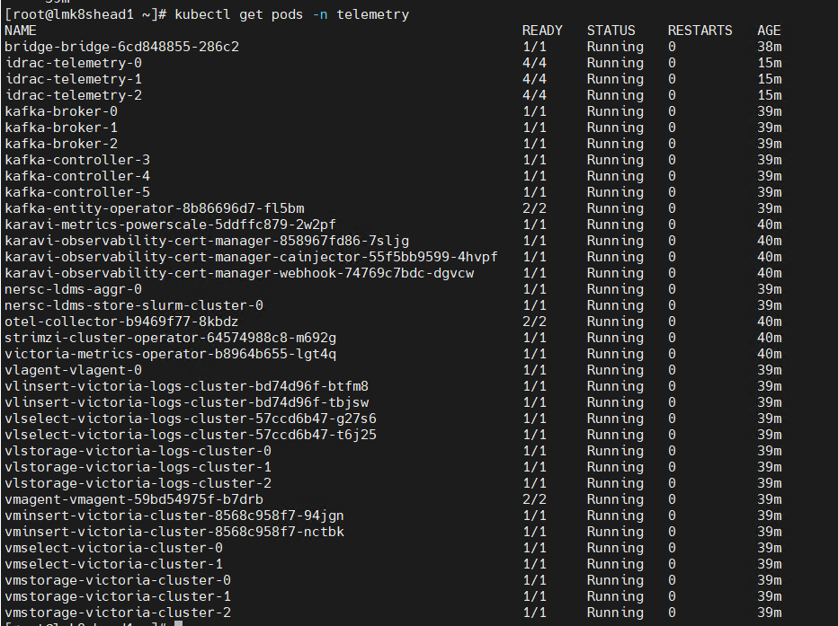
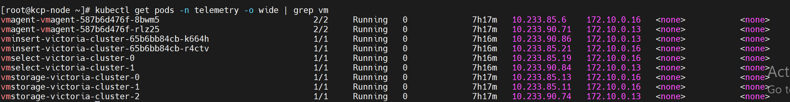
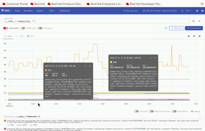

# Path D: BuildStreaM Automated Deployment

Omnia BuildStreaM provides a comprehensive automation solution for managing infrastructure build workflows. It uses a catalog-driven approach where you define your build requirements in a structured catalog file, and BuildStreaM executes automated pipelines to create and deploy images according to your specifications.

BuildStreaM supports three pipeline types that can be executed through GitLab:

- **Build Pipeline**: Creates diskless images based on catalog specifications. This pipeline is automatically triggered when the catalog is committed, but can also be executed manually.
- **Deploy Pipeline**: Deploys built images to target cluster nodes. This pipeline is automatically triggered when the PXE mapping file is updated, but can also be executed manually.
- **Clean Pipeline**: Removes old Image Groups based on retention policy. This pipeline can be executed only manually.

!!! note

    Do not cancel a running GitLab pipeline or stage. Cancellation prevents some pipeline steps from executing, which leaves the BuildStreaM job in an intermediate, inconsistent state. Note that backend BuildStreaM tasks already in progress will continue running to completion regardless of the cancellation.

!!! note

    BuildStreaM does not support execution of multiple pipelines in parallel or concurrently. Only one pipeline can be executed at a time. Attempting to run multiple pipelines simultaneously may result in unexpected behavior or failures.

BuildStreaM addresses the key challenges in HPC cluster image management:

- **Automation**: Eliminates manual build and deployment processes
- **Integration**: Works seamlessly with existing Omnia deployments
- **Traceability**: Provides complete audit trails for all build operations

To build your own custom workflows, you can use the BuildStreaM REST API. The BuildStreaM API documentation is available at [Omnia BuildStreaM API Documentation](https://developer.dell.com/apis/ea677050-f49b-49e1-a4b9-1cdd563415d9/versions/2.2.0-0/introduction-to-buildstream-api-12967m0).

---

## Step 1: Deploy Omnia Core Container

Deploy the Omnia core container on the Omnia Infrastructure Manager (OIM) where the BuildStreaM container and playbook watcher service will be installed during the BuildStreaM setup. BuildStreaM container and playbook watcher service are required to execute the pipelines to create, discover, and deploy images on the cluster nodes.
The Omnia core container is deployed on the Omnia Infrastructure Manager (OIM) and it is managed as a Systemd service (`omnia_core.service`).
The Omnia core container contains the following:

- The open-source code to deploy and manage Omnia clusters. The source code is available at [https://github.com/dell/omnia](https://github.com/dell/omnia).
- Python and Ansible preinstalled.

Use the `omnia.sh` script to install, uninstall, and view help on the actions that you can perform on the Omnia core container.

### Prerequisites

Before you begin, ensure the following:

- The OIM has internet access to download necessary packages for cluster deployment and configuration.
- The OIM must have two active Network Interface Cards (NICs):

    - One connected to the public network.
    - One dedicated to internal cluster communication.

- Ensure that Podman container engine is installed on your OIM.
- If you want to use a NFS share for the omnia shared path, ensure the following:

    - The NFS share has 755 permissions and `no_root_squash` is enabled on the mounted NFS share.
    - Edit the `/etc/exports` file on the NFS server to include the `no_root_squash` option for the exported path.

        ```text
        /<your_exported_path>  *(rw,sync,no_root_squash,no_subtree_check)
        ```

- Ensure that the following OIM hostname prerequisites are met.

    - Hostname should not contain the following characters: , (comma), . (period), _ (underscore).
    - Hostname cannot start or end with a hyphen (-).
    - No upper case characters are allowed in the hostname.
    - Hostname cannot start with a number.
    - Hostname and domain name (hostname00000x.domain.xxx) cumulatively cannot exceed 64 characters.

### Deploy the Omnia Core Container from Omnia Artifactory

To deploy the container images from any Omnia branch, available at [Omnia Artifactory Repository](https://github.com/dell/omnia-artifactory.git), do the following:

1. Clone the Omnia artifacts repository and build the `omnia_core` container images. Run the following commands:

    ```bash title="Run on: OIM host"
    git clone https://github.com/dell/omnia-artifactory.git -b omnia-container-v2.2.0.0
    cd omnia-artifactory
    ./build_images.sh core omnia_branch=v2.2.0.0 core_tag=2.2
    ```

    - For detailed build instructions, refer to the [Omnia Artifacts README](https://github.com/dell/omnia-artifactory/blob/omnia-container/README.md).
    - For `core_tag=<version>`, use first two digits of the Omnia version. For example, for `v2.2.0.0`, use `core_tag=2.2`.
    - For `omnia_branch=<tag|branch>`, use the branch name or tag name.

        - For `<tag>`, example: v2.1.0.0
        - For `<branch>`, example: main, pub/q1_dev, staging
        - For `<default>`, example: main

2. Download the `omnia.sh` script using the following commands:

    - To use the tagged version of Omnia, run the following command:

        ```bash title="Run on: OIM host"
        wget https://raw.githubusercontent.com/dell/omnia/refs/tags/${OMNIA_VERSION}/omnia.sh
        ```

    - To use the specific branch of Omnia, run the following command:

        ```bash title="Run on: OIM host"
        wget https://raw.githubusercontent.com/dell/omnia/refs/heads/${OMNIA_VERSION}/omnia.sh
        ```

    **Example:**

    - Specifc verion: `wget https://raw.githubusercontent.com/dell/omnia/refs/heads/main/omnia.sh`
    - Tagged version: `wget https://raw.githubusercontent.com/dell/omnia/refs/tags/v2.1.0.0-rc2/omnia.sh`

3. Run the following command to make the script executable:

    ```bash title="Run on: OIM host"
    chmod +x omnia.sh
    ```

4. On the OIM, to deploy the `omnia_core` container and configure passwordless SSH, run the following command:

    ```bash title="Run on: OIM host"
    ./omnia.sh --install
    ```

5. When prompted for the shared path, enter the path for the Omnia shared directory. This can be a local file path or an NFS share path.

6. When prompted for the password, enter a secure alphanumeric password for accessing the Omnia core container.

7. To view the Omnia version, run the following command:

    ```bash title="Run on: OIM host"
    ./omnia.sh --version
    ```

!!! caution

    The password must not contain special characters such as \ , | , & , ; , ` , < > , * , ? , ! , $ , ( ) , { } , [ ] .

### Tasks Performed by `omnia.sh`

The `omnia.sh` script performs the following tasks:

- Deploys and starts the `omnia_core` container as a Systemd service.
- Generates an SSH key pair and stores them in the `/root/.ssh` folder in the core container.
- Initializes the Podman container engine.
- Creates the following directories within the Omnia Core Container:

    - `/opt/omnia`:  Shared directory that is mapped to the Omnia shared path used by OIM.
    - `/opt/omnia/input/project_default`: Contains the input files for the playbooks.
    - `/omnia`:  Contains the Omnia source code.
    - `/opt/omnia/log/core/playbooks`: Contains the playbook execution logs.

!!! note

    Provide any file paths (for example, mapping file) that are mentioned in input files in the `/opt/omnia` directory.

!!! caution

    - Do not delete any key pairs generated by Omnia from `/root/.ssh` because this will lead to `omnia_core.service` execution failure.
    - Do not manually delete any files from the OMNIA shared directory. Use the following command to safely remove the entire OMNIA shared directory:

        ```bash title="Run on: OIM host"
        ./omnia.sh --uninstall
        ```

### Access the Omnia Core Container

You can access the Omnia core container using either of the following methods:

1. **Podman**: To access the Omnia core container using Podman, run the following command:

    ```bash title="Run on: OIM host"
    podman exec -it -u root omnia_core bash
    ```

2. **SSH**: To access the Omnia core container using SSH, run the following command:

    ```bash title="Run on: OIM host"
    ssh omnia_core
    ```

### Uninstall Omnia Core Container

The `omnia.sh --uninstall` command removes the `omnia_core` container and its associated Systemd service (`omnia_core.service`). It also cleans up the Omnia shared directory and generated files, while preserving user-generated files such as inventory and mapping files.

!!! note

    Before you uninstall the `omnia_core` container, ensure that no other containers are running on the OIM except `omnia_core`. If other containers are present, log in to the `omnia_core` container and run the following Ansible playbook to remove the containers:

    ```bash title="Run on: omnia_core container"
    cd /omnia/utils
    ansible-playbook oim_cleanup.yml
    ```

To uninstall the Omnia core container, on the OIM, run the following script:

```bash title="Run on: OIM host"
./omnia.sh --uninstall
```

### View Usage Instructions for Omnia Core Container

The `omnia.sh --help` command provides usage instructions for managing the Omnia core container. The help menu lists the supported actions you can perform, such as installing and uninstalling the Omnia Core Container.

To view the usage instructions, on the OIM, run the following command:

```text title="Expected output"
./omnia.sh --help

    Usage: ./omnia.sh [--install | --uninstall | --upgrade | --rollback | --version | --help]
  -i, --install     Install and start the Omnia core container
  -u, --uninstall   Uninstall the Omnia core container and clean up configuration
      --upgrade     Upgrade the Omnia core container to newer version
      --rollback    Rollback the Omnia core container to previous version
  -v, --version     Display Omnia version information
  -h, --help        More information about usage
```

The help menu includes:

- `--install`: Deploys the `omnia_core` container and configures it as a Systemd service.
- `--uninstall`: Stops and removes the `omnia_core` container and its associated service.
- `--upgrade`: Upgrade the Omnia core container to newer version.
- `--rollback`: Rollback the Omnia core container to previous version.
- `--version`: Display Omnia version information
- `--help`: Display usage information.

### Verification

Ensure that the `omnia_core` container is running and the Systemd service is active.

### Next Steps

After installing the Omnia core container, create the PXE mapping file with the information of the nodes to be provisioned.

---

## Step 2: Create Mapping File with Node Information

In Omnia, nodes are discovered and provisioned based on the  **groups** and **functional groups** defined in the mapping file. By combining both groups and functional groups, Omnia offers a powerful and flexible approach to managing large-scale node infrastructures, ensuring both logical organization and physical optimization of resources.

- A **group** is based on the physical characteristics of the nodes. It refers to nodes that are located in the same place or have similar hardware. For example, nodes in the same rack or SU (Scalable Unit) might be grouped together, with specific functional groups like **Service Kube Node** or **Slurm Control Node**. Groups help with physical organization and management of nodes.

- A **functional group** defines what a node does in the system. It is a way to categorize nodes based on their functionality. Functional groups help group nodes that perform similar tasks, making it easier to manage and assign resources.
  For example, a node could belong to a functional group such as:

    - **Service Kube Control Plane**
    - **Service Kube Node**
    - **Slurm Login Node**
    - **Slurm Login/Compiler Node**
    - **Slurm Control Node**
    - **Slurm Node**

### Create Mapping File

Manually collect PXE NIC information of the nodes to be provisioned and manually define them to Omnia using the **pxe_mapping_file.csv** file. Provide the file path to the `pxe_mapping_file_path` variable in `/opt/omnia/input/project_default/provision_config.yml`.
Each node listed in the mapping file must be assigned with the following values:
`FUNCTIONAL_GROUP_NAME`, `GROUP_NAME`, `SERVICE_TAG`, `PARENT_SERVICE_TAG`, `HOSTNAME`, `ADMIN_MAC`,
`ADMIN_IP`, `BMC_MAC`, `BMC_IP`, `IB_NIC_NAME`, and `IB_IP`.

Refer to the [Group Attributes](#groups) table to assign the appropriate `GROUP_NAME` and the [Types of Functional Groups](#functional-groups) table to assign the correct `FUNCTIONAL_GROUP_NAME` for each node in the mapping file.

The following is the sample format of a mapping file for x86_64 cluster:

```text title="File: pxe_mapping_file.csv (x86_64)"
FUNCTIONAL_GROUP_NAME,GROUP_NAME,SERVICE_TAG,PARENT_SERVICE_TAG,HOSTNAME,ADMIN_MAC,ADMIN_IP,BMC_MAC,BMC_IP,IB_NIC_NAME,IB_IP
slurm_control_node_x86_64,grp0,ABCD12,,slurm-control-node1,a1:b2:c3:d4:e5:f6,172.16.107.52,a2:b3:c4:d5:e6:f7,172.17.107.52,InfiniBand.Slot.7-1,192.168.0.100
slurm_node_x86_64,grp1,ABCD34,ABFL82,slurm-node1,b1:c2:d3:e4:f5:a6,172.16.107.43,b2:c3:d4:e5:f6:a7,172.17.107.43,InfiniBand.Slot.7-1,192.168.0.101
slurm_node_x86_64,grp1,ABFG34,ABKD88,slurm-node2,c1:d2:e3:f4:a5:b6,172.16.107.44,c2:d3:e4:f5:a6:b7,172.17.107.44,InfiniBand.Slot.7-1,192.168.0.102
login_compiler_node_x86_64,grp8,ABCD78,,login-compiler-node1,d1:e2:f3:a4:b5:c6,172.16.107.41,d2:e3:f4:a5:b6:c7,172.17.107.41,InfiniBand.Slot.7-1,192.168.0.103
login_compiler_node_x86_64,grp8,ABFG78,,login-compiler-node2,e1:f2:a3:b4:c5:d6,172.16.107.42,e2:f3:a4:b5:c6:d7,172.17.107.42,InfiniBand.Slot.7-1,192.168.0.104
service_kube_control_plane_x86_64,grp3,ABFG79,,service-kube-control-plane1,f1:a2:b3:c4:d5:e6,172.16.107.53,f2:a3:b4:c5:d6:e7,172.17.107.53,,InfiniBand.Slot.7-1,192.168.0.105
service_kube_control_plane_x86_64,grp4,ABFH78,,service-kube-control-plane2,11:22:33:44:55:66,172.16.107.54,12:23:34:45:56:67,172.17.107.54,,InfiniBand.Slot.7-1,192.168.0.106
service_kube_control_plane_x86_64,grp4,ABFH80,,service-kube-control-plane3,aa:bb:cc:dd:ee:01,172.16.107.55,ab:bc:cd:de:ef:12,172.17.107.55,,InfiniBand.Slot.7-1,192.168.0.107
service_kube_node_x86_64,grp5,ABFL82,,service-kube-node1,33:44:55:66:77:88,172.16.107.56,34:45:56:67:78:89,172.17.107.56,InfiniBand.Slot.7-1,192.168.0.108
service_kube_node_x86_64,grp5,ABKD88,,service-kube-node2,55:66:77:88:99:aa,172.16.107.57,56:67:78:89:aa:bb,172.17.107.57,InfiniBand.Slot.7-1,192.168.0.109
os_x86_64,grp6,ABEF56,,os-node1,77:88:99:aa:bb:cc,172.16.107.60,78:89:aa:bb:cc:dd,172.17.107.60,,
```

The following is the sample format of a mapping file for x86_64 and aarch64 cluster:

```text title="File: pxe_mapping_file.csv (x86_64 and aarch64)"
FUNCTIONAL_GROUP_NAME,GROUP_NAME,SERVICE_TAG,PARENT_SERVICE_TAG,HOSTNAME,ADMIN_MAC,ADMIN_IP,BMC_MAC,BMC_IP,IB_NIC_NAME,IB_IP
slurm_control_node_x86_64,grp0,ABCD12,,slurm-control-node1,a1:b2:c3:d4:e5:f6,172.16.107.52,a2:b3:c4:d5:e6:f7,172.17.107.52,InfiniBand.Slot.7-1,192.168.0.100
slurm_node_aarch64,grp1,ABCD34,ABFL82,slurm-node1,b1:c2:d3:e4:f5:a6,172.16.107.43,b2:c3:d4:e5:f6:a7,172.17.107.43,InfiniBand.Slot.7-2,192.168.0.101
slurm_node_aarch64,grp2,ABFG34,ABKD88,slurm-node2,c1:d2:e3:f4:a5:b6,172.16.107.44,c2:d3:e4:f5:a6:b7,172.17.107.44,NIC.InfiniBand.1-3,192.168.0.102
login_compiler_node_aarch64,grp8,ABCD78,,login-compiler-node1,d1:e2:f3:a4:b5:c6,172.16.107.41,d2:e3:f4:a5:b6:c7,172.17.107.41,InfiniBand.PCIe.Slot.8-1,192.168.0.103
login_node_aarch64,grp9,ABFG78,,login-node1,e1:f2:a3:b4:c5:d6,172.16.107.42,e2:f3:a4:b5:c6:d7,172.17.107.42,NIC.InfiniBand.1-1,192.168.0.104
service_kube_control_plane_x86_64,grp3,ABFG79,,service-kube-control-plane1,f1:a2:b3:c4:d5:e6,172.16.107.53,f2:a3:b4:c5:d6:e7,172.17.107.53,,
service_kube_control_plane_x86_64,grp4,ABFH78,,service-kube-control-plane2,11:22:33:44:55:66,172.16.107.54,12:23:34:45:56:67,172.17.107.54,,
service_kube_control_plane_x86_64,grp4,ABFH80,,service-kube-control-plane3,aa:bb:cc:dd:ee:01,172.16.107.55,ab:bc:cd:de:ef:12,172.17.107.55,,
service_kube_node_x86_64,grp5,ABFL82,,service-kube-node1,33:44:55:66:77:88,172.16.107.56,34:45:56:67:78:89,172.17.107.56,,
service_kube_node_x86_64,grp5,ABKD88,,service-kube-node2,55:66:77:88:99:aa,172.16.107.57,56:67:78:89:aa:bb,172.17.107.57,,
os_x86_64,grp6,ABEF56,,os-node1,77:88:99:aa:bb:cc,172.16.107.60,78:89:aa:bb:cc:dd,172.17.107.60,,
os_aarch64,grp7,ABEF78,,os-node2,99:aa:bb:cc:dd:ee,172.16.107.61,9a:ab:bc:cd:de:ef,172.17.107.61,,
```

!!! note

    - Ensure that nodes belonging to the same group have the same parent. In the mapping file, node entries with the same `GROUP_NAME` must have the same parent specified in the `PARENT_SERVICE_TAG` column.
    - The header fields mentioned above are case sensitive.
    - The IP addresses provided in the mapping file are not validated by Omnia. Ensure that the correct IP addresses are provided. Incorrect IP addresses can cause unexpected failures.
    - The service tags provided in the mapping file are not validated by Omnia. Ensure that correct service tags are provided. Incorrect service tags can cause unexpected failures.
    - The hostnames provided should not contain the domain name of the nodes.
    - All fields mentioned in the mapping file are mandatory.
    - The ADMIN_MAC and BMC_MAC addresses provided in `pxe_mapping_file.csv` should refer to the PXE NIC and BMC NIC on the target nodes respectively.
    - Target servers should be configured to boot in PXE mode with the appropriate NIC as the first boot device.

### Groups

Nodes that are located in the same place or similar hardware can be grouped together. To do so, update the mapping file with all necessary attributes for the nodes, based on their role within the cluster. Each group will have following attributes as indicated in the table below:

| Attribute | Mandatory/Conditional mandatory/Optional | Description |
| --- | --- | --- |
| Group Name - `grpN` | Mandatory | User defined name of the group. Range for `N` is 0-99. Example: `grp0`, `grp1`, and `grp2`. |
| Parent of the node- "parent" | Conditional Mandatory | The list of service tags that are associated with active service node(s). This field will be mandatory for group of nodes which is associated with `slurm_node_x86_64` and `slurm_node_aarch64` functional_groups. This should be the service tag of the parent node. Example: `ABCD12` |

### Functional Groups

Nodes with similar functional roles or functionalities can be grouped together. The following table lists the functional groups available in Omnia.

!!! note

    - At least one functional group is mandatory, and you must not change the name of functional groups.
    - Ensure that the group nodes intended for a specific role must be associated with the corresponding functional group and must not be associated under multiple functional groups.
    - The functional groups are case-sensitive.
    - Omnia supports HA functionality for the `service_cluster`. For more information, see [Configure HA](../HowTo/Kubernetes/configure_ha.md).
    - To set up a service cluster, the `service_kube_node` must be present in the mapping file.


| Functional Group Name | Layer | Details |
| --- | --- | --- |
| Slurm control plane - `slurm_control_node_x86_64` | Management | Nodes with `slurm_control_node` functional group can be added to the Slurm head node groups. This functional group is used to configure the nodes for Slurm head. The nodes included in this functional group will have the necessary tools and configurations to run Slurm head. The nodes in this functional group can be used to run the Slurm head. |
| Slurm compute node - `slurm_node_x86_64` | Compute | This functional group is used to configure nodes as Slurm compute nodes on the x86_64 architecture. The nodes included in this functional group will have the necessary tools and configurations to run Slurm workloads. Nodes in this functional group can be used as Slurm compute nodes for x86_64 clusters. |
| Slurm compute node - `slurm_node_aarch64` | Compute | This functional group is used to configure nodes as Slurm compute nodes on the aarch64 architecture. The nodes included in this functional group will have the necessary tools and configurations to run Slurm workloads. Nodes in this functional group can be used as Slurm compute nodes for aarch64 clusters. |
| Service Cluster Kubernetes control plane - `service_kube_control_plane_x86_64` | Management | This functional_group is used to configure the kubernetes control plane nodes on service cluster. The nodes included in this functional_group will have the necessary tools and configurations to configure Kubernetes control plane to provide HA on service cluster. |
| Service Cluster Kubernetes worker node - `service_kube_node_x86_64` | Management | This functional group is used to configure the Kubernetes worker nodes on service cluster. The nodes included in this functional group will have the necessary tools and configurations to configure and run Kubernetes worker on service cluster. |
| Slurm Login node - `login_node_x86_64` | Management | This functional group is used to configure nodes for user logins on the x86_64 architecture. The nodes included in this functional group will have the necessary tools and configurations to support user login activities. Nodes in this functional group can be used to handle user login sessions on x86_64 systems. |
| Slurm Login node - `login_node_aarch64` | Management | This functional group is used to configure nodes for user logins on the aarch64 architecture. The nodes included in this functional group will have the necessary tools and configurations to support user login activities. Nodes in this functional group can be used to handle user login sessions on aarch64 systems. |
| Slurm Login and Compiler node - `login_compiler_node_x86_64` | Management | This functional group is used to configure nodes for compilation on the x86_64 architecture. The nodes included in this functional group will have the necessary tools and configurations to perform compilation. Nodes in this functional group can be used to compile code on x86_64 systems. |
| Slurm Login and Compiler node - `login_compiler_node_aarch64` | Management | This functional group is used to configure nodes for compilation on the aarch64 architecture. The nodes included in this functional group will have the necessary tools and configurations to perform compilation. Nodes in this functional group can be used to compile code on aarch64 systems. |
| Minimal OS compute node - `os_x86_64` | Compute | This functional group provides a clean operating system baseline for x86_64 architecture, designed for downstream platform software installation. This functional group is ideal for deploying platform software that requires a clean OS environment without conflicts from pre-installed components. |
| Minimal OS compute node - `os_aarch64` | Compute | This functional group provides a clean operating system baseline for aarch64 architecture, designed for downstream platform software installation. This functional group is ideal for deploying platform software that requires a clean OS environment without conflicts from pre-installed components. |

### Recommended Software by Functional Groups

!!! caution

    Ensure that the `software_config.json` file contains all required inputs for the software to be deployed on each functional group. For more information, see [Input parameters for Local Repositories](https://omnia-devel.readthedocs.io/en/latest/OmniaInstallGuide/RHEL_new/CreateLocalRepo/InputParameters.html).

The following table lists the functional groups along with the recommended software to be deployed on each group.

| Functional Group Name | Recommended Software |
| --- | --- |
| service_kube_control_plane_x86_64 | service_k8s.json |
| service_kube_node_x86_64 | service_k8s.json |
| slurm_control_node_x86_64 | slurm_custom.json, openldap.json, ldms.json |
| slurm_node_x86_64 | slurm_custom.json, openldap.json, ldms.json |
| slurm_node_aarch64 | slurm_custom.json, openldap.json, ldms.json |
| login_node_x86_64 | slurm_custom.json, openldap.json, ldms.json |
| login_node_aarch64 | slurm_custom.json, openldap.json, ldms.json |
| login_compiler_node_x86_64 | slurm_custom.json, openldap.json, ucx.json, openmpi.json, ldms.json |
| login_compiler_node_aarch64 | slurm_custom.json, openldap.json, ucx.json, openmpi.json, ldms.json |

### Verification

Ensure that the PXE mapping file is correctly formatted and that all required fields are populated.

### Next Steps

After creating the PXE mapping file, prepare the Omnia Infrastructure Manager by following the instructions in Step 3 below.

---

## Step 3: Prepare the Omnia Infrastructure Manager

To enable BuildStreaM functionality, you must prepare the Omnia Infrastructure Manager (OIM) by deploying the required containers and services. This procedure installs the OpenCHAMI containers, BuildStreaM container, Omnia Auth container, Pulp container, and Playbook watcher service that are essential for automated build workflows and cluster management.

### Prerequisites

Before beginning the BuildStreaM setup:

- Ensure that the Omnia core container is installed with Omnia 2.2.0.0
- Administrator access on the Omnia Infrastructure Manager (OIM) node
- Minimum 4 GB RAM and 2 CPU cores for BuildStreaM services
- 10 GB free disk space for BuildStreaM data and logs
- Ensure that the system time is synchronized across all compute nodes and the OIM. Time mismatch can lead to certificate-related issues during or after the `prepare_oim.yml` playbook execution.

!!! important

    BuildStreaM requires a separate PostgreSQL database for storing transaction details and job metadata.

### Procedure

**1. Update the following input files.**

    - `build_stream_config.yml`: contains the details about the BuildStreaM pipeline.
    - `gitlab_config.yml`: contains the details about the BuildStreaM GitLab configuration.
    - `high_availability_config.yml`: contains the details about the high availability configuration.
    - `local_repo_config.yml`: contains the details about the local repository configuration.
    - `network_spec.yml`: contains the details about the network configuration.
    - `omnia_config.yml`: contains the details about the Omnia configuration.
    - `provision_config.yml`: contains the details about the provision configuration.
    - `security_config.yml`: contains the details about the security configuration.
    - `storage_config.yml`: contains the details about the storage configuration.
    - `telemetry_config.yml`: contains the details about the telemetry configuration.
    - `telemetry_storage_config.yml`: contains the details about the telemetry storage configuration.
    - `user_registry_credential.yml`: contains the details about the user registry credentials.

**`build_stream_config.yml`**

Add necessary inputs to the `build_stream_config.yml` file for the BuildStreaM pipeline. Use the [BuildStreaM configuration table](../Reference/Configuration/build_stream_config.md) for guidance when configuring these parameters.

!!! note

    Ensure that the `build_stream_port` (BuildStreaM port) is correctly configured in the `build_stream_config.yml` file. The BuildStreaM port cannot be modified after preparing the OIM. To modify the port after preparing the OIM, you need to cleanup the OIM first (using `cleanup_oim.yml`), and then prepare the OIM again with the required port number (using `prepare_oim.yml`).

**`gitlab_config.yml`**

Add necessary inputs to the `gitlab_config.yml` file for the BuildStreaM GitLab configuration. Use the [GitLab configuration table](../Reference/Configuration/gitlab_config.md) for guidance when configuring these parameters.

**`high_availability_config.yml`**

Add necessary inputs to the `high_availability_config.yml` file for the high availability configuration. Use the high availability configuration table for guidance when configuring these parameters.

**`local_repo_config.yml`**

Add necessary inputs to the `local_repo_config.yml` file for the local repository configuration. Use the local repository configuration table for guidance when configuring these parameters.

**`network_spec.yml`**

Add necessary inputs to the `network_spec.yml` file to configure the network on which the cluster will operate. Use the network configuration table for guidance when configuring these parameters.

!!! caution

    - All provided network ranges and NIC IP addresses should be distinct with no overlap.
    - All iDRACs must be reachable from the OIM.

A sample of the `network_spec.yml` where nodes are discovered using a **mapping file** is provided below:

```yaml title="Example network_spec.yml excerpt"
Networks:
- admin_network:
   oim_nic_name: "eno1"
   netmask_bits: "24"
   primary_oim_admin_ip: "172.16.107.67"
   primary_oim_bmc_ip: ""
   dynamic_range: "172.16.107.201-172.16.107.250"
   dns: []
```

**`omnia_config.yml`**

Add necessary inputs to the `omnia_config.yml` file for the OMNIA configuration. Use the OMNIA configuration table for guidance when configuring these parameters.

**`provision_config.yml`**

Add necessary inputs to the `provision_config.yml` file for the provisioning of the cluster. Use the provisioning configuration table for guidance when configuring these parameters.

**`security_config.yml`**

Add necessary inputs to the `security_config.yml` file for the security configuration. Use the security configuration table for guidance when configuring these parameters.

**`storage_config.yml`**

Add necessary inputs to the `storage_config.yml` file for the storage configuration. Use the storage configuration table for guidance when configuring these parameters.

**`telemetry_config.yml`**

Add necessary inputs to the `telemetry_config.yml` file for the telemetry configuration. Use the telemetry configuration table for guidance when configuring these parameters.

**`telemetry_storage_config.yml`**

Add necessary inputs to the `telemetry_storage_config.yml` file for the telemetry storage configuration. Use the telemetry storage configuration table for guidance when configuring these parameters.

**2. After updating the input files, run the `prepare_oim.yml` playbook:**

```bash title="Run on: omnia_core container"
ssh omnia_core
cd /omnia/prepare_oim
ansible-playbook prepare_oim.yml
```

The `prepare_oim.yml` deploys the following on the OIM node:

- OpenCHAMI containers
- PostgreSQL database container
- Omnia Auth container
- Pulp container
- BuildStreaM API container
- Playbook watcher service

!!! note

    After `prepare_oim.yml` execution, `ssh omnia_core` may fail if you switch from a non-root to root user using `sudo` command. To avoid this, log in directly as a `root` user before executing the playbook or follow the steps mentioned [here](../Troubleshooting/general.md).

### Verification

After successfully running the `prepare.oim.yml`, you can verify if the `omnia.target` and its dependent services are running correctly.

Run the following commands to check the status of the BuildStreaM services:

```bash title="Run on: OIM host"
# Check OMNIA Core service status
systemctl status omnia_core.service

# Check BuildStreaM API container status
systemctl status omnia_build_stream.service

# Check playbook watcher service status
systemctl status playbook_watcher.service

# Check PostgreSQL database container status
systemctl status omnia_postgres.service

# View complete list of dependent services
systemctl list-dependencies omnia.target
```

Review the status of the dependent services in the following tree output.

!!! note

    The `prepare_oim.yml` deploys the following on the OIM node only when BuildStream is enabled on the `build_stream_config.yml`.

    - PostgreSQL database container
    - BuildStreaM API container
    - Playbook watcher service

```text title="Expected output"
omnia.target
● ├─minio.service
● ├─omnia_auth.service
● ├─omnia_build_stream.service
● ├─omnia_core.service
● ├─omnia_postgres.service
● ├─playbook_watcher.service
● ├─pulp.service
● ├─registry.service
● ├─network-online.target
● │ └─NetworkManager-wait-online.service
● └─openchami.target
●   ├─acme-deploy.service
●   ├─acme-register.service
●   ├─bss-init.service
●   ├─bss.service
●   ├─cloud-init-server.service
●   ├─coresmd-coredhcp.service
●   ├─coresmd-coredns.service
●   ├─haproxy.service
●   ├─hydra-gen-jwks.service
●   ├─hydra-migrate.service
●   ├─hydra.service
●   ├─opaal-idp.service
●   ├─opaal.service
●   ├─openchami-cert-trust.service
●   ├─postgres.service
●   ├─smd-init.service
●   ├─smd.service
●   └─step-ca.service
```

- A **green circle** indicates that the service is running.
- A **grey circle** indicates that the service is not running.
- A **circle with a cross** indicates that the service failed to start.

!!! note

    The `omnia_auth.service` runs only when OpenLDAP is specified in the `/opt/omnia/input/project_default/software_config.json`.

!!! note

    The `omnia_build_stream.service`, `omnia_postgres.service`, and `playbook_watcher_service` run only when BuildStreaM is enabled in the `/opt/omnia/input/project_default/build_stream_config.yml`.

### View Usage Instructions for OpenCHAMI Containers

The `ochami --help` command provides usage instructions for interacting with **OpenCHAMI services**. The help menu lists the supported commands you can use for node discovery, provisioning, and service management.

1. Access the OpenCHAMI container via Podman.

2. On the Omnia Infrastructure Manager (OIM), run the following command:

    ```bash title="Run on: OIM host"
    ochami --help
    ```

The help menu includes:

- `bss`: Communicate with the Boot Script Service (BSS).
- `cloud-init`: Interact with the cloud-init service.
- `completion`: Generate the autocompletion script for the specified shell.
- `config`: View or modify configuration options.
- `discover`: Perform static or dynamic discovery of nodes.
- `pcs`: Interact with the Power Control Service (PCS).
- `smd`: Communicate with the State Management Database (SMD).
- `version`: Display detailed version information and exit.
- `help`: Display help for a specific command.

For more details about a specific command, run:

```bash title="Run on: OIM host"
ochami [command] --help
```

---

## Step 4: Deploy GitLab for BuildStream

Deploy GitLab as the CI/CD automation engine for BuildStream, providing a three-pipeline architecture for build, deploy, and cleanup operations. This procedure covers GitLab installation, project setup with pipeline configuration files, input folder structure, and runner verification.

BuildStream uses a **three-pipeline architecture** in GitLab:

- **Build Pipeline**: Triggered by catalog changes, creates images and establishes Job ID to Image Group ID mapping. This pipeline can also be executed manually.
- **Deploy Pipeline**: Triggered by PXE mapping changes, deploys images to cluster nodes. This pipeline can also be executed manually.
- **Cleanup Pipeline**: Triggered manually, allows users to delete selected Image Groups.

### Prerequisites

Before deploying GitLab for BuildStreaM:

- Ensure that Omnia BuildStreaM container, PostgreSQL container, and Playbook Watcher service are deployed on the OIM node (see Step 3 above)
- The node where GitLab will be deployed must have Internet connectivity.
- A dedicated node is required for BuildStreaM GitLab deployment.
- The node must have sufficient system resources for BuildStreaM (minimum 4 GB RAM, 2 CPU cores, 20 GB free disk space)
- GitLab requires a minimum of 2 CPU cores. More cores may be needed for production workloads.
- OIM node must be accessible from the GitLab node.
- Ensure that BuildStream API server (BuildStream container) is reachable from the GitLab node.
- Ensure that appStream and Base OS repositories are configured and accessible from the GitLab node.
- Ensure that on the GitLab node, SELinux is disabled.

!!! important

    Omnia uses a dedicated GitLab instance for BuildStreaM. This procedure provisions a new GitLab instance specifically configured for BuildStreaM. Currently, existing GitLab setups configured for other purposes are not supported.

### Procedure

1. Use SSH to connect to the `omnia_core` container.

    ```bash title="Run on: OIM host"
    ssh omnia_core
    ```

2. Update the `gitlab_config.yml` file. Run the `gitlab.yml` playbook.
   Use the [GitLab configuration table](../Reference/Configuration/gitlab_config.md) for reference. 

    ```bash title="Run on: omnia_core container"
    # Update gitlab_config.yml
    vi /opt/omnia/input/project_default/gitlab_config.yml

    # Navigate to the GitLab directory.
    cd /omnia/gitlab

    # Run the playbook
    ansible-playbook gitlab.yml
    ```

3. When it prompts you to enter the GitLab password, enter the password. Note the password as it is required to access the GitLab project and instance.

    !!! note

        The installation may take 10-15 minutes to complete.

    This `gitlab.yml` playbook performs the following tasks:

    - Installs the GitLab instance on the host specified in the `gitlab_config.yml` file.
    - In the GitLab instance, creates a project with the specified name, visibility, and default branch as configured in the `gitlab_config.yml` file.
    - Installs GitLab runner as a Podman container.
    - Generates a self-signed CA certificate for GitLab on the GitLab node at `/root/gitlab-certs/ca.crt`
    - Adds the project with the following files:
        - **Pipeline Configuration Files**:
            - `.gitlab-ci.yml` - Parent router pipeline that dispatches to child pipelines
            - `.gitlab-ci-build.yml` - Build pipeline for creating images
            - `.gitlab-ci-deploy.yml` - Deploy pipeline for deploying images to nodes
            - `.gitlab-ci-cleanup.yml` - Cleanup pipeline for removing old Image Groups
            - `.gitlab-ci-deploy-child-template.yml` - Dynamic child pipeline template for deploy operations
        - **Catalog File**:
            - `catalog_rhel.json` - Default catalog file containing build definitions for RHEL images
        - **Input Folder**:
            - `input/` - Directory containing all BuildStream input configuration files

    

    The input folder includes the following configuration files (see [Configuration Tables](../Reference/Configuration/build_stream_config.md) for detailed parameter descriptions):

    - `build_stream_config.yml` — BuildStream configuration file
    - `gitlab_config.yml` — GitLab configuration file
    - `high_availability_config.yml` — High availability configuration file
    - `local_repo_config.yml` — Local repository configuration file
    - `network_config.yml` — Network configuration file
    - `omnia_config.yml` — Omnia configuration file
    - `provision_config.yml` — Provision configuration file
    - `pxe_mapping_file.csv` — PXE mapping file
    - `security_config.yml` — Security configuration file
    - `storage_config.yml` — Storage configuration file
    - `telemetry_config.yml` — Telemetry configuration file
    - `telemetry_storage_config.yml` — Telemetry storage configuration file

    

4. To avoid **Not Secure** warnings when accessing the GitLab instance, download and import the certificate generated in step 5 to the browser.

### Verification

After the installation of GitLab complete, verify the following:

- Verify you can access the GitLab project URL:

    ```text
    https://<gitlab_host>:<gitlab_https_port>/root/<gitlab_project_name>
    ```

- Verify the project contains the expected files and folders.
- Verify runner status through GitLab web interface:

    1. Navigate to **Settings** → **CI/CD**.
    2. Expand **Runners** section.
    3. Verify the runner shows a **green** status indicator.
    4. Confirm runner is set to **Running Always** with **Podman Container**.

### Next Steps

After completing GitLab deployment, update the catalog file to automatically trigger the build pipeline. See Step 5 below.

---

## Step 5: Execute Build Pipeline

Update the `catalog_rhel.json` file and execute the Omnia BuildStreaM build pipeline through GitLab. This procedure covers catalog modifications, pipeline triggering (automatic and manual), and verification of pipeline status and job execution.

The BuildStream build pipeline automates the creation of diskless images based on catalog specifications. The pipeline consists of four sequential stages:

- **parse-catalog**: Parses and validates the catalog file for build requirements
- **generate-input-files**: Generates input files and configuration data for image building
- **create-local-repository**: Creates and configures the local repository for build artifacts
- **build-image**: Builds the diskless images based on catalog specifications

The build pipeline is automatically triggered when you update the `catalog_rhel.json` file in the GitLab repository, or can be manually initiated through the GitLab interface.

!!! note

    Do not cancel a running GitLab pipeline or stage. Cancellation prevents some pipeline steps from executing, which leaves the BuildStreaM job in an intermediate, inconsistent state. Note that backend BuildStreaM tasks already in progress will continue running to completion regardless of the cancellation.

### Prerequisites

Before updating catalogs and checking pipelines:

- Deploy and Configure BuildStreaM Container on OIM Node (see Step 3 above)
- GitLab deployment for BuildStreaM is completed (see Step 4 above)
- Confirm that you can access GitLab project repository

### Procedure

1. Go to the GitLab project URL:

    ```text
    https://<gitlab_host>:<gitlab_https_port>/root/<gitlab_project_name>
    ```

2. Go to **Code** → **Repository**.
3. Locate the catalog file `catalog_rhel.json`.
4. Modify the `catalog_rhel.json` file to define your build requirements.

    !!! note

        Ensure that the catalog file is updated with valid functional group names, architecture types, operating system types and versions, and package types. The pipeline fails if invalid details are provided.

        The following are the supported values:
        - **Functional group names**: For supported functional group names, see the Functional Groups section above.
        - **Architecture type**: `x86_64` and `aarch64`.
        - **OS type**: `RHEL`, see supported OS types and versions.
        - **OS version**: `10.0`, see supported OS types and versions.
        - **Package types**: `rpm`, `rpm_repo`, `image`, `iso`, `tarball`, `pip_module`, `git`, `manifest`.

5. Trigger the build pipeline by committing and pushing the catalog changes. The pipeline triggers automatically when catalog changes are committed. This pipeline can also be executed manually through the GitLab UI. See "Execute Build Pipeline Manually" below for detailed instructions.

    

6. Monitor the pipeline progress to ensure it completes successfully. See "Monitor Build Pipeline Progress" below for detailed instructions.

    

!!! note

    - Currently, BuildStreaM supports only one catalog file and one pipeline trigger. BuildStreaM pipeline behavior is controlled by the GitLab CI/CD configuration in your environment.
    - Each pipeline processes the catalog changes independently and builds the specified images based on the catalog requirements. Once a pipeline execution is complete, users can modify the catalog and re-trigger the pipeline as needed. However, multiple pipeline triggers cannot be executed simultaneously.

**Execute Build Pipeline Manually**

To manually execute the build pipeline, follow these steps:

1. Review the pipeline logs in GitLab to check the current status.

    - a. Navigate to **Build** → **Pipelines**.
    - b. Click on the desired pipeline.
    - c. Click on the stage to view logs.

2. Update the input configuration files in the GitLab repository.

    - a. Navigate to the `input/` folder in the GitLab repository.
    - b. Edit the relevant configuration file.
    - c. Commit and push the changes.

3. Manually trigger the pipeline with the updated parameters.

    - a. Navigate to **Build** → **Pipelines**.
    - b. Click **New Pipeline**.
    - c. In the **Run new pipeline** dialog box, enter the variable name as **PIPELINE_TYPE** and enter the value as **build**.

    

    - d. Click **Run Pipeline** to execute the build pipeline.

4. Monitor the pipeline progress to ensure it completes successfully. See "Monitor Build Pipeline Progress" below for detailed instructions.

For troubleshooting common pipeline issues, see [BuildStreaM Troubleshooting](../Troubleshooting/buildstream.md).

**Monitor Build Pipeline Progress**

Monitor the build pipeline progress through the GitLab web interface to track stage execution and identify any issues.

1. Navigate to **Build** → **Pipeline**.
2. Click on the running pipeline to view details.
3. Monitor each stage as it progresses:
    - **parse-catalog**: Parses and validates the catalog file for build requirements
    - **create-local-repository**: Creates and configures the local repository for build artifacts
    - **generate-input-files**: Generates input files and configuration data for image building
    - **build-image**: Builds the diskless images based on catalog specifications

4. Review the stage status indicators:
    - **Green checkmark**: Stage completed successfully
    - **Red X**: Stage failed (click for error details)
    - **Blue circle**: Stage currently running

5. If any stage fails, review the error logs by clicking on the failed job.

!!! note

    The build pipeline uses the catalog file to determine which images to build based on functional group assignments.

### Verification

After the pipeline is completed, you can check the overall pipeline status and job execution.

1. Navigate to **Build** → **Pipelines**
2. Review the job list and status.
3. Click on individual jobs to view:
    - Execution logs
    - Resource usage
    - Error messages (if any)

### Next Steps

After successful execution of the build pipeline, proceed with deploying the images to cluster nodes. See Step 6 below.

---

## Step 6: Execute Deploy Pipeline

Execute the BuildStream deploy pipeline to deploy images to cluster nodes. This procedure covers the three deploy stages: deploy, restart, and validate.

The BuildStream deploy pipeline automates the deployment of built images to target cluster nodes. The pipeline consists of three sequential stages:

- **deploy**: Deploys the built images to the target nodes
- **restart**: PXE-boots the target nodes to load the deployed images
- **validate**: Executes Molecule-based infrastructure tests to verify cluster deployment, network connectivity, and service health

The deploy pipeline is automatically triggered when you update the PXE mapping file (`pxe_mapping_file.csv`) in the GitLab repository, or can be manually initiated through the GitLab interface.

!!! note

    Do not cancel a running GitLab pipeline or stage. Cancellation prevents some pipeline steps from executing, which leaves the BuildStreaM job in an intermediate, inconsistent state. Note that backend BuildStreaM tasks already in progress will continue running to completion regardless of the cancellation.

### Prerequisites

Before executing the deploy pipeline, ensure the following:

- Build pipeline has completed successfully and images are available
- Target nodes are powered on and accessible via BMC
- PXE mapping file (`pxe_mapping_file.csv`) is correctly configured with target node information
- PXE mapping file is present in the GitLab repository `input/` folder for automatic triggering

### Procedure

1. Navigate to the GitLab project URL:

    ```text
    https://<gitlab_host>:<gitlab_https_port>/root/<gitlab_project_name>
    ```

2. Trigger the deploy pipeline by updating the `pxe_mapping_file.csv` file in the GitLab repository and committing the changes. This pipeline can also be executed manually through the GitLab UI. See "Execute Deploy Pipeline Manually" below for detailed instructions.

    

3. In the deploy pipeline, select the image from the `select_image` stage and click the "Play" button.

    

4. To deploy the image, click the "Play" button in the `deploy` stage.

    

5. Monitor the pipeline progress to ensure it completes successfully. See "Monitor Deploy Pipeline Progress" below for detailed instructions.

**Execute Deploy Pipeline Manually**

To manually execute the deploy pipeline, follow these steps:

1. Review the pipeline logs in GitLab to check the current status.

    - a. Navigate to **Deploy** → **Pipelines**.
    - b. Click on the desired pipeline.
    - c. Click on the stage to view logs.

2. Update the input parameters in the GitLab repository.

    - a. Navigate to the `input/` folder in the GitLab repository.
    - b. Edit the relevant configuration file.
    - c. Commit and push the changes.

3. Manually trigger the pipeline with the updated parameters.

    - a. Navigate to **Deploy** → **Pipelines**.
    - b. Click **New Pipeline**.
    - c. In the **Run new pipeline** dialog box, enter the variable name as **PIPELINE_TYPE** and enter the value as **deploy**.

    

    - d. Click **Run Pipeline** to execute the deploy pipeline.

4. Monitor the pipeline progress to ensure it completes successfully. See "Monitor Deploy Pipeline Progress" below for detailed instructions.

    

!!! note

    When using manual retry, ensure that only the necessary parameters are updated. Unnecessary changes may cause additional pipeline failures.

For information on handling deploy failures with partial node failures, see "Handling Deploy Failures During Restart Stage (PXE Boot)" below.

**Monitor Deploy Pipeline Progress**

1. Monitor the deploy pipeline progress through the GitLab web interface:

    a. Click on the running pipeline to view details.
    b. Monitor each stage as it progresses:

        - **deploy**: Deploys images to target nodes based on catalog specifications
        - **restart**: PXE-boots the nodes to load the deployed images.
        - **validate**: Executes Molecule-based infrastructure tests to verify cluster deployment, network connectivity, and service health

2. Review the stage status indicators:
    - **Green checkmark**: Stage completed successfully
    - **Red X**: Stage failed (click for error details)
    - **Blue circle**: Stage currently running

3. If any stage fails, review the error logs by clicking on the failed job.

!!! note

    The deploy pipeline uses the PXE mapping file to determine which nodes receive which images based on functional group assignments.

### Verification

After the deploy pipeline completes, verify the deployment:

1. Check the overall pipeline status in GitLab to ensure all stages passed.
2. Verify that the target nodes have restarted and are accessible.
3. Log in to a sample of deployed nodes to verify the correct image is loaded.
4. Check the BuildStreaM API for deployment status and image group information.

**Adding New Nodes to the Cluster**

This procedure describes how to deploy images on the new nodes without affecting previously provisioned nodes.

1. Update the `pxe_mapping` file with the details of the new nodes to be added in GitLab.
2. Run the deploy pipeline by selecting the image required.

The system will PXE boot only the newly added nodes, without impacting previously successful nodes.

**Handling Deploy Failures During Restart Stage (PXE Boot)**

In the deploy pipeline, when the restart stage encounters partial failures (some nodes PXE booted successfully while others fail), BuildStream provides a `failed_nodes.json` mechanism to enable efficient retry operations.

`failed_nodes.json` is a structured JSON file that tracks which nodes failed to PXE boot during the restart stage. This file enables you to:

- Track failed nodes with detailed error messages
- Manually fix the failed nodes and update their entries as successful.
- Retry only the failed nodes instead of the entire inventory
- Maintain accurate state across pipeline runs

**Sample failed_nodes.json Schema**

```json
{
  "job_id": "018f3c4b-7b5b-7a9d-b6c4-9f3b4f9b2c10",
  "stage_name": "restart",
  "timestamp": "2026-04-10T16:32:15Z",
  "total_nodes": 5,
  "failure_count": 2,
  "failed_nodes": [
    {
      "bmc_ip": "172.17.107.44",
      "hostname": "slurm-node2",
      "service_tag": "79WWJ93",
      "status": "failed",
      "message": "Failed. iDRAC is not ready. Retry again after iDRAC is ready"
    },
    {
      "bmc_ip": "172.17.107.45",
      "hostname": "slurm-node3",
      "service_tag": "79WWJ94",
      "status": "failed",
      "message": "iDRAC is unreachable. pxe boot might be set. Please check the host reboot status manually"
    }
  ]
}
```

**Procedure**

1. During the first run, the restart stage attempts to PXE boot all nodes automatically.

2. If all nodes succeed, the stage is marked successful and proceeds to the validation stage.

3. In case of partial failure, only failed nodes are recorded in `failed_nodes.json` in a directory called `miscellaneous` in GitLab. The file contains failed node details along with corresponding error messages.

    

4. Analyze failures and perform corrective actions:

    - Check iDRAC readiness
    - Verify BMC network connectivity
    - Validate PXE boot configuration

5. After resolving issues, retry the restart stage for failed nodes.

6. If automated retry is not feasible (for example, VM or manual dependency), manually PXE boot the affected nodes.

7. After manual boot of the nodes, update the node status as `success` in `failed_nodes.json` and click the **Retry donwstream pipline** icon to retry the failed pipeline. Updated nodes are excluded from further PXE attempts by the pipeline/API and are automatically added to the booted nodes list.

    

    The restart stage completes successfully only when all nodes are successful (automated or manual). Upon completion, the workflow proceeds to the validation stage.

    

8. To view detailed logs for a validate stage, click on the Validate stage in the pipeline. This will display the execution logs, including whether the stage has passed or failed. Within these logs, the corresponding log file path is provided. Users can navigate to this path on the OIM to access the detailed test report of the cluster deployment. If any failure occurs, the logs will include a comprehensive report for further analysis.

---

## Step 7: Initialize and Verify Telemetry

This step describes how to initialize and verify telemetry services for monitoring the cluster. Telemetry collection enables you to gather performance metrics and system health data from cluster nodes.

!!! note

    BuildStreaM does not automate telemetry invocation and data collection. You must perform all steps in this section manually on the OIM.

### Prerequisites

- Ensure that the nodes are powered on and accessible via BMC.

### Steps

1. To initiate the iDRAC telemetry service on the service cluster, run the `telemetry.yml` playbook:

    ```bash title="Run on: omnia_core container"
    cd telemetry
    ansible-playbook telemetry.yml
    ```

!!! note

    Service cluster metadata automatically captures the service cluster kube control plane virtual IP. As a result, the `telemetry.yml` playbook is executed against the VIP rather than an individual control plane node.

!!! note

    You do not need to run `telemetry.yml` if the service cluster is configured only for LDMS. By default, LDMS begins collecting data after the nodes are deployed with the appropriate configuration.

### Collect Telemetry from External Nodes

To collect telemetry from the external nodes, do the following:

1. Update the BMC IP of the external nodes in the `/opt/omnia/telemetry/bmc_group_data.csv`. The `GROUP_NAME` and `PARENT` fields must be left blank.

2. Run the `telemetry.yml` playbook using the following command:

    ```bash title="Run on: omnia_core container"
    ansible-playbook telemetry.yml
    ```

Sample:

```text title="File: bmc_group_data.csv"
BMC_IP,GROUP_NAME,PARENT
<IP Address>,,
```

---

## Step 8: Verify Telemetry Services Deployed on the Cluster

This section outlines the steps to validate telemetry services and their components, including checking pod status, verifying message flow, confirming TLS connectivity, and reviewing collected telemetry data.

!!! note

    For the list of iDRAC telemetry metrics collected by Kafka and VictoriaMetrics, see [iDRAC Telemetry Reference Tools](https://github.com/dell/iDRAC-Telemetry-Reference-Tools).

### Verify Telemetry-Related Pods Are Running

To verify that the iDRAC Telemetry, Kafka, LDMS, VictoriaMetrics, and VictoriaLogs pods are running, do the following:

1. Run the following command:

    ```bash title="Run on: Service Kubernetes Control plane"
    kubectl get pods -n telemetry
    ```

2. Ensure that the following pods are in a running state in the output:

    - iDRAC Telemetry pods
    - Kafka broker, controller, and operator pods
    - LDMS aggregator and store pods
    - VictoriaMetrics and vmagent pods
    - VictoriaLogs pods
    - PowerScale Telemetry pods

The following is the sample output file:



### Verify Kubernetes Telemetry Services Attached to Telemetry

To verify Kubernetes telemetry services attached to the iDRAC Telemetry, Kafka, LDMS, VictoriaMetrics, and VictoriaLogs pods, do the following:

1. Run the following command:

    ```bash title="Run on: Service Kubernetes Control plane"
    kubectl get svc -n telemetry
    ```

2. Ensure the following service entries exist:

    - iDRAC Telemetry service
    - Kafka broker, controller (bootstrap), and bridge services
    - LDMS aggregator and store services
    - VictoriaMetrics service
    - VictoriaLogs service
    - PowerScale Telemetry service

The following is the sample output file:


### Verify iDRAC Telemetry Messages in Kafka

To verify that iDRAC telemetry data is being successfully published to the `idrac` Kafka topic, do the following:

1. Log in to the Service Kubernetes Control plane.

2. Create a Kafka consumer using the following command:

    ```bash title="Run on: Service Kubernetes Control plane"
    KAFKA_LB_IP=<external load balancer IP of the bridge-bridge-lb service>
    curl -X POST http://$KAFKA_LB_IP:8080/consumers/idrac-consumer-group \
    -H 'content-type: application/vnd.kafka.v2+json' \
    -d '{
            "name": "idrac-consumer-1",
            "format": "json",
            "auto.offset.reset": "earliest"
        }'
    ```

3. Subscribe the consumer to the telemetry topic using the following command:

    ```bash title="Run on: Service Kubernetes Control plane"
    curl -X POST http://$KAFKA_LB_IP:8080/consumers/idrac-consumer-group/instances/idrac-consumer-1/subscription \
    -H 'content-type: application/vnd.kafka.v2+json' \
    -d '{"topics": ["idrac"]}'
    ```

4. Consume messages from the topic using the following command:

    ```bash title="Run on: Service Kubernetes Control plane"
    while true; do curl -X GET http://$KAFKA_LB_IP:8080/consumers/idrac-consumer-group/instances/idrac-consumer-1/records \
    -H 'accept: application/vnd.kafka.json.v2+json' | jq '.' ;  sleep 2; done
    ```

If telemetry metrics are collected correctly, the output contains JSON-formatted iDRAC telemetry records.

### Verify LDMS Messages in Kafka

To verify that LDMS telemetry data is being successfully published to the `ldms` Kafka topic, do the following:

1. Log in to the Service Kubernetes Control plane.

2. Create a Kafka consumer using the following command:

    ```bash title="Run on: Service Kubernetes Control plane"
    KAFKA_LB_IP=<external load balancer IP of the bridge-bridge-lb service>
    curl -X POST http://$KAFKA_LB_IP:8080/consumers/ldms-consumer-group \
    -H 'content-type: application/vnd.kafka.v2+json' \
    -d '{
            "name": "ldms-consumer-1",
            "format": "json",
            "auto.offset.reset": "latest",
            "enable.auto.commit": true
        }'
    ```

3. Subscribe the consumer to the LDMS topic using the following command:

    ```bash title="Run on: Service Kubernetes Control plane"
    curl -X POST http://$KAFKA_LB_IP:8080/consumers/ldms-consumer-group/instances/ldms-consumer-1/subscription \
    -H 'content-type: application/vnd.kafka.v2+json' \
    -d '{"topics": ["ldms"]}'
    ```

4. Consume messages from the topic using the following command:

    ```bash title="Run on: Service Kubernetes Control plane"
    while true; do curl -X GET http://$KAFKA_LB_IP:8080/consumers/ldms-consumer-group/instances/ldms-consumer-1/records \
    -H 'accept: application/vnd.kafka.json.v2+json' | jq '.' ;  sleep 2; done
    ```

If telemetry is flowing correctly, the output contains JSON-formatted LDMS telemetry records.

!!! note

    When new nodes are added, ensure the nodes are up and cloud-init has completed successfully (check /var/log/cloud-init-output.log on each node). Then, create a new Kafka consumer group with a unique name (e.g., ldms-new-nodes-group) to verify metrics from the newly added nodes. Wait 2-3 minutes after discovery completes before checking.

### Verify Kafka TLS Connectivity

To verify TLS connectivity for Kafka, run the Kafka TLS test job to verify that certificates, truststores, keystores, and mTLS communication are functioning correctly:

```bash title="Run on: Service Kubernetes Control plane"
cd /<nfs client mount path of the service k8s cluster>/telemetry/deployments/test
kubectl apply -f kafka.tls_test_job.yaml
```

After the job completes, check the logs to confirm that the TLS connection is successful:

```bash title="Run on: Service Kubernetes Control plane"
kubectl logs kafka-tls-test-xxx -n telemetry
```

### Verify VictoriaMetrics TLS Connectivity

To verify TLS connectivity for VictoriaMetrics, run the VictoriaMetrics TLS test job to verify that certificates and secure connectivity are functioning correctly:

```bash title="Run on: Service Kubernetes Control plane"
cd /<nfs client mount path of the service k8s cluster>/telemetry/deployments/test
kubectl apply -f victoria-tls-test-job.yaml
```

After the job completes, check the logs to confirm that the TLS connection is successful:

```bash title="Run on: Service Kubernetes Control plane"
kubectl logs victoria-tls-test-xxx -n telemetry
```

### View Collected Logs using VictoriaLogs Query Interface

After applying the `telemetry.yml` configuration with `idrac_telemetry_collection_type` set to `victoria`, you can access the VictoriaLogs query interface to validate that log data is being collected and stored successfully.

1. Run the following command to verify that the VictoriaLogs vlselect pod is running:

    ```bash title="Run on: Service Kubernetes Control plane"
    kubectl get pods -n telemetry -o wide | grep vlselect
    ```

2. Run the following command to verify that the VictoriaLogs vlselect service is running:

    ```bash title="Run on: Service Kubernetes Control plane"
    kubectl get service -n telemetry -o wide | grep vlselect
    ```

3. Note the **External IP** and **port number** of the VictoriaLogs vlselect service. The external IP and port number will be used to access the VictoriaLogs query interface.

4. Access the VictoriaLogs query interface in a web browser using:

    ```text
    https://<external vlselect loadbalancer IP>:9471/select/vmui
    ```

5. Filter and view logs using LogsQL queries in the query interface. For example, the following query displays recent log entries:

    ```text
    * | sort by time desc
    ```

### View Collected iDRAC Telemetry Data using VictoriaMetrics UI (VMUI) - Cluster Mode Deployment

After applying the `telemetry.yml` configuration using the VictoriaMetrics deployment mode as `cluster`, use the (VMUI) to validate that iDRAC telemetry data is being collected and stored successfully in a cluster mode VictoriaMetrics deployment. For more details, see [VictoriaMetrics Cluster deployment documentation](https://docs.victoriametrics.com/victoriametrics/cluster-victoriametrics/).

1. Run the following command to verify that the VictoriaMetrics pod is running:

    ```bash title="Run on: Service Kubernetes Control plane"
    kubectl get pods -n telemetry -o wide | grep vm
    ```

    

2. Run the following command to verify that the VictoriaMetrics service is running:

    ```bash title="Run on: Service Kubernetes Control plane"
    kubectl get service -n telemetry -o wide | grep vm
    ```

    

3. Note the **External IP** and **port number** of the VictoriaMetrics service. The external IP and port number will be used to access the VictoriaMetrics UI (VMUI).

4. Access the VMUI in a web browser using:

    ```text
    https://<external vmselect loadbalancer IP>:8481/select/0/vmui
    ```

5. Filter and view telemetry metrics using queries in VMUI. For example, the following query displays detailed PowerEdge metrics for each hardware component:

    ```text
    {__name__=~"PowerEdge_.*"}
    ```

    

### View Collected PowerScale Telemetry Data using VictoriaMetrics UI (VMUI) - Cluster Mode Deployment

After applying the `telemetry.yml` configuration using the VictoriaMetrics deployment mode as `cluster`, use the (VMUI) to validate that PowerScale telemetry data is being collected and stored successfully in a cluster mode VictoriaMetrics deployment. For more details, see [VictoriaMetrics Cluster deployment documentation](https://docs.victoriametrics.com/victoriametrics/cluster-victoriametrics/).

1. Run the following command to verify that the VictoriaMetrics pod is running:

    ```bash title="Run on: Service Kubernetes Control plane"
    kubectl get pods -n telemetry -o wide | grep vm
    ```

    

2. Run the following command to verify that the VictoriaMetrics service is running:

    ```bash title="Run on: Service Kubernetes Control plane"
    kubectl get service -n telemetry -o wide | grep vm
    ```

    

3. Run the following command to verify if OTEL collector is receiving telemetry data:

    ```bash title="Run on: Service Kubernetes Control plane"
    kubectl logs -n telemetry -l app.kubernetes.io/name=otel-collector --all-containers --tail=50 | grep -i metric
    ```

    

4. Note the **External IP** and **port number** of the VictoriaMetrics service. The external IP and port number will be used to access the VictoriaMetrics UI (VMUI).

5. Access the VMUI in a web browser using:

    ```text
    https://<external vmselect loadbalancer IP>:8481/select/0/vmui
    ```

6. Filter and view telemetry metrics using queries in VMUI. For example, the following query displays detailed PowerScale metrics for each hardware component:

    ```text
    {source=~"powerscale"}
    ```

    

### Accessing the MySQL Database

After `telemetry.yml` has been executed for the service cluster, you can check the MySQL database inside the `mysqldb` container. To view these logs, do the following:

1. Use the following command to get the names of all the telemetry pods:

    ```bash title="Run on: Service Kubernetes Control plane"
    kubectl get pods -n telemetry -l app=idrac-telemetry
    ```

    !!! note

        The `idrac-telemetry-0` pod will always be responsible for collecting the telemetry data of the management nodes (`oim`, `service_kube_control_plane_x86_64`, `service_kube_node_x86_64`, `login_node_x86_64`, etc.).

2. Execute the following command:

    ```bash title="Run on: Service Kubernetes Control plane"
    kubectl exec -it -n telemetry <iDRAC_telemetry_pod_name> -c mysqldb -- mysql -u <MYSQL_USER> -p
    ```

3. When prompted, enter the mysql password to log in.

4. To enter into the `idrac_telemetry_db`, use the following command:

    ```bash
    use idrac_telemetrydb;
    ```

5. To access the services table:

    ```bash
    select * from services;
    ```
