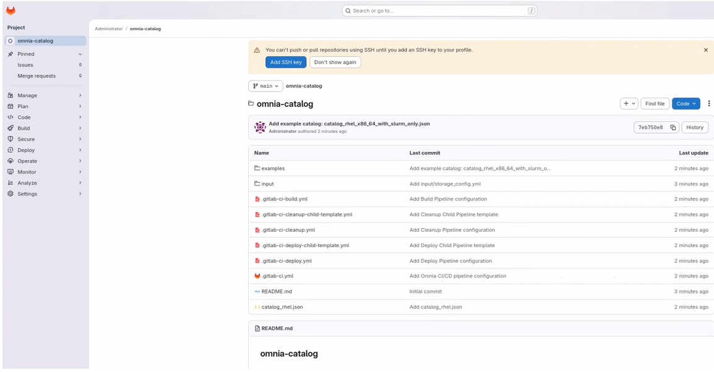
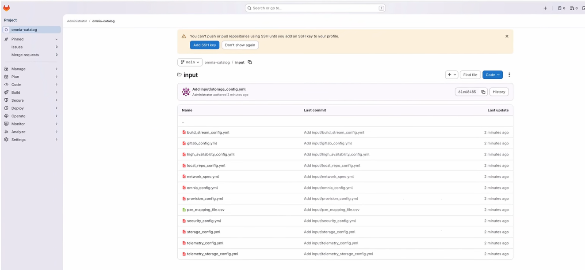
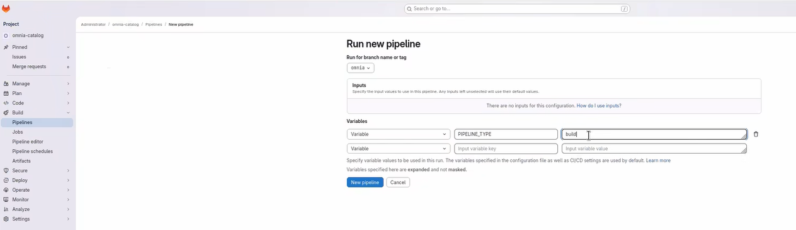
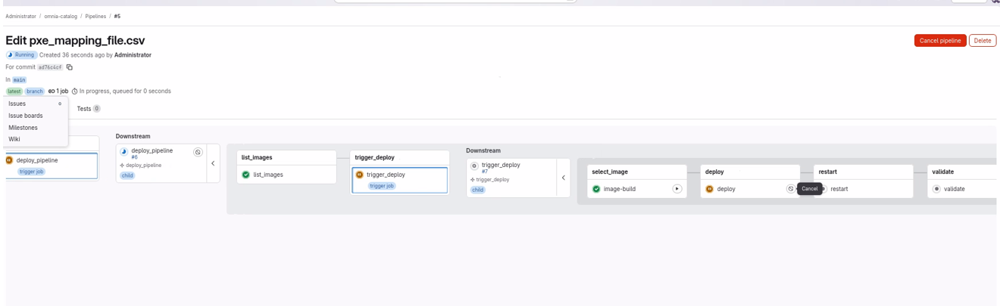
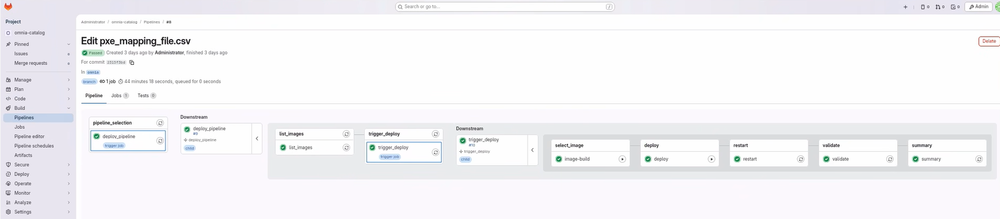

# Path D: BuildStreaM Automated Deployment

Omnia BuildStreaM provides a comprehensive automation solution for managing
infrastructure build workflows. Deploy an automated, catalog-driven HPC cluster
using Omnia BuildStreaM and GitLab CI/CD pipelines. BuildStreaM reads a
declarative catalog (json) to build diskless images and deploy them to cluster
nodes through automated pipelines.

BuildStreaM supports three pipeline types executed through GitLab:

- **Build Pipeline**: Creates diskless images based on catalog specifications. Automatically triggered when the catalog is committed, or executed manually.
- **Deploy Pipeline**: Deploys built images to target cluster nodes. Automatically triggered when the PXE mapping file is updated, or executed manually.
- **Clean Pipeline**: Removes old Image Groups based on retention policy. Executed manually only.

!!! note

    This tutorial assumes you have completed every item on the
    [Prerequisites Checklist](prerequisites_checklist.md). If you have not, stop here and
    finish that first.

!!! note

   - BuildStreaM does not support execution of multiple pipelines in parallel
    or concurrently. Only one pipeline can be executed at a time.

   - Do not cancel a running GitLab pipeline or stage. Cancellation prevents
    some pipeline steps from executing, which leaves the BuildStreaM job in
    an intermediate, inconsistent state. Backend BuildStreaM tasks already in
    progress continue running to completion regardless of cancellation.

BuildStreaM addresses the key challenges in HPC cluster image management:

- **Automation**: Eliminates manual build and deployment processes
- **Integration**: Works seamlessly with existing Omnia deployments
- **Traceability**: Provides complete audit trails for all build operations


To build custom workflows, use the BuildStreaM REST API. See the
[Omnia BuildStreaM API Documentation](https://developer.dell.com/apis/ea677050-f49b-49e1-a4b9-1cdd563415d9/versions/2.2.0-0/introduction-to-buildstream-api-12967m0).

## Step 1 -- Deploy the omnia_core Container

Deploy the Omnia core container on the OIM. The BuildStreaM container and
Playbook Watcher service are installed during the BuildStreaM setup in Step 3.
The `omnia_core` container is managed as a Systemd service
(`omnia_core.service`) and contains the Omnia source code with Python and
Ansible preinstalled.

### Prerequisites

- The OIM has internet access to download necessary packages.
- The OIM has two active NICs: one for the public network, one for internal cluster communication.
- Podman container engine is installed on the OIM.
- If using an NFS share for the Omnia shared path, the share has `755` permissions and `no_root_squash` enabled.

### Deploy from Omnia Artifactory

1. **Clone the Omnia Artifactory repository and build the container images**:

    ```bash title="Run on: OIM host"
    git clone https://github.com/dell/omnia-artifactory.git -b omnia-container-v2.2.0.0
    cd omnia-artifactory
    ./build_images.sh core omnia_branch=v2.2.0.0 core_tag=2.2
    ```

    - For `core_tag=<version>`, use the first two digits of the Omnia version. For example, for `v2.2.0.0`, use `core_tag=2.2`.
    - For `omnia_branch=<tag|branch>`, use the branch name or tag name (e.g., `v2.2.0.0`, `main`, `pub/q1_dev`).

2. **Download the `omnia.sh` script**:

    To use a tagged version:

    ```bash title="Run on: OIM host"
    wget https://raw.githubusercontent.com/dell/omnia/refs/tags/${OMNIA_VERSION}/omnia.sh
    ```

    To use a specific branch:

    ```bash title="Run on: OIM host"
    wget https://raw.githubusercontent.com/dell/omnia/refs/heads/${OMNIA_VERSION}/omnia.sh
    ```

3. **Make the script executable and install the container**:

    ```bash title="Run on: OIM host"
    chmod +x omnia.sh
    ./omnia.sh --install
    ```

    - When prompted for the shared path, enter the path for the Omnia shared directory (local file path or NFS share path).
    - When prompted for the password, enter a secure alphanumeric password for accessing the Omnia core container.

    !!! warning

        The password must not contain special characters such as `\`, `|`,
        `&`, `;`, `` ` ``, `<>`, `*`, `?`, `!`, `$`, `()`, `{}`, `[]`.

4. **Verify the container is running**:

    ```bash title="Run on: OIM host"
    ./omnia.sh --version
    systemctl status omnia_core
    ```

    You should see `active (running)` in the output.

5. **Access the Omnia core container**:

    ```bash title="Run on: OIM host"
    ssh omnia_core
    ```

!!! tip

    The `omnia.sh` script creates the following directories inside the
    container: `/opt/omnia` (shared directory), `/opt/omnia/input/project_default`
    (input files), `/omnia` (source code), and `/opt/omnia/log/core/playbooks`
    (logs). Provide any file paths referenced in input files relative to
    `/opt/omnia`.

## Step 2 -- Create the Mapping File

The mapping file tells Omnia which physical servers map to which cluster
roles. Nodes are discovered and provisioned based on **groups** (physical
location or hardware similarity) and **functional groups** (role in the
system).

Create a CSV file at `/opt/omnia/input/project_default/pxe_mapping_file.csv`
and set the `pxe_mapping_file_path` variable in `provision_config.yml` to
point to it.

Each node must be assigned: `FUNCTIONAL_GROUP_NAME`, `GROUP_NAME`,
`SERVICE_TAG`, `PARENT_SERVICE_TAG`, `HOSTNAME`, `ADMIN_MAC`, `ADMIN_IP`,
`BMC_MAC`, `BMC_IP`, `IB_NIC_NAME`, and `IB_IP`.

```text title="File: /opt/omnia/input/project_default/pxe_mapping_file.csv (x86_64 example)"
FUNCTIONAL_GROUP_NAME,GROUP_NAME,SERVICE_TAG,PARENT_SERVICE_TAG,HOSTNAME,ADMIN_MAC,ADMIN_IP,BMC_MAC,BMC_IP,IB_NIC_NAME,IB_IP
slurm_control_node_x86_64,grp0,ABCD12,,slurm-control-node1,a1:b2:c3:d4:e5:f6,172.16.107.52,a2:b3:c4:d5:e6:f7,172.17.107.52,InfiniBand.Slot.7-1,192.168.0.100
slurm_node_x86_64,grp1,ABCD34,ABFL82,slurm-node1,b1:c2:d3:e4:f5:a6,172.16.107.43,b2:c3:d4:e5:f6:a7,172.17.107.43,InfiniBand.Slot.7-1,192.168.0.101
slurm_node_x86_64,grp1,ABFG34,ABKD88,slurm-node2,c1:d2:e3:f4:a5:b6,172.16.107.44,c2:d3:e4:f5:a6:b7,172.17.107.44,InfiniBand.Slot.7-1,192.168.0.102
login_compiler_node_x86_64,grp8,ABCD78,,login-compiler-node1,d1:e2:f3:a4:b5:c6,172.16.107.41,d2:e3:f4:a5:b6:c7,172.17.107.41,InfiniBand.Slot.7-1,192.168.0.103
service_kube_control_plane_x86_64,grp3,ABFG79,,service-kube-cp1,f1:a2:b3:c4:d5:e6,172.16.107.53,f2:a3:b4:c5:d6:e7,172.17.107.53,InfiniBand.Slot.7-1,192.168.0.105
service_kube_control_plane_x86_64,grp4,ABFH78,,service-kube-cp2,11:22:33:44:55:66,172.16.107.54,12:23:34:45:56:67,172.17.107.54,InfiniBand.Slot.7-1,192.168.0.106
service_kube_control_plane_x86_64,grp4,ABFH80,,service-kube-cp3,aa:bb:cc:dd:ee:01,172.16.107.55,ab:bc:cd:de:ef:12,172.17.107.55,InfiniBand.Slot.7-1,192.168.0.107
service_kube_node_x86_64,grp5,ABFL82,,service-kube-node1,33:44:55:66:77:88,172.16.107.56,34:45:56:67:78:89,172.17.107.56,InfiniBand.Slot.7-1,192.168.0.108
service_kube_node_x86_64,grp5,ABKD88,,service-kube-node2,55:66:77:88:99:aa,172.16.107.57,56:67:78:89:aa:bb,172.17.107.57,InfiniBand.Slot.7-1,192.168.0.109
```

!!! warning

    Replace the placeholder values (`SERVICE_TAG`, `ADMIN_MAC`,
    `ADMIN_IP`, `BMC_IP`) with the actual values from your servers.
    Collect service tags from the server pull-out tab or iDRAC. Collect
    MAC addresses from `iDRAC > Network > NIC Selection` or by running
    `ip link` on each node.

!!! note

    - Ensure that nodes belonging to the same group have the same parent. Node entries with the same `GROUP_NAME` must have the same `PARENT_SERVICE_TAG`.
    - The header fields are case-sensitive.
    - IP addresses and service tags are not validated by Omnia. Incorrect values cause unexpected failures.
    - Hostnames must not contain the domain name.
    - All fields in the mapping file are mandatory.
    - `ADMIN_MAC` and `BMC_MAC` must refer to the PXE NIC and BMC NIC on target nodes respectively.
    - Target servers must be configured to boot in PXE mode with the appropriate NIC as the first boot device.

## Step 3 -- Prepare the OIM for BuildStreaM

Prepare the OIM by deploying the required containers and services for
BuildStreaM. This step installs the OpenCHAMI containers, BuildStreaM
container, Omnia Auth container, Pulp container, and Playbook Watcher service.

### Prerequisites

- The Omnia core container is installed with Omnia 2.2.0.0.
- Administrator access on the OIM node.
- Minimum 4 GB RAM and 2 CPU cores for BuildStreaM services.
- 10 GB free disk space for BuildStreaM data and logs.
- System time is synchronized across all compute nodes and the OIM. Time mismatch can lead to certificate-related issues.

!!! warning

    BuildStreaM requires a separate PostgreSQL database for storing
    transaction details and job metadata.

### 3a. Update input configuration files

Update the following input files in `/opt/omnia/input/project_default/`:

- `build_stream_config.yml` -- BuildStreaM pipeline configuration. See the [BuildStreaM configuration reference](../Reference/Configuration/buildstream_config.md) for parameter details.
- `gitlab_config.yml` -- GitLab configuration for BuildStreaM.
- `high_availability_config.yml` -- High availability configuration.
- `local_repo_config.yml` -- Local repository configuration.
- `network_spec.yml` -- Network configuration for the cluster.
- `omnia_config.yml` -- Omnia configuration.
- `provision_config.yml` -- Provisioning configuration.
- `security_config.yml` -- Security configuration.
- `storage_config.yml` -- Storage configuration.
- `telemetry_config.yml` -- Telemetry configuration.
- `telemetry_storage_config.yml` -- Telemetry storage configuration.
- `user_registry_credential.yml` -- User registry credentials.

!!! note

    Ensure that `build_stream_port` is correctly configured in
    `build_stream_config.yml`. The BuildStreaM port cannot be modified
    after preparing the OIM. To change the port, clean up the OIM first
    (`cleanup_oim.yml`) and then prepare it again with the new port
    (`prepare_oim.yml`).

**BuildStreaM configuration parameters:**

| Parameter | Required | Default | Description |
|-----------|----------|---------|-------------|
| `enable_build_stream` | Yes | `false` | Enable or disable the BuildStreaM pipeline. Accepted values: `true`/`false` or `yes`/`no`. |
| `build_stream_host_ip` | Yes | Admin IP of OIM | BuildStreaM API server host IP. Must be reachable from the GitLab server. |
| `build_stream_port` | Yes | `8010` | BuildStreaM API server port. Must be a free port (1--65535). |
| `aarch64_inventory_host_ip` | Conditional | None | The admin IP of the aarch64 host. Required only for aarch64 builds. |

**Sample `network_spec.yml`:**

```yaml title="File: /opt/omnia/input/project_default/network_spec.yml"
Networks:
- admin_network:
   oim_nic_name: "eno1"
   netmask_bits: "24"
   primary_oim_admin_ip: "172.16.107.67"
   primary_oim_bmc_ip: ""
   dynamic_range: "172.16.107.201-172.16.107.250"
   dns: []
```

!!! warning

    All provided network ranges and NIC IP addresses must be distinct with
    no overlap. All iDRACs must be reachable from the OIM.

### 3b. Set credentials

Run the `credentials_utility.yml` playbook to store passwords for BuildStreaM
and other services:

```bash title="Run on: OIM (inside omnia_core container)"
ssh omnia_core
cd /omnia
ansible-playbook credentials_utility.yml
```

You will be prompted to set:

- **BuildStreaM username and password** -- Required when BuildStreaM is enabled in `build_stream_config.yml`.
- **Provisioning OS password** -- Root password for provisioned nodes.
- **iDRAC credentials** -- Username and password for out-of-band access.

### 3c. Run `prepare_oim.yml`

```bash title="Run on: OIM (inside omnia_core container)"
ssh omnia_core
cd /omnia/prepare_oim
ansible-playbook prepare_oim.yml
```

The `prepare_oim.yml` playbook deploys the following on the OIM:

- OpenCHAMI containers
- PostgreSQL database container
- Omnia Auth container
- Pulp container
- BuildStreaM API container
- Playbook Watcher service

!!! note

    After `prepare_oim.yml` execution, `ssh omnia_core` may fail if you
    switch from a non-root to root user using `sudo`. Log in directly as
    `root` before executing the playbook.

### 3d. Verify OIM services

1. **Check the Omnia Core service**:

    ```bash title="Run on: OIM host"
    systemctl status omnia_core.service
    ```

2. **Check the BuildStreaM API container**:

    ```bash title="Run on: OIM host"
    systemctl status omnia_build_stream.service
    ```

3. **Check the Playbook Watcher service**:

    ```bash title="Run on: OIM host"
    systemctl status playbook_watcher.service
    ```

4. **Check the PostgreSQL database container**:

    ```bash title="Run on: OIM host"
    systemctl status omnia_postgres.service
    ```

5. **View the complete dependency tree**:

    ```bash title="Run on: OIM host"
    systemctl list-dependencies omnia.target
    ```

    Expected output:

    ```text title="Expected output"
    omnia.target
    ● ├─minio.service
    ● ├─omnia_auth.service
    ● ├─omnia_build_stream.service
    ● ├─omnia_core.service
    ● ├─omnia_postgres.service
    ● ├─playbook_watcher.service
    ● ├─pulp.service
    ● ├─registry.service
    ● ├─network-online.target
    ● │ └─NetworkManager-wait-online.service
    ● └─openchami.target
    ●   ├─acme-deploy.service
    ●   ├─acme-register.service
    ●   ├─bss-init.service
    ●   ├─bss.service
    ●   ├─cloud-init-server.service
    ●   ├─coresmd-coredhcp.service
    ●   ├─coresmd-coredns.service
    ●   ├─haproxy.service
    ●   ├─hydra-gen-jwks.service
    ●   ├─hydra-migrate.service
    ●   ├─hydra.service
    ●   ├─opaal-idp.service
    ●   ├─opaal.service
    ●   ├─openchami-cert-trust.service
    ●   ├─postgres.service
    ●   ├─smd-init.service
    ●   ├─smd.service
    ●   └─step-ca.service
    ```

    - A green circle indicates the service is running.
    - A grey circle indicates the service is not running.

!!! note

    The `omnia_build_stream.service`, `omnia_postgres.service`, and
    `playbook_watcher.service` run only when BuildStreaM is enabled in
    `build_stream_config.yml`.

## Step 4 -- Deploy GitLab for BuildStreaM

Deploy GitLab as the CI/CD automation engine for BuildStreaM. GitLab provides
the three-pipeline architecture for build, deploy, and cleanup operations.

### Prerequisites

- The BuildStreaM container, PostgreSQL container, and Playbook Watcher service are deployed on the OIM (Step 3 completed).
- A dedicated node is required for BuildStreaM GitLab deployment.
- The GitLab node has internet connectivity.
- The GitLab node has minimum 4 GB RAM, 2 CPU cores, and 20 GB free disk space.
- GitLab requires a minimum of 2 CPU cores.
- The OIM node is accessible from the GitLab node.
- The BuildStreaM API server is reachable from the GitLab node.
- AppStream and BaseOS repositories are configured and accessible on the GitLab node.
- SELinux is disabled on the GitLab node.

!!! warning

    Omnia uses a dedicated GitLab instance for BuildStreaM. This procedure
    provisions a new GitLab instance specifically configured for BuildStreaM.
    Existing GitLab setups configured for other purposes are not supported.

### Procedure

1. **Connect to the omnia_core container**:

    ```bash title="Run on: OIM host"
    ssh omnia_core
    ```

2. **Verify the GitLab configuration**:

    ```bash title="Run on: OIM (inside omnia_core container)"
    cat /opt/omnia/input/project_default/gitlab_config.yml
    ```

    <!-- TODO: Provide gitlab_config.yml parameter reference link when available -->

3. **Run the GitLab deployment playbook**:

    ```bash title="Run on: OIM (inside omnia_core container)"
    cd /omnia/gitlab
    ansible-playbook gitlab.yml
    ```

    When prompted, enter a GitLab password. Note this password as it is
    required to access the GitLab project and instance.

!!! note

    The installation takes 10--15 minutes to complete.

The `gitlab.yml` playbook performs the following:

- Installs GitLab on the host specified in `gitlab_config.yml`.
- Creates a project with the configured name, visibility, and default branch.
- Installs GitLab Runner as a Podman container.
- Generates a self-signed CA certificate at `/root/gitlab-certs/ca.crt` on the GitLab node.
- Adds the following files to the project:
    - **Pipeline configuration**: `.gitlab-ci.yml` (parent router), `.gitlab-ci-build.yml`, `.gitlab-ci-deploy.yml`, `.gitlab-ci-cleanup.yml`, `.gitlab-ci-deploy-child-template.yml`
    - **Catalog file**: `catalog_rhel.json` (default catalog for RHEL images)
    - **Input folder**: `input/` directory containing all BuildStreaM input configuration files



The `input/` folder includes:

- `build_stream_config.yml`
- `gitlab_config.yml`
- `high_availability_config.yml`
- `local_repo_config.yml`
- `network_config.yml`
- `omnia_config.yml`
- `provision_config.yml`
- `pxe_mapping_file.csv`
- `security_config.yml`
- `storage_config.yml`
- `telemetry_config.yml`
- `telemetry_storage_config.yml`



### Verification

1. **Verify you can access the GitLab project URL**:

    ```text title="GitLab project URL"
    https://<gitlab_host>:<gitlab_https_port>/root/<gitlab_project_name>
    ```

2. **Verify the project** contains the expected files and folders.

3. **Verify runner status** through the GitLab web interface:
    1. Navigate to **Settings** > **CI/CD**.
    2. Expand the **Runners** section.
    3. Verify the runner shows a **green** status indicator.
    4. Confirm the runner is set to **Running Always** with **Podman Container**.

!!! tip

    To avoid "Not Secure" warnings when accessing GitLab, download and
    import the CA certificate generated at `/root/gitlab-certs/ca.crt`
    on the GitLab node into your browser.

## Step 5 -- Execute the Build Pipeline

Update the `catalog_rhel.json` file and execute the BuildStreaM build
pipeline to create diskless images. The build pipeline consists of four
sequential stages:

- **parse-catalog**: Parses and validates the catalog file.
- **generate-input-files**: Generates input files and configuration data.
- **create-local-repository**: Creates the local repository for build artifacts.
- **build-image**: Builds the diskless images based on catalog specifications.

### Prerequisites

- The BuildStreaM container is deployed on the OIM (Step 3).
- GitLab deployment is complete (Step 4).
- You can access the GitLab project repository.

### Procedure

1. **Navigate to the GitLab project URL**:

    ```text title="GitLab project URL"
    https://<gitlab_host>:<gitlab_https_port>/root/<gitlab_project_name>
    ```

2. Go to **Code** > **Repository** and locate `catalog_rhel.json`.

3. **Modify the catalog file** to define your build requirements.

    !!! note

        Ensure the catalog file contains valid values:

        - **Functional group names**: See the functional groups reference table.
        - **Architecture type**: `x86_64` or `aarch64`.
        - **OS type**: `RHEL`.
        - **Package types**: `rpm`, `rpm_repo`, `image`, `iso`, `tarball`, `pip_module`, `git`, `manifest`.

4. **Trigger the build pipeline** by committing and pushing the catalog changes. The pipeline triggers automatically on commit.

    

5. **Monitor the pipeline progress** through the GitLab web interface:
    1. Navigate to **Build** > **Pipelines**.
    2. Click on the running pipeline to view details.
    3. Monitor each stage as it progresses.

    

!!! note

    - BuildStreaM currently supports only one catalog file and one pipeline trigger at a time.
    - Each pipeline processes catalog changes independently. Once a pipeline completes, you can modify the catalog and re-trigger.

### Execute build pipeline manually

To manually trigger the build pipeline:

1. Navigate to **Build** > **Pipelines** and click **New Pipeline**.
2. In the **Run new pipeline** dialog, enter the variable name as `PIPELINE_TYPE` and the value as `build`.

    

3. Click **Run Pipeline**.

### Verification

1. Navigate to **Build** > **Pipelines** and verify all stages show green checkmarks.
2. Click on individual jobs to view execution logs and verify no errors.

## Step 6 -- Execute the Deploy Pipeline

Deploy the built images to target cluster nodes. The deploy pipeline
consists of three sequential stages:

- **deploy**: Deploys images to the target nodes.
- **restart**: PXE-boots the target nodes to load deployed images.
- **validate**: Executes Molecule-based infrastructure tests to verify cluster deployment, network connectivity, and service health.

### Prerequisites

- The build pipeline has completed successfully and images are available.
- Target nodes are powered on and accessible via BMC.
- The PXE mapping file (`pxe_mapping_file.csv`) is correctly configured with target node information.
- The PXE mapping file is present in the GitLab repository `input/` folder.

### Procedure

1. **Navigate to the GitLab project URL**:

    ```text title="GitLab project URL"
    https://<gitlab_host>:<gitlab_https_port>/root/<gitlab_project_name>
    ```

2. **Trigger the deploy pipeline** by updating `pxe_mapping_file.csv` in the GitLab repository and committing the changes.

    

3. In the deploy pipeline, **select the image** from the `select_image` stage and click the **Play** button.

    

4. Click the **Play** button in the `deploy` stage to deploy the image.

    

5. **Monitor the pipeline progress**:
    1. Click on the running pipeline to view details.
    2. Monitor each stage: **deploy** > **restart** > **validate**.

### Execute deploy pipeline manually

1. Navigate to **Build** > **Pipelines** and click **New Pipeline**.
2. Enter the variable name as `PIPELINE_TYPE` and the value as `deploy`.

    

3. Click **Run Pipeline**.

    

!!! note

    When using manual retry, ensure only necessary parameters are updated.
    Unnecessary changes may cause additional pipeline failures.

### Handle deploy failures during restart stage

When the restart stage encounters partial failures (some nodes PXE-boot
successfully while others fail), BuildStreaM provides a `failed_nodes.json`
mechanism for efficient retry operations.

The `failed_nodes.json` file tracks which nodes failed to PXE boot and
enables you to:

- Track failed nodes with detailed error messages.
- Manually fix failed nodes and update their entries as successful.
- Retry only failed nodes instead of the entire inventory.

```json title="Example: failed_nodes.json"
{
  "job_id": "018f3c4b-7b5b-7a9d-b6c4-9f3b4f9b2c10",
  "stage_name": "restart",
  "timestamp": "2026-04-10T16:32:15Z",
  "total_nodes": 5,
  "failure_count": 2,
  "failed_nodes": [
    {
      "bmc_ip": "172.17.107.44",
      "hostname": "slurm-node2",
      "service_tag": "79WWJ93",
      "status": "failed",
      "message": "Failed. iDRAC is not ready. Retry again after iDRAC is ready"
    },
    {
      "bmc_ip": "172.17.107.45",
      "hostname": "slurm-node3",
      "service_tag": "79WWJ94",
      "status": "failed",
      "message": "iDRAC is unreachable. pxe boot might be set. Please check the host reboot status manually"
    }
  ]
}
```

**Retry procedure for failed nodes:**

1. During the first run, the restart stage attempts to PXE-boot all nodes automatically.
2. If all nodes succeed, the stage proceeds to validation.
3. In case of partial failure, only failed nodes are recorded in `failed_nodes.json` in the `miscellaneous` directory in GitLab.

    

4. Analyze failures and perform corrective actions:
    - Check iDRAC readiness.
    - Verify BMC network connectivity.
    - Validate PXE boot configuration.

5. After resolving issues, retry the restart stage for failed nodes.
6. If automated retry is not feasible (e.g., VM or manual dependency), manually PXE-boot the affected nodes.
7. After manual boot, update the node status to `success` in `failed_nodes.json` and click the **Retry downstream pipeline** icon.

    

    The restart stage completes successfully when all nodes are successful (automated or manual). The workflow then proceeds to the validation stage.

    

8. To view detailed logs for the validate stage, click on the Validate stage in the pipeline. The logs include the log file path on the OIM for the detailed test report.

### Add new nodes to the cluster

To deploy images on new nodes without affecting previously provisioned nodes:

1. Update the `pxe_mapping_file.csv` with the details of the new nodes in GitLab.
2. Run the deploy pipeline by selecting the required image.

The system PXE-boots only the newly added nodes without impacting previously successful nodes.

### Verification

1. Check the overall pipeline status in GitLab to ensure all stages passed.
2. Verify that target nodes have restarted and are accessible.
3. Log in to a sample of deployed nodes to verify the correct image is loaded.
4. Check the BuildStreaM API for deployment status and image group information.

## Step 7 -- Initialize Telemetry

Initialize telemetry services for monitoring the cluster. Telemetry collection
enables you to gather performance metrics and system health data from cluster
nodes.

!!! note

    BuildStreaM does not automate telemetry invocation and data collection.
    You must perform all steps in this section manually on the OIM.

### Prerequisites

- Nodes are powered on and accessible via BMC.

### Procedure

1. **Run the `telemetry.yml` playbook**:

    ```bash title="Run on: OIM (inside omnia_core container)"
    cd telemetry
    ansible-playbook telemetry.yml
    ```

!!! note

    Service cluster metadata automatically captures the service cluster
    kube control plane virtual IP. The `telemetry.yml` playbook executes
    against the VIP rather than an individual control plane node.

!!! note

    You do not need to run `telemetry.yml` if the service cluster is
    configured only for LDMS. LDMS begins collecting data automatically
    after nodes are deployed with the appropriate configuration.

### Collect telemetry from external nodes

1. Update the BMC IP of external nodes in `/opt/omnia/telemetry/bmc_group_data.csv`. Leave the `GROUP_NAME` and `PARENT` fields blank.

    ```text title="File: /opt/omnia/telemetry/bmc_group_data.csv"
    BMC_IP,GROUP_NAME,PARENT
    <IP Address>,,
    ```

2. Run the telemetry playbook:

    ```bash title="Run on: OIM (inside omnia_core container)"
    ansible-playbook telemetry.yml
    ```

## Step 8 -- Verify Telemetry Services

Validate telemetry services and their components, including pod status,
message flow, TLS connectivity, and collected telemetry data.

!!! note

    For the list of iDRAC telemetry metrics collected by Kafka and
    VictoriaMetrics, see the
    [iDRAC Telemetry Reference Tools](https://github.com/dell/iDRAC-Telemetry-Reference-Tools).

### Verify telemetry pods

```bash title="Run on: Service K8s control plane"
kubectl get pods -n telemetry
```

Ensure the following pods are in a `Running` state:

- iDRAC Telemetry pods
- Kafka broker, controller, and operator pods
- LDMS aggregator and store pods
- VictoriaMetrics and vmagent pods
- VictoriaLogs pods
- PowerScale Telemetry pods

### Verify telemetry services

```bash title="Run on: Service K8s control plane"
kubectl get svc -n telemetry
```

Ensure the following service entries exist:

- iDRAC Telemetry service
- Kafka broker, controller (bootstrap), and bridge services
- LDMS aggregator and store services
- VictoriaMetrics service
- VictoriaLogs service
- PowerScale Telemetry service

### Verify iDRAC telemetry messages in Kafka

1. Log in to the Service Kubernetes control plane.

2. **Create a Kafka consumer**:

    ```bash title="Run on: Service K8s control plane"
    KAFKA_LB_IP=<external load balancer IP of the bridge-bridge-lb service>
    curl -X POST http://$KAFKA_LB_IP:8080/consumers/idrac-consumer-group \
    -H 'content-type: application/vnd.kafka.v2+json' \
    -d '{
            "name": "idrac-consumer-1",
            "format": "json",
            "auto.offset.reset": "earliest"
        }'
    ```

3. **Subscribe the consumer to the telemetry topic**:

    ```bash title="Run on: Service K8s control plane"
    curl -X POST http://$KAFKA_LB_IP:8080/consumers/idrac-consumer-group/instances/idrac-consumer-1/subscription \
    -H 'content-type: application/vnd.kafka.v2+json' \
    -d '{"topics": ["idrac"]}'
    ```

4. **Consume messages from the topic**:

    ```bash title="Run on: Service K8s control plane"
    while true; do curl -X GET http://$KAFKA_LB_IP:8080/consumers/idrac-consumer-group/instances/idrac-consumer-1/records \
    -H 'accept: application/vnd.kafka.json.v2+json' | jq '.' ;  sleep 2; done
    ```

    If telemetry metrics are collected correctly, the output contains JSON-formatted iDRAC telemetry records.

### Verify LDMS messages in Kafka

1. Log in to the Service Kubernetes control plane.

2. **Create a Kafka consumer**:

    ```bash title="Run on: Service K8s control plane"
    KAFKA_LB_IP=<external load balancer IP of the bridge-bridge-lb service>
    curl -X POST http://$KAFKA_LB_IP:8080/consumers/ldms-consumer-group \
    -H 'content-type: application/vnd.kafka.v2+json' \
    -d '{
            "name": "ldms-consumer-1",
            "format": "json",
            "auto.offset.reset": "latest",
            "enable.auto.commit": true
        }'
    ```

3. **Subscribe to the LDMS topic**:

    ```bash title="Run on: Service K8s control plane"
    curl -X POST http://$KAFKA_LB_IP:8080/consumers/ldms-consumer-group/instances/ldms-consumer-1/subscription \
    -H 'content-type: application/vnd.kafka.v2+json' \
    -d '{"topics": ["ldms"]}'
    ```

4. **Consume messages**:

    ```bash title="Run on: Service K8s control plane"
    while true; do curl -X GET http://$KAFKA_LB_IP:8080/consumers/ldms-consumer-group/instances/ldms-consumer-1/records \
    -H 'accept: application/vnd.kafka.json.v2+json' | jq '.' ;  sleep 2; done
    ```

!!! note

    When new nodes are added, ensure the nodes are up and cloud-init has
    completed successfully (check `/var/log/cloud-init-output.log` on each
    node). Create a new Kafka consumer group with a unique name to verify
    metrics from newly added nodes. Wait 2--3 minutes after discovery
    completes before checking.

### Verify Kafka TLS connectivity

```bash title="Run on: Service K8s control plane"
cd /<nfs client mount path of the service k8s cluster>/telemetry/deployments/test
kubectl apply -f kafka.tls_test_job.yaml
```

After the job completes, check the logs:

```bash title="Run on: Service K8s control plane"
kubectl logs kafka-tls-test-xxx -n telemetry
```

### Verify VictoriaMetrics TLS connectivity

```bash title="Run on: Service K8s control plane"
cd /<nfs client mount path of the service k8s cluster>/telemetry/deployments/test
kubectl apply -f victoria-tls-test-job.yaml
```

After the job completes, check the logs:

```bash title="Run on: Service K8s control plane"
kubectl logs victoria-tls-test-xxx -n telemetry
```

### View collected logs using VictoriaLogs

1. Verify the VictoriaLogs `vlselect` pod is running:

    ```bash title="Run on: Service K8s control plane"
    kubectl get pods -n telemetry -o wide | grep vlselect
    ```

2. Verify the VictoriaLogs `vlselect` service is running:

    ```bash title="Run on: Service K8s control plane"
    kubectl get service -n telemetry -o wide | grep vlselect
    ```

3. Note the **External IP** and **port number** of the `vlselect` service.

4. Access the VictoriaLogs query interface in a browser:

    ```text title="VictoriaLogs URL"
    https://<external vlselect loadbalancer IP>:9471/select/vmui
    ```

5. Filter and view logs using LogsQL queries. For example:

    ```text title="Example query"
    * | sort by time desc
    ```

### View iDRAC telemetry data using VictoriaMetrics UI (cluster mode)

1. Verify VictoriaMetrics pods are running:

    ```bash title="Run on: Service K8s control plane"
    kubectl get pods -n telemetry -o wide | grep vm
    ```

2. Verify VictoriaMetrics services are running:

    ```bash title="Run on: Service K8s control plane"
    kubectl get service -n telemetry -o wide | grep vm
    ```

3. Note the **External IP** and **port number** of the VictoriaMetrics service.

4. Access the VMUI in a browser:

    ```text title="VictoriaMetrics VMUI URL"
    https://<external vmselect loadbalancer IP>:8481/select/0/vmui
    ```

5. Filter and view telemetry metrics. For example:

    ```text title="Example query"
    {__name__=~"PowerEdge_.*"}
    ```

### Access the MySQL database

After `telemetry.yml` has been executed, you can check the MySQL database
inside the `mysqldb` container:

1. Get the names of the telemetry pods:

    ```bash title="Run on: Service K8s control plane"
    kubectl get pods -n telemetry -l app=idrac-telemetry
    ```

2. Access the MySQL database:

    ```bash title="Run on: Service K8s control plane"
    kubectl exec -it -n telemetry <iDRAC_telemetry_pod_name> -c mysqldb -- mysql -u <MYSQL_USER> -p
    ```

3. Enter the MySQL password when prompted.

4. Access the telemetry database:

    ```sql title="MySQL commands"
    use idrac_telemetrydb;
    select * from services;
    ```

## Next Steps

- [Deploy GitLab](../HowTo/BuildStreaM/deploy_gitlab.md) -- Configure and manage the GitLab instance.
- [Update Catalog & Pipelines](../HowTo/BuildStreaM/update_catalog_pipeline.md) -- Modify catalogs and re-trigger pipelines.
- [Perform Cleanup Operations](../HowTo/BuildStreaM/cleanup_operations.md) -- Remove old Image Groups when the count exceeds 50.
- [Retry Pipeline Operations](../HowTo/BuildStreaM/retry_pipelines.md) -- Retry failed pipelines.

## Troubleshooting

- **Health Check stage failing**: Ensure the GitLab target IP and BuildStreaM API server are in the same subnet. Verify that `omnia_build_stream`, `omnia_postgres`, and `playbook_watcher` services are running. Check logs with `journalctl -u omnia_build_stream --no-pager`.

- **API Registration stage failing**: Currently only one client can register with the BuildStreaM API server. If you see `max_clients_limit_reached`, either run the pipeline from the already registered client or perform `gitlab_cleanup` and reconfigure GitLab.

- **Token Generation stage failing**: Check authentication logs at `/<nfs-dir>/omnia/log/build_stream/auth.log`.

- **Parse Catalog stage failing**: Ensure `catalog_rhel.json` matches the expected schema. Reference examples are available at `https://github.com/dell/omnia/tree/pub/build_stream/examples/catalog`. Check job logs at `/<nfs-dir>/omnia/log/build_stream/<job-id>/<jobid>.log`.

- **Create Local Repo stage failing**: Check the log path from the API response for detailed error information. Verify `local_repo_config.yml` settings.

- **Build Images stage failing**: Ensure the catalog has predefined functional groups. Check the log path from the API response.

- **Deploy Images stage failing**: Ensure functional groups in the PXE mapping file match those in `catalog_rhel.json`. Check the API response log path.

- **Retry button not displayed**: Initiate a restart from the parent pipeline. This restarts the entire pipeline from the beginning.

For detailed troubleshooting, see [BuildStreaM Troubleshooting](../Troubleshooting/buildstream.md).

!!! info "Related resources"

    - [Prerequisites Checklist](prerequisites_checklist.md)
    - [BuildStreaM Troubleshooting](../Troubleshooting/buildstream.md)
    - [Omnia BuildStreaM API Documentation](https://developer.dell.com/apis/ea677050-f49b-49e1-a4b9-1cdd563415d9/versions/2.2.0-0/introduction-to-buildstream-api-12967m0)
