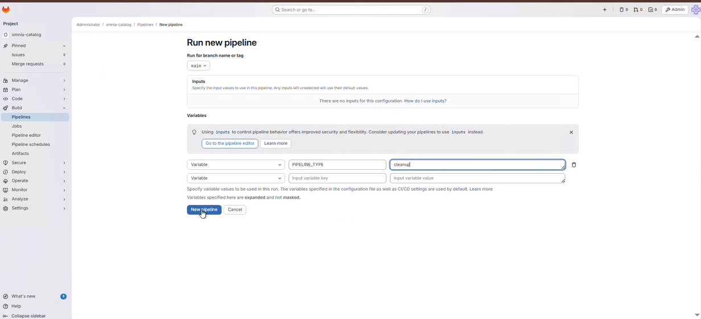
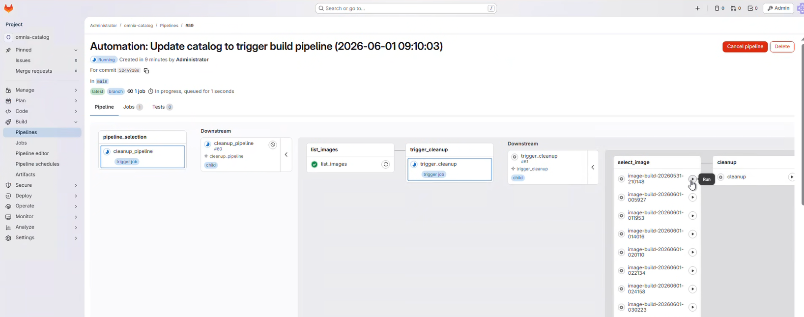
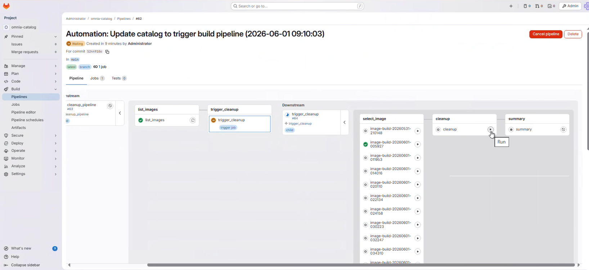
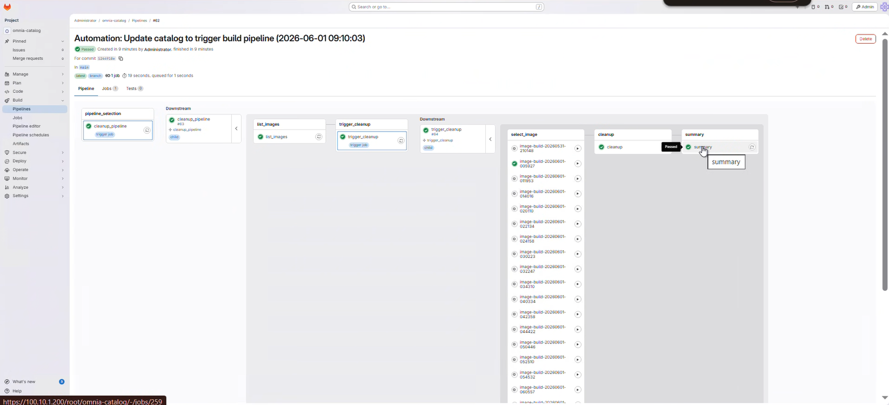

# Perform Cleanup Operations

Remove old Image Groups when the build image count exceeds the maximum
limit of 50 images.

## Overview

BuildStreaM supports a maximum of 50 build images. When the count exceeds
this limit, you must manually perform cleanup operations to remove old
images before creating new ones. The cleanup pipeline is triggered manually
through the GitLab interface.

!!! warning

    Do not cancel a running GitLab pipeline or stage. Cancellation prevents
    some pipeline steps from executing, which leaves the BuildStreaM job in
    an intermediate, inconsistent state. Backend BuildStreaM tasks already in
    progress continue running to completion regardless of cancellation.

## Prerequisites

- Administrative access to the OIM.
- The BuildStreaM API server is running.
- The PostgreSQL database is accessible.

## Procedure

1. **Navigate to the GitLab project URL**:

    ```text title="GitLab project URL"
    https://<gitlab_host>:<gitlab_https_port>/root/<gitlab_project_name>
    ```

2. Navigate to **Build** > **Pipelines**.

3. Click **New Pipeline**.

4. In the **Run new pipeline** dialog, enter the variable name as `PIPELINE_TYPE` and the value as `cleanup`.

    

5. Click **Run Pipeline** to execute the cleanup pipeline.

6. In the pipeline, **select the image to be cleaned up** from the `select_image` stage.

    

7. Click the **Play** button on the cleanup stage to execute the cleanup.

    

8. **Monitor the pipeline progress** through the GitLab web interface:
    1. Click on the running pipeline to view details.
    2. Monitor the cleanup stage as it progresses to completion.

    

9. Review the stage status indicators:
    - Green checkmark: Stage completed successfully.
    - Red X: Stage failed (click for error details).
    - Blue circle: Stage currently running.

## Verification

1. Check the GitLab pipeline status to ensure the cleanup stage passed.
2. Verify the Image Group count is within the configured retention limit.
3. Review the cleanup pipeline logs in GitLab for details about which Image Groups were removed.

## Next Steps

- [Retry Pipeline Operations](retry_pipelines.md) -- Retry failed pipeline operations.
- [Update Catalog & Pipelines](update_catalog_pipeline.md) -- Trigger new build pipelines after cleanup.

## Troubleshooting

- **Cleanup pipeline fails**: Check the pipeline logs in GitLab for specific error messages. Verify the BuildStreaM API server and PostgreSQL database are running on the OIM.

- **Image Group not appearing in selection**: Ensure the Image Group exists and was created by a successful build pipeline.

!!! info "Related resources"

    - [BuildStreaM Deployment](../../GetStarted/buildstream_deployment.md) -- End-to-end deployment tutorial.
    - [BuildStreaM Troubleshooting](../../Troubleshooting/buildstream.md) -- Symptom/Cause/Resolution reference.
