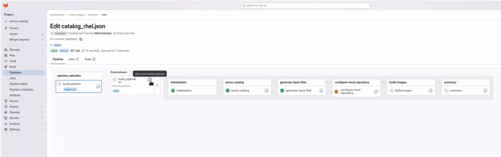

# Retry Pipeline Operations

Retry a BuildStreaM pipeline when one or more stages have failed. Before retrying, identify and resolve the issue that caused the failure.

!!! warning

    Do not cancel a running GitLab pipeline or stage. Cancellation prevents some pipeline steps from executing, which leaves the BuildStreaM job in an intermediate, inconsistent state.

## Prerequisites

- A Job exists with one or more stages in `FAILED` state
- The issue that caused the failure has been identified and resolved
- Configuration files (PXE mapping and input files) have been corrected if needed

## Procedure

1. Navigate to **Build** → **Pipelines** and identify the failed pipeline.

2. Identify the stage that failed and review the error logs.

3. Resolve the issue that caused the failure:

    - Fix configuration errors if present.
    - Resolve network connectivity issues.
    - Clear resource constraints if applicable.
    - Address any other specific error conditions.

4. Click the **Retry downstream pipeline** icon on the stage to re-execute the entire pipeline.

    

    !!! note

        This creates a new job and re-executes the entire pipeline from the beginning. It is recommended to retry the entire pipeline rather than an individual stage.

5. Verify that the pipeline completes successfully.

## Verification

1. Check the GitLab pipeline status to ensure all stages passed.

2. Verify that a new Pipeline ID is created for the retry operation.

3. For build pipelines, verify that images were created successfully.

4. For deploy pipelines, verify that nodes were deployed correctly.

5. Compare results with the original failed pipeline to confirm the issue is resolved.

## Next Steps

- [Execute Build Pipeline](execute_build_pipeline.md) -- Build pipeline operations
- [Execute Deploy Pipeline](execute_deploy_pipeline.md) -- Deploy pipeline operations
- [Cleanup Operations](cleanup_operations.md) -- Remove old Image Groups

## Troubleshooting

- **Retry button not displayed**: The Retry button may not appear in certain failed pipeline stages. Initiate a restart from the parent pipeline to resolve this issue. This restarts the entire pipeline from the beginning.
- For additional issues, see [BuildStreaM Troubleshooting](../../Troubleshooting/buildstream.md).
