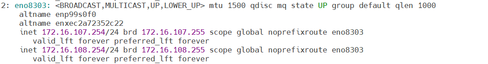
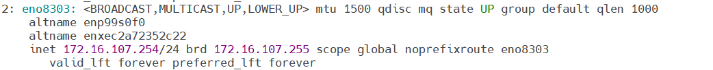

# Provision Nodes

Run the `provision.yml` playbook to discover, configure, and provision bare-metal cluster nodes. This playbook reads the PXE mapping file, configures boot scripts and cloud-init based on functional groups, and prepares all target servers for PXE boot.

## Prerequisites

- The [Create Mapping File](create_mapping_file.md) procedure is complete.
- The [Configure Credentials](configure_credentials.md) procedure is complete.
- The [Configure Inputs](configure_inputs.md) procedure is complete.
- The [Prepare OIM](prepare_oim.md) procedure is complete (OpenCHAMI and DHCP are running).
- The [Create Local Repos](create_local_repos.md) procedure is complete (local Pulp repository is set up with required packages).
- The [Build Cluster Images](build_cluster_images.md) procedure is complete. Verify that images exist for each functional group:

    ```bash title="Run on: OIM host"
    s3cmd ls -Hr s3://boot-images
    ```

- The UEFI boot setting is configured in the BIOS settings of all target servers before initiating PXE boot.
- Admin and BMC network switches are manually configured.
- External NFS storage is accessible by all nodes and reachable on the admin network.
- The OIM NIC connected to remote servers (through the switch) is configured with the correct IP addresses:
    - **Shared LOM / hybrid setup**: Two IPs (BMC IP and admin IP) on the same NIC.
        

    - **Dedicated network topology**: A single IP (admin IP).
        

- All network manager connection names match their corresponding device names. To verify:

    ```bash title="Run on: OIM host"
    nmcli connection
    ip link show
    ```

    If there is a mismatch, edit `/etc/sysconfig/network-scripts/ifcfg-<nic name>` to correct the connection name.

- When discovering nodes via mapping files, all cluster nodes are set to PXE mode before running the playbook.
- The first PXE device on target nodes is the designated active NIC for PXE booting.

!!! caution

    After the cluster has been configured and deployed, changing the OIM node is not supported. If you need to change the OIM node, you must redeploy the entire cluster.

## Procedure

1. **Enter the omnia_core container**:

    ```bash title="Run on: OIM host"
    ssh omnia_core
    ```

2. **Verify all prerequisites are complete**:

    - The mapping file, credentials, input files, OIM services, local repos, and cluster images are configured as listed in [Prerequisites](#prerequisites).
    - Verify boot images exist:

        ```bash title="Run on: omnia_core container"
        s3cmd ls -Hr s3://boot-images
        ```

3. **Run the provision playbook**:

    ```bash title="Run on: omnia_core container"
    cd /omnia/provision
    ansible-playbook provision.yml
    ```

    The playbook performs the following:

    - Provisions all target servers.
    - Configures the boot script based on functional groups.
    - Configures cloud-init based on functional groups.
    - Applies additional cloud-init configurations (if `additional_cloud_init_config_file` is set in `provision_config.yml`).
    - Deploys iDRAC telemetry service on the service cluster.
    - Deploys LDMS on the service cluster.

4. **PXE boot the nodes** using one of the following methods:

    - **Manual PXE boot**: Power on target servers and select network boot from the BIOS boot menu.
    - **Automated PXE boot**: Use the `set_pxe_boot.yml` playbook. For detailed steps, see [Configure PXE Boot](configure_pxe_boot.md).

5. **Monitor provisioning progress**:

    ```bash title="Run on: omnia_core container"
    tail -f /opt/omnia/log/provision.log
    ```

!!! note

    - Ansible playbooks run concurrently on 5 nodes by default. To change this, update the `forks` value in `ansible.cfg` in the playbook directory.
    - Omnia does not track the OS installation on the target node. Verify the installation status manually.
    - While the `admin_nic` on cluster nodes is configured by Omnia to be static, the public NIC IP address must be configured by the user.

!!! caution

    - In case of any IP route conflict between the admin network and an additional NIC (for example, an internet NIC), delete the admin route or configure the IP route priority based on your cluster requirements.
    - If internet connectivity is required on the target node, configure it after the node is booted.
    - To avoid breaking the password-less SSH channel on the OIM, do not run `ssh-keygen` commands after execution of `provision.yml`.
    - Do not delete the Omnia shared path or the NFS directory.

!!! important

    After running `provision.yml`, the file `/opt/omnia/input/project_default/omnia_config_credentials.yml` is encrypted. To edit it, use:

    ```bash title="Run on: omnia_core container"
    ansible-vault edit omnia_config_credentials.yml --vault-password-file .omnia_config_credentials_key
    ```

    Post execution of `provision.yml`, IPs and hostnames cannot be reassigned by changing the mapping file.

## Verification

1. **Check provision logs for errors**:

    ```bash title="Run on: omnia_core container"
    cat /opt/omnia/log/provision.log | tail -50
    ```

2. **Check cloud-init output on a provisioned node**:

    ```bash title="Run on: provisioned compute node"
    cat /var/log/cloud-init-output.log | tail -30
    ```

3. **Verify all nodes are reachable**:

    ```bash title="Run on: omnia_core container"
    ansible all -m ping
    ```

## Next Steps

- [Configure PXE Boot](configure_pxe_boot.md) -- Automate PXE boot for provisioned nodes
- [Verify Cluster](verify_cluster.md) -- Verify the cluster is operational
- [Set Up Telemetry](../Telemetry/setup_telemetry.md) -- Start telemetry collection

## Troubleshooting

**Provision playbook fails at "Waiting for node registration"**
   Verify the admin network switch is configured and nodes can PXE boot. Check DHCP and TFTP services on the OIM:

   ```bash title="Run on: OIM host"
   systemctl status coredhcp.service
   systemctl status tftpd.service
   ```

**Cloud-init did not complete on provisioned node**
   Check the cloud-init log on the affected node:

   ```bash title="Run on: provisioned compute node"
   cat /var/log/cloud-init-output.log
   journalctl -u cloud-init --no-pager -n 50
   ```

**Nodes not reachable after provisioning**
   Verify admin network connectivity and NIC configuration:

   ```bash title="Run on: OIM host"
   ping -c 3 <admin-ip>
   arping -D -I <admin-nic> <admin-ip>
   ```

   Check for IP route conflicts between admin and public networks on the node.

**omnia_config_credentials.yml is encrypted and cannot be edited**
   Use the vault password file to edit:

   ```bash title="Run on: omnia_core container"
   ansible-vault edit omnia_config_credentials.yml --vault-password-file .omnia_config_credentials_key
   ```
