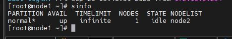

# Verify Cluster

Verify that the Slurm cluster and Kubernetes are deployed successfully on the service cluster after booting the nodes.

## Overview

After booting the nodes, verify the following:

- Required Slurm services are active and compute nodes report an `idle` state.
- GPU-enabled Slurm nodes complete GPU driver installation.
- The Slurm PAM feature restricts SSH access to compute nodes to the duration of an active job.
- Kubernetes pods and nodes on the service cluster are healthy.

## Prerequisites

- Nodes are booted and provisioned.
- Slurm and/or Kubernetes have been deployed (see [Setup Slurm](../Slurm/setup_slurm.md) or [Setup Service K8S](../Kubernetes/setup_service_k8s.md)).
- For GPU verification: GPU-enabled Slurm nodes are configured (see [Slurm With Gpu](../Slurm/slurm_with_gpu.md)).
- For PAM verification: External LDAP is deployed (see [Deploy External LDAP](../Authentication/deploy_external_ldap.md)).

## Procedure

### Verify Slurm Cluster

1. On the Slurm controller node, verify the required services are running:

    ```bash title="Run on: Slurm control node"
    systemctl status munge
    systemctl status slurmctld
    systemctl status slurmdbd
    systemctl status mariadb
    ```

    Confirm that each service is active (running).

2. Verify the node status with `sinfo`:

    ```bash title="Run on: Slurm control node"
    sinfo
    ```

    

    Ensure that the compute nodes are listed and the node state is `idle`.

!!! tip

    Store job output and error files in NFS-mounted directories (for example, `/var/log/slurm/`) so that job logs are persisted.

### Verify Slurm Cluster with GPU

3. On Slurm nodes that have GPUs, it may take some time for Slurmd to start because of the GPU driver installation. To view the logs during this process, run:

    ```bash title="Run on: GPU compute node"
    tail -f /var/log/cloud-init-output.log
    ```

!!! note

    - The CUDA installation path on the OIM and nodes must be `{client_share_path}/slurm/cuda`.
    - The `client_share_path` is the same as mentioned in `storage_config.yml` for `nfs_slurm`.

### Verify PAM Feature for Slurm

Slurm PAM restricts SSH access to compute nodes for non-root users. You can log in only while their job is actively running on the node. After the job is completed, you are automatically logged out.

4. On the login node, switch to the LDAP user:

    ```bash title="Run on: login node"
    ssh <ldap_user>@<login_node_hostname>
    sbatch job.sh
    ```

5. While the job is running, SSH as `<ldap_user>` to the Slurm node where the job is running. After the job is completed, `<ldap_user>` is logged out.

### Verify Kubernetes on the Service Cluster

6. Run the following commands on the Kubernetes controller node:

    ```bash title="Run on: K8s control plane node"
    kubectl get pods -A -o wide
    kubectl get nodes -o wide
    ```

## Verification

| Check | Command | Expected Result |
| --- | --- | --- |
| Slurm services active | `systemctl status munge slurmctld slurmdbd mariadb` | All `active (running)` |
| Slurm nodes idle | `sinfo` | Compute nodes listed, state `idle` |
| PAM restricts SSH | `ssh <ldap_user>@<node>` outside job runtime | Access denied after job completes |
| K8s nodes ready | `kubectl get nodes -o wide` | All `Ready` |
| K8s pods running | `kubectl get pods -A -o wide` | All `Running` |

## Next Steps

- [Slurm With Gpu](../Slurm/slurm_with_gpu.md) -- Configure GPU support for Slurm.
- [Deploy External LDAP](../Authentication/deploy_external_ldap.md) -- Set up centralized authentication for the PAM feature.
