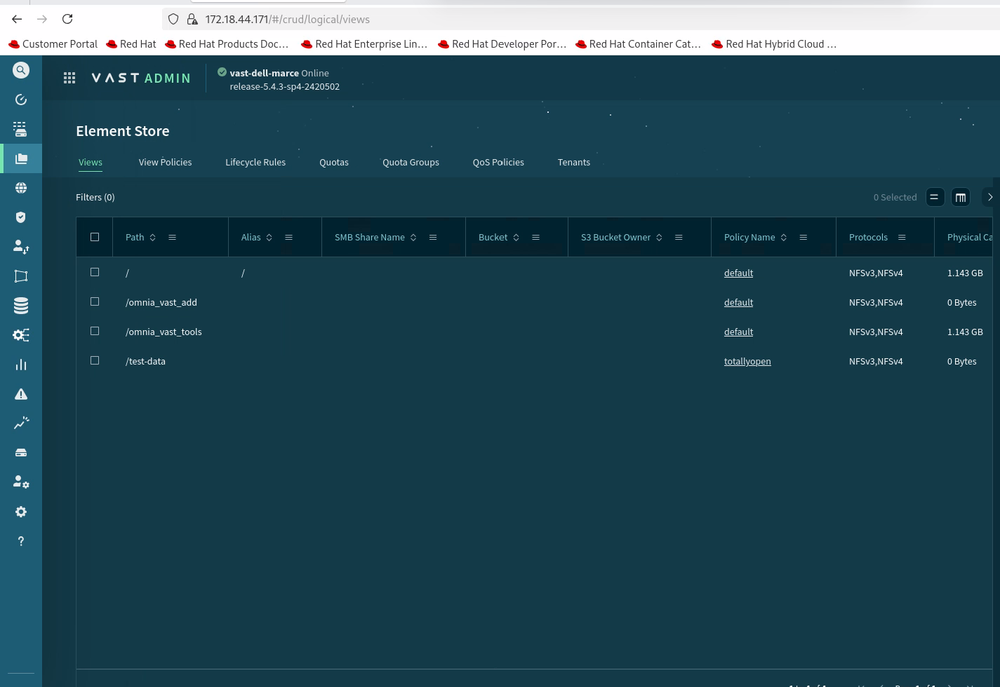
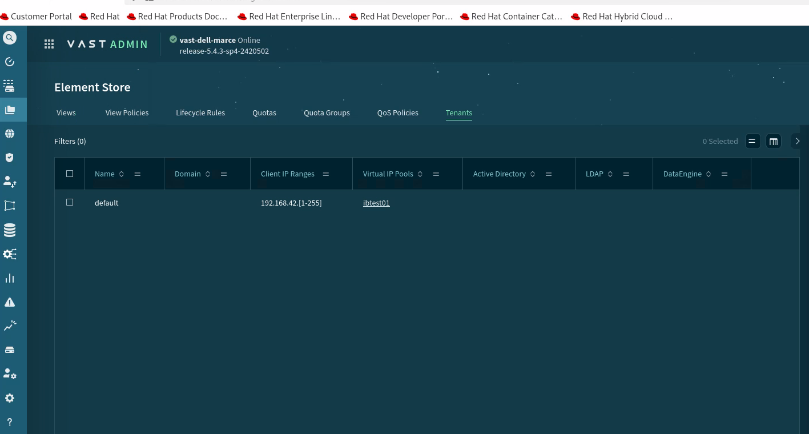
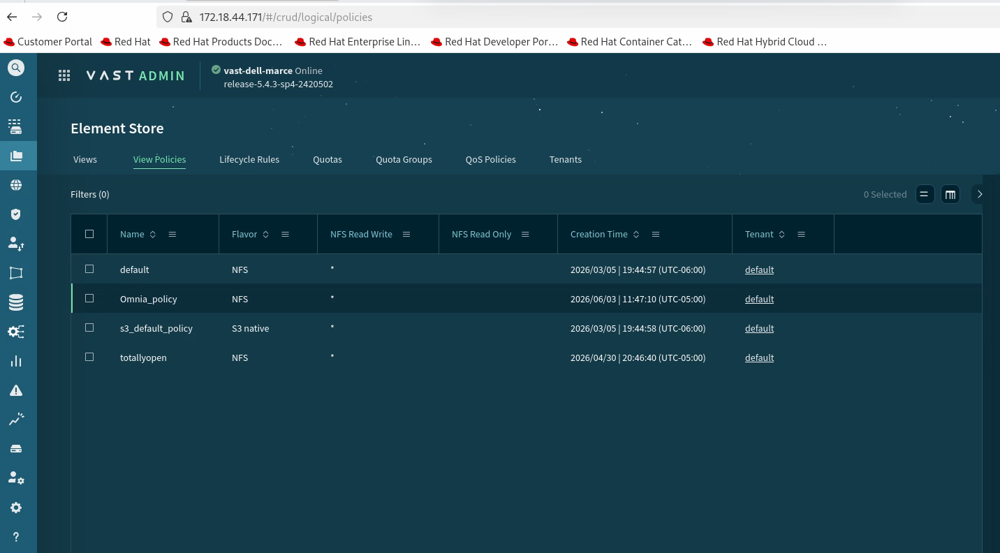
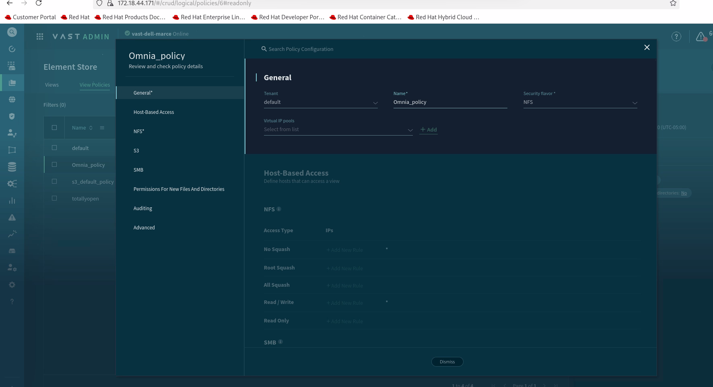
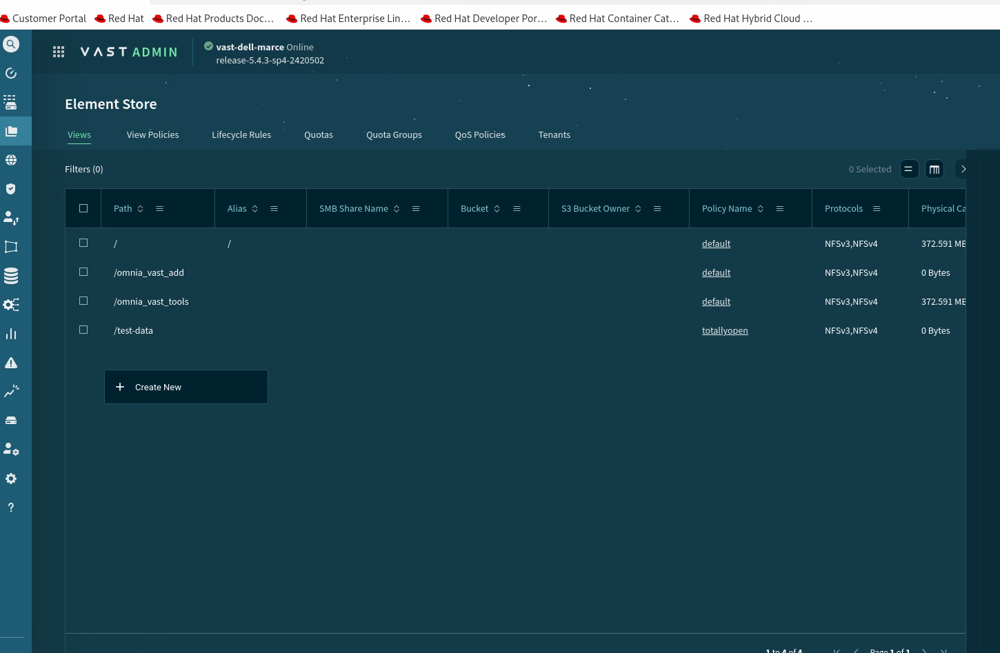
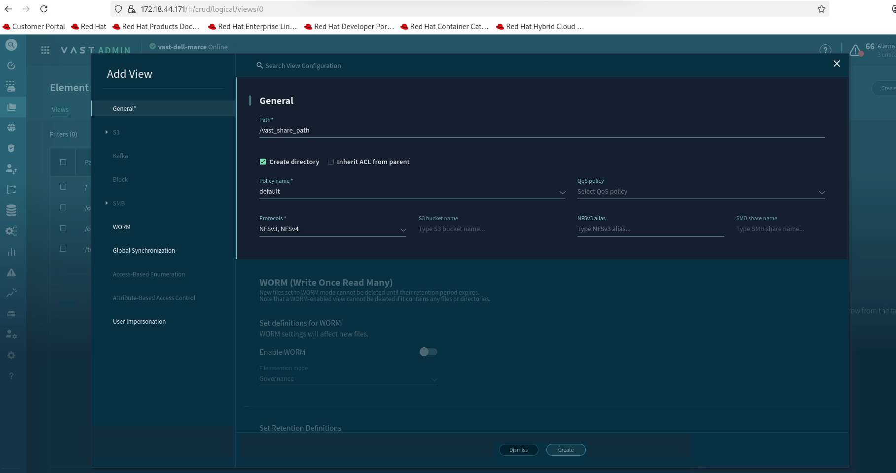
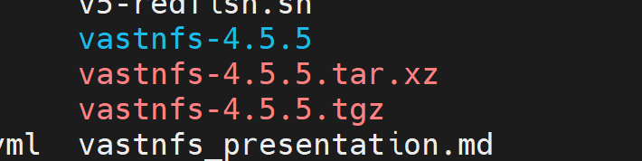
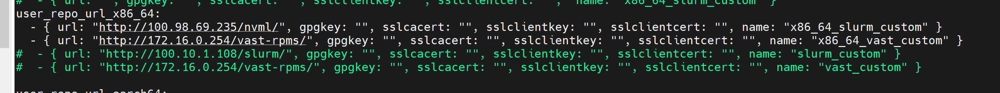

# Configure VAST Storage

## Overview

Build the VAST NFS repository and install the VAST client on cluster nodes. The VAST repository must be built from the official package, hosted on an HTTP server, and configured as a user repository in Omnia before provisioning.

!!! note

    The VAST repository must be hosted on an HTTP server (such as Apache) before it can be used as a user repository in Omnia.

## Prerequisites

Configure the following settings on the VAST Storage appliance before building the VAST repository:

1. **Log in to the VAST Dashboard** and click on **Element Store**.

    

2. **Configure Tenant** -- Verify that a tenant is configured on the VAST Storage appliance.

    

3. **Configure Policies** -- Verify that the required policies are configured.

    

    Verify the policy options are configured as follows:

    

4. **Create New Configuration** -- Right-click on the empty space to display the **Create** option.

    

    

    Click **Create** to complete the configuration.

## Procedure

### Step 1: Download VAST

Download the VAST NFS package:

```bash title="Run on: OIM host"
curl -sSf https://vast-nfs.s3.amazonaws.com/download.sh | bash -s -- --version 4.5.5
```



### Step 2: Extract the package

Extract the downloaded tarball:

```bash title="Run on: OIM host"
tar -xf vastnfs-4.5.5.tar.xz vastnfs-4.5.5/
```


### Step 3: Build the VAST repository

Navigate to the extracted directory and build the repository:

```bash title="Run on: OIM host"
cd vastnfs-4.5.5/
./build.sh bin
```


Once the build completes, the RPM files are created and ready to be hosted as a user repository. The VAST RPMs are located in the `dist/` directory within `vastnfs-4.5.5/`.


```text title="Expected output"
========== Vast repo build completed ==========
```

### Step 4: Host the RPMs on an HTTP server

Host the built RPMs on an HTTP server (such as Apache) that serves as your user repository. You can use the OIM host as the HTTP server.



```text title="Expected output"
========== Vast rpms hosted for user_Repo ==========
```

!!! tip

    Refer to [Create Local Repos](../Setup/create_local_repos.md) for instructions on hosting repositories on the Apache server.

### Step 5: Configure the user repository

Add the VAST user repository URL to the `local_repo_config.yml` file:

```bash title="Run on: omnia_core container"
vi /opt/omnia/input/project_default/local_repo_config.yml
```

Add the HTTP URL where the VAST RPMs are hosted as a user repository entry.

### Step 6: Run Omnia playbooks

Run the following playbooks in order:

1. `local_repo` -- Syncs the VAST repository to the local Pulp server.
2. `build_image` -- Builds the cluster OS image with VAST client packages.
3. `provision` -- Provisions nodes with the built image.

The VAST client is installed on the cluster nodes after the `provision` playbook completes successfully.

## Next Steps

- [Configure Mounts](configure_mounts.md) -- Configure NFS and other storage mounts.

## Verification

After provisioning, verify that the VAST client is installed on the target nodes:

```bash title="Run on: target node"
rpm -qa | grep vast
mount | grep vast
```

Confirm that the VAST NFS mount is active and accessible.

## Troubleshooting

- **VAST repository not found during local_repo.yml**: Verify that the VAST repository URL is correct in `local_repo_config.yml` and the HTTP server hosting the repository is running.
- **VAST client installation fails**: Confirm that the VAST RPM package is compatible with the target OS version and architecture.

!!! info "Related References"

    - [Create Local Repos](../Setup/create_local_repos.md) -- Host and sync RPM repositories.
    - [Local Repo Config](../../Reference/Configuration/local_repo_config.md) -- User repository configuration parameters.
