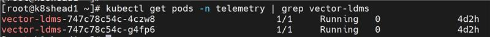
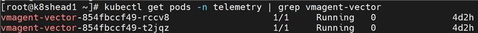
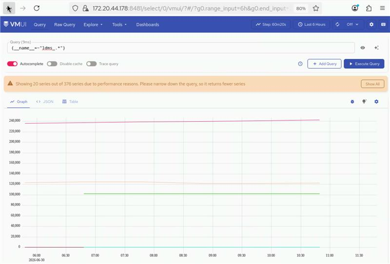

# Configure LDMS Telemetry


Configure deployment of Lightweight Distributed Metric Service (LDMS) to collect in-band telemetry from Slurm clusters.

## Overview


LDMS collects system metrics such as CPU, memory, network, I/O, and Slurm job statistics. During deployment, Omnia attaches LDMS aggregator and store pods to the admin network. This improves throughput between Slurm nodes and the Kubernetes cluster.

### Data Flow

```
Slurm Compute Nodes (LDMS Sampler) → LDMS Aggregator → LDMS Store → Kafka
                                                                      ↓
                                                        (Optional: Vector-LDMS Bridge)
                                                                      ↓
                                                        Vector-LDMS → vmagent-vector → VictoriaMetrics
```

LDMS data is always sent to Kafka. To route LDMS metrics to VictoriaMetrics, enable the [Vector-LDMS pipeline](configure_vector_ldms.md).

### Components

- **LDMS producer (collector)** -- Collects local system metrics and runs on Slurm controller, compute, and login nodes.
- **LDMS aggregator** -- Receives and aggregates metrics from producers. Runs as a Kubernetes pod.
- **LDMS store** -- Buffers and stores metric batches reliably. Runs as a Kubernetes pod.
- **Kafka broker** -- Handles telemetry streaming for consumption by downstream systems.

For more details on LDMS, see [Lightweight Distributed Metric Service](https://github.com/ovis-hpc/ldms).

!!! note

    To consume LDMS metrics from the Kafka `ldms` topic, transform to Prometheus format, and write to VictoriaMetrics, see [Configure Vector Pipeline](configure_vector.md).

### Supported Metrics

The following LDMS plugins are supported in Omnia:

| Plugin | Metrics Collected |
| --- | --- |
| `meminfo` | Memory usage statistics |
| `procstat2` | Process statistics |
| `vmstat` | Virtual memory statistics |
| `loadavg` | System load average |
| `procnetdev2` | Network interface statistics |

!!! note

    The LDMS Slurm sampler metrics are not supported in the current telemetry deployment.


## Prerequisites


- `provision.yml` has been executed successfully with `service_kube_control_plane` and `service_kube_node` in the mapping file.


## Procedure


1. **Specify the following entries in `software_config.json`**. If any entry is missing, Omnia skips LDMS deployment and logs an informational message. For more information, see the [software_config.json reference](../../Reference/Configuration/software_config.md).

    ```json
    {"name": "slurm_custom", "arch": ["x86_64","aarch64"]},
    {"name": "service_k8s", "version": "1.34.1", "arch": ["x86_64"]},
    {"name": "ldms", "arch": ["x86_64", "aarch64"]}
    ```

2. **In `local_repo_config.yml`**, specify the paths for the `ovis-ldms` RPMs accordingly for the `user_repo_url_x86_64` and `user_repo_url_aarch64`.

3. **Ensure that `telemetry_config.yml` has the entries specific for LDMS and Kafka deployment**. For details on all parameters, see the [telemetry_config.yml reference](../../Reference/Configuration/telemetry_config.md).

    ```yaml title="telemetry_config.yml -- LDMS section"
    telemetry_sources:
      ldms:
        metrics_enabled: true
        collection_targets:
          - "kafka"

    ldms_configurations:
      agg_port: 6001
      store_port: 6001
      sampler_port: 10001
      sampler_plugins:
        - plugin_name: meminfo
          config_parameters: ""
          activation_parameters: "interval=30000000"
        - plugin_name: procstat2
          config_parameters: ""
          activation_parameters: "interval=30000000"
        - plugin_name: vmstat
          config_parameters: ""
          activation_parameters: "interval=30000000"
        - plugin_name: loadavg
          config_parameters: ""
          activation_parameters: "interval=30000000"
        - plugin_name: procnetdev2
          config_parameters: ""
          activation_parameters: "interval=30000000 offset=0"
    ```

    - `metrics_enabled` -- Enable or disable LDMS metrics collection (`true` or `false`).
    - `collection_targets` -- LDMS data is sent to Kafka. To route to VictoriaMetrics, enable the [Vector-LDMS pipeline](configure_vector_ldms.md).
    - `agg_port` / `store_port` / `sampler_port` -- Network ports for LDMS aggregator, store, and sampler.
    - `sampler_plugins` -- List of LDMS sampler plugins to activate. At least one plugin is mandatory.

    !!! note

        For LDMS telemetry configuration, at least one sampler plugin is mandatory to collect system metrics.

!!! important

    If you enable LDMS telemetry after the initial deployment, execute the `telemetry.sh` script on the K8s control plane:

    ```bash title="Run on K8s control plane"
    <K8s_NFS_mount_point>/telemetry/telemetry.sh
    ```


## Verification


### Verify LDMS Messages in Kafka

To verify that LDMS telemetry data is being successfully published to the `ldms` Kafka topic:

1. Log in to the Service Kubernetes control plane.

2. Set the required variables:

    ```bash title="Run on K8s control plane"
    KAFKA_LB_IP=<external IP of bridge-bridge-lb service>
    TOPIC=ldms
    GROUP=ldms-consumer-group
    INSTANCE=ldms-consumer-1
    ```

3. Create a Kafka consumer:

    ```bash title="Run on K8s control plane"
    curl -X POST http://$KAFKA_LB_IP:8080/consumers/ldms-consumer-group \
    -H 'content-type: application/vnd.kafka.v2+json' \
    -d '{
            "name": "ldms-consumer-1",
            "format": "json",
            "auto.offset.reset": "latest",
            "enable.auto.commit": true
        }'
    ```

4. View the list of LDMS Kafka topics configured:

    ```bash title="Run on K8s control plane"
    curl -s -X GET "http://$KAFKA_LB_IP:8080/topics" | jq '.'
    ```

5. Subscribe the consumer to the LDMS topic:

    ```bash title="Run on K8s control plane"
    curl -X POST http://$KAFKA_LB_IP:8080/consumers/ldms-consumer-group/instances/ldms-consumer-1/subscription \
    -H 'content-type: application/vnd.kafka.v2+json' \
    -d '{"topics": ["ldms"]}'
    ```

6. Consume messages from the topic:

    ```bash title="Run on K8s control plane"
    while true; do curl -X GET http://$KAFKA_LB_IP:8080/consumers/ldms-consumer-group/instances/ldms-consumer-1/records \
    -H 'accept: application/vnd.kafka.json.v2+json' | jq '.' ;  sleep 2; done
    ```

If telemetry is flowing correctly, the output contains JSON-formatted LDMS telemetry records.

!!! note

    When new nodes are added, ensure the nodes are up and cloud-init has completed successfully (check `/var/log/cloud-init-output.log` on each node). Then, create a new Kafka consumer group with a unique name (e.g., `ldms-new-nodes-group`) to verify metrics from the newly added nodes. Wait 2-3 minutes after discovery completes before checking.

### Verify TLS Connectivity

To verify TLS connectivity for Kafka, run the Kafka TLS test job:

```bash title="Run on K8s control plane"
cd /<nfs client mount path of the service k8s cluster>/telemetry/deployments/test
kubectl apply -f kafka.tls_test_job.yaml
```

After the job completes, check the logs to confirm that the TLS connection is successful:

```bash title="Run on K8s control plane"
kubectl logs kafka-tls-test-xxx -n telemetry
```

### View LDMS Metrics in VictoriaMetrics UI (VMUI)

LDMS metrics are routed to VictoriaMetrics via the [Vector-LDMS pipeline](configure_vector_ldms.md).

1. Verify that the Vector-LDMS pod is running:

    ```bash title="Run on K8s control plane"
    kubectl get pods -n telemetry | grep vector-ldms
    ```

    

2. Verify that the vmagent-vector pod is running:

    ```bash title="Run on K8s control plane"
    kubectl get pods -n telemetry | grep vmagent-vector
    ```

    

3. Verify that the VictoriaMetrics service is running:

    ```bash title="Run on K8s control plane"
    kubectl get service -n telemetry | grep vm
    ```

    

4. Note the **External IP** and **port number** of the VictoriaMetrics service.

5. Access the VMUI in a web browser:

    ```
    https://<external vmselect loadbalancer IP>:8481/select/0/vmui
    ```

6. Verify that metrics are reaching VictoriaMetrics by querying the VMUI. For example, the following query displays LDMS-related metrics:

    ```
    {__name__=~"ldms_.*"}
    ```

    


## Next Steps


- [Configure Vector-LDMS Pipeline](configure_vector_ldms.md) -- Route LDMS data from Kafka to VictoriaMetrics via Vector.
- [Telemetry Overview](setup_telemetry.md) -- Overview of all telemetry sources.


## Troubleshooting


For common telemetry issues and resolutions, see [Troubleshooting Telemetry](../../Troubleshooting/telemetry.md).
