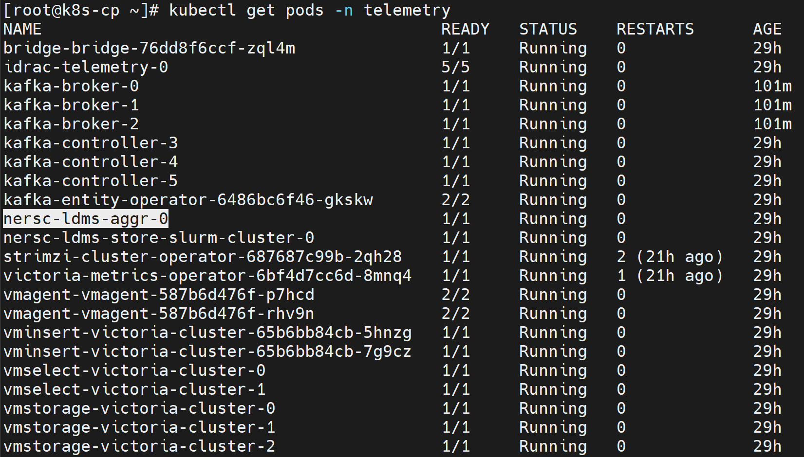

# Configure LDMS Telemetry

Configure Lightweight Distributed Metric Service (LDMS) to collect in-band
Telemetry from Slurm clusters.

## Overview

LDMS collects system metrics such as CPU, memory, network, I/O, and Slurm job
statistics. During deployment, Omnia attaches LDMS aggregator and store pods
to the admin network. This improves throughput between Slurm nodes and the
Kubernetes cluster.

### Components

- **LDMS producer (collector)** -- Collects local system metrics and runs on
  Slurm controller, compute, and login nodes.
- **LDMS aggregator** -- Receives and aggregates metrics from producers. Runs
  as a Kubernetes pod.
- **LDMS store** -- Buffers and stores metric batches reliably. Runs as a
  Kubernetes pod.
- **Kafka broker** -- Handles telemetry streaming for consumption by
  downstream systems.

For more details, see the
[Lightweight Distributed Metric Service](https://github.com/ovis-hpc/ovis).

### Data flow

```text
Slurm compute nodes (LDMS sampler) → LDMS aggregator → LDMS store → Kafka
                                                                    ↓
                                              Optional Vector-LDMS bridge
                                                                    ↓
                                  Vector-LDMS → vmagent-vector → VictoriaMetrics
```

LDMS data is always sent to Kafka. To route LDMS metrics to VictoriaMetrics,
enable the Vector-LDMS bridge.

### Supported metrics

| Plugin | Metrics collected |
|---|---|
| `meminfo` | Memory usage statistics |
| `procstat2` | Process statistics |
| `vmstat` | Virtual memory statistics |
| `loadavg` | System load average |
| `slurm_sampler` | Slurm job statistics |
| `procnetdev2` | Network interface statistics |

## Prerequisites

- Complete the common [Telemetry deployment prerequisites](deploy_telemetry.md#prerequisites).
- Ensure `cluster_inventory` contains at least one Slurm control node and one
  Slurm compute node. The precheck requires `slurmctld` on control nodes and
  `slurmd` on compute nodes.
- Ensure at least one reachable Slurm control node has a readable
  `/etc/munge/munge.key`.
- Make the shared Slurm and Kubernetes mounts configured by
  `telemetry_packages.yml` available to their respective nodes.
- Provide `ldms_sampler_password` when prompted.

## Procedure

1. Enable the LDMS source in `telemetry_config.yml`. Kafka is its only
   supported collection target:

    ```yaml
    telemetry_sources:
      ldms:
        metrics_enabled: true
        collection_targets:
          - kafka

    telemetry_bridges:
      vector_ldms:
        metrics_enabled: true
    ```

    Disable `vector_ldms.metrics_enabled` only when LDMS data should remain in
    Kafka and should not be forwarded to VictoriaMetrics.

2. Configure ports and sampler plugins. Aggregator and store ports accept
   `6001` through `6100`; the sampler port accepts `10001` through `10100`.

    ```yaml
    ldms_configurations:
      agg_port: 6001
      store_port: 6001
      sampler_port: 10001
      sampler_plugins:
        - plugin_name: meminfo
          config_parameters: ""
          activation_parameters: "interval=30000000"
    ```

    Supported plugin names are `meminfo`, `procstat2`, `vmstat`, `loadavg`,
    `slurm_sampler`, and `procnetdev2`.

3. Keep the LDMS and Vector image entries in `telemetry_packages.yml` and their
   resource sections in `telemetry_storage_config.yml` consistent with the
   images and capacity available to the cluster.

4. Run the Telemetry precheck. Choose one execution method; do not run both
   commands for the same operation.

    === "Using omnia.sh (recommended)"

        ```bash title="Run on: OIM"
        cd src/main
        ./omnia.sh --run telemetry --tags precheck
        ```

        The wrapper loads the installed Omnia environment and activates the
        configured virtual environment before running the Telemetry playbook.

    === "Using ansible-playbook"

        ```bash title="Run on: OIM"
        source /opt/omnia/activate-omnia.sh
        cd <OMNIA_SOURCE_PATH>/src/telemetry/playbooks
        ansible-playbook telemetry.yml --tags precheck
        ```

        If `OMNIA_DATA_PATH` uses a nondefault value, activate
        `<OMNIA_DATA_PATH>/activate-omnia.sh` instead.

5. Validate the Telemetry inputs and collect the required credentials:

    === "Using omnia.sh (recommended)"

        ```bash title="Run on: OIM"
        cd src/main
        ./omnia.sh --run telemetry --tags validate
        ```

    === "Using ansible-playbook"

        ```bash title="Run on: OIM"
        source /opt/omnia/activate-omnia.sh
        cd <OMNIA_SOURCE_PATH>/src/telemetry/playbooks
        ansible-playbook telemetry.yml --tags validate
        ```

6. Deploy the enabled Telemetry configuration:

    === "Using omnia.sh (recommended)"

        ```bash title="Run on: OIM"
        cd src/main
        ./omnia.sh --run telemetry --tags deploy
        ```

    === "Using ansible-playbook"

        ```bash title="Run on: OIM"
        source /opt/omnia/activate-omnia.sh
        cd <OMNIA_SOURCE_PATH>/src/telemetry/playbooks
        ansible-playbook telemetry.yml --tags deploy
        ```

7. To run validation and deployment in one invocation, omit the tag:

    === "Using omnia.sh (recommended)"

        ```bash title="Run on: OIM"
        cd src/main
        ./omnia.sh --run telemetry
        ```

    === "Using ansible-playbook"

        ```bash title="Run on: OIM"
        source /opt/omnia/activate-omnia.sh
        cd <OMNIA_SOURCE_PATH>/src/telemetry/playbooks
        ansible-playbook telemetry.yml
        ```

    The untagged flow does not run the opt-in precheck. Run step 4 separately
    when an environment precheck is required.

## Verification

### Verify LDMS Telemetry pods

Verify that the LDMS Telemetry pods are running:

```bash title="Run on: Kubernetes control plane"
kubectl get pods -n telemetry
```



### Verify LDMS messages in Kafka

To verify that LDMS Telemetry data is being successfully published to the
`ldms` Kafka topic:

1. Log in to the Service Kubernetes control plane.

2. List the Telemetry services to identify the external IP of the
   `bridge-bridge-lb` service:

    ```bash title="Run on: Kubernetes control plane"
    kubectl get svc -n telemetry
    ```

    

3. Set the required variables:

    ```bash title="Run on: Kubernetes control plane"
    KAFKA_LB_IP=<external IP of bridge-bridge-lb service>
    TOPIC=ldms
    GROUP=ldms-consumer-group
    INSTANCE=ldms-consumer-1
    ```

4. Create a Kafka consumer:

    ```bash title="Run on: Kubernetes control plane"
    curl -ksS -X POST "https://$KAFKA_LB_IP:8080/consumers/$GROUP" \
      -H 'content-type: application/vnd.kafka.v2+json' \
      -d '{
            "name": "ldms-consumer-1",
            "format": "json",
            "auto.offset.reset": "latest",
            "enable.auto.commit": true
          }'
    ```

5. View the list of configured LDMS Kafka topics:

    ```bash title="Run on: Kubernetes control plane"
    curl -ksS -X GET "https://$KAFKA_LB_IP:8080/topics" \
      -H 'accept: application/vnd.kafka.v2+json' | jq '.'
    ```

6. Subscribe the consumer to the LDMS topic:

    ```bash title="Run on: Kubernetes control plane"
    curl -ksS -X POST \
      "https://$KAFKA_LB_IP:8080/consumers/$GROUP/instances/$INSTANCE/subscription" \
      -H 'content-type: application/vnd.kafka.v2+json' \
      -d "{\"topics\": [\"$TOPIC\"]}"
    ```

7. Consume messages from the topic:

    ```bash title="Run on: Kubernetes control plane"
    while true; do
      curl -ksS -X GET \
        "https://$KAFKA_LB_IP:8080/consumers/$GROUP/instances/$INSTANCE/records" \
        -H 'accept: application/vnd.kafka.json.v2+json' | jq '.'
      sleep 2
    done
    ```

If Telemetry is flowing correctly, the output contains JSON-formatted LDMS
Telemetry records.

!!! note

    When new nodes are added, ensure that the nodes are up and cloud-init has
    completed successfully. Check `/var/log/cloud-init-output.log` on each
    node. Create a new Kafka consumer group with a unique name, such as
    `ldms-new-nodes-group`, to verify metrics from the new nodes. Wait two to
    three minutes after discovery completes before checking.

### Verify TLS configuration

Run the current `external_kafka` utility through the Telemetry playbook:

=== "Using omnia.sh (recommended)"

    ```bash title="Run on: OIM"
    cd <OMNIA_SOURCE_PATH>/src/main
    ./omnia.sh --run telemetry --tags external_kafka
    ```

=== "Using ansible-playbook"

    ```bash title="Run on: OIM"
    source /opt/omnia/activate-omnia.sh
    cd <OMNIA_SOURCE_PATH>/src/telemetry/playbooks
    ansible-playbook telemetry.yml --tags external_kafka
    ```

The CLI runs `src/telemetry/playbooks/telemetry.yml`, which imports
`playbooks/utils/external_kafka_connect.yml`. Confirm that the following
directory contains the connection details and the `ca.crt`, `user.crt`, and
`user.key` TLS files:

```text
<TELEMETRY_DATA_PATH>/output/<OMNIA_PROJECT_NAME>/external_kafka/
```

The utility fails if the Kafka pods, native Kafka endpoint, HTTP Bridge
endpoint, or TLS material are unavailable.

### View LDMS metrics in the VictoriaMetrics UI (VMUI)

LDMS metrics are routed to VictoriaMetrics through the Vector-LDMS bridge.

1. Verify that the Vector-LDMS pod is running:

    ```bash title="Run on: Kubernetes control plane"
    kubectl get pods -n telemetry | grep vector-ldms
    ```

    

2. Verify that the `vmagent-vector` pod is running:

    ```bash title="Run on: Kubernetes control plane"
    kubectl get pods -n telemetry | grep vmagent-vector
    ```

    

3. Verify that the VictoriaMetrics service is running:

    ```bash title="Run on: Kubernetes control plane"
    kubectl get service -n telemetry | grep vm
    ```

    

4. Run the `external_victoria` utility to export the current VMUI URL:

    === "Using omnia.sh (recommended)"

        ```bash title="Run on: OIM"
        cd <OMNIA_SOURCE_PATH>/src/main
        ./omnia.sh --run telemetry --tags external_victoria
        ```

    === "Using ansible-playbook"

        ```bash title="Run on: OIM"
        source /opt/omnia/activate-omnia.sh
        cd <OMNIA_SOURCE_PATH>/src/telemetry/playbooks
        ansible-playbook telemetry.yml --tags external_victoria
        ```

5. Access the VMUI in a web browser:

    ```text
    https://<external vmselect loadbalancer IP>:8481/select/0/vmui
    ```

6. Query for LDMS metrics:

    ```promql
    {__name__=~"ldms_.*"}
    ```

    

## Troubleshooting

- **Precheck reports missing Slurm groups or services:** Correct the configured
  inventory and start `slurmctld` and `slurmd` on the required nodes.
- **Aggregator preparation fails:** Ensure at least one reachable control node
  has a readable Munge key.
- **A sampler does not start:** Confirm that its generated configuration is
  present, the configured sampler port is available, and `ldmsd` can start.
  Omnia opens that port automatically when `firewalld` is active.
- **Vector-LDMS is rejected:** The bridge requires the LDMS source to be
  enabled. It also requires Kafka and VictoriaMetrics support.
