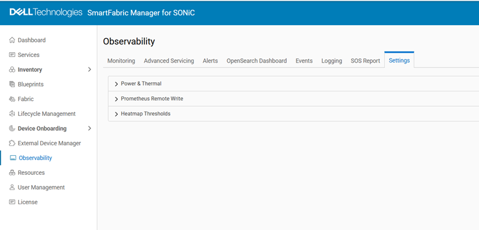
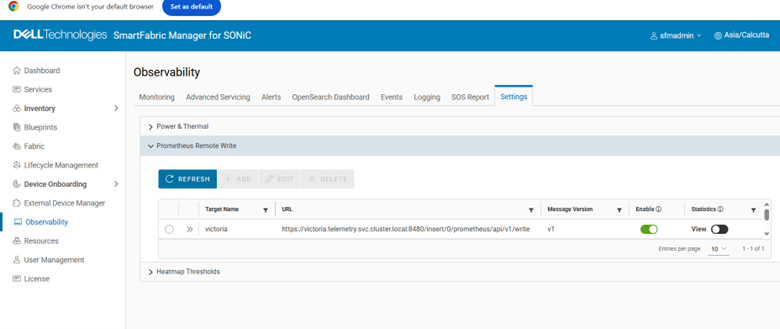
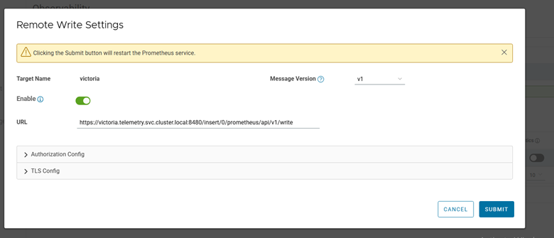
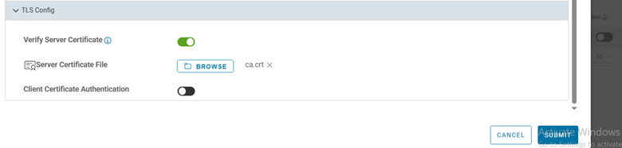
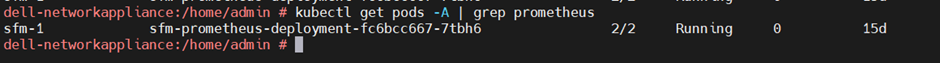
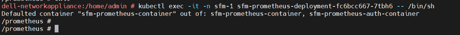
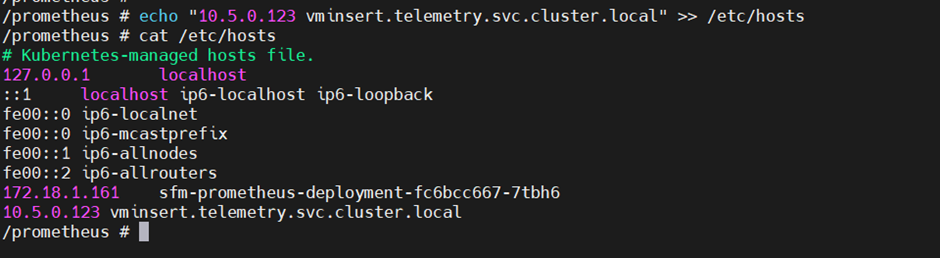

# Configure SFM Telemetry


Configure Smart Fabric Manager (SFM) to securely stream telemetry metrics to VictoriaMetrics in the Service Kubernetes cluster.

## Overview


SFM collects network telemetry metrics including transceiver DOM readings, queue statistics, interface counters, and error counters from the managed fabric. SFM streams data directly to VictoriaMetrics via Prometheus Remote Write.

### Components

- **SFM Prometheus Exporter** -- Collects network telemetry metrics from the managed fabric and exports them via Prometheus Remote Write.
- **vminsert** -- VictoriaMetrics ingestion endpoint that receives metrics over TLS from SFM.

### Data Flow

```
SFM (Smart Fabric Manager) → Prometheus Remote Write → vminsert → VictoriaMetrics
```

### Supported Metrics

| Category | Metrics Collected |
| --- | --- |
| Transceiver DOM | Optical power (TX/RX), temperature, voltage, bias current |
| Queue Statistics | Queue depth, egress queue counters, multicast queue counters |
| Interface Counters | Interface throughput (TX/RX bytes), packet counts, error counts, drop counts |
| Error Counters | CRC errors, alignment errors, symbol errors, FCS errors |

For the complete list of SFM telemetry metrics, see [SFM Metrics Reference](../../Reference/Metrics/sfm_metrics.md).


## Prerequisites


Complete the following before you configure SFM telemetry. You provision the
cluster first (which deploys VictoriaMetrics), then configure SFM to push metrics
to it via Prometheus Remote Write.

- The `omnia_core` container is deployed on the OIM. See
  [Deploy Omnia Core](../Setup/deploy_omnia_core.md).
- The mapping file (`pxe_mapping_file.csv`) is created. See
  [Create Mapping File](../Setup/create_mapping_file.md).
- SFM (Smart Fabric Manager) must be operational and accessible from the service
  Kubernetes cluster.


## Procedure


### Step 1: Add Required Software to software_config.json

SFM streams metrics to VictoriaMetrics running on the service Kubernetes cluster.
Ensure the `service_k8s` entry is present in `software_config.json`. Include an
`aarch64` entry only if you have aarch64 nodes.

```json title="software_config.json -- required for SFM telemetry"
{
    "softwares": [
        {"name": "service_k8s", "version": "1.35.1", "arch": ["x86_64"]}
    ]
}
```

For the full file structure, see the
[software_config.json reference](../../Reference/Configuration/software_config.md).

### Step 2: Add Required Nodes to the Mapping File

SFM telemetry requires a service Kubernetes cluster with VictoriaMetrics exposed
over a MetalLB LoadBalancer. In `pxe_mapping_file.csv`, ensure the following
functional groups are present:

- `service_kube_control_plane` (three control plane nodes)
- `service_kube_node` (at least one worker node)

```csv title="pxe_mapping_file.csv -- example service K8s rows"
FUNCTIONAL_GROUP_NAME,GROUP_NAME,SERVICE_TAG,PARENT_SERVICE_TAG,HOSTNAME,ADMIN_MAC,ADMIN_IP,BMC_MAC,BMC_IP,IB_NIC_NAME,IB_IP
service_kube_control_plane_x86_64,grp4,H94M8F3,,kcp1,BC:97:E1:F0:94:F0,172.16.107.96,b0:7b:25:d8:4a:f4,100.10.1.99,,
service_kube_control_plane_x86_64,grp5,2LXT933,,kcp2,BC:97:E1:F0:95:10,172.16.107.97,b0:7b:25:d8:4b:04,100.10.1.100,,
service_kube_control_plane_x86_64,grp7,8X697C3,,kcp3,BC:97:E1:F0:95:30,172.16.107.98,b0:7b:25:d8:4b:14,100.10.1.101,,
service_kube_node_x86_64,grp6,GZF6ZS3,,kn,EC:2A:72:32:C6:98,172.16.107.95,ec:2a:72:3b:a8:52,100.10.0.209,,
```

Ensure `pod_external_ip_range` is set in `omnia_config.yml` so MetalLB can assign
an external IP to the `vminsert` service. For the full mapping file format, see the
[PXE mapping file reference](../../Reference/SampleFiles/pxe_mapping_file.md).

### Step 3: Deploy the Cluster

Deploy the cluster by running the full playbook sequence
(`prepare_oim.yml` -> `local_repo.yml` -> `build_image` -> `provision.yml`).
`provision.yml` deploys VictoriaMetrics in the telemetry namespace. See
[Deploy the Telemetry Stack](deploy_telemetry.md).

Once the cluster is provisioned and VictoriaMetrics is running, configure SFM to
stream metrics to it using the following steps.

### Step 4: Retrieve VictoriaMetrics Connection Details

1. Log in to the Service Kubernetes control plane.

2. Run the following commands to retrieve the VictoriaMetrics connection details:

    ```bash title="Run on K8s control plane"
    kubectl get svc -n telemetry | grep vminsert
    ```

3. Note the **External IP** of the `vminsert` LoadBalancer service.

4. Run the following command to extract the VictoriaMetrics TLS certificates:

    ```bash title="Run on K8s control plane"
    kubectl get secret -n telemetry vminsert-tls -o jsonpath='{.data.ca\.crt}' | base64 --decode > ca.crt
    kubectl get secret -n telemetry vminsert-tls -o jsonpath='{.data.tls\.crt}' | base64 --decode > tls.crt
    kubectl get secret -n telemetry vminsert-tls -o jsonpath='{.data.tls\.key}' | base64 --decode > tls.key
    ```

### Step 5: Configure SFM Prometheus Remote Write

1. Log in to the SFM web UI.

2. Navigate to **Settings > Observability**.

    

3. Select **Prometheus Remote Write** to configure remote write settings.

    

4. Configure the remote write settings:

    - **Remote Write URL**: `https://<vminsert external IP>:8480/insert/0/prometheus/api/v1/write`
    - **Write Interval**: Set based on desired metric frequency

    

5. Upload the TLS certificates (`ca.crt`, `tls.crt`, `tls.key`) extracted in the previous step.

    

6. Save and apply the configuration.

### Step 6: Update /etc/hosts in the Kubernetes Prometheus Pod

After configuring the SFM remote write settings, update the `/etc/hosts` file in the Kubernetes Prometheus pod to ensure proper DNS resolution:

1. Identify the Prometheus pod:

    ```bash title="Run on K8s control plane"
    kubectl get pods -n telemetry | grep prometheus
    ```

    

2. Access the Prometheus pod:

    ```bash title="Run on K8s control plane"
    kubectl exec -it -n telemetry <prometheus-pod-name> -- /bin/sh
    ```

    

3. Add the vminsert entry to `/etc/hosts`:

    ```bash
    echo "<vminsert external IP> vminsert-victoria-cluster" >> /etc/hosts
    ```

    


## Verification


For detailed SFM telemetry verification steps including VMUI queries and key metrics, see the SFM section in the [Setup Telemetry](setup_telemetry.md).


## Next Steps


- [Setup Telemetry](setup_telemetry.md) -- Overview of all telemetry sources.


## Troubleshooting


For common telemetry issues and resolutions, see [Troubleshooting Telemetry](../../Troubleshooting/telemetry.md).
