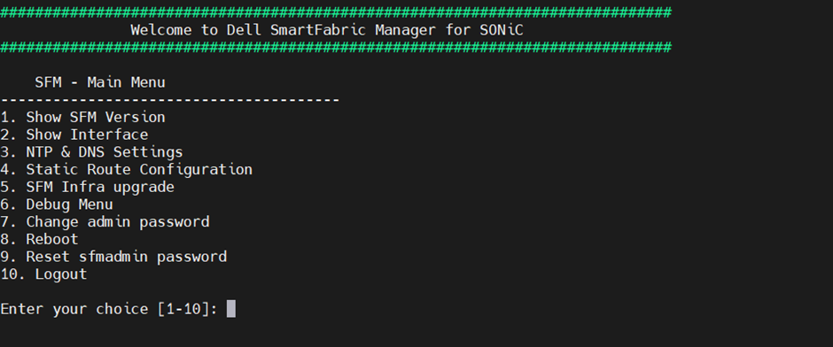
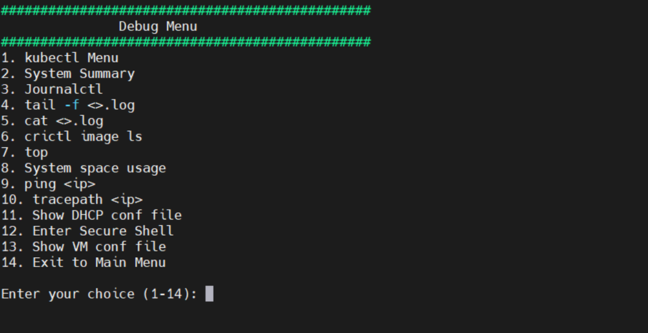

# SFM Telemetry


Configure Smart Fabric Manager (SFM) to securely stream telemetry metrics to VictoriaMetrics in the Service Kubernetes cluster.

## Overview


SFM collects network telemetry metrics including transceiver DOM readings, queue statistics, interface counters, and error counters from the managed fabric. SFM streams data directly to VictoriaMetrics via Prometheus Remote Write.

### Components

- **SFM Prometheus Exporter** -- Collects network telemetry metrics from the managed fabric and exports them via Prometheus Remote Write.
- **vminsert** -- VictoriaMetrics ingestion endpoint that receives metrics over TLS from SFM.

### Data Flow

```
SFM (Smart Fabric Manager) → Prometheus Remote Write → vminsert → VictoriaMetrics
```

### Supported Metrics

| Category | Metrics Collected |
| --- | --- |
| Transceiver DOM | Optical power (TX/RX), temperature, voltage, bias current |
| Queue Statistics | Queue depth, egress queue counters, multicast queue counters |
| Interface Counters | Interface throughput (TX/RX bytes), packet counts, error counts, drop counts |
| Error Counters | CRC errors, alignment errors, symbol errors, FCS errors |

For the complete list of SFM telemetry metrics, see [SFM Metrics Reference](../../Reference/Metrics/sfm_metrics.md).


## Prerequisites


Complete the following before you configure SFM telemetry. You provision the
cluster first (which deploys VictoriaMetrics), then configure SFM to push metrics
to it via Prometheus Remote Write.

- Deploy Omnia Telemetry with the VictoriaMetrics sink before running this
  playbook. SFM supports only VictoriaMetrics as a telemetry sink.
- SFM (Smart Fabric Manager) must be operational and accessible from the service
  Kubernetes cluster.
- Ensure that Secure Shell (SSH) is enabled on the SFM virtual machine. For detailed steps, see the [Smart Fabric Manager documentation](https://www.dell.com/support/manuals/en-in/smartfabric-manager-for-sonic/sfm-141-user-guide-pub/enable-secure-shell-access-for-admin-user?guid=guid-a381d8a7-2f41-42c5-b597-aa651321e588&lang=en-us){target="_blank"}.
- Ensure that `pod_external_ip_range` is set in `omnia_config.yml` for the Service Kubernetes cluster and is reachable from the SFM network.


## Procedure


### Step 1: Retrieve VictoriaMetrics Connection Details

Run the following playbook to retrieve the VictoriaMetrics connection details and TLS certificate from the Service Kubernetes cluster:

=== "Using omnia.sh (recommended)"

    ```bash title="Run on: OIM"
    cd src/main
    ./omnia.sh --run telemetry --tags external_victoria
    ```

=== "Using ansible-playbook"

    ```bash title="Run on: OIM"
    source "$OMNIA_DATA_PATH/activate-omnia.sh"
    cd <OMNIA_SOURCE_PATH>/src/telemetry/playbooks
    ansible-playbook telemetry.yml --tags external_victoria
    ```


The above playbook does the following:

- Retrieves the VictoriaMetrics `vminsert` and `vmselect` LoadBalancer IPs.
- Extracts the server CA certificate for TLS.
- Writes the connection details to `$OMNIA_DATA_PATH/telemetry/output/$OMNIA_PROJECT_NAME/external_victoria_connect_details.yml`.
- Saves the CA certificate at `$OMNIA_DATA_PATH/telemetry/output/$OMNIA_PROJECT_NAME/external_victoria/ca.crt`.

### Step 2: Configure SFM Prometheus Remote Write

1. In the Smart Fabric Manager for SONiC UI, navigate to **Observability**, and then select the **Settings** tab.

    

2. Under **Prometheus Remote Write**, select the option button next to `vminsert-target`, and then select **Edit**.

3. Configure the following settings:

    - **Enable**: ON
    - **URL**: `https://vminsert-victoria-cluster.telemetry.svc.cluster.local:8480/insert/0/prometheus/api/v1/write`
    - **Message Version**: v1
    - **TLS Config**: Upload `ca.crt` from `/opt/omnia/telemetry/victoria-certs/` as the Server Certificate File

    !!! note

        If SFM is installed on a different system than the OIM host, copy `ca.crt` from `/opt/omnia/telemetry/victoria-certs/` to that system before uploading it in the UI.

    

    

    

### Step 3: Update /etc/hosts in the SFM Prometheus Pod

Update the `/etc/hosts` file of the Kubernetes Prometheus pod in the SFM VM to resolve the VictoriaMetrics endpoint:

1. Log in to the SFM VM. Run the following command to connect using SSH with your admin credentials:

    ```bash
    ssh <admin_user>@<sfm_vm_ip>
    ```

2. From the **SFM - Main Menu**, enter **6** to select **Debug Menu**.

    

3. From the **Debug Menu**, enter **12** to select **Enter Secure Shell**. This opens a shell session on the SFM host VM.

    

4. Identify the Prometheus pod:

    ```bash
    kubectl get pods -A | grep prometheus
    ```

    

5. Inside the Prometheus pod, add the VictoriaMetrics insert LoadBalancer IP to `/etc/hosts`:

    ```bash
    kubectl exec -it -n <Prometheus Namespace> <Prometheus Pod Name> -- /bin/sh
    echo "<vminsert loadbalancer IP> vminsert-victoria-cluster.telemetry.svc.cluster.local" >> /etc/hosts
    ```

    

    


## Verification


### View SFM Telemetry Data in VictoriaMetrics UI (VMUI)

To view the SFM telemetry data streamed to VictoriaMetrics:

1. Verify that the VictoriaMetrics pods are running:

    ```bash title="Run on K8s control plane"
    kubectl get pods -n telemetry -o wide | grep vm
    ```

    

2. Verify that all VictoriaMetrics cluster services are running:

    ```bash title="Run on K8s control plane"
    kubectl get service -n telemetry -o wide | grep vm
    ```

    

3. Note the **External IP** and **port number** of the `vmselect` service.

4. Access the VMUI in a web browser:

    ```
    https://<external vmselect loadbalancer IP>:8481/select/0/vmui
    ```

5. Filter and view telemetry metrics using queries in VMUI. For example, the following query displays transceiver DOM temperature values:

    ```
    transceiver_dom_temperature_value
    ```

    

The following are some of the key metrics that can be queried:

| Metric | Description |
| --- | --- |
| `transceiver_dom_temperature_value` | Monitors optical transceiver temperature for hardware health |
| `queue_tx_pkts` | Tracks transmitted packets per queue for performance monitoring |
| `queue_drop_pkts` | Counts dropped packets per queue to identify congestion issues |
| `queue_tx_bits_per_second` | Measures queue throughput in bits per second |
| `ifcounters_in_octets` | Monitors incoming data volume in bytes per interface |
| `ifcounters_out_octets` | Monitors outgoing data volume in bytes per interface |
| `ifcounters_in_pkts` | Counts incoming packets per interface |
| `ifcounters_out_pkts` | Counts outgoing packets per interface |
| `ifcounters_in_errors` | Tracks input errors per interface for fault detection |
| `ifcounters_out_errors` | Tracks output errors per interface for fault detection |

For the complete list of SFM telemetry metrics, see [SFM Metrics Reference](../../Reference/Metrics/sfm_metrics.md).


## Next Steps


- [Setup Telemetry](setup_telemetry.md) -- Overview of all telemetry sources.


## Troubleshooting


For common telemetry issues and resolutions, see [Troubleshooting Telemetry](../../Troubleshooting/telemetry.md).
