# SFM Telemetry


Configure Smart Fabric Manager (SFM) to securely stream telemetry metrics to VictoriaMetrics in the Service Kubernetes cluster.

## Overview


SFM collects network telemetry metrics including transceiver DOM readings, queue statistics, interface counters, and error counters from the managed fabric. SFM streams data directly to VictoriaMetrics via Prometheus Remote Write.

### Components

- **SFM Prometheus Exporter** -- Collects network telemetry metrics from the managed fabric and exports them via Prometheus Remote Write.
- **vminsert** -- VictoriaMetrics ingestion endpoint that receives metrics over TLS from SFM.

### Data Flow

```
SFM (Smart Fabric Manager) → Prometheus Remote Write → vminsert → VictoriaMetrics
```

### Supported Metrics

| Category | Metrics Collected |
| --- | --- |
| Transceiver DOM | Optical power (TX/RX), temperature, voltage, bias current |
| Queue Statistics | Queue depth, egress queue counters, multicast queue counters |
| Interface Counters | Interface throughput (TX/RX bytes), packet counts, error counts, drop counts |
| Error Counters | CRC errors, alignment errors, symbol errors, FCS errors |

For the complete list of SFM telemetry metrics, see [SFM Metrics Reference](../../Reference/Metrics/sfm_metrics.md).


## Prerequisites


Complete the following before you configure SFM telemetry. Orchestrator
provisions the Service Kubernetes cluster. The Telemetry domain deploys
VictoriaMetrics on that cluster. Before configuring SFM, deploy Telemetry with
the VictoriaMetrics sink and verify the Telemetry deployment status.

- Deploy Omnia Telemetry with the VictoriaMetrics sink before running this
  playbook. SFM supports only VictoriaMetrics as a telemetry sink.
- SFM (Smart Fabric Manager) must be operational and accessible from the service
  Kubernetes cluster.
- Ensure that Secure Shell (SSH) is enabled on the SFM virtual machine. For detailed steps, see the [Smart Fabric Manager documentation](https://www.dell.com/support/manuals/en-in/smartfabric-manager-for-sonic/sfm-141-user-guide-pub/enable-secure-shell-access-for-admin-user?guid=guid-a381d8a7-2f41-42c5-b597-aa651321e588&lang=en-us){target="_blank"}.
- Ensure that `pod_external_ip_range` is set in `omnia_config.yml` for the Service Kubernetes cluster and is reachable from the SFM network.

After deploying Telemetry, verify the following output contract:

```text
$OMNIA_DATA_PATH/telemetry/output/$OMNIA_PROJECT_NAME/telemetry_status.yml
```

The status must report a successful deployment with VictoriaMetrics deployed:

```yaml
type: deploy
overall_status: success
sinks:
  victoria_metrics: deployed
```


## Procedure


### Step 1: Retrieve VictoriaMetrics Connection Details

Run the following playbook to retrieve the VictoriaMetrics connection details and TLS certificate from the Service Kubernetes cluster:

=== "Using omnia.sh (recommended)"

    ```bash title="Run on: OIM"
    cd src/main
    ./omnia.sh --run telemetry --tags external_victoria
    ```

=== "Using ansible-playbook"

    ```bash title="Run on: OIM"
    source "$OMNIA_DATA_PATH/activate-omnia.sh"
    cd <OMNIA_SOURCE_PATH>/src/telemetry/playbooks
    ansible-playbook telemetry.yml --tags external_victoria
    ```


The above playbook does the following:

- Retrieves the VictoriaMetrics `vminsert` and `vmselect` LoadBalancer IPs.
- Extracts the server CA certificate for TLS.
- Writes the connection details to `$OMNIA_DATA_PATH/telemetry/output/$OMNIA_PROJECT_NAME/external_victoria_connect_details.yml`.
- Saves the CA certificate at `$OMNIA_DATA_PATH/telemetry/output/$OMNIA_PROJECT_NAME/external_victoria/ca.crt`.

### Step 2: Configure SFM Prometheus Remote Write

1. In the Smart Fabric Manager for SONiC UI, navigate to **Observability**, and then select the **Settings** tab.

    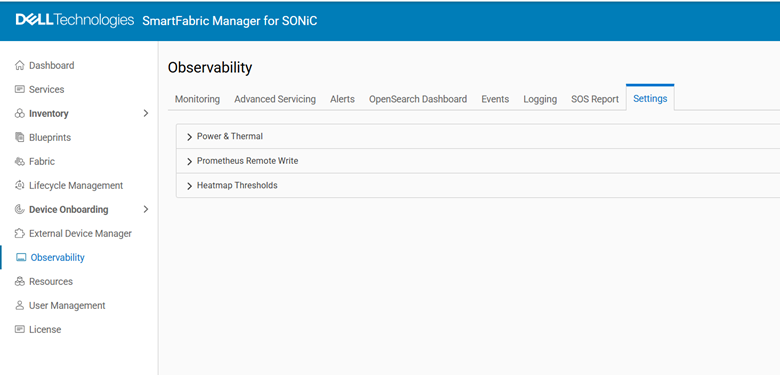

2. Under **Prometheus Remote Write**, select the option button next to `vminsert-target`, and then select **Edit**.

3. Configure the following settings:

    - **Enable**: ON
    - **URL**: `https://vminsert-victoria-cluster.telemetry.svc.cluster.local:8480/insert/0/prometheus/api/v1/write`
    - **Message Version**: v1
    - **TLS Config**: Upload `ca.crt` from `/opt/omnia/telemetry/victoria-certs/` as the Server Certificate File

    !!! note

        If SFM is installed on a different system than the OIM host, copy `ca.crt` from `/opt/omnia/telemetry/victoria-certs/` to that system before uploading it in the UI.

    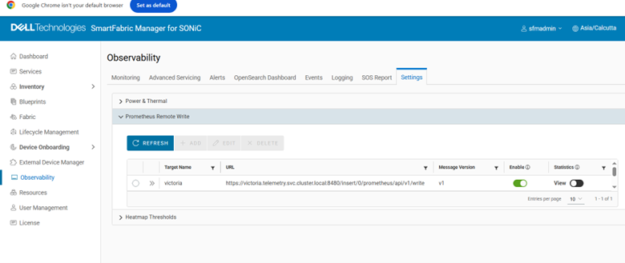

    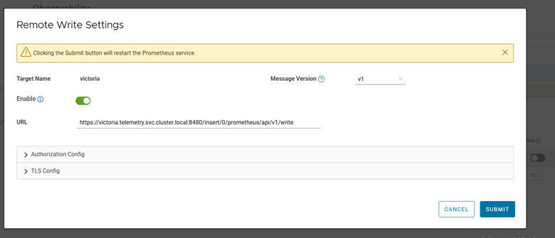

    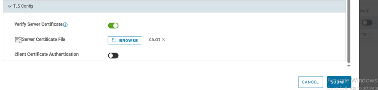

### Step 3: Update /etc/hosts in the SFM Prometheus Pod

Update the `/etc/hosts` file of the Kubernetes Prometheus pod in the SFM VM to resolve the VictoriaMetrics endpoint:

1. Log in to the SFM VM. Run the following command to connect using SSH with your admin credentials:

    ```bash
    ssh <admin_user>@<sfm_vm_ip>
    ```

2. From the **SFM - Main Menu**, enter **6** to select **Debug Menu**.

    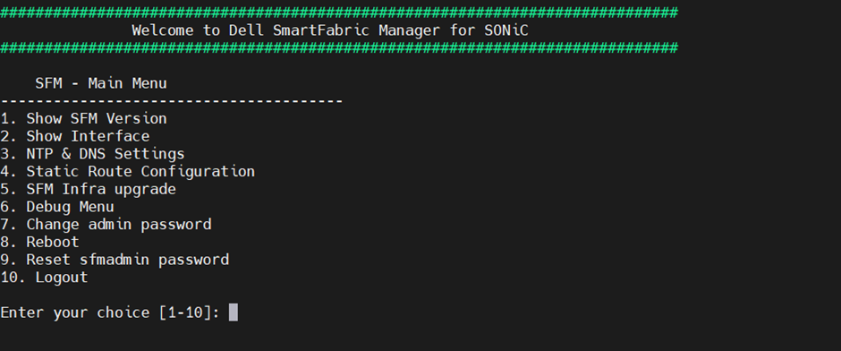

3. From the **Debug Menu**, enter **12** to select **Enter Secure Shell**. This opens a shell session on the SFM host VM.

    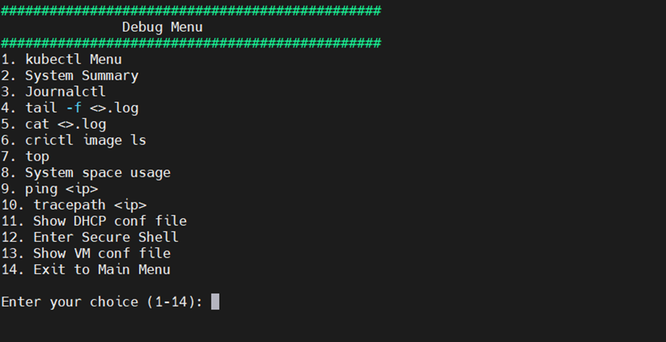

4. Identify the Prometheus pod:

    ```bash
    kubectl get pods -A | grep prometheus
    ```

    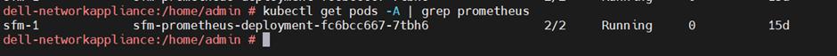

5. Inside the Prometheus pod, add the VictoriaMetrics insert LoadBalancer IP to `/etc/hosts`:

    ```bash
    kubectl exec -it -n <Prometheus Namespace> <Prometheus Pod Name> -- /bin/sh
    echo "<vminsert loadbalancer IP> vminsert-victoria-cluster.telemetry.svc.cluster.local" >> /etc/hosts
    ```

    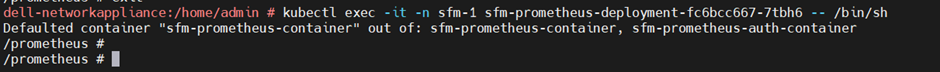

    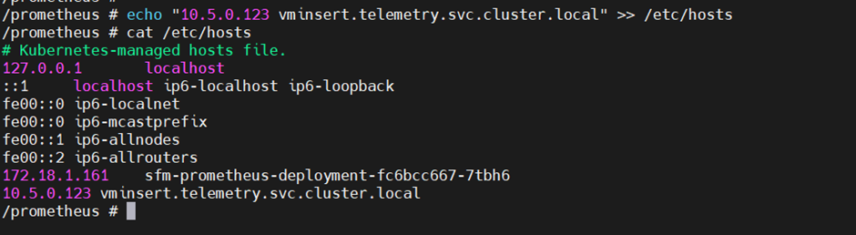


## Verification


### View SFM Telemetry Data in VictoriaMetrics UI (VMUI)

To view the SFM telemetry data streamed to VictoriaMetrics:

1. Verify that the VictoriaMetrics pods are running:

    ```bash title="Run on K8s control plane"
    kubectl get pods -n telemetry -o wide | grep vm
    ```

    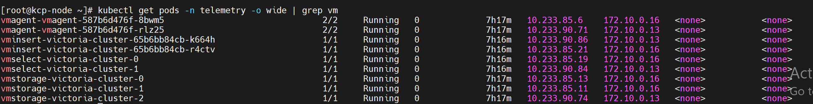

2. Verify that all VictoriaMetrics cluster services are running:

    ```bash title="Run on K8s control plane"
    kubectl get service -n telemetry -o wide | grep vm
    ```

    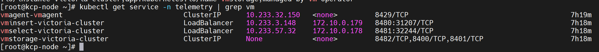

3. Note the **External IP** and **port number** of the `vmselect` service.

4. Access the VMUI in a web browser:

    ```
    https://<external vmselect loadbalancer IP>:8481/select/0/vmui
    ```

5. Filter and view telemetry metrics using queries in VMUI. For example, the following query displays transceiver DOM temperature values:

    ```
    transceiver_dom_temperature_value
    ```

    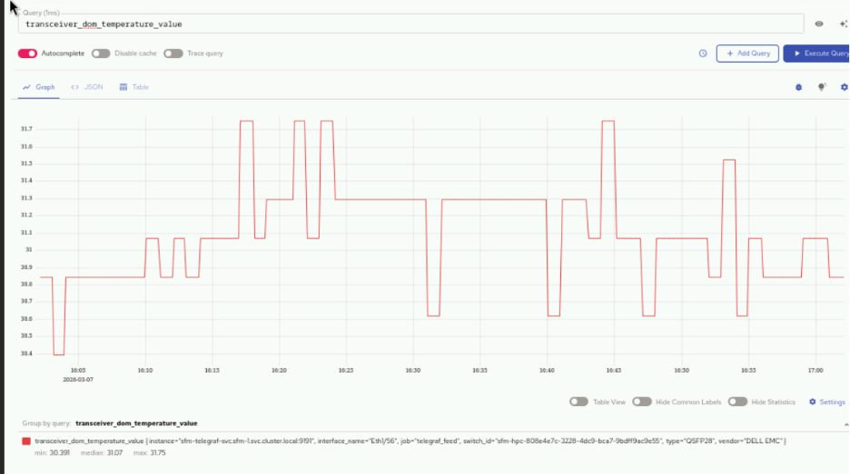

The following are some of the key metrics that can be queried:

| Metric | Description |
| --- | --- |
| `transceiver_dom_temperature_value` | Monitors optical transceiver temperature for hardware health |
| `queue_tx_pkts` | Tracks transmitted packets per queue for performance monitoring |
| `queue_drop_pkts` | Counts dropped packets per queue to identify congestion issues |
| `queue_tx_bits_per_second` | Measures queue throughput in bits per second |
| `ifcounters_in_octets` | Monitors incoming data volume in bytes per interface |
| `ifcounters_out_octets` | Monitors outgoing data volume in bytes per interface |
| `ifcounters_in_pkts` | Counts incoming packets per interface |
| `ifcounters_out_pkts` | Counts outgoing packets per interface |
| `ifcounters_in_errors` | Tracks input errors per interface for fault detection |
| `ifcounters_out_errors` | Tracks output errors per interface for fault detection |

For the complete list of SFM telemetry metrics, see [SFM Metrics Reference](../../Reference/Metrics/sfm_metrics.md).


## Next Steps


- [Setup Telemetry](setup_telemetry.md) -- Overview of all telemetry sources.


### Disable SFM Prometheus Remote Write

To stop SFM from streaming telemetry to VictoriaMetrics:

1. In the Smart Fabric Manager for SONiC UI, navigate to **Observability**, and then select the **Settings** tab.

2. Under **Prometheus Remote Write**, select the option button next to `vminsert-target`, and then select **Edit**.

    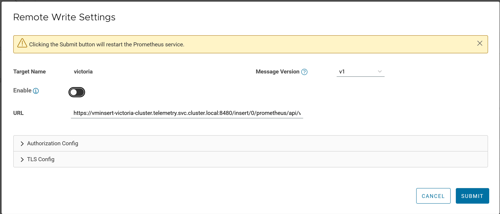

3. Set **Enable** to **OFF**.

4. Select **Save** to apply the changes.

SFM immediately stops streaming telemetry data to VictoriaMetrics. Historical metrics in VictoriaMetrics remain available until the configured retention period expires.

### Re-Enable SFM Telemetry

If you previously disabled SFM telemetry and want to re-enable it, follow these steps.

#### Prerequisites

Before re-enabling, verify the SFM Prometheus pod status:

1. Log in to the SFM VM:

    ```bash
    ssh <admin_user>@<sfm_vm_ip>
    ```

2. Check the Prometheus pod age:

    ```bash
    kubectl get pods -A | grep prometheus
    ```

    Note the **AGE** column. If the pod has restarted since the initial configuration (age is recent, e.g., a few minutes), the `/etc/hosts` entry will be lost and must be re-added.

#### Re-Enable Procedure

1. In the Smart Fabric Manager for SONiC UI, navigate to **Observability**, and then select the **Settings** tab.

2. Under **Prometheus Remote Write**, select the option button next to `vminsert-target`, and then select **Edit**.

3. Set **Enable** to **ON**.

4. Select **Save** to apply the changes.

5. Re-add the `/etc/hosts` entry (required if the SFM Prometheus pod has restarted since the initial configuration):

    ```bash
    # From SFM Debug Menu → Enter Secure Shell
    kubectl get pods -A | grep prometheus
    kubectl exec -it -n <Prometheus Namespace> <Prometheus Pod Name> -- /bin/sh
    echo "<vminsert loadbalancer IP> vminsert-victoria-cluster.telemetry.svc.cluster.local" >> /etc/hosts
    ```

6. Wait 1-2 minutes for metrics to start flowing.

!!! warning

    Toggling the **Enable** button back to **ON** is not sufficient to restore metrics flow if the SFM Prometheus pod has restarted. Without the `/etc/hosts` entry, SFM will attempt to send metrics but they will fail silently because the Prometheus pod cannot resolve the VictoriaMetrics endpoint (`vminsert-victoria-cluster.telemetry.svc.cluster.local`). The `/etc/hosts` entry must be re-added manually after any pod restart.

#### Troubleshooting

##### Metrics Not Flowing After Re-Enable

If you re-enabled SFM telemetry but metrics are not appearing in VictoriaMetrics:

1. Verify the `/etc/hosts` entry is present:

    ```bash
    kubectl exec -it -n <Prometheus Namespace> <Prometheus Pod Name> -- cat /etc/hosts
    ```

    Expected output: A line containing `vminsert-victoria-cluster.telemetry.svc.cluster.local`.

    If the entry is missing, re-add it:

    ```bash
    kubectl exec -it -n <Prometheus Namespace> <Prometheus Pod Name> -- /bin/sh
    echo "<vminsert loadbalancer IP> vminsert-victoria-cluster.telemetry.svc.cluster.local" >> /etc/hosts
    ```

2. Check if the SFM Prometheus pod has restarted recently:

    ```bash
    kubectl get pods -A | grep prometheus
    ```

    If the **AGE** is very recent (e.g., a few minutes), the pod restarted and the `/etc/hosts` entry was lost.

3. Verify metrics are flowing in VictoriaMetrics UI:

    ```
    https://<external vmselect loadbalancer IP>:8481/select/0/vmui
    ```

    Run the query:

    ```
    transceiver_dom_temperature_value
    ```

    You should see new data points with recent timestamps.

For common telemetry issues and resolutions, see [Troubleshooting Telemetry](../../Troubleshooting/telemetry/telemetry.md).
