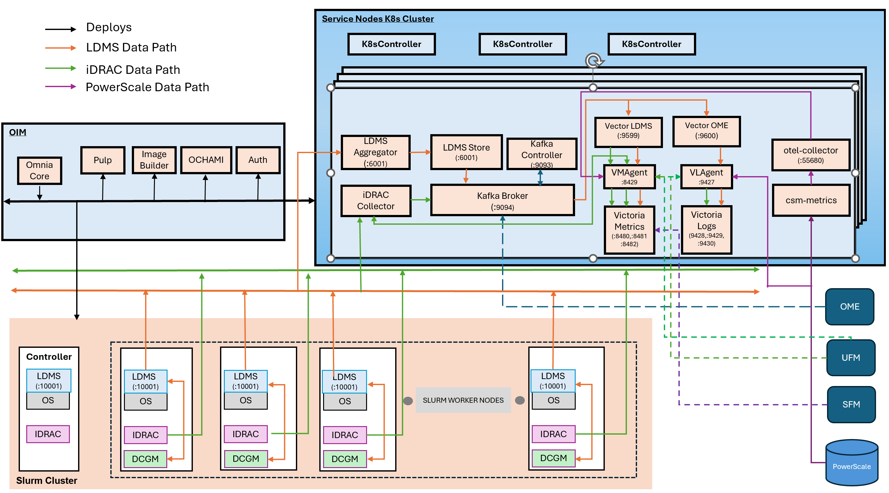

# Setup Telemetry

Omnia deploys a telemetry pipeline to collect, aggregate, and store hardware, OS-level, and storage telemetry data from across the cluster using VictoriaMetrics, VictoriaLogs, and Kafka.

For a summary of all supported telemetry sources, bridges and their sinks, see [Supported Telemetry Sources, Bridges and Sinks](../../Reference/Configuration/telemetry_config.md#supported-telemetry-sources-bridges-and-sinks).

!!! note

    To enable any telemetry and log collections (iDRAC, LDMS, PowerScale, DCGM, UFM, VAST, or Vector), ensure that the `service_k8s` entry is present in the `software_config.json` file and the corresponding telemetry source fields are set to `true` in the `telemetry_config.yml` file.
## Telemetry Architecture

The following diagram illustrates the telemetry services deployed by Omnia and the data flow between the components:

### Telemetry Components

**OIM (Omnia Infrastructure Manager)** -- Central management node that deploys and configures all telemetry services across the cluster.

**Service Kubernetes Cluster** -- Hosts telemetry collection and storage services:

- **iDRAC Collector** -- Collects hardware telemetry via Redfish API
- **LDMS Aggregator / Store** -- Receives and stores aggregated LDMS data
- **Kafka Broker** -- Streams telemetry data via Strimzi operator
- **VMAgent** -- Forwards metrics to VictoriaMetrics
- **VictoriaMetrics Cluster** -- Time-series database (vminsert, vmstorage, vmselect)
- **VictoriaLogs Cluster** -- Distributed log storage (vlinsert, vlstorage, vlselect)
- **VLAgent** -- Platform-managed log collection agent that receives logs from external sources
- **Vector-LDMS / Vector-OME** -- Kafka consumers that route data to Victoria stack via dedicated vmagent-vector and vlagent-vector instances
- **karavi-metrics-powerscale** -- Collects PowerScale metrics via CSM Observability
- **otel-collector** -- Forwards metrics to VictoriaMetrics and VictoriaLogs

**Slurm Cluster** -- Each Slurm compute node runs:

- **LDMS Sampler** -- Collects OS metrics (CPU, memory, network, and I/O)
- **iDRAC** -- Provides hardware health data (temperature, power, and fans)

For detailed data flow diagrams, see the respective configuration pages below.

## Kafka PV Sizing Guidance

Set `persistence_size` in `input/telemetry_config.yml` under `telemetry_sinks.kafka` according to the table below. This value is applied per Kafka pod.

| Telemetry Sources | Node Count | Retention | Kafka PV Size |
|-------------------|------------|----------|----------------|
| iDRAC only | 50 nodes | 7 days | 128Gi per broker |
| iDRAC only | 200 nodes | 7 days | 512Gi per broker |
| iDRAC + LDMS | 50 nodes | 7 days | 200Gi per broker |
| iDRAC + LDMS | 200 nodes | 7 days | 800Gi per broker |
| iDRAC + LDMS + DCGM | 200 nodes | 7 days | 1Ti per broker |
| iDRAC + LDMS + DCGM | 500+ nodes | 7 days | 2Ti per broker |

!!! note

    - Kafka does not enable compression by default. All telemetry data (iDRAC, LDMS, DCGM) is stored uncompressed.
    - Each Kafka topic uses a replication factor of 2. The PV size recommendations already account for this.
    - Actual storage consumption varies based on iDRAC metric report group subscriptions, LDMS sampler plugin count, sampling intervals, and DCGM collection frequency.
    - Controllers use minimal storage (~100Mi for metadata) but share the same `persistence_size` setting as brokers.
    - If `log_retention_hours` is increased beyond the default of 168 (7 days), scale the PV size proportionally.

Monitor actual usage after deployment. If any broker exceeds 70% of its PV capacity within the first 3-4 days, increase `persistence_size` and redeploy to avoid filling the disk before the 7-day retention window.

## Next Steps

Configure one or more telemetry sources, then deploy the cluster to bring up the
telemetry stack. For the end-to-end playbook sequence, see
[Deploy the Telemetry Stack](deploy_telemetry.md).

- [Configure iDRAC Telemetry](configure_idrac.md)
- [Configure LDMS Telemetry](configure_ldms.md)
- [Configure PowerScale Telemetry](configure_powerscale.md)
- [Configure UFM Telemetry](configure_ufm.md)
- [Configure VAST Telemetry](configure_vast.md)
- [Configure OpenManage Enterprise Telemetry (OME)](telemetry_from_ome.md)
- [Configure SFM Telemetry](configure_sfm.md)
- [External Kafka](configure_external_kafka.md)
- [External VictoriaMetrics](configure_external_victoria.md)
