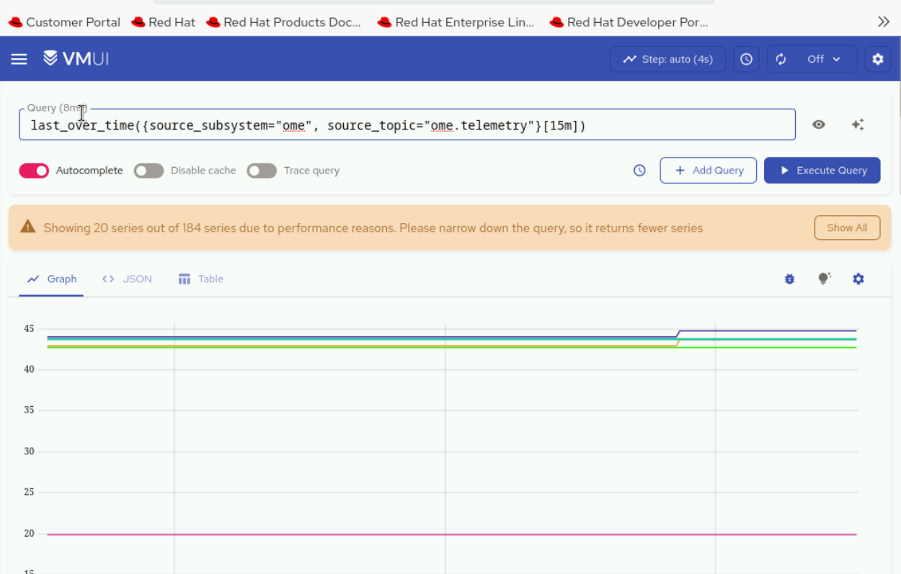

# Configure OpenManage Enterprise Telemetry

Configure OpenManage Enterprise (OME) to securely stream Telemetry data to the
Omnia Kafka pipeline using mutual TLS (mTLS).

## Overview

This procedure describes how to integrate OpenManage Enterprise with the Omnia
Kafka pipeline for secure Telemetry data streaming. OME connects to the Kafka
external mTLS listener on port `9094` and publishes inventory, health, alerts,
and audit-log data to Kafka topics. The Vector-OME bridge consumes the matching
topics and routes metrics to VictoriaMetrics and logs to VictoriaLogs.

OME creates the topics when it begins publishing. Omnia deploys the bridge and
its dedicated `vector-ome-user`, but does not deploy OME.

## Prerequisites

- Complete the common [Telemetry deployment prerequisites](deploy_telemetry.md#prerequisites).
- Ensure that the nodes are discovered in OpenManage Enterprise before
  configuring Telemetry streaming.
- Ensure that the OpenManage Enterprise Advanced license is installed for the
  nodes discovered in OME. This license is required to retrieve OME Telemetry.
- Enable OME with the Kafka collection target. The Vector-OME bridge derives
  the required VictoriaMetrics and VictoriaLogs sinks from its enabled
  channels; another source is not required to select those sinks.
- Have an OME instance that can reach the native Kafka LoadBalancer endpoint.
- Install OpenSSL on the OIM if OME requires the exported client certificate in
  PKCS#12 format.

## Procedure

1. Configure the OME source and bridge in `telemetry_config.yml`:

    ```yaml
    telemetry_sources:
      ome:
        metrics_enabled: true
        logs_enabled: true
        collection_targets:
          - kafka

    telemetry_bridges:
      vector_ome:
        metrics_enabled: true
        logs_enabled: true
        ome_identifier: "ome"
    ```

    Each bridge channel requires the corresponding OME source channel. Change
    `ome_identifier` only when the OME Kafka topic prefix differs; the bridge
    matches `<identifier>.*` topics.

2. Run the Telemetry precheck. Choose one execution method; do not run both
   commands for the same operation.

    === "Using omnia.sh (recommended)"

        ```bash title="Run on: OIM"
        cd src/main
        ./omnia.sh --run telemetry --tags precheck
        ```

    === "Using ansible-playbook"

        ```bash title="Run on: OIM"
        source /opt/omnia/activate-omnia.sh
        cd src/telemetry
        ansible-playbook playbooks/telemetry.yml --tags precheck
        ```

3. Validate the Telemetry inputs:

    === "Using omnia.sh (recommended)"

        ```bash title="Run on: OIM"
        cd src/main
        ./omnia.sh --run telemetry --tags validate
        ```

    === "Using ansible-playbook"

        ```bash title="Run on: OIM"
        source /opt/omnia/activate-omnia.sh
        cd src/telemetry
        ansible-playbook playbooks/telemetry.yml --tags validate
        ```

4. Deploy the enabled Telemetry configuration:

    === "Using omnia.sh (recommended)"

        ```bash title="Run on: OIM"
        cd src/main
        ./omnia.sh --run telemetry --tags deploy
        ```

    === "Using ansible-playbook"

        ```bash title="Run on: OIM"
        source /opt/omnia/activate-omnia.sh
        cd src/telemetry
        ansible-playbook playbooks/telemetry.yml --tags deploy
        ```

    To run validation and deployment together, omit `--tags` from either
    command:

    === "Using omnia.sh (recommended)"

        ```bash title="Run on: OIM"
        cd src/main
        ./omnia.sh --run telemetry
        ```

    === "Using ansible-playbook"

        ```bash title="Run on: OIM"
        source /opt/omnia/activate-omnia.sh
        cd src/telemetry
        ansible-playbook playbooks/telemetry.yml
        ```

    The untagged flow does not run the opt-in precheck. Run step 2 separately
    when an environment precheck is required.

### Step 5: Retrieve Kafka connection details and configure OME

#### Extract Kafka connection details and TLS certificates

1. Retrieve the Kafka connection details and TLS certificates from the Service
   Kubernetes cluster:

    === "Using omnia.sh (recommended)"

        ```bash title="Run on: OIM"
        cd src/main
        ./omnia.sh --run telemetry --tags external_kafka
        ```

    === "Using ansible-playbook"

        ```bash title="Run on: OIM"
        source /opt/omnia/activate-omnia.sh
        cd src/telemetry
        ansible-playbook playbooks/telemetry.yml --tags external_kafka
        ```

    This utility retrieves the native Kafka LoadBalancer endpoint and HTTP
    bridge endpoint, extracts the server CA and client certificate files from
    the `telemetry` namespace, and writes them to:

    ```text
    $OMNIA_DATA_PATH/telemetry/output/$OMNIA_PROJECT_NAME/external_kafka/
    ```

    The directory contains `external_kafka_connect_details.yml`, `ca.crt`,
    `user.crt`, and `user.key`. Use the `kafka.bootstrap_server` value from the
    connection-details file when configuring OME.

    !!! note

        If OpenManage Enterprise is installed on a different system, securely
        copy `ca.crt` and the generated `user.pfx` file to that system before
        uploading them in the OME interface.

2. Create the client certificate in `.pfx` format for mTLS. Enter a passphrase
   when prompted:

    ```bash title="Run on: OIM"
    source /opt/omnia/activate-omnia.sh
    cd "$OMNIA_DATA_PATH/telemetry/output/$OMNIA_PROJECT_NAME/external_kafka"
    openssl pkcs12 -export -out user.pfx -inkey user.key -in user.crt
    ```

#### Configure OME Kafka connectivity

1. In OpenManage Enterprise, go to **Configuration > Remote Connectivity** and
   select **Enable**.

    

2. In the Kafka Connectivity wizard, select **Enable Kafka Connectivity**.

    

3. In **OME Identifier**, enter the unique identifier used as the topic prefix
   for OpenManage Enterprise metrics. It must match
   `telemetry_bridges.vector_ome.ome_identifier` in `telemetry_config.yml`.

4. In **Kafka Bootstrap Server**, enter the `kafka.bootstrap_server` value from
   `external_kafka_connect_details.yml`.

5. From **Authentication Mode**, select **SSL**.

6. Under **Server Certificate Validation**, enable certificate validation and
   upload `ca.crt`.

7. Under **Client Certificate Configuration**, enable the client certificate
   for mTLS, upload `user.pfx`, enter the passphrase used to create it, and
   select **Next**.

    

8. On the **Data Configuration** page, select the metrics to stream to the
   Omnia Service Kubernetes cluster, and select **Next**.

    

9. On the **Group Configuration** page, select the devices and device groups
   from which metrics must be collected, and select **Next**.

    

10. Go to **Configuration > Remote Connectivity** and verify that:

    - A green check mark next to **Connected since** indicates successful
      connectivity between OME and the Omnia Service Kubernetes cluster.
    - Green check marks under **Transfer status** indicate that the selected
      metrics are being transmitted without errors.

    

## Verification

### Verify OME messages in Kafka

To verify that OME Telemetry data is being successfully published to the OME
Kafka topics:

1. Log in to the Service Kubernetes control plane.

2. List the Telemetry services and note the external IP of the
   `bridge-bridge-lb` service:

    ```bash title="Run on: Kubernetes control plane"
    kubectl get svc -n telemetry
    ```

3. Set the required variables. Set `TOPIC` to one of the topics published by
   OME, such as `ome.telemetry`:

    ```bash title="Run on: Kubernetes control plane"
    KAFKA_LB_IP=<external IP of bridge-bridge-lb service>
    TOPIC=<OME topic name>
    GROUP=ome-consumer-group
    INSTANCE=ome-consumer
    ```

4. Create a Kafka consumer:

    ```bash title="Run on: Kubernetes control plane"
    curl -ksS -X POST "https://$KAFKA_LB_IP:8080/consumers/$GROUP" \
      -H 'content-type: application/vnd.kafka.v2+json' \
      -d '{
            "name": "ome-consumer",
            "format": "json",
            "auto.offset.reset": "earliest"
          }'
    ```

5. View the configured OME Kafka topics:

    ```bash title="Run on: Kubernetes control plane"
    curl -ksS -X GET "https://$KAFKA_LB_IP:8080/topics" \
      -H 'accept: application/vnd.kafka.v2+json' | jq '.'
    ```

6. Subscribe the consumer to the selected topic:

    ```bash title="Run on: Kubernetes control plane"
    curl -ksS -X POST \
      "https://$KAFKA_LB_IP:8080/consumers/$GROUP/instances/$INSTANCE/subscription" \
      -H 'content-type: application/vnd.kafka.v2+json' \
      -d "{\"topics\": [\"$TOPIC\"]}"
    ```

7. Consume messages from the topic:

    ```bash title="Run on: Kubernetes control plane"
    while true; do
      curl -ksS -X GET \
        "https://$KAFKA_LB_IP:8080/consumers/$GROUP/instances/$INSTANCE/records" \
        -H 'accept: application/vnd.kafka.json.v2+json' | jq '.'
      sleep 2
    done
    ```

8. Optionally, delete the consumer after verification:

    ```bash title="Run on: Kubernetes control plane"
    curl -ksS -X DELETE \
      "https://$KAFKA_LB_IP:8080/consumers/$GROUP/instances/$INSTANCE"
    ```

!!! note

    - Set `auto.offset.reset` to `earliest` to retrieve existing data.
    - Use `format: json` only when OME publishes JSON. Otherwise, use `binary`
      and decode the Base64 payloads.
    - An empty array indicates that there are no new records. Adjust the
      polling interval when required.
    - HTTP `404` usually indicates an incorrect group or instance name. HTTP
      `409` indicates that the consumer is already subscribed.

### View OME metrics in VictoriaMetrics UI

To verify that the Vector-OME bridge is routing OME data from Kafka to
VictoriaMetrics:

1. Access the VMUI in a web browser:

    ```text
    https://<external vmselect loadbalancer IP>:8481/select/0/vmui
    ```

2. Go to the **Explore** tab.

3. Run the applicable query:

    - Retrieve OME health metrics:

      ```promql
      last_over_time({source_subsystem="ome", source_topic="ome.health"}[15m])
      ```

      

    - Retrieve OME Telemetry metrics:

      ```promql
      last_over_time({source_subsystem="ome", source_topic="ome.telemetry"}[15m])
      ```

      

The `source_subsystem` value comes from
`telemetry_bridges.vector_ome.ome_identifier`. The suffix after the dot in
`source_topic`, such as `health`, `inventory`, or `telemetry`, is supplied by
OME.

### View OME logs in VictoriaLogs

To verify that the Vector-OME bridge is routing OME logs from Kafka to
VictoriaLogs:

1. Access the VictoriaLogs UI in a web browser:

    ```text
    https://<external vlselect loadbalancer IP>:9471/select/vmui
    ```

2. Go to the **Select** tab.

3. Run the following query:

    ```text
    _msg_topic:ome.auditlogs
    ```

    

4. Verify that OME-related logs are displayed.

!!! note

    Enable `telemetry_bridges.vector_ome.logs_enabled` in
    `telemetry_config.yml` to route log data from Kafka to VictoriaLogs.

Confirm that the bridge pod is running:

```bash title="Run on: Kubernetes control plane"
kubectl get pods -n telemetry -l app=vector-ome
```

Confirm the requested OME channels are `deployed` under `sources.ome` and
`bridges.vector_ome: deployed` in `telemetry_status.yml`.

These values confirm that the bridge resources are deployed. Query the
matching OME topics and the enabled Victoria sink to prove end-to-end data
flow.

## Next steps

- Retain the exported Kafka CA and client files securely for OME maintenance.

## Troubleshooting

- **The bridge validation fails:** Ensure OME uses only the `kafka` collection
  target and enable each source channel required by the corresponding bridge
  channel.
- **The metrics or logs bridge lacks a sink:** Confirm the corresponding
  Vector-OME channel is enabled. The bridge selection supplies the required
  VictoriaMetrics or VictoriaLogs sink.
- **No OME topics are consumed:** Confirm OME is publishing to the generated
  native Kafka endpoint and that topic names match the configured identifier.
- **The export utility fails:** Verify Kafka pods are Running and Ready and both
  Kafka LoadBalancer services have external IPs.
