# Verify Telemetry

## Overview

This page provides comprehensive verification steps for the entire Omnia telemetry pipeline. Use the section relevant to your deployed telemetry sources.

!!! note

    For the list of iDRAC telemetry metrics collected by Kafka and VictoriaMetrics, see [iDRAC Telemetry Reference Tools](https://github.com/dell/iDRAC-Telemetry-Reference-Tools).

## Prerequisites


- The [Set Up Telemetry](setup_telemetry.md) procedure is complete.
- The service Kubernetes cluster is running with telemetry pods deployed.


## Verify Telemetry Component Status


### Verify Telemetry Pods Are Running

To verify that the iDRAC Telemetry, Kafka, LDMS, VictoriaMetrics, and VictoriaLogs pods are running:

1. Run the following command:

    ```bash title="Run on K8s control plane"
    kubectl get pods -n telemetry
    ```

2. Ensure that the following pods are in a running state in the output:

    - iDRAC Telemetry pods
    - Kafka broker, controller, and operator pods
    - LDMS aggregator and store pods
    - VictoriaMetrics and vmagent pods
    - vmagent-vector pod
    - Vector-LDMS pod
    - Vector-OME pod
    - vlagent-vector pod
    - VictoriaLogs pods
    - PowerScale Telemetry pods

The following is the sample output:


### Verify Kubernetes Telemetry Services

To verify Kubernetes telemetry services attached to the telemetry namespace:

1. Run the following command:

    ```bash title="Run on K8s control plane"
    kubectl get svc -n telemetry
    ```

2. Ensure the following service entries exist:

    - iDRAC Telemetry service
    - Kafka broker, controller (bootstrap), and bridge services
    - LDMS aggregator and store services
    - VictoriaMetrics service
    - vmagent-vector service
    - Vector-LDMS service
    - Vector-OME service
    - vlagent-vector service
    - VictoriaLogs service
    - PowerScale Telemetry service

The following is the sample output:


## Verify iDRAC Telemetry Flow


### Verify iDRAC Telemetry Messages in Kafka

To verify that iDRAC telemetry data is being successfully published to the `idrac` Kafka topic:

1. Log in to the Service Kubernetes control plane.

2. Set the required variables:

    ```bash title="Run on K8s control plane"
    KAFKA_LB_IP=<external IP of bridge-bridge-lb service>
    TOPIC=idrac
    GROUP=idrac-consumer-group
    INSTANCE=idrac-consumer-1
    ```

3. Create a Kafka consumer:

    ```bash title="Run on K8s control plane"
    curl -X POST http://$KAFKA_LB_IP:8080/consumers/idrac-consumer-group \
    -H 'content-type: application/vnd.kafka.v2+json' \
    -d '{
            "name": "idrac-consumer-1",
            "format": "json",
            "auto.offset.reset": "earliest"
        }'
    ```

4. View the list of iDRAC Kafka topics configured:

    ```bash title="Run on K8s control plane"
    curl -s -X GET "http://$KAFKA_LB_IP:8080/topics" | jq '.'
    ```

5. Subscribe the consumer to the telemetry topic:

    ```bash title="Run on K8s control plane"
    curl -X POST http://$KAFKA_LB_IP:8080/consumers/idrac-consumer-group/instances/idrac-consumer-1/subscription \
    -H 'content-type: application/vnd.kafka.v2+json' \
    -d '{"topics": ["idrac"]}'
    ```

6. Consume messages from the topic:

    ```bash title="Run on K8s control plane"
    while true; do curl -X GET http://$KAFKA_LB_IP:8080/consumers/idrac-consumer-group/instances/idrac-consumer-1/records \
    -H 'accept: application/vnd.kafka.json.v2+json' | jq '.' ;  sleep 2; done
    ```

If telemetry metrics are collected correctly, the output contains JSON-formatted iDRAC telemetry records.

### Verify VictoriaMetrics TLS Connectivity

To verify TLS connectivity for VictoriaMetrics, run the VictoriaMetrics TLS test job:

```bash title="Run on K8s control plane"
cd /<nfs client mount path of the service k8s cluster>/telemetry/deployments/test
kubectl apply -f victoria-tls-test-job.yaml
```

After the job completes, check the logs to confirm that the TLS connection is successful:

```bash title="Run on K8s control plane"
kubectl logs victoria-tls-test-xxx -n telemetry
```

### Verify Kafka TLS Connectivity

To verify TLS connectivity for Kafka, run the Kafka TLS test job:

```bash title="Run on K8s control plane"
cd /<nfs client mount path of the service k8s cluster>/telemetry/deployments/test
kubectl apply -f kafka.tls_test_job.yaml
```

After the job completes, check the logs to confirm that the TLS connection is successful:

```bash title="Run on K8s control plane"
kubectl logs kafka-tls-test-xxx -n telemetry
```

### View iDRAC Telemetry Data in VictoriaMetrics UI (VMUI)

After applying the `telemetry.yml` configuration using the VictoriaMetrics deployment mode as `cluster`, use the VMUI to validate that iDRAC telemetry data is being collected and stored successfully.

1. Verify that the VictoriaMetrics pod is running:

    ```bash title="Run on K8s control plane"
    kubectl get pods -n telemetry -o wide | grep vm
    ```

    

2. Verify that the VictoriaMetrics service is running:

    ```bash title="Run on K8s control plane"
    kubectl get service -n telemetry | grep vm
    ```

    

3. Note the **External IP** and **port number** of the VictoriaMetrics service.

4. Access the VMUI in a web browser:

    ```
    https://<external vmselect loadbalancer IP>:8481/select/0/vmui
    ```

5. Filter and view telemetry metrics using queries in VMUI. For example, the following `PowerEdge_TemperatureReading` query displays all available metrics:

    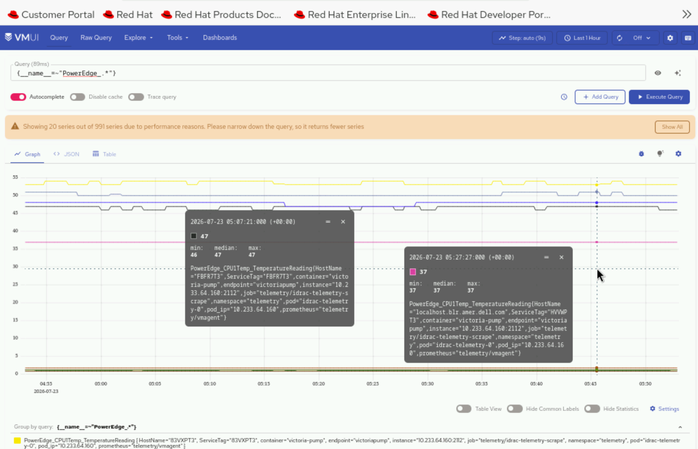


## Verify LDMS Telemetry Flow


### Verify LDMS Messages in Kafka

To verify that LDMS telemetry data is being successfully published to the `ldms` Kafka topic:

1. Log in to the Service Kubernetes control plane.

2. Set the required variables:

    ```bash title="Run on K8s control plane"
    KAFKA_LB_IP=<external IP of bridge-bridge-lb service>
    TOPIC=ldms
    GROUP=ldms-consumer-group
    INSTANCE=ldms-consumer-1
    ```

3. Create a Kafka consumer:

    ```bash title="Run on K8s control plane"
    curl -X POST http://$KAFKA_LB_IP:8080/consumers/ldms-consumer-group \
    -H 'content-type: application/vnd.kafka.v2+json' \
    -d '{
            "name": "ldms-consumer-1",
            "format": "json",
            "auto.offset.reset": "latest",
            "enable.auto.commit": true
        }'
    ```

4. View the list of LDMS Kafka topics configured:

    ```bash title="Run on K8s control plane"
    curl -s -X GET "http://$KAFKA_LB_IP:8080/topics" | jq '.'
    ```

5. Subscribe the consumer to the LDMS topic:

    ```bash title="Run on K8s control plane"
    curl -X POST http://$KAFKA_LB_IP:8080/consumers/ldms-consumer-group/instances/ldms-consumer-1/subscription \
    -H 'content-type: application/vnd.kafka.v2+json' \
    -d '{"topics": ["ldms"]}'
    ```

6. Consume messages from the topic:

    ```bash title="Run on K8s control plane"
    while true; do curl -X GET http://$KAFKA_LB_IP:8080/consumers/ldms-consumer-group/instances/ldms-consumer-1/records \
    -H 'accept: application/vnd.kafka.json.v2+json' | jq '.' ;  sleep 2; done
    ```

If telemetry is flowing correctly, the output contains JSON-formatted LDMS telemetry records.

!!! note

    When new nodes are added, ensure the nodes are up and cloud-init has completed successfully (check `/var/log/cloud-init-output.log` on each node). Then, create a new Kafka consumer group with a unique name (e.g., `ldms-new-nodes-group`) to verify metrics from the newly added nodes. Wait 2-3 minutes after discovery completes before checking.

### Verify LDMS Metrics in VictoriaMetrics via Vector

To verify that LDMS telemetry data is being successfully consumed from Kafka by Vector-LDMS and routed to VictoriaMetrics:

1. Verify that the Vector-LDMS pod is running:

    ```bash title="Run on K8s control plane"
    kubectl get pods -n telemetry | grep vector-ldms
    ```

    

2. Verify that the vmagent-vector pod is running:

    ```bash title="Run on K8s control plane"
    kubectl get pods -n telemetry | grep vmagent-vector
    ```

    

3. Verify that the VictoriaMetrics service is running:

    ```bash title="Run on K8s control plane"
    kubectl get service -n telemetry | grep vm
    ```

    

4. Note the **External IP** and **port number** of the VictoriaMetrics service.

5. Access the VMUI in a web browser:

    ```
    https://<external vmselect loadbalancer IP>:8481/select/0/vmui
    ```

6. Verify that metrics are reaching VictoriaMetrics by querying the VMUI. For example, the following query displays LDMS-related metrics:

    ```
    {__name__=~"ldms_.*"}
    ```

    

### Verify Kafka TLS Connectivity (LDMS)

To verify TLS connectivity for Kafka, run the Kafka TLS test job:

```bash title="Run on K8s control plane"
cd /<nfs client mount path of the service k8s cluster>/telemetry/deployments/test
kubectl apply -f kafka.tls_test_job.yaml
```

After the job completes, check the logs to confirm that the TLS connection is successful:

```bash title="Run on K8s control plane"
kubectl logs kafka-tls-test-xxx -n telemetry
```


## Verify PowerScale Telemetry Flow


### View PowerScale Telemetry Data in VictoriaMetrics UI (VMUI)

After applying the `telemetry.yml` configuration using the VictoriaMetrics deployment mode as `cluster`, use the VMUI to validate that PowerScale telemetry data is being collected and stored successfully.

1. Verify that the VictoriaMetrics pod is running:

    ```bash title="Run on K8s control plane"
    kubectl get pods -n telemetry -o wide | grep vm
    ```

    

2. Verify that the VictoriaMetrics service is running:

    ```bash title="Run on K8s control plane"
    kubectl get service -n telemetry -o wide | grep vm
    ```

    

3. Note the **External IP** and **port number** of the VictoriaMetrics service.

4. Access the VMUI in a web browser:

    ```
    https://<external vmselect loadbalancer IP>:8481/select/0/vmui
    ```

5. Filter and view telemetry metrics using queries in VMUI. For example, the following query displays detailed PowerScale metrics for each hardware component:

    ```
    {__name__=~"powerscale"}
    ```

    

### View PowerScale Logs in VictoriaLogs UI

After applying the `telemetry.yml` configuration using the VictoriaLogs deployment mode as `cluster`, use the VictoriaLogs UI to validate that PowerScale log data is being collected.

1. Verify that the VictoriaLogs pods are running:

    ```bash title="Run on K8s control plane"
    kubectl get pods -n telemetry -o wide | grep vl
    ```

    

2. Verify that the VictoriaLogs service is running:

    ```bash title="Run on K8s control plane"
    kubectl get service -n telemetry -o wide | grep vl
    ```

    

3. Note the **External IP** and **port number** of the VictoriaLogs service.

4. Access the VictoriaLogs UI in a web browser:

    ```
    https://<external vlselect loadbalancer IP>:9471/select/vmui
    ```

5. Filter and view PowerScale logs using queries in VictoriaLogs UI. For example, use the `*` query to display all logs.

    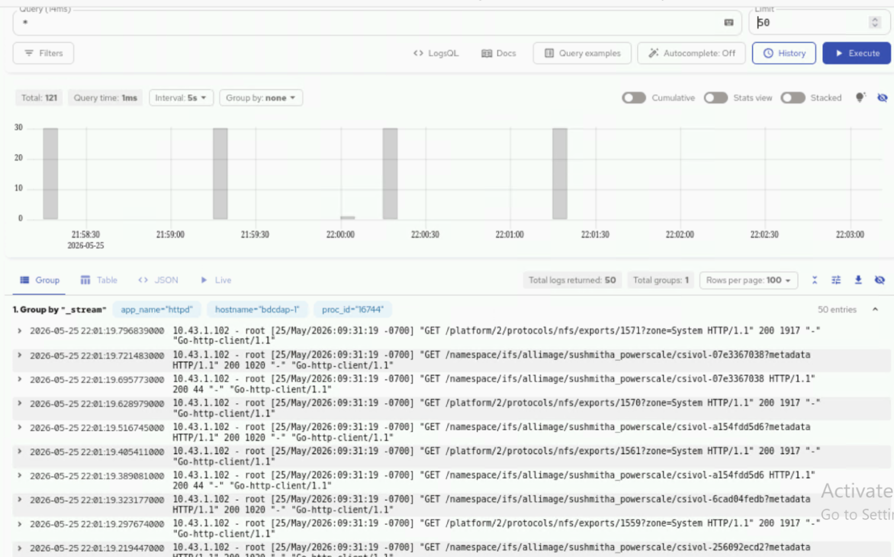


## Verify UFM Telemetry Flow


### View UFM Telemetry Data in VictoriaMetrics UI (VMUI)

After applying the `telemetry.yml` configuration using the VictoriaMetrics deployment mode as `cluster`, use the VMUI to validate that UFM telemetry data is being collected.

1. Verify that the VictoriaMetrics pod is running:

    ```bash title="Run on K8s control plane"
    kubectl get pods -n telemetry -o wide | grep vm
    ```

    

2. Verify that the VictoriaMetrics service is running:

    ```bash title="Run on K8s control plane"
    kubectl get service -n telemetry -o wide | grep vm
    ```

    

3. Verify VMagent logs for UFM scraping to view recent logs:

    ```bash title="Run on K8s control plane"
    VMAGENT_POD=$(kubectl get pods -n telemetry -l app.kubernetes.io/name=vmagent -o jsonpath='{.items[0].metadata.name}')
    kubectl logs $VMAGENT_POD -n telemetry -c vmagent --tail=50
    ```

    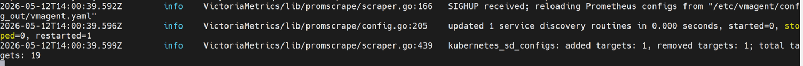

4. Note the **External IP** and **port number** of the VictoriaMetrics service:

    ```bash title="Run on K8s control plane"
    kubectl get svc -n telemetry | grep vmselect
    ```

    

5. Access the VMUI in a web browser:

    ```
    https://<external vmselect loadbalancer IP>:8481/select/vmui
    ```

    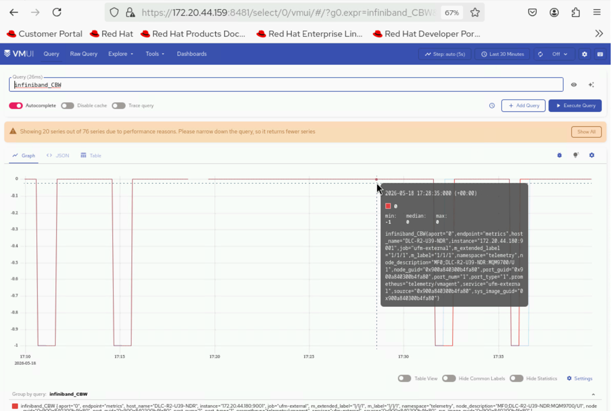

6. Filter and view UFM InfiniBand metrics using queries in VMUI. For example:

    ```
    {source="ufm", subsystem="infiniband"}
    ```

### View UFM Logs in VictoriaLogs

1. Retrieve the VLAgent LoadBalancer IP and configure it on the UFM appliance:

    ```bash title="Run on K8s control plane"
    kubectl get svc -n telemetry | grep -E "(vlagent|victoria-logs)"
    ```

    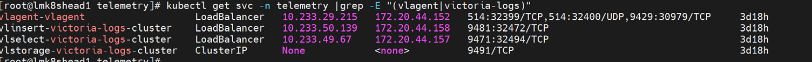

2. Retrieve the external IP and port of the vlselect service:

    ```bash title="Run on K8s control plane"
    kubectl get svc -n telemetry | grep vlselect
    ```

    

3. Access the VictoriaLogs UI in a web browser:

    ```
    https://<external vlselect loadbalancer IP>:9471/select/0/vmui
    ```

    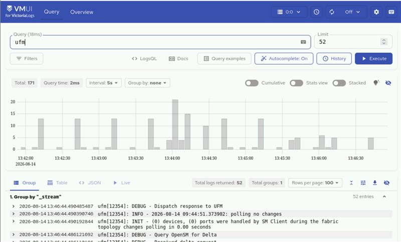


## Verify VAST Telemetry Flow


### View VAST Telemetry Data in VictoriaMetrics UI (VMUI)

After applying the `telemetry.yml` configuration using the VictoriaMetrics deployment mode as `cluster`, use the VMUI to validate that VAST telemetry data is being collected.

1. Verify that the VictoriaMetrics pod is running:

    ```bash title="Run on K8s control plane"
    kubectl get pods -n telemetry -o wide | grep vm
    ```

    

2. Verify that the VictoriaMetrics service is running:

    ```bash title="Run on K8s control plane"
    kubectl get service -n telemetry -o wide | grep vm
    ```

    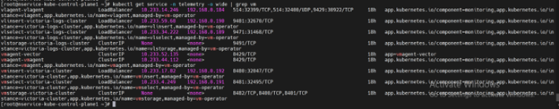
    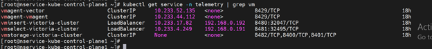

3. Verify VMagent logs for VAST scraping to view recent logs:

    ```bash title="Run on K8s control plane"
    VMAGENT_POD=$(kubectl get pods -n telemetry -l app.kubernetes.io/name=vmagent -o jsonpath='{.items[0].metadata.name}')
    kubectl logs $VMAGENT_POD -n telemetry -c vmagent --tail=10
    ```

    

4. Note the **External IP** and **port number** of the VictoriaMetrics service:

    ```bash title="Run on K8s control plane"
    kubectl get svc -n telemetry | grep vmselect
    ```

    

5. Access the VMUI in a web browser:

    ```
    https://<external vmselect loadbalancer IP>:8481/select/0/vmui
    ```

    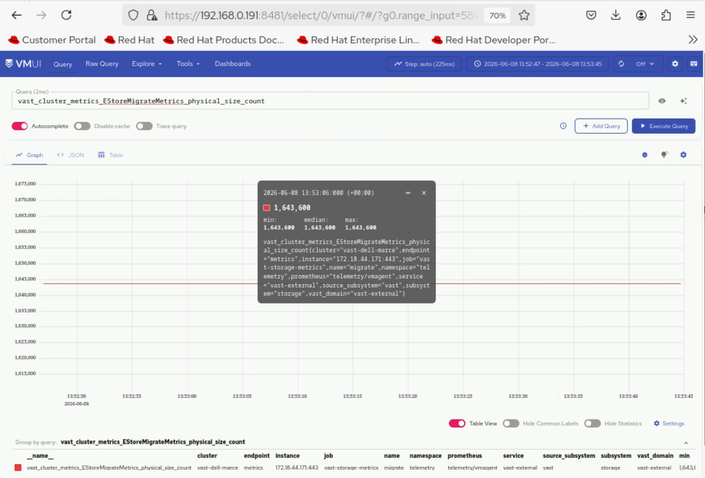

### View VAST Logs in VictoriaLogs

1. Retrieve the VLAgent LoadBalancer IP and configure it on the VAST appliance:

    ```bash title="Run on K8s control plane"
    kubectl get svc -n telemetry | grep -E "(vlagent|victoria-logs)"
    ```

    

2. Retrieve the external IP and port of the vlselect service:

    ```bash title="Run on K8s control plane"
    kubectl get svc -n telemetry | grep vlselect
    ```

    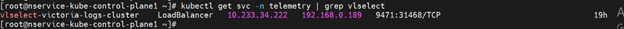

3. Access the VictoriaLogs UI in a web browser:

    ```
    https://<external vlselect loadbalancer IP>:9471/select/vmui
    ```

    


## Verify OME Telemetry Flow


### Verify OME Telemetry Data in Kafka

To verify that OME telemetry data is being successfully published to the OME Kafka topics:

!!! note

    Ensure that the nodes are discovered in OpenManage Enterprise before configuring telemetry streaming.

1. Log in to the Service Kubernetes control plane.

2. Set the required variables:

    ```bash title="Run on K8s control plane"
    KAFKA_LB_IP=<external IP of bridge-bridge-lb service>
    TOPIC=<OME Topic Name>
    GROUP=ome-consumer-group
    INSTANCE=ome-consumer
    ```

3. Create a Kafka consumer:

    ```bash title="Run on K8s control plane"
    curl -s -X POST "http://$KAFKA_LB_IP:8080/consumers/$GROUP" \
      -H 'content-type: application/vnd.kafka.v2+json' \
      -d '{"name": "ome-consumer", "format": "json", "auto.offset.reset": "earliest"}'
    ```

4. View the list of OME Kafka topics configured:

    ```bash title="Run on K8s control plane"
    curl -s -X GET "http://$KAFKA_LB_IP:8080/topics" | jq '.'
    ```

5. Subscribe the consumer to the telemetry topic:

    ```bash title="Run on K8s control plane"
    curl -s -X POST "http://$KAFKA_LB_IP:8080/consumers/$GROUP/instances/$INSTANCE/subscription" \
      -H 'content-type: application/vnd.kafka.v2+json' \
      -d '{"topics": ["'"$TOPIC"'"]}'
    ```

6. Consume messages from the topic:

    ```bash title="Run on K8s control plane"
    while true; do
      curl -s -X GET "http://$KAFKA_LB_IP:8080/consumers/$GROUP/instances/$INSTANCE/records" \
        -H 'accept: application/vnd.kafka.json.v2+json' | jq '.'
      sleep 2
    done
    ```

7. (Optional) Cleanup the consumer:

    ```bash title="Run on K8s control plane"
    curl -s -X DELETE "http://$KAFKA_LB_IP:8080/consumers/$GROUP/instances/$INSTANCE"
    ```

!!! note

    - **From beginning**: Ensure `"auto.offset.reset": "earliest"` when creating the consumer if you want existing data.
    - **Message format**: Use `"format": "json"` only if producers publish JSON. Otherwise use `"binary"` and decode base64 payloads.
    - **Throughput**: Adjust polling interval; bridge returns empty array when no new records.
    - **404/409 errors**: 404 usually means wrong group/instance name; 409 means already subscribed.

### Verify OME Telemetry Data in VictoriaMetrics

To verify that OME telemetry data is being successfully routed from Kafka to VictoriaMetrics using Vector:

1. Access the VMUI in a web browser:

    ```
    https://<external vmselect loadbalancer IP>:8481/select/0/vmui
    ```

2. Navigate to the **Explore** tab.

3. Run the following query to retrieve health metrics from OME:

    ```
    last_over_time({source_subsystem="ome", type="health"}[24h])
    ```

    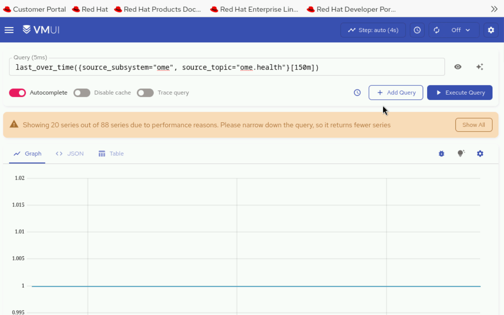

!!! note

    `source_subsystem=ome` comes from the `ome_identifier` that the user has given in the `telemetry_config.yml` input file and the suffix after the dot (i.e., health, inventory, auditlogs) is coming from OME.

4. Verify that OME-related metrics are displayed in the results.

!!! note

    Ensure that the Vector-OME bridge is enabled in `telemetry_config.yml` (`telemetry_bridges > vector_ome > metrics_enabled: true`) for metrics data to flow from Kafka to VictoriaMetrics.

### Verify OME Telemetry Data in VictoriaLogs

To verify that OME telemetry data is being successfully routed from Kafka to VictoriaLogs using Vector:

1. Access the VictoriaLogs UI in a web browser:

    ```
    https://<external vlselect loadbalancer IP>:9471/select/vmui
    ```

2. Navigate to the **Select** tab.

3. In the query field, run the following query to filter for OME logs:

    ```
    _msg_topic:ome.auditlogs
    ```

    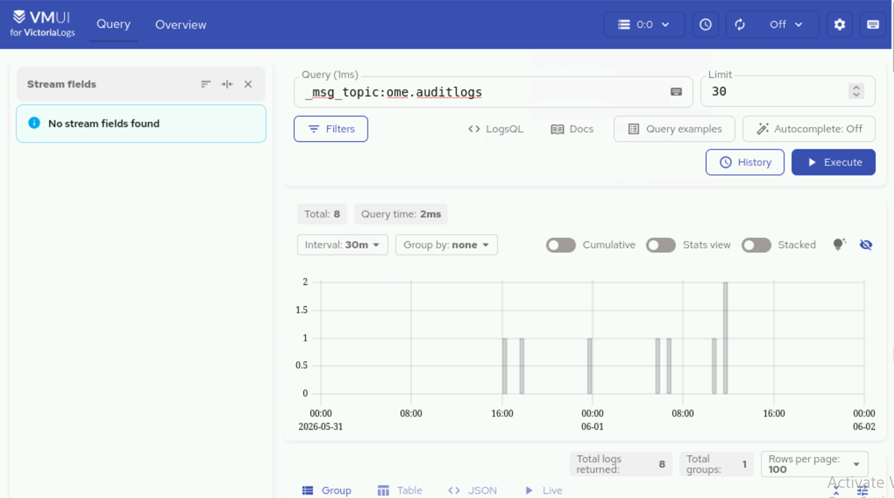

4. Verify that OME-related logs are displayed in the results.

!!! note

    Ensure that the Vector-OME bridge is enabled in `telemetry_config.yml` (`telemetry_bridges > vector_ome > logs_enabled: true`) for logs data to flow from Kafka to VictoriaLogs.


## Verify SFM Telemetry Flow


### View SFM Telemetry Data in VictoriaMetrics UI (VMUI)

To view the SFM telemetry data that is streamed to VictoriaMetrics:

1. Verify that the VictoriaMetrics pod is running:

    ```bash title="Run on K8s control plane"
    kubectl get pods -n telemetry -o wide | grep vm
    ```

2. Verify that all the services of VictoriaMetrics cluster are running:

    ```bash title="Run on K8s control plane"
    kubectl get service -n telemetry -o wide | grep vm
    ```

3. Note the **External IP** and **port number** of the `vmselect` service.

4. Access the VMUI in a web browser:

    ```
    https://<external vmselect loadbalancer IP>:8481/select/0/vmui
    ```

5. Filter and view telemetry metrics using queries in VMUI. For example, the following query displays transceiver DOM temperature values:

    ```
    transceiver_dom_temperature_value
    ```

    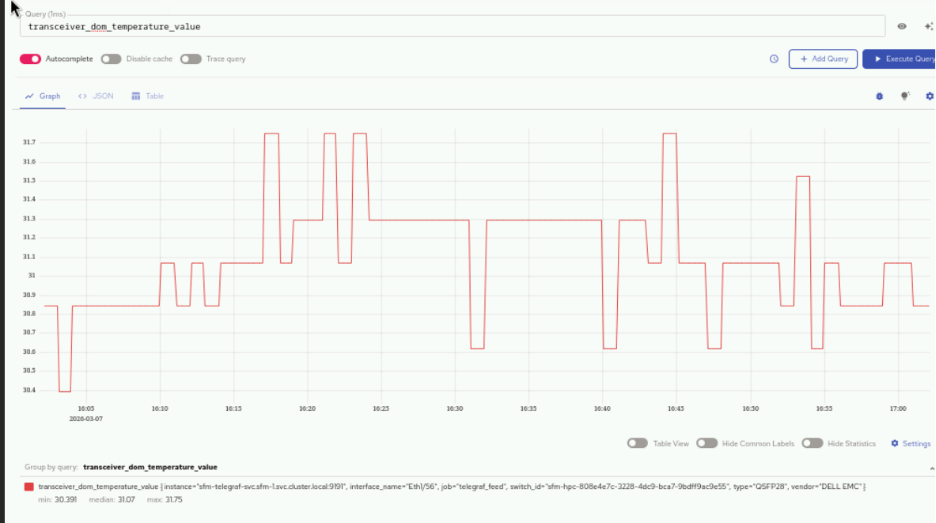

The following are some of the key metrics that can be queried:

- `transceiver_dom_temperature_value` -- Monitors optical transceiver temperature for hardware health
- `queue_tx_pkts` -- Tracks transmitted packets per queue for performance monitoring
- `queue_drop_pkts` -- Counts dropped packets per queue to identify congestion issues
- `queue_tx_bits_per_second` -- Measures queue throughput in bits per second
- `ifcounters_in_octets` -- Monitors incoming data volume in bytes per interface
- `ifcounters_out_octets` -- Monitors outgoing data volume in bytes per interface
- `ifcounters_in_pkts` -- Counts incoming packets per interface
- `ifcounters_out_pkts` -- Counts outgoing packets per interface
- `ifcounters_in_errors` -- Tracks input errors per interface for fault detection
- `ifcounters_out_errors` -- Tracks output errors per interface for fault detection


## Access the MySQL Database


After `telemetry.yml` has been executed for the service cluster, you can check the MySQL database inside the `mysqldb` container.

1. Get the names of all the telemetry pods:

    ```bash title="Run on K8s control plane"
    kubectl get pods -n telemetry -l app=idrac-telemetry
    ```

    !!! note

        The `idrac-telemetry-0` pod will always be responsible for collecting the telemetry data of the management nodes (`oim`, `service_kube_control_plane_x86_64`, `service_kube_node_x86_64`, `login_node_x86_64`, etc.).

2. Execute the following command:

    ```bash title="Run on K8s control plane"
    kubectl exec -it -n telemetry <iDRAC_telemetry_pod_name> -c mysqldb -- mysql -u <MYSQL_USER> -p
    ```

3. When prompted, enter the MySQL password to log in.

4. To enter into the `idrac_telemetry_db`:

    ```sql
    use idrac_telemetrydb;
    ```

5. To access the services table:

    ```sql
    select * from services;
    ```


## Quick Reference Checklist


| Telemetry Source | Verification Check | Expected Result |
| --- | --- | --- |
| **Component Status** | `kubectl get pods -n telemetry` | All pods Running |
| **Component Status** | `kubectl get svc -n telemetry` | All services present |
| **iDRAC** | Kafka consumer on `idrac` topic | JSON telemetry records |
| **iDRAC** | VMUI query: `PowerEdge_TemperatureReading` | Metric data displayed |
| **LDMS** | Kafka consumer on `ldms` topic | JSON telemetry records |
| **LDMS** | VMUI query: `{__name__=~"ldms_.*"}` | LDMS metrics displayed |
| **PowerScale** | VMUI query: `{__name__=~"powerscale"}` | PowerScale metrics displayed |
| **PowerScale** | VictoriaLogs UI query: `*` | PowerScale logs displayed |
| **UFM** | VMUI query: `{source="ufm", subsystem="infiniband"}` | UFM metrics displayed |
| **VAST** | VMUI query for VAST metrics | VAST metrics displayed |
| **OME** | Kafka consumer on OME topics | JSON telemetry records |
| **OME** | VMUI query: `last_over_time({source_subsystem="ome"}[24h])` | OME metrics displayed |
| **SFM** | VMUI query: `transceiver_dom_temperature_value` | SFM metrics displayed |


## Next Steps


- [Configure LDMS](configure_ldms.md) -- Set up LDMS telemetry.
- [Configure PowerScale Telemetry](configure_powerscale.md) -- Set up PowerScale telemetry.
- [Configure UFM Telemetry](configure_ufm.md) -- Set up UFM telemetry.
- [Configure VAST Telemetry](configure_vast.md) -- Set up VAST telemetry.
- [External Kafka](configure_external_kafka.md) -- Stream data from external clients to Kafka.
- [External VictoriaMetrics](configure_external_victoria.md) -- Push metrics from external clients to VictoriaMetrics.
