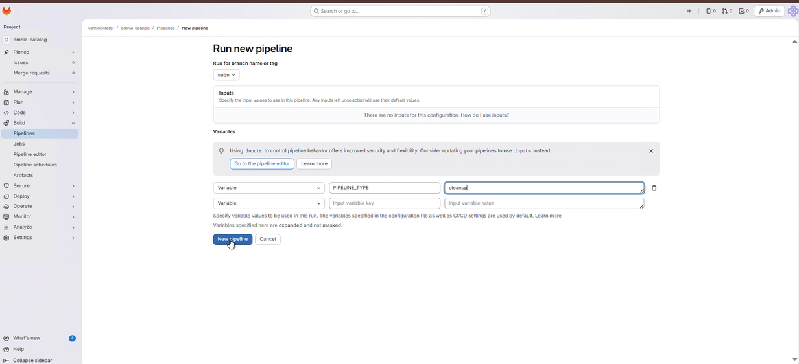
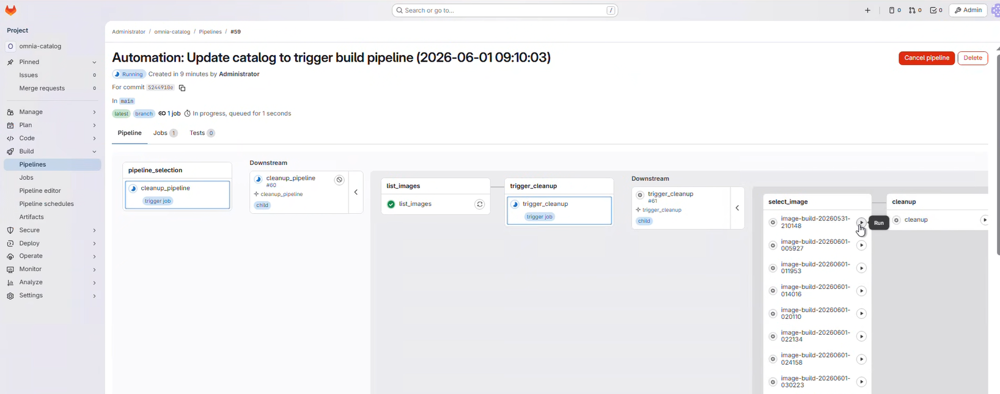
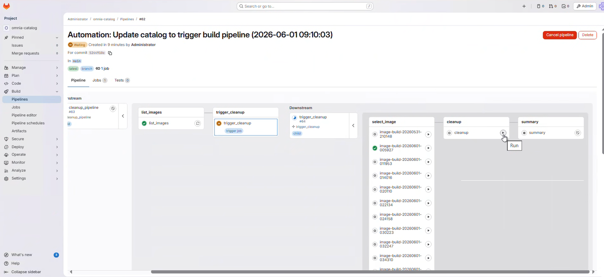
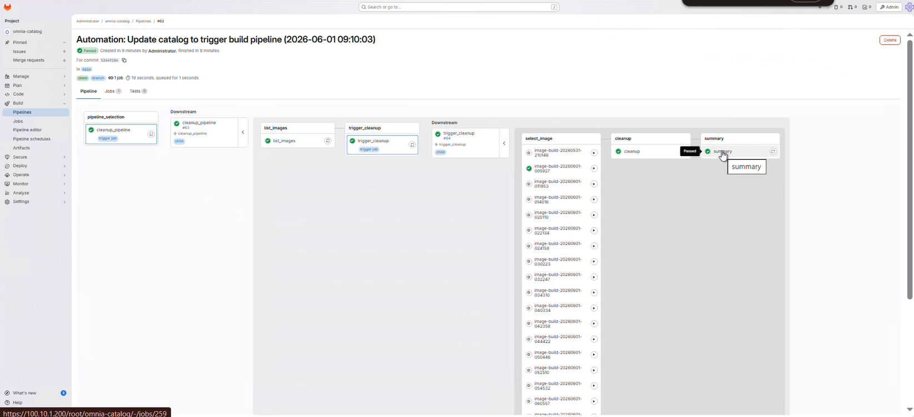

# Clean Up BuildStreaM Image Groups

## Overview

BuildStreaM enforces a retention guard on non-`CLEANED` image groups. The
default `IMAGE_RETENTION_LIMIT` in the source is 50. Use the manual cleanup
pipeline to select an image group and delete the associated job's S3 images
and NFS artifacts when the guard blocks a new job or when an image group is no
longer required. For catalog-mode images, exact image-group cleanup also
removes entries owned by that image group from the Image Build Manager global
dictionary.

!!! warning

    Do not cancel a running GitLab pipeline or stage. Cancellation prevents some pipeline steps from executing, which leaves the BuildStreaM job in an intermediate, inconsistent state.

## Prerequisites

- Access to the managed GitLab project.
- The BuildStreaM API server and PostgreSQL service are running.
- The Build pipeline has run at least once so the BSM client credentials are
  available to GitLab.
- At least one image group has a status other than `CLEANED`.

## Procedure

1. Navigate to the GitLab project URL:

    ```text title="GitLab project URL"
    https://<gitlab_host>:<gitlab_https_port>/root/<gitlab_project_name>
    ```

2. Navigate to **Build** → **Pipelines**.

3. Click **New Pipeline**.

4. In the **Run new pipeline** dialog box, enter the variable name as **PIPELINE_TYPE** and enter the value as **cleanup**.

    

5. Click **Run Pipeline** to execute the cleanup pipeline.

6. In the pipeline, select the image to be cleaned up from the `select_image` stage.

    

7. Click the **Play** button on the cleanup stage to execute the cleanup.

    

8. Monitor the pipeline progress through the GitLab web interface:

    - Click on the running pipeline to view details.
    - Monitor the cleanup stage as it progresses to completion.

    

9. Review the stage status indicators:

    - **Green checkmark**: Stage completed successfully
    - **Red X**: Stage failed (click for error details)
    - **Blue circle**: Stage currently running

## Verification

1. Check the GitLab pipeline status to ensure the cleanup stage passed.

2. Confirm that the selected image group is reported as `CLEANED` and is no
   longer offered by the cleanup pipeline as a cleanable image group.

3. Review the cleanup pipeline logs in GitLab for specific details about which Image Groups were removed.

4. For a catalog-mode image group, inspect the dictionary and confirm that no
   entry retains the cleaned composite image-group identifier:

    ```text
    $OMNIA_DATA_PATH/image_build_manager/output/$OMNIA_PROJECT_NAME/image_group_dictionary.json
    ```

    A dictionary-cleanup warning is reported separately and does not change an
    otherwise successful artifact cleanup into a failed cleanup operation.

## Next steps

- [Retry Pipelines](retry_pipelines.md) -- Retry failed pipeline operations
- [Execute Build Pipeline](../../HowTo/build_stream/execute_build_pipeline.md) -- Create new images after cleanup

## Troubleshooting

- **No cleanup pipeline starts:** Set `PIPELINE_TYPE` to the exact lowercase
  value `cleanup` when creating the pipeline.
- **No image groups are listed:** The Images API returns only groups whose
  status is not `CLEANED`; there is nothing to remove when the list is empty.
- **Cleanup pipeline failing:** Verify that the BuildStreaM API server and
  PostgreSQL database are running. See
  [BuildStreaM troubleshooting](../../Troubleshooting/build_stream/build_stream.md).
- **A dictionary entry remains:** Confirm that the cleanup selected the exact
  composite image-group identifier. Review Image Build Manager cleanup logs
  for a dictionary warning before editing the dictionary manually.


