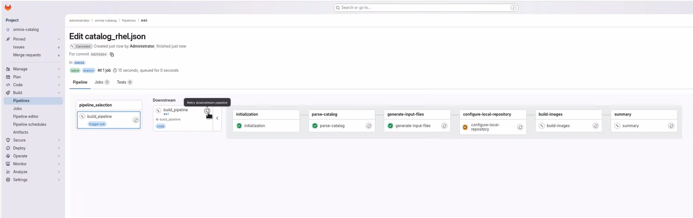

# Retry BuildStreaM Pipelines

## Overview

Retry a BuildStreaM pipeline when one or more stages have failed. Before retrying, identify and resolve the issue that caused the failure.

A retry of a downstream GitLab pipeline and a new catalog-mode build are
different operations. A new build can reuse valid functional-group artifacts
from the global image dictionary when `build_image.force_rebuild` is `false`.
That reuse behavior does not provide automatic rollback for an individual
failed GitLab stage.

!!! warning

    Do not cancel a running GitLab pipeline or stage. Cancellation prevents some pipeline steps from executing, which leaves the BuildStreaM job in an intermediate, inconsistent state.

## Prerequisites

- A Job exists with one or more stages in `FAILED` state
- The issue that caused the failure has been identified and resolved
- Configuration files (PXE mapping and input files) have been corrected if needed

## Procedure

1. Navigate to **Build** → **Pipelines** and identify the failed pipeline.

2. Identify the stage that failed and review the error logs.

3. Resolve the issue that caused the failure:

    - Fix configuration errors if present.
    - Resolve network connectivity issues.
    - Clear resource constraints if applicable.
    - Address any other specific error conditions.

4. From the parent pipeline, retry the failed downstream pipeline so that the
   complete child pipeline is created again.

    

    !!! note

        Retry the complete downstream pipeline rather than invoking an
        individual BSM stage again. The source creates a new BSM Job for a new
        build child pipeline. Build and deploy stages also refresh their
        module input files from the current branch when `GITLAB_API_TOKEN` is
        configured.

5. Verify that the pipeline completes successfully.

## Verification

1. Check the GitLab pipeline status to ensure all stages passed.

2. Verify that a new Pipeline ID is created for the retry operation.

3. For build pipelines, verify that images were created successfully.

    For a new catalog-mode build, review the job log for dictionary hits and
    verify the recorded S3 objects when an existing functional-group image was
    reused.

4. For deploy pipelines, verify that nodes were deployed correctly.

5. Compare results with the original failed pipeline to confirm the issue is resolved.

## Next steps

- [Execute Deploy Pipeline](../../HowTo/build_stream/execute_deploy_pipeline.md) -- Deploy pipeline operations
- [Cleanup Operations](cleanup_operations.md) -- Remove old Image Groups

## Troubleshooting

- **The corrected input is not used:** Confirm that `GITLAB_API_TOKEN` is
  configured and that the correction was committed to the current branch.
  Without the token, the source skips its latest-file refresh.
- **A BSM stage returns a state conflict:** Retry the complete downstream
  pipeline so the supported stage sequence starts with a new BSM Job.
- **A new build does not reuse an existing image:** Confirm that
  `build_image.force_rebuild` is `false` and that the dictionary entry's
  kernel, initramfs, and root filesystem objects still exist. Missing objects
  cause a rebuild.
- **A cadence retry starts without repository reconciliation:** Manual
  `PIPELINE_TYPE=cadence` execution starts the unified pipeline directly. The
  periodic watcher owns the reconciliation and package-change decision.
- For additional issues, see [BuildStreaM troubleshooting](../../Troubleshooting/build_stream/build_stream.md).

