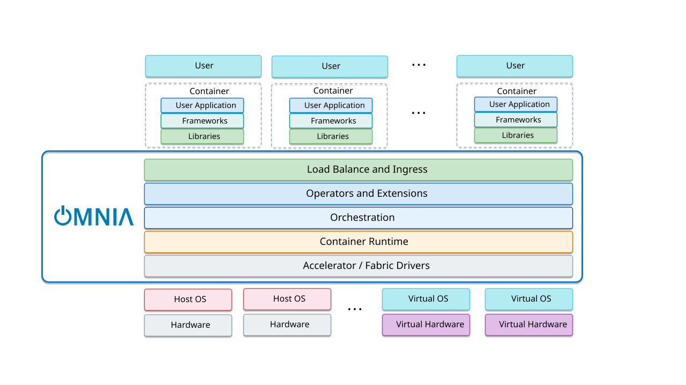
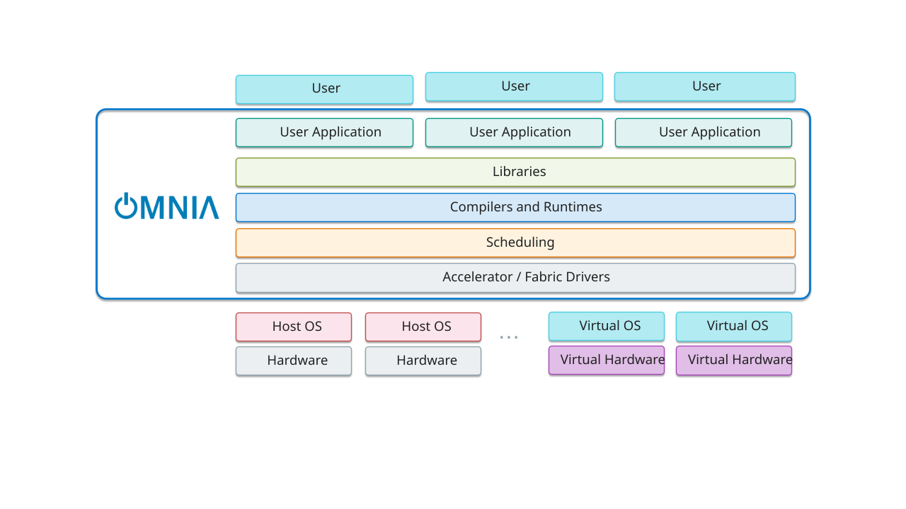

# Architecture

## OMNIA v2.2.0.0 Architecture

Omnia provides a comprehensive infrastructure management platform that orchestrates the deployment, configuration, and monitoring of HPC clusters. The architecture centers around the Omnia Infrastructure Manager (OIM), which serves as the central control plane for managing all cluster operations.

## OIM Role and Responsibilities

The OIM is the primary management node that coordinates all cluster activities.

- **Provisioning**: Manages the Bare System Setup (BSS) and cloud-init configurations to provision nodes from bare metal
- **Package Deployment**: Handles software distribution and configuration management across the cluster
- **Monitoring**: Collects and aggregates metrics, logs, and telemetry data from all cluster components
- **Orchestration**: Coordinates workflows for cluster operations including upgrades, scaling, and maintenance

## Node Relationships

The OIM (Omnia Infrastructure Manager) sits at the center and manages all
provisioned nodes. It PXE-boots, configures, and monitors every node via
OpenCHAMI, Ansible, and cloud-init.
 
- **Service Cluster**: Kubernetes cluster (k8s control-plane + worker nodes) 
  running core services such as telemetry, logging, and scheduling.
- **Slurm Control Node**: Runs Slurm management services (slurmctld,
  slurmdbd) and dispatches jobs to compute nodes.
- **Compute Nodes**: Slurm-managed workload execution nodes.
- **Login Nodes**: User access points for job submission and cluster
  interaction (includes login_compiler_node variant).
- **Storage Nodes**: Shared storage providers (NFS, PowerScale, VAST, MinIO)
  mounted by compute, login, and service nodes.
 
All nodes receive their OS image, hostname, IP, and functional group from
the OIM during provisioning. The OIM communicates over the admin network
(SSH/Ansible) and optionally the BMC network (IPMI/Redfish) for out-of-band
management. The OIM is the authoritative source of truth for cluster state
and configuration.

## Component Integration

The architecture integrates three primary subsystems.

1. **Monitoring Service**: Collects metrics and logs from all cluster components using VictoriaMetrics and VictoriaLogs for time-series data storage and analysis
2. **Provisioning System**: Automates node provisioning through BSS and cloud-init, ensuring consistent configuration across the cluster
3. **Package Management**: Deploys and manages software packages using local repositories and build pipelines

These subsystems work together through the OIM's orchestration layer to provide a unified, automated infrastructure management experience.

## Omnia Stack

Omnia provides two distinct deployment models tailored to different workload requirements: the Kubernetes Stack for containerized applications and the Slurm Stack for high-performance computing (HPC) workloads. These stacks can be deployed independently or in a converged configuration where both Kubernetes and Slurm coexist on the same infrastructure, enabling organizations to support diverse workload types within a single management framework.

The following diagrams illustrate the architectural layers and component relationships for each deployment model.

## Omnia Kubernetes Stack

The Kubernetes stack provides a complete container orchestration platform for deploying and managing containerized applications. Key components include:

- **Hardware / Virtual Hardware**: Physical Dell servers or virtualized infrastructure that provide the compute resources for the Kubernetes cluster.
- **Host OS / Virtual OS**: The operating system running on physical or virtual nodes that hosts Kubernetes components.
- **Accelerator / Fabric Drivers**: Drivers and software that enable access to GPUs, accelerators, and high-speed networking fabrics.
- **Container Runtime**: The runtime layer (such as containerd) responsible for creating and managing containers on each node.
- **Orchestration**: Kubernetes services that schedule, deploy, scale, and manage containerized workloads across the cluster.
- **Operators and Extensions**: Kubernetes operators, controllers, and add-ons that automate operations and extend cluster functionality.
- **Load Balance and Ingress**: Services that provide traffic routing, load balancing, and external access to applications.
- **Container**: An isolated environment that packages application components and dependencies for consistent execution.
- **Libraries**: Shared software dependencies required by applications running within containers.
- **Frameworks**: Development frameworks and platforms used to build and run containerized applications.
- **User Application**: The application or workload deployed and managed within the Kubernetes environment.
- **User**: Developers, administrators, or end users who interact with applications and services running on the cluster.

## Omnia Slurm Stack

The Slurm stack provides a workload manager optimized for HPC and batch job scheduling. Key components include:

- **Hardware / Virtual Hardware**: Physical Dell servers or virtualized infrastructure that provide compute resources for the cluster.
- **Host OS / Virtual OS**: The operating system running on physical or virtual nodes that hosts the Slurm environment.
- **Accelerator / Fabric Drivers**: Drivers and software that enable GPUs, accelerators, and high-performance networking fabrics for HPC workloads.
- **Scheduling**: The Slurm workload manager that allocates resources, schedules jobs, and manages workload execution.
- **Compilers and Runtimes**: Development toolchains and runtime environments required to build and execute HPC applications.
- **Libraries**: Shared HPC and application libraries that provide functionality for scientific and compute-intensive workloads.
- **User Application**: HPC applications, batch jobs, AI/ML workloads, and MPI programs executed on the cluster.
- **User**: Researchers, developers, and administrators who submit, monitor, and manage workloads on the cluster.

## Virtual Deployment Considerations

The diagrams show Virtual OS and Virtual Hardware blocks to represent scenarios where Omnia can be deployed on virtualized infrastructure. However, Omnia is primarily designed and tested for bare-metal deployments to ensure optimal performance for both Kubernetes and Slurm workloads. Virtual deployments may be supported for specific test or development scenarios, but production environments should use bare-metal hardware to avoid performance limitations and ensure full compatibility with all Omnia features.
