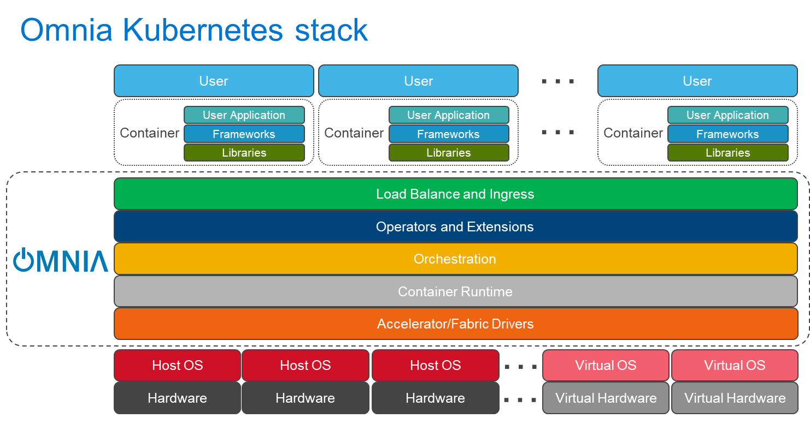
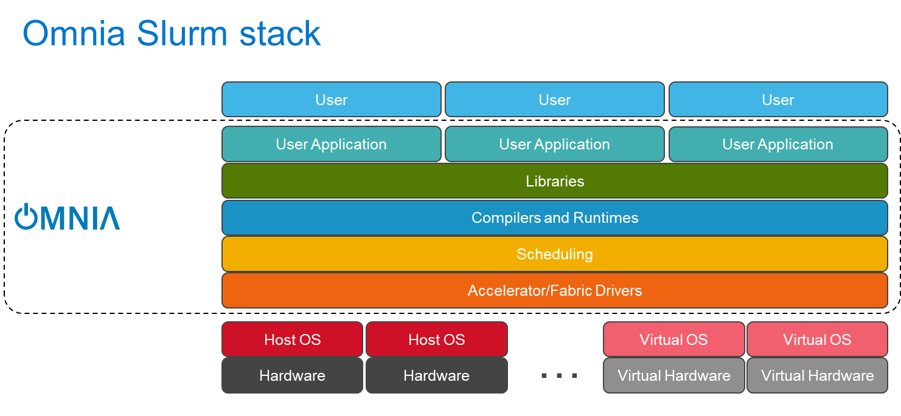

# Architecture

Omnia provides a comprehensive infrastructure management platform that orchestrates the deployment, configuration, and monitoring of HPC clusters. The architecture centers around the Omnia Infrastructure Manager (OIM), which serves as the central control plane for managing all cluster operations.

## OIM Role and Responsibilities

The OIM is the primary management node that coordinates all cluster activities.

- **Provisioning**: Manages the Bare System Setup (BSS) and cloud-init configurations to provision nodes from bare metal
- **Package Deployment**: Handles software distribution and configuration management across the cluster
- **Monitoring**: Collects and aggregates metrics, logs, and telemetry data from all cluster components
- **Orchestration**: Coordinates workflows for cluster operations including upgrades, scaling, and maintenance

## Node Relationships

The OIM maintains a hierarchical relationship with provisioned nodes.

- **Service Cluster**: Kubernetes-based control plane running core services (monitoring, telemetry, scheduling)
- **Compute Nodes**: Slurm-managed workload execution nodes
- **Login Nodes**: User access points for job submission and cluster interaction
- **Storage Nodes**: Dedicated nodes for shared storage and data management

All nodes communicate with the OIM through secure channels for configuration updates, health checks, and status reporting. The OIM maintains the authoritative source of truth for cluster state and configuration.

## Component Integration

The architecture integrates three primary subsystems.

1. **Monitoring Service**: Collects metrics and logs from all cluster components using VictoriaMetrics and VictoriaLogs for time-series data storage and analysis
2. **Provisioning System**: Automates node provisioning through BSS and cloud-init, ensuring consistent configuration across the cluster
3. **Package Management**: Deploys and manages software packages using local repositories and build pipelines

These subsystems work together through the OIM's orchestration layer to provide a unified, automated infrastructure management experience.

## Monitoring Service Component Legend

The Monitoring Service block in the architecture diagram uses the following VictoriaMetrics components.

- **VictoriaMetrics / VictoriaLogs Agent (vmagent / vlagent)**: Collects metrics and logs from cluster components
- **VictoriaMetrics Insert (vminsert)**: Ingests time-series data into the VictoriaMetrics database
- **VictoriaMetrics Database (vmstorage + vmselect)**: Stores and queries metrics and log data

## Omnia Stack

Omnia provides two distinct deployment models tailored to different workload requirements: the Kubernetes Stack for containerized applications and the Slurm Stack for high-performance computing (HPC) workloads. These stacks can be deployed independently or in a converged configuration where both Kubernetes and Slurm coexist on the same infrastructure, enabling organizations to support diverse workload types within a single management framework.

The following diagrams illustrate the architectural layers and component relationships for each deployment model.

## Omnia Kubernetes Stack

The Kubernetes stack provides a complete container orchestration platform for deploying and managing containerized applications. Key components include:

- **Infrastructure Layer**: Bare-metal or virtualized Dell PowerEdge servers with iDRAC management
- **Operating System**: RHEL-based provisioning with cloud-init configuration
- **Container Runtime**: Containerd for running containerized workloads
- **Orchestration**: Kubernetes cluster with control plane and worker nodes
- **Networking**: Calico CNI for pod networking, MetalLB for load balancing
- **Storage**: CSI drivers for PowerScale and other storage backends
- **Monitoring and Telemetry**: VictoriaMetrics for metrics collection, Kafka for telemetry data streaming
- **Application Layer**: User-deployed containerized workloads

## Omnia Slurm Stack

The Slurm stack provides a workload manager optimized for HPC and batch job scheduling. Key components include:

- **Infrastructure Layer**: Bare-metal or virtualized Dell PowerEdge servers with iDRAC management
- **Operating System**: RHEL-based provisioning with cloud-init configuration
- **Resource Management**: Slurm Workload Manager with control and compute nodes
- **Networking**: InfiniBand for high-performance interconnects, Ethernet for management
- **Storage**: NFS mounts for shared filesystem access
- **GPU Support**: NVIDIA GPU provisioning with CUDA Toolkit and DCGM for GPU-enabled nodes
- **Monitoring and Telemetry**: LDMS and other HPC-specific monitoring tools
- **Application Layer**: Batch jobs, MPI workloads, and other HPC applications

## Virtual Deployment Considerations

The diagrams show Virtual OS and Virtual Hardware blocks to represent scenarios where Omnia can be deployed on virtualized infrastructure. However, Omnia is primarily designed and tested for bare-metal deployments to ensure optimal performance for both Kubernetes and Slurm workloads. Virtual deployments may be supported for specific test or development scenarios, but production environments should use bare-metal hardware to avoid performance limitations and ensure full compatibility with all Omnia features.
