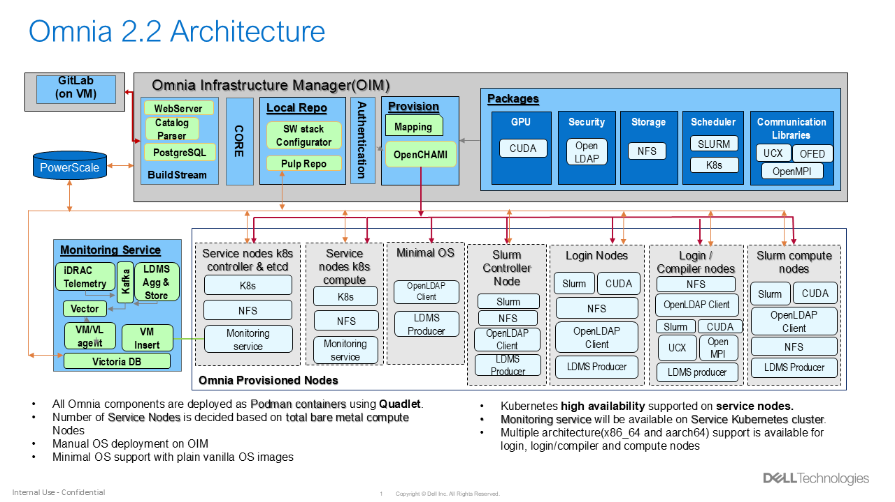
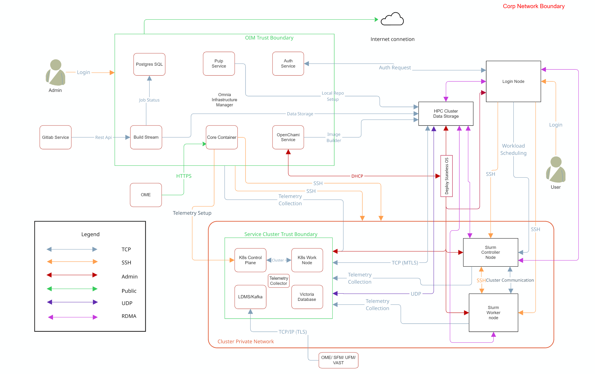

# Security Configuration Guide

## Preface
The security configuration guide of Omnia provides Dell customers an overview and understanding of the security features supported by Omnia. As part of an effort to improve its product lines, Dell periodically releases revisions of its software and hardware. The product release notes provide the most up-to-date information about product features. Contact your Dell technical support professional if a product does not function properly or does not function as described in this document. This document was accurate at publication time. To ensure that you are using the latest version of this document, go to [Omnia: Docs](https://omnia.readthedocs.io/en/v2.1.0.0-rc2/index.html)



### LEGAL DISCLAIMERS

THE INFORMATION IN THIS PUBLICATION IS PROVIDED “AS-IS.” DELL MAKES NO REPRESENTATIONS OR WARRANTIES OF ANY KIND WITH RESPECT TO THE INFORMATION IN THIS PUBLICATION, AND SPECIFICALLY DISCLAIMS IMPLIED WARRANTIES OF MERCHANTABILITY OR FITNESS FOR A PARTICULAR PURPOSE. In no event shall Dell Technologies, its affiliates or suppliers, be liable for any damages whatsoever arising from or related to the information contained herein or actions that you decide to take based thereon, including any direct, indirect, incidental, consequential, loss of business profits or special damages, even if Dell Technologies, its affiliates or suppliers have been advised of the possibility of such damages. The Security Configuration Guide intends to be a reference. The guidance is provided based on a diverse set of installed systems and may not represent the actual risk/guidance to your local installation and individual environment. It is recommended that all users determine the applicability of this information to their individual environments and take appropriate actions. All aspects of this Security Configuration Guide are subject to change without notice and on a case-by-case basis. Your use of the information contained in this document or materials linked herein is at your own risk. Dell reserves the right to change or update this document in its sole discretion and without notice at any time.

### Scope of the Document

This document covers the security features supported by Omnia 2.1.


### Document References

In addition to this guide, more information on Omnia can be found using the below links:

- [Omnia: Read Me](https://github.com/dell/omnia#readme)
- [Omnia: Deployment Guide](../GetStarted/index.md)

### Reporting Security Vulnerabilities

Dell takes reports of potential security vulnerabilities in our products very seriously. If you discover a security vulnerability, you are encouraged to report it to Dell immediately. For the latest instructions on how to report a security issue to Dell, see the [Dell Vulnerability Response Policy](https://www.dell.com/support/contents/en-in/article/product-support/self-support-knowledgebase/security-antivirus/alerts-vulnerabilities/dell-vulnerability-response-policy) on the dell.com site.

Follow Dell Security on these sites:

- [Security@Dell](https://www.dell.com/support/security/en-us)
- [Support@Dell](https://www.dell.com/support/home/en-us)

To provide feedback on this solution, email us at [security@dell.com](mailto:security@dell.com).

If you have any feedback about Omnia documentation, please reach out at [omnia.readme@dell.com](mailto:omnia.readme@dell.com).

## Security Quick Reference

### Security Profiles

Omnia requires root privileges during installation because it provisions the operating system on bare metal servers.

If you have any feedback about Omnia documentation, please reach out at [omnia.readme@dell.com](mailto:omnia.readme@dell.com).

## Product and Subsystem Security

### Security Controls Map



!!! note

    Omnia supports NFS configured on the following external storage solutions for HPC cluster data storage:

    - Dell PowerVault (iSCSI)
    - Dell PowerScale (CSI)
    - VAST (NFS)

    Each storage system may require specific authentication credentials and configurations. Refer to the respective storage integration documentation for detailed setup instructions.

Omnia performs bare metal configuration to enable AI/HPC workloads. It uses
Ansible playbooks to perform installations and configurations. iDRAC is
supported for provisioning bare metal servers. Omnia enables provisioning of
clusters via PXE using a mapping file **(Mandatory)** to dictate IP
address/MAC mapping.

Omnia can be installed via CLI only. Slurm and Kubernetes are deployed and
configured on the cluster. OpenLDAP is installed for providing authentication.

To perform these configurations and installations, a secure SSH channel is
established between the management node and the following entities:

- `slurm_control_node`
- `slurm_node`
- `login_node`
- `service_kube_control_node`
- `service_kube_node`

### Authentication

Omnia adheres to a subset of the specifications of NIST 800-53 and NIST 800-171 guidelines on the OIM and login node.

Omnia does not have its own authentication mechanism because bare metal installations and configurations take place using root privileges. Post the execution of Omnia, third-party tools are responsible for authentication to the respective tool.

### Cluster Authentication Tool

In order to enable authentication to the cluster, Omnia installs OpenLDAP: an open source tool providing integrated identity and authentication for Linux networked environments. As part of the HPC cluster, the login node is responsible for configuring users and managing a limited number of administrative tasks. Access to the manager/head node is restricted to cluster administrators only.

!!! note

    Omnia does not configure OpenLDAP users or groups.

### Authentication Types and Setup

#### Key-Based authentication

**Use of SSH authorized_keys**

A password-less channel is created between the management station and compute nodes using SSH authorized keys. This is explained in the[Security Controls Map](#security-controls-map).

### Login Security Settings

User needs to provide the following credentials during cluster configuration. Once these credentials are provided, Omnia stores them in an encrypted Ansible Vault in `input/omnia_config_credetials.yml`.
They are hidden from external visibility and access.

1. iDRAC/BMC (Username / Password)
2. Provisioning OS (Password)
3. slurmdb_password (Password)
4. DockerHub (Username / Password)
5. OpenLDAP (`openldap_db_username`, `openldap_db_password`, `openldap_config_username`, `openldap_config_password`, `openldap_monitor_password`)
6. Telemetry (`mysql_user`, `mysql_password`, `mysql_root_password`)
7. Minio S3 bucket (Password)
8. Pulp (Password)
9. CSI PowerScale credentials (Username / Password)
10. LDMS Sampler (Password)
11. Postgres (`postgres_user`, `postgres_password`)
12. GitLab (`gitlab_root_password`)
13. OME Discovery (`ome_username`, `ome_password`)
14. UFM Telemetry (`ufm_username`, `ufm_password`)
15. VAST Telemetry (`vast_username`, `vast_password`)

## Authentication to External Systems

Third party software installed by Omnia are responsible for supporting and maintaining manufactured-unique or installation-unique secrets.

## Network Security

Omnia configures the firewall as required by the third-party tools to enhance security by restricting inbound and outbound traffic to the TCP and UDP ports.

### Network Exposure

Omnia uses port 22 for SSH connections, same as Ansible.

### Firewall Settings

Omnia configures the following ports for use by third-party tools installed by Omnia.

**Host Port Requirements**

| Port Number | Protocol | Service | Type of Node |
|-------------|----------|---------|--------------|
| 22 | TCP | SSH | All Nodes |
| 2222 | TCP | SSH — Omnia Core Relay | Manager (OIM) |
| 2049 | TCP/UDP | NFS Server | Manager (OIM) |
| 111 | TCP/UDP | RPC Bind | Manager (OIM) |
| 20048 | TCP/UDP | NFS mountd | Manager (OIM) |
| 123 | UDP | NTP | Manager (OIM) |
| 53 | TCP/UDP | DNS – Cluster | Manager (OIM) |
| 9153 | TCP | DNS Metrics | Manager (OIM) |
| 53 | TCP/UDP | DNS – Podman Internal | Manager (OIM) |
| 67 | UDP | DHCP | Manager (OIM) |
| 68 | UDP | DHCP BootPC | Manager (OIM) |

**Podman Container Port Requirements**

| Port | Protocol | Service Name | Type of Node |
|---|---|---|---|
|2222|TCP|Omnia Core|Manager (OIM)|
|2225|TCP|Pulp Content Service|Manager (OIM)|
|5000|TCP|OCI Registry|Manager (OIM)|
|9000|TCP|MinIO S3 API|Manager (OIM)|
|9001|TCP|MinIO Console|Manager (OIM)|
|389|TCP|OpenLDAP|Manager (OIM)|

**Kubernetes Port Requirements**

| Port Number | Protocol | Service | Type of Node |
|---|---|---|---|
|6443|TCP|Kubernetes API server|Manager|
|2379-2380|TCP|etcd server client API|Manager|
|10251|TCP|Kube-scheduler|Manager|
|10252|TCP|Kube-controller manager|Manager|
|10250|TCP|Kubelet API|Compute|
|30000-32767|TCP|NodePort services|Compute|
|5473|TCP|Calico services|Manager/Compute|
|179|TCP|Calico services|Manager/Compute|
|4789|UDP|Calico services|Manager/Compute|
|8285|UDP|Flannel services|Manager/Compute|
|8472|UDP|Flannel services|Manager/Compute|
|10256|TCP|kube-proxy health check|Manager + Compute|
|7472|TCP|MetalLB L2 speaker Prometheus metrics|Manager + Compute|
|7946|TCP|MetalLB gossip/memberlist|Manager + Compute|
|2112|TCP|kube-vip Prometheus metrics + health|Manager|
|10257|TCP|Controller manager secure HTTPS port|Manager|
|10259|TCP|Scheduler secure HTTPS port|Manager|
|10249|TCP|kube-proxy Prometheus metrics|Manager + Compute|
|10248|TCP|kubelet local health check|Manager + Compute|
|9099|TCP|Calico Felix health check|Manager + Compute|
|53|TCP/UDP|Kubernetes CoreDNS|Manager|
|443|TCP|NFS StorageClass dynamic provisioner|Compute|
|45845|TCP|CRI-O runtime service|Manager/Compute|

**Slurm Port Requirements**

| Port Number | Layer 4 Protocol | Purpose | Node |
|-------------|------------------|---------|------|
| 6817 | TCP/UDP | Slurmctld Port | Manager |
| 6818 | TCP/UDP | Slurmd Port | Compute |
| 6819 | TCP/UDP | Slurmdbd Port | Manager |
| 60001-63000 | TCP | Slurm SrunPortRange | Compute |
| 3306 | TCP | MariaDB | Manager |

**OpenLDAP Port Requirements**

| Port Number | Layer 4 Protocol | Purpose | Node |
|-------------|------------------|---------|------|
| 80 | TCP | HTTP | Manager / Login Node |
| 443 | TCP | HTTPS | Manager / Login Node |
| 389 | TCP | LDAP | Manager / Login Node |
| 636 | TCP | LDAPS | Manager / Login Node |

**Telemetry Ports**

| Port | Protocol | Service Name | Type of Node |
|---|---|---|---|
|8161|TCP|ActiveMQ Console|Manager (Telemetry K8s)|
|61613|TCP|ActiveMQ STOMP|Manager (Telemetry K8s)|
|61616|TCP|ActiveMQ STOMP|Manager (Telemetry K8s)|
|8082|TCP|Telemetry Config UI|Manager (Telemetry K8s)|
|3306|TCP|MySQL|Manager (Telemetry K8s)|
|33060|TCP|MySQL X Protocol|Manager (Telemetry K8s)|
|9092|TCP|Kafka plaintext|Manager (Telemetry K8s)|
|9093|TCP|Kafka TLS|Manager (Telemetry K8s)|
|9094|TCP|Kafka LoadBalancer|Manager (Telemetry K8s)|
|8443|TCP|VictoriaMetrics Service|Manager (Telemetry K8s)|
|8480|TCP|VictoriaMetrics Insert LB|Manager (Telemetry K8s)|
|8481|TCP|VictoriaMetrics Query LB|Manager (Telemetry K8s)|
|2112|TCP|vmagent metrics|Manager (Telemetry K8s)|
|8429|TCP|vmagent remote_write|Manager (Telemetry K8s)|
|9427|TCP|vlagent JSON receiver|Manager (Telemetry K8s)|
|9481|TCP|VictoriaLogs vlinsert|Manager (Telemetry K8s)|
|9491|TCP|VictoriaLogs health|Manager (Telemetry K8s)|
|9471|TCP|VictoriaLogs query|Manager (Telemetry K8s)|
|8687|TCP|vector-ldms health|Manager (Telemetry K8s)|
|9599|TCP|vector-ldms metrics|Manager (Telemetry K8s)|
|8688|TCP|vector-ome health|Manager (Telemetry K8s)|
|9600|TCP|vector-ome metrics|Manager (Telemetry K8s)|
|514|TCP/UDP|Syslog|Manager (Telemetry K8s)|
|6514|TCP|Syslog TLS|Manager (Telemetry K8s)|
|6001-6100|TCP|LDMS Aggregator / Store Daemon|Manager (Telemetry)|
|10001-10100|TCP|LDMS Sampler|Compute|

**Build Stream Ports**

| Port | Protocol | Service Name | Type of Node |
|---|---|---|---|
|8010|TCP|Build Stream API|Manager (OIM)|

**DOCA/IB Ports **

| Port | Protocol | Service Name | Type of Node |
|---|---|---|---|
|18515-18520|TCP/UDP|DOCA/OFED RDMA|Compute (IB nodes)|

**OpenCHAMI Ports**

| Port | Protocol | Service Name | Type of Node |
|---|---|---|---|
|8081|TCP|HAProxy HTTP|Manager (OIM)|
|8443|TCP|HAProxy HTTPS|Manager (OIM)|
|27779|TCP|SMD|Manager (OIM)|
|27778|TCP|BSS|Manager (OIM)|
|5432|TCP|PostgreSQL|Manager (OIM)|
|9000|TCP|Step CA|Manager (OIM)|
|4444/4445|TCP|Hydra OAuth2|Manager (OIM)|
|67/69|UDP|CoreDHCP|Manager (OIM)|
|53|TCP/UDP|CoreDNS|Manager (OIM)|

### Data Security

Omnia does not store data. The passwords Omnia accepts as input to configure the third party tools are validated and then encrypted using Ansible Vault. Run the following commands routinely on the OIM for the latest RHEL security updates.

```bash
yum update --security
```

For more information on the passwords used by Omnia, see [Login Security Settings](#login-security-settings)

### Auditing and Logging

Omnia creates and stores log files related to containers at `<nfs_share_path>/omnia/log`.The events during the installation of Omnia are captured as logs. For different roles called by Omnia, separate log files are created as listed below:

**Omnia Log File Locations**

| Location | Purpose |
|----------|---------|
| `/opt/omnia/log/core/playbooks/discovery.log` | Discovery logs |
| `/opt/omnia/log/core/playbooks/local_repo.log` | Local Repository logs |
| `/opt/omnia/log/core/playbooks/prepare_oim.log` | Prepare OIM logs |
| `/opt/omnia/log/core/playbooks/provision.log` | Provision logs |
| `/opt/omnia/log/core/playbooks/scheduler.log` | Scheduler logs |
| `/opt/omnia/log/core/playbooks/telemetry.log` | Telemetry logs |
| `/opt/omnia/log/core/playbooks/utils.log` | Utility logs |
| `/opt/omnia/log/core/playbooks/credential_utility.log` | Credential utility logs |
| `/opt/omnia/log/openchami/*.log` | OpenCHAMI playbook logs |
| `/opt/omnia/log/pulp/*.log` | Pulp container logs |
| `/opt/omnia/log/local_repo/*.log` | Local repository logs |
| `/opt/omnia/log/core/container/*.log` | Core container logs |
| `/opt/omnia/log/core/playbooks/validation_omnia_project_default.log` | Omnia input validation report logs |
| `/opt/omnia/log/core/playbooks/input_validation.log` | Omnia input validation playbook logs |

Additionally, an aggregate of the events taking place during storage, scheduler and network role installation called `omnia.log` is created in `/var/log`.

There are separate logs generated by the third party tools installed by Omnia.

### Logs

A sample of the omnia.log is provided below:

```bash
2021-02-15 15:17:36,877 p=2778 u=omnia n=ansible | [WARNING]: provided hosts
list is empty, only localhost is available. Note that the implicit localhost does not
match 'all'
2021-02-15 15:17:37,396 p=2778 u=omnia n=ansible | PLAY [Executing omnia roles]
************************************************************************************
2021-02-15 15:17:37,454 p=2778 u=omnia n=ansible | TASK [Gathering Facts]
*****************************************************************************************
*
2021-02-15 15:17:38,856 p=2778 u=omnia n=ansible | ok: [localhost]
2021-02-15 15:17:38,885 p=2778 u=omnia n=ansible | TASK [common : Mount Path]
**************************************************************************************
2021-02-15 15:17:38,969 p=2778 u=omnia n=ansible | ok: [localhost]
...
```

These logs are intended to enable debugging.

!!! note

    Omnia recommends applying masking rules to personally identifiable information (PII) in log files before sending them to external monitoring applications or other third-party destinations.

### Logging Format

Every log message begins with a timestamp and also carries information on the invoking play and task.

The format is described in the following table.

**Log Format Reference**

| Field | Format | Sample Value |
|-------|--------|--------------|
| Timestamp | `yyyy-mm-dd h:m:s` | `2021-02-15 15:17:36` |
| Process ID | `p=xxxx` | `p=2778` |
| User | `u=xxxx` | `u=omnia` |
| Name of the Executing Process | `n=xxxx` | `n=ansible` |
| Task Being Executed | `PLAY` / `TASK` | `PLAY [Executing omnia roles]`<br>`TASK [Gathering Facts]` |
| Error | `fatal: [hostname]: Error Message` | `fatal: [localhost]: FAILED! => {"msg": "lookup_plugin.lines"}` |
| Warning | `[WARNING]: warning message` | `[WARNING]: provided hosts list is empty` |


### Network Vulnerability Scanning

Omnia performs network and application security scans on all modules of the product. Omnia additionally performs Blackduck scans on the open source softwares, which are installed by Omnia at runtime. However, Omnia is not responsible for the third-party software installed using Omnia. Review all third party software before using Omnia to install it.

If you have any feedback about Omnia documentation, please reach out at [omnia.readme@dell.com](mailto:omnia.readme@dell.com).


## Miscellaneous Configuration and Management Elements

### Licensing

Omnia is licensed under the Apache License 2.0. A permissive license whose main conditions require preservation of copyright and license notices. Contributors provide an express grant of patent rights. Licensed works, modifications, and larger works may be distributed under different terms and without source code.

### Protect Authenticity

Every GitHub push requires a sign-off and a moderator is required to approve pull requests. All contributions have to be certified using the Developer Certificate of Origin (DCO):

``` bash
Developer Certificate of Origin
Version 1.1

Copyright (C) 2004, 2006 The Linux Foundation and its contributors.
1 Letterman Drive
Suite D4700
San Francisco, CA, 94129

Everyone is permitted to copy and distribute verbatim copies of this
license document, but changing it is not allowed.


Developer's Certificate of Origin 1.1

By making a contribution to this project, I certify that:

(a) The contribution was created in whole or in part by me and I
    have the right to submit it under the open source license
    indicated in the file; or

(b) The contribution is based upon previous work that, to the best
    of my knowledge, is covered under an appropriate open source
    license and I have the right under that license to submit that
    work with modifications, whether created in whole or in part
    by me, under the same open source license (unless I am
    permitted to submit under a different license), as indicated
    in the file; or

(c) The contribution was provided directly to me by some other
    person who certified (a), (b) or (c) and I have not modified
    it.

(d) I understand and agree that this project and the contribution
    are public and that a record of the contribution (including all
    personal information I submit with it, including my sign-off) is
    maintained indefinitely and may be redistributed consistent with
    this project or the open source license(s) involved.
```

### Ansible Security

For the security guidelines of Ansible modules, go to [Developing Modules Best Practices: Module Security](https://docs.ansible.com/ansible/latest/dev_guide/developing_modules_best_practices.html#module-security).

### Ansible Vault

Ansible vault enables encryption of variables and files to protect sensitive content such as passwords or keys rather than leaving it visible as plaintext in playbooks or roles. Please refer [Ansible Vault guidelines](https://docs.ansible.com/ansible/latest/vault_guide/index.html) for more information.


### Encrypted Parameters Management

To view encrypted parameters:

```bash
ansible-vault view omnia_config_credentials.yml --vault-password-file .omnia_config_credentials_key
```

To edit encrypted parameters:

```bash
ansible-vault edit omnia_config_credentials.yml --vault-password-file .omnia_config_credentials_key
```

If you have any feedback about Omnia documentation, please reach out at [omnia.readme@dell.com](mailto:omnia.readme@dell.com).
