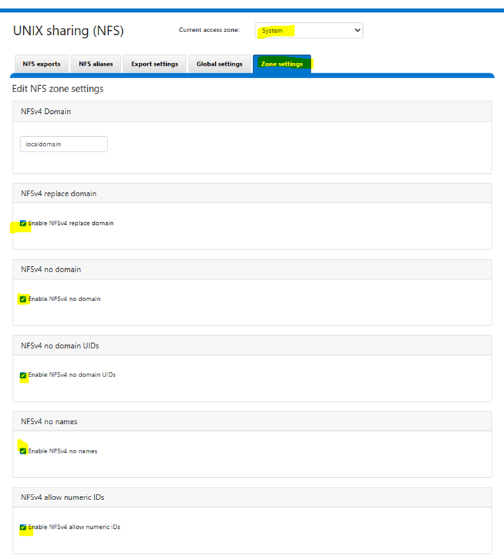

# Storage Requirements

This section outlines the key storage requirements for the components used by Omnia to deploy HPC clusters. For more information about the supported devices and software, see [Support Matrix](../index.md#support-matrix).

## NFS Server

- If PowerScale is configured as the NFS server using **NFSv4** protocol, the following settings must be enabled on the PowerScale cluster to prevent file ownership from displaying as `nobody:nobody`:

    From the PowerScale web interface, navigate to **Protocols** > **NFS** > **Zone settings** and enable:

    - `nfsv4-no-names = true`
    - `nfsv4-no-domain = true`
    - `nfsv4-no-domain-uids = true`
    - `nfsv4-allow-numeric-ids = true`

    

    Alternatively, run the following CLI command:

    ```bash title="Run on: PowerScale cluster"
    isi nfs settings zone modify \
      --nfsv4-no-names=true \
      --nfsv4-no-domain=true \
      --nfsv4-no-domain-uids=true \
      --nfsv4-allow-numeric-ids=true \
      --zone=System
    ```

    This configuration ensures the following:

    - PowerScale sends numeric UIDs/GIDs instead of string-based identity (`user@domain`), which eliminates the `nobody:nobody` ownership issue caused by NFSv4 domain mismatch.
    - Ensure that **UID/GID mappings are consistent** across all NFS client nodes and the PowerScale cluster. Since numeric ID mode bypasses name-based identity resolution, mismatched UIDs/GIDs between clients will result in incorrect file ownership.
    - This setting **degrades NFSv4 ACL support**. If your environment requires NFSv4 ACLs, consider aligning the NFSv4 domain between PowerScale and all clients instead.
    - For more details, see [Dell KB 000023023](https://www.dell.com/support/kbdoc/en-us/000023023).

- Choose an NFS server located outside your cluster.
- The NFS share has **755 permissions** and `no_root_squash` is enabled during mount.
- To enable `no_root_squash`, edit the `/etc/exports` file on the NFS server and include the option for the exported path, run the following command:

    ```bash title="File: /etc/exports"
    /<your_exported_path>  *(rw,sync,no_root_squash,no_subtree_check)
    ```

- Ensure that the external NFS share is accessible from all nodes (both diskless and diskful) and is reachable via the admin network.

### NFS Server for K8s

- Minimum NFS for Kubernetes is 200 GB. The storage is recommended based on small cluster deployments. Increase the storage based on cluster size and telemetry data.
- Ensure that there is a dedicated mount point for each NFS.

### NFS Server for Slurm

- Minimum NFS for Slurm is 50 GB. Increase the storage based on job data.
- Ensure that there is a dedicated mount point for each NFS.

### NFS Server for Omnia Infrastructure Manager (OIM)

- Omnia recommends using an NFS share with at least 200 GB storage for OIM and cluster configuration.
- Ensure that there is a dedicated mount point for each NFS.

## PowerScale S3 Storage

- PowerScale cluster must be deployed within the admin subnet and should be accessible from all cluster nodes.
- Omnia uses HTTP access only when connecting to PowerScale, using the default port 9020.
- Ensure both S3 and HTTP services are enabled in the S3 bucket configuration.
- Ensure that valid S3 Access Key ID and S3 Secret Access Key are provided for authentication when accessing the PowerScale S3 service.
- S3 Access Key ID and S3 Secret Access Key are tightly associated with the S3 buckets. You need S3 Access Key ID and S3 Secret Access Key to access the S3 buckets created using the key.
- For detailed configuration instructions, see [Configure PowerScale as S3 storage](../../HowTo/Setup/prepare_oim.md#configure-powerscale-as-s3-storage).
