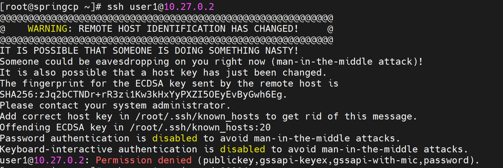

# Authentication Issues

Issues related to LDAP authentication, user login, OpenLDAP service, and TLS certificate errors.

## LDAP Login Fails After User Creation

???+ note "Symptom"

    User login fails after LDAP user creation. Error messages include:

    - `id: 'newuser': no such user`
    - `Permission denied (publickey,gssapi-keyex,gssapi-with-mic)`

??? note "Cause"

    Whitespace in the LDIF file used to create the user.

??? note "Resolution"

    1. Inspect the LDIF file for hidden whitespace or control characters:

        ```bash title="Run on: auth server"
        cat -vet <filename>
        ```

    2. Remove any whitespace found, then re-import the corrected LDIF file.

## OpenLDAP Login Fails

???+ note "Symptom"

    OpenLDAP login fails.

??? note "Cause"

    Stale SSH key.

??? note "Resolution"

    ```bash title="Run on: OIM host"
    ssh-keygen -R <hostname>
    ```

## User Login Fails on Cluster Nodes

???+ note "Symptom"

    Users cannot log in to Slurm compute nodes or login nodes via SSH. Login attempts fail with `Permission denied, please try again.` even though the user exists in LDAP and can authenticate on the auth server directly.

??? note "Cause"

    - The LDAP client (`sssd` or `nslcd`) is not running on the target node.
    - The LDAP client is configured with the wrong server URI or search base.
    - NSS (Name Service Switch) is not configured to use LDAP.
    - The user's home directory does not exist on the target node.

??? note "Resolution"

    1. Check SSSD status on the target node:

        ```bash title="Run on: compute node"
        systemctl status sssd
        ```

        If not running:

        ```bash title="Run on: compute node"
        systemctl start sssd
        ```

    2. Verify SSSD configuration:

        ```bash title="Run on: compute node"
        cat /etc/sssd/sssd.conf | grep -E 'ldap_uri|ldap_search_base'
        ```

    3. Test user lookup via NSS:

        ```bash title="Run on: compute node"
        getent passwd <username>
        ```

        If the user does not appear, SSSD or NSS is misconfigured.

    4. Check if the home directory exists:

        ```bash title="Run on: compute node"
        ls -la /home/<username>
        ```

        If it does not exist, enable automatic home directory creation:

        ```bash title="Run on: compute node"
        authconfig --enablemkhomedir --update
        ```

    5. Clear the SSSD cache and restart:

        ```bash title="Run on: compute node"
        sss_cache -E
        systemctl restart sssd
        ```

## User Login Through OpenLDAP Fails

???+ note "Symptom"

    User login through OpenLDAP fails on cluster nodes. Commands such as `ssh ldapuser@node`, `su - ldapuser`, or `id ldapuser` return no user or authentication errors.

??? note "Cause"

    Possible causes include:

    - OpenLDAP container is not running
    - SSSD is not running or is misconfigured
    - TLS/SSL certificate issue
    - Incorrect LDAP connection type configured
    - Network connectivity issue to LDAP server
    - Stale SSH host key when connecting to OIM or container

??? note "Resolution"

    Check if the OpenLDAP container is running:

    ```bash title="Run on: OIM host"
    podman ps -a | grep omnia_auth
    ```

    If the container is not running, start it:

    ```bash title="Run on: OIM host"
    systemctl start omnia_auth.service
    ```

    Alternatively, re-run prepare_oim.yml with OpenLDAP enabled in software_config.json.

    Verify SSSD status and configuration on the login or compute node:

    ```bash title="Run on: compute node"
    systemctl status sssd
    ```

    If SSSD is not running or misconfigured, restart it:

    ```bash title="Run on: compute node"
    systemctl restart sssd
    ```

    Verify that `/etc/sssd/sssd.conf` has the correct settings for `ldap_uri`, `ldap_search_base`, `ldap_default_bind_dn`, and `ldap_default_authtok`.

    Check for TLS/SSL certificate issues:

    Verify that the certificate file exists:

    ```bash title="Run on: compute node"
    ls -la /etc/openldap/certs/ldapserver.crt
    ```

    Ensure the certificate matches the one used by the omnia_auth container. If there is a mismatch, re-copy certificates from the shared NFS path (`/opt/omnia/omnia/openldap/certs` or the configured `nfs_server_share_path`) and restart SSSD:

    ```bash title="Run on: compute node"
    systemctl restart sssd
    ```

    Verify LDAP connection type consistency:

    The default connection type is TLS on port 389. If security_config.yml sets `ldap_connection_type: SSL`, SSSD expects `ldaps://<ldap_server_ip>:636`. Verify that security_config.yml and sssd.conf are consistent regarding the connection type and port.

    Test network connectivity to the LDAP server:

    ```bash title="Run on: compute node"
    ping <ldap_server_ip>
    ldapsearch -x -H ldap://<ldap_server_ip> -b <ldap_search_base>
    ```

    If connectivity fails, verify firewall rules and ensure the LDAP server IP is reachable from the affected node.

    Check for stale SSH host keys:

    If the actual failure is an SSH connection to the OIM or omnia_core container (not an OpenLDAP bind), the error may indicate a stale SSH host key:

    ```text title="Expected output"
    WARNING: REMOTE HOST IDENTIFICATION HAS CHANGED!
    ```

    This occurs when the OIM or container was reprovisioned, leaving a stale entry in `~/.ssh/known_hosts`. Remove the stale key:

    ```bash title="Run on: compute node"
    ssh-keygen -R <hostname>
    ```

    Or for a specific port:

    ```bash title="Run on: compute node"
    ssh-keygen -R "[localhost]:<port>"
    ```

    Then re-scan the host key:

    ```bash title="Run on: compute node"
    ssh-keyscan <hostname> >> ~/.ssh/known_hosts
    ```

    
    

## Certificate Errors

???+ note "Symptom"

    LDAP or other services fail with TLS certificate errors:

    ```text title="Expected output"
    TLS: peer cert untrusted or revoked
    SSL routines:ssl3_get_server_certificate:certificate verify failed
    ```

??? note "Cause"

    - The CA certificate used by step-ca is not installed on the client node.
    - The service certificate has expired.
    - The certificate's Subject Alternative Name (SAN) does not match the hostname or IP being used to connect.

??? note "Resolution"

    1. Check the certificate expiry:

        ```bash title="Run on: auth server"
        openssl x509 -in /etc/step/certs/server.crt -noout -dates
        step certificate inspect /etc/step/certs/server.crt --short
        ```

    2. If expired, renew the certificate:

        ```bash title="Run on: auth server"
        step ca renew /etc/step/certs/server.crt /etc/step/certs/server.key
        ```

    3. Verify the CA certificate is installed on client nodes:

        ```bash title="Run on: compute node"
        ls /etc/pki/ca-trust/source/anchors/
        ```

        If the CA cert is missing, copy it and update the trust store:

        ```bash title="Run on: OIM host"
        scp /etc/step/certs/root_ca.crt <client_node>:/etc/pki/ca-trust/source/anchors/
        ssh <client_node> update-ca-trust
        ```

    4. Verify the SAN matches the connection target:

        ```bash title="Run on: auth server"
        openssl x509 -in /etc/step/certs/server.crt -noout -ext subjectAltName
        ```

        If the SAN does not include the correct hostname or IP, reissue the certificate:

        ```bash title="Run on: auth server"
        step ca certificate <hostname> /etc/step/certs/server.crt \
          /etc/step/certs/server.key --san <hostname> --san <ip_address>
        ```

    5. Restart services after updating certificates:

        ```bash title="Run on: compute node"
        systemctl restart sssd
        ```

!!! info

    - [Deploy External LDAP](../HowTo/Authentication/deploy_external_ldap.md) -- External LDAP deployment guide.
