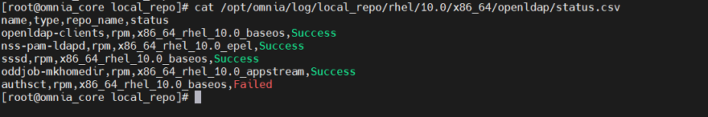
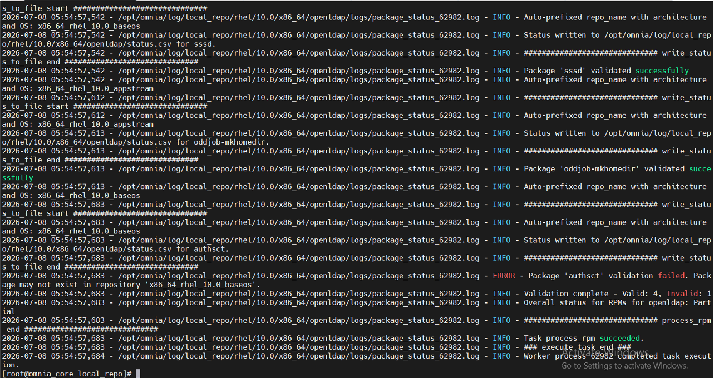
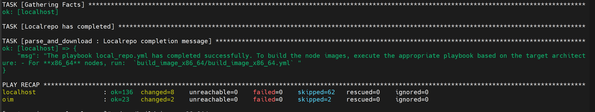

# Local Repository and Pulp Issues

Issues related to the `local_repo.yml` playbook, Pulp container operations, and repository synchronization.

## `local_repo.yml` Download Failures

???+ note "Symptom"

    The `local_repo.yml` playbook fails during package download, displaying errors such as "TASK [parse_and_download : Display Failed Packages]" or indicating that specific software packages could not be downloaded.

??? note "Cause"

    - Incorrect URLs in software JSON configuration files.
    - Docker pull limit reached or invalid Docker credentials.
    - Insufficient disk space on Pulp NFS storage.
    - Unreachable software repositories.

??? note "Resolution"

    1. Verify and correct URLs in the software JSON configuration files.
    2. Provide valid Docker credentials in `input/omnia_config_credentials.yml`.
    3. Ensure adequate disk space is available on Pulp NFS storage.
    4. Re-run the `local_repo.yml` playbook.

    **Log analysis for download failures:**

    - Overall download status:

        ```text title="Example"
        /opt/omnia/log/local_repo/<cluster_os>/<cluster_os_version>/<arch>/software.csv
        ```

        Example: `/opt/omnia/log/local_repo/rhel/10.0/x86_64/software.csv`

    

    - Per-software task results:

        ```text title="Example"
        /opt/omnia/log/local_repo/rhel/10.0/x86_64/<sw>_task_results.log
        ```

        Example for OpenLDAP: `/opt/omnia/log/local_repo/rhel/10.0/x86_64/openldap_task_results.log`

    

    - Package-level status:

        ```text title="Example"
        /opt/omnia/log/local_repo/<cluster_os>/<cluster_os_version>/<arch>/<sw>/status.csv
        ```

        Example: `/opt/omnia/log/local_repo/rhel/10.0/x86_64/openldap/status.csv`

    

    - Detailed failure information. View the reason a job was unsuccessful in the `package_status_<pid>.log` file referenced in the `<sw>_task_results.log`:

        ```text title="Example"
        /opt/omnia/log/local_repo/rhel/10.0/x86_64/<sw>/logs/package_status_<pid>.log
        ```

        Example: `/opt/omnia/log/local_repo/rhel/10.0/x86_64/openldap/logs/package_status_858667.log`

    

    !!! note

        If `local_repo.yml` completes without any package download failures, a `Successful` message is displayed.

    

## Playbook Fails When Re-Run Multiple Times

???+ note "Symptom"

    The `local_repo.yml` playbook fails when re-run multiple times in quick succession.

??? note "Cause"

    Pulp container resource saturation.

??? note "Resolution"

    Allow the system to idle approximately 1 hour before re-running.

## Pulp Reset Password Failed

???+ note "Symptom"

    Pulp reset password operation fails during `prepare_oim.yml` execution.

??? note "Cause"

    - NFS Storage Export Configuration (PowerScale): Missing or incorrect settings for `nfsv4-no-names`, `nfsv4-no-domain`, `nfsv4-no-domain-uids`, and `nfsv4-allow-numeric-ids`.
    - Inconsistent UID and GID mappings between NFS server and client.
    - Missing `no_root_squash` option in NFS export configuration.
    - NFS server connectivity issues or firewall blocking ports 2049, 111, and 20048.

??? note "Resolution"

    Verify the NFS export configurations and settings mentioned above, then re-run the `prepare_oim.yml` playbook.

    For PowerScale-specific configuration details, see the PowerScale configuration on [Deploy PowerScale CSI](../HowTo/Kubernetes/deploy_powerscale_csi.md) page.

## EPEL Repository Unavailable or Unstable

???+ note "Symptom"

    `local_repo.yml` fails during Pulp repository sync of EPEL metadata or during individual EPEL package download/validation, with timeout, connection, sync failure, or repository errors. The failure can occur at two stages:

    - **Pulp sync stage:** The EPEL URL reachability check fails or the Pulp remote sync to `x86_64_rhel_10.0_epel` (or `aarch64_rhel_10.0_epel`) times out.
    - **RPM download/validation stage:** Individual EPEL-dependent packages (`gedit`, `fping`, `clustershell`, `nss-pam-ldapd`, `apptainer`) fail during `dnf download` or `dnf info` validation.

??? note "Cause"

    The EPEL repository is unavailable, unreachable through the configured proxy or firewall, or contains stale metadata. Additional causes include:

    - Pulp container is not running (verify with `podman ps | grep pulp`).
    - Pulp sync timeout for large EPEL repository (syncs can take 10–20 minutes, especially with `pulp_concurrency: 1` on NFS storage).
    - EPEL GPG key URL (`https://dl.fedoraproject.org/pub/epel/RPM-GPG-KEY-EPEL-10`) is unreachable.

??? note "Resolution"

    1. Verify connectivity to the EPEL repository and GPG key:

        ```bash title="Run on: OIM host"
        curl -I --connect-timeout 10 https://dl.fedoraproject.org/pub/epel/10/Everything/x86_64/
        curl -I --connect-timeout 10 https://dl.fedoraproject.org/pub/epel/RPM-GPG-KEY-EPEL-10
        ```

    2. Verify the Pulp container is running and the EPEL repository sync status:

        ```bash title="Run on: OIM host"
        podman ps | grep pulp
        pulp rpm repository show --name x86_64_rhel_10.0_epel
        pulp rpm remote show --name x86_64_rhel_10.0_epel
        ```

    3. Identify the failed EPEL package in the Omnia logs:

        ```bash title="Run on: OIM host"
        grep -i "epel" /opt/omnia/log/core/playbooks/local_repo.log
        grep -RiE "epel|failed|timeout|error" /opt/omnia/log/local_repo/rhel/10.0/x86_64/default_packages/logs/
        grep -RiE "epel|failed|timeout|error" /opt/omnia/log/local_repo/rhel/10.0/x86_64/admin_debug_packages/logs/
        grep -RiE "epel|failed|timeout|error" /opt/omnia/log/local_repo/rhel/10.0/x86_64/openldap/logs/
        grep -RiE "epel|failed|timeout|error" /opt/omnia/log/local_repo/rhel/10.0/x86_64/slurm_custom/logs/
        cat /opt/omnia/log/local_repo/standard.log
        ```

    4. Apply the appropriate recovery:

        - If EPEL is temporarily unavailable, retry after service recovery by rerunning `local_repo.yml`.
        - To force re-sync of only the EPEL repository without resyncing all repos:

            ```bash title="Run on: omnia_core container"
            ansible-playbook local_repo.yml -e "resync_repos=['x86_64_rhel_10.0_epel']"
            ```

        - If the EPEL repository is corrupted in Pulp, clean it up and rerun:

            ```bash title="Run on: omnia_core container"
            ansible-playbook local_repo/pulp_cleanup.yml -e "cleanup_repos=x86_64_rhel_10.0_epel,aarch64_rhel_10.0_epel"
            ```

    5. Rerun `local_repo.yml` and verify that all required packages download successfully.

    !!! note

        For repeatable or air-gapped deployments, host the required EPEL packages locally instead of relying on the external EPEL service during deployment. Set `repo_config: "always"` in `software_config.json` and `caching: "False"` in `omnia_repo_url_rhel_<arch>` to ensure Omnia syncs the full EPEL content into the local Pulp repository and downloads all RPMs for offline use.

## Intermittent Local Repository Sync Failure Due to Non-Persistent Iptables Rules

???+ note "Symptom"

    Local repository synchronization fails intermittently, particularly after an OIM restart or firewall reload. The OIM may have internet access while the repository container cannot reach external repositories.

??? note "Cause"

    Required outbound traffic from the Podman container network is blocked by the OIM firewall. Temporary firewall rules may also be lost after a restart or firewall reload.

    !!! warning

        Do not set the INPUT, FORWARD, or OUTPUT policies to ACCEPT:

        ```bash title="Do NOT run these commands"
        iptables -P INPUT ACCEPT
        iptables -P FORWARD ACCEPT
        iptables -P OUTPUT ACCEPT
        ```

        These commands effectively bypass the OIM firewall policy and may expose the system to unauthorized traffic.

??? note "Resolution"

    1. Identify the repository container and Podman network:

        ```bash title="Run on: OIM host"
        podman ps -a
        podman network ls
        podman network inspect <network_name>
        ```

    2. Verify connectivity from the affected container:

        ```bash title="Run on: OIM host"
        podman exec <container_name> getent hosts <repository_fqdn>
        podman exec <container_name> curl -Iv --connect-timeout 10 https://<repository_fqdn>/
        ```

    3. Review the active forwarding rules:

        ```bash title="Run on: OIM host"
        iptables -L FORWARD -n -v --line-numbers
        ```

    4. Add narrowly scoped rules. Replace the placeholders with values from your environment:

        ```bash title="Run on: OIM host"
        # Allow established return traffic
        iptables -I FORWARD 1 \
          -d <container_subnet> \
          -m conntrack --ctstate ESTABLISHED,RELATED \
          -j ACCEPT

        # Allow container DNS queries
        iptables -I FORWARD 1 \
          -s <container_subnet> -d <dns_server_ip> \
          -p udp --dport 53 \
          -m conntrack --ctstate NEW,ESTABLISHED \
          -j ACCEPT

        # Allow HTTPS only to the approved repository or proxy
        iptables -I FORWARD 1 \
          -s <container_subnet> -d <repository_or_proxy_cidr> \
          -p tcp --dport 443 \
          -m conntrack --ctstate NEW,ESTABLISHED \
          -j ACCEPT
        ```

        Add TCP port 80 only if the repository explicitly requires HTTP.

        !!! warning

            Do not set the INPUT, FORWARD, or OUTPUT policies to ACCEPT:

            ```bash title="Do NOT run these commands"
            iptables -P INPUT ACCEPT
            iptables -P FORWARD ACCEPT
            iptables -P OUTPUT ACCEPT
            ```

            These commands effectively bypass the OIM firewall policy and may expose the system to unauthorized traffic.

    5. Retest repository access:

        ```bash title="Run on: OIM host"
        podman exec <container_name> curl -Iv --connect-timeout 10 https://<repository_fqdn>/
        ```

    6. Make the scoped rules persistent using the firewall manager configured on the OIM, such as firewalld or nftables.

        !!! note

            For repositories using CDNs or frequently changing IP addresses, route container traffic through an approved outbound proxy and restrict access to the proxy IP and port. Do not create broad internet-access rules.

        **Validation**

        Verify the following to confirm the resolution:

        - Repository synchronization completes successfully without errors
        - The scoped firewall rules persist after an OIM restart or firewall reload
        - Default firewall policies remain unchanged (not set to blanket ACCEPT)
        - No unnecessary inbound or forwarded access has been enabled

## Connectivity Issues

???+ note "Symptom"

    `local_repo.yml` fails with connectivity errors. Failures can occur at multiple stages:

    - **Validation stage:** URL reachability checks fail with `<url> is either unreachable, invalid or has incorrect SSL certificates` or `Unreachable registries detected: <host>`.
    - **Pulp sync stage:** Repository sync to the local Pulp server fails or times out.
    - **Download stage:** Package downloads fail with `Download interrupted`, `Max retries exceeded, download failed`, or `Unable to reach Docker Hub (network DNS/timeout/SSL issue)`.
    - **Final status reports:** `Local repo setup failed — some packages didn't download, and dependent scripts/playbooks may also fail. Refer to the localrepo logs for more details. Rerun local_repo.yml.`

??? note "Cause"

    The OIM was unable to reach a required online resource. Specific causes include:

    - External repository URLs are unreachable due to network outage, DNS failure, or firewall rules. `local_repo.yml` playbook fails fast on the first unreachable URL before testing all URLs and reporting all failures.
    - User-defined registries or repository URLs in `local_repo_config.yml` are unreachable.
    - SSL/TLS certificate issues — mismatched, expired, or missing certificates for user repositories or registries.
    - Docker Hub rate limiting (HTTP 429), invalid credentials (HTTP 401), or server errors (HTTP 5xx).
    - Pulp container is not running or Pulp endpoint is unresponsive.

??? note "Resolution"

    1. Verify connectivity to the upstream repository URLs configured in `local_repo_config.yml`.

    2. Verify that the Pulp container is running and Pulp endpoint is accessible:

        ```bash title="Run on: OIM host"
        podman ps | grep pulp
        curl -k https://<pulp_server_ip>:<pulp_port>/pulp/api/v3/status/
        ```

    3. If user registries are configured, verify connectivity on the OIM.

    4. Check the logs for specific error messages:

        ```bash title="Run on: OIM host"
        grep -i "unreachable" /opt/omnia/log/core/playbooks/local_repo.log
        grep -RiE "unreachable|timeout|connection|failed|SSL" /opt/omnia/log/local_repo/standard.log
        grep -RiE "Download interrupted|Max retries exceeded|HTTP error" /opt/omnia/log/local_repo/rhel/10.0/x86_64/*/logs/
        ```

    5. Apply the appropriate recovery:

        - If the Pulp container is not running, run `prepare_oim.yml` first.
        - If external URLs are unreachable, verify DNS resolution and firewall rules on OIM.
        - If SSL certificate errors occur for user repos, verify that certificate files exist under the expected path and are valid.
        - If Docker Hub rate limiting occurs, wait and retry, or configure Docker Hub credentials in `omnia_config_credentials.yml`.

    6. Rerun `local_repo.yml` after resolving the connectivity issues. Previously downloaded packages are not re-downloaded.

## Software Installation Fails With Checksum Error

???+ note "Symptom"

    Software installation fails with a checksum error.

??? note "Cause"

    A local repository for the software has not been configured by the `local_repo.yml` playbook.

??? note "Resolution"

    1. Re-run the `local_repo.yml` playbook with proper inputs to download the software package to the Pulp repository.
    2. Once the local repository has been configured successfully, re-run the failed installation script.

## Pulp Certificate Trust Failure on Compute Nodes

???+ note "Symptom"

    - `dnf install` fails with SSL certificate errors on provisioned compute nodes.
    - Package installation during cloud-init `runcmd` phase fails.
    - Container image pulls from the Pulp mirror fail on nodes.

    Example errors on the compute node:

    ```text title="Expected output"
    SSL certificate problem: unable to get local issuer certificate
    Peer's certificate issuer is not recognized
    Error: Failed to download metadata for repo 'pulp_mirror'
    ```

??? note "Cause"

    The Pulp webserver certificate (`pulp_webserver.crt`) was not copied or trusted on the node. All cloud-init templates include a `runcmd` step that copies the certificate from the NFS-mounted `/cert` directory:

    ```bash
    cp /cert/pulp_webserver.crt /etc/pki/ca-trust/source/anchors && update-ca-trust
    ```

    This step can fail if the NFS mount for `/cert` was not established before the certificate copy step executes.

??? note "Resolution"

    1. Verify the certificate and NFS mount status:

        ```bash title="Run on: compute node"
        # Check if the certificate is present and trusted
        ls -la /etc/pki/ca-trust/source/anchors/pulp_webserver.crt
        ls -la /cert/pulp_webserver.crt

        # Verify the NFS mount for /cert
        mount | grep /cert

        # Test SSL connectivity to Pulp
        openssl s_client -connect <admin_nic_ip>:2225 -showcerts </dev/null 2>&1 | grep -i verify

        # Test package manager connectivity
        dnf repolist
        ```

    2. Mount the certificate NFS share and copy the certificate manually:

        ```bash title="Run on: compute node"
        mount | grep /cert || mount -t nfs <admin_nic_ip>:<share_path>/cert /cert
        cp /cert/pulp_webserver.crt /etc/pki/ca-trust/source/anchors/
        update-ca-trust
        ```

    3. Verify package manager connectivity:

        ```bash title="Run on: compute node"
        dnf repolist
        dnf makecache
        ```

    4. If the issue recurs on re-provisioned nodes, verify the NFS export for the `/cert` directory is accessible from the node network.

## Container Image Pull Fails From Pulp Mirror

???+ note "Symptom"

    - Container images (SIF format) fail to download on Slurm/HPC nodes.
    - `/var/log/apptainer_pull.log` shows pull failures.
    - Expected container images are missing under `/hpc_tools/container_images`.

    Example errors in `/var/log/container_image_download.log` or `/var/log/apptainer_pull.log`:

    ```text title="Expected output"
    [ERROR] Failed to pull container image from Pulp mirror (exit code: 1).
    [INFO] Image may not be available in Pulp or download was interrupted.
    Error: error pulling image: unable to pull <image>: Error initializing source
    TIMEOUT: Container image pull timed out after 1800 seconds
    ```

??? note "Cause"

    - Container image was not synced to Pulp during `local_repo.yml` execution.
    - Pulp mirror endpoint is unreachable from the node (firewall, network issues).
    - Pulp certificate not trusted on the node (see [Pulp certificate trust failure](#pulp-certificate-trust-failure-on-compute-nodes) above).
    - Image tag mismatch between `container_image.list` and what is available in Pulp.

??? note "Resolution"

    1. Check download logs and image status:

        ```bash title="Run on: compute node"
        # Check download log
        tail -50 /var/log/container_image_download.log
        tail -50 /var/log/apptainer_pull.log

        # Check if Pulp mirror is reachable from the node
        curl -sk https://<admin_nic_ip>:2225/v2/_catalog

        # Check what images are expected
        cat /hpc_tools/scripts/container_image.list

        # Check downloaded images
        ls -lh /hpc_tools/container_images/
        ```

    2. Verify the container image exists in Pulp. From the OIM:

        ```bash title="Run on: OIM host"
        podman exec -it omnia_core pulp container repository list
        ```

    3. If the image is missing in Pulp, ensure it is listed in `software_config.json` and re-run `local_repo.yml`.

    4. If the image exists in Pulp but the pull fails, verify certificate trust (see [Pulp certificate trust failure](#pulp-certificate-trust-failure-on-compute-nodes)) and re-run the download script:

        ```bash title="Run on: compute node"
        /hpc_tools/scripts/download_container_image.sh
        ```

!!! info

    - [Create Local Repos](../HowTo/Setup/create_local_repos.md) -- Local repository setup guide.
    - [Log Management](../Operations/log_management.md) -- Where to find logs for deeper diagnosis.
    - [Pulp Cleanup](../Operations/pulp_cleanup.md) -- Pulp cleanup procedures.
