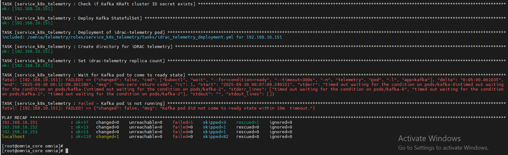
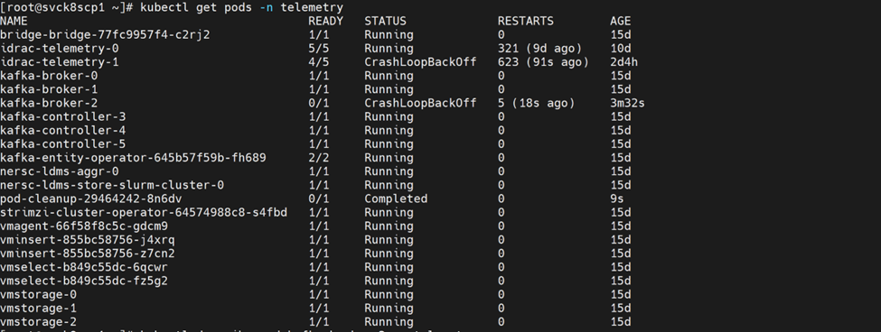

# Telemetry Issues

Issues related to the telemetry pipeline: Kafka, iDRAC telemetry, LDMS samplers, VictoriaMetrics (cluster mode), VictoriaLogs, and Grafana dashboards.

## Kafka pods CrashLoopBackOff

???+ note "Symptom"

    Kafka pods enter `CrashLoopBackOff` state.

??? note "Cause"

    - No service kube nodes available.
    - Missing CSI driver.
    - Persistent volume full.

??? note "Resolution"

    1. Ensure service kube nodes are booted.
    2. Add PowerScale CSI driver (see [Missing PowerScale CSI Driver](kubernetes.md#missing-powerscale-csi-driver)).
    3. Increase Kafka volume and configure log retention.

    

## Kafka "No space left on device"

???+ note "Symptom"

    Kafka pods crash with "No space left on device" errors.

    

    

??? note "Cause"

    Configured `persistence_size` for Kafka has reached capacity limit.

??? note "Resolution"

    The default `8Gi` persistent volume size is suitable for small clusters (typically fewer than 5 nodes). For larger clusters, increase `persistence_size` and configure Kafka retention settings `log_retention_hours` and `log_retention_bytes` so that old logs are deleted before the persistent volume reaches its limit.

    **Cleanup Script**

    If Kafka brokers are experiencing disk space issues and require immediate cleanup, use the following automated script to identify and remove old log segments:

    ```bash title="kafka-pv-cleanup.sh"
    #!/bin/bash
    # ============================================================
    # KAFKA PV FULL — AUTOMATED EMERGENCY CLEANUP (OMNIA)
    # ============================================================
    set -e

    NAMESPACE="telemetry"
    BROKER_COUNT=3
    RETENTION_MS=3600000        # 1 hour temporary retention
    SEGMENT_AGE_DAYS=3          # Delete segments older than 3 days

    echo "============================================"
    echo " KAFKA PV EMERGENCY CLEANUP - AUTOMATED"
    echo "============================================"

    # -------------------------------------------------------
    # STEP 1: CHECK — Which brokers are full
    # -------------------------------------------------------
    echo ""
    echo ">>> STEP 1: Checking broker disk usage..."
    BROKERS_HEALTHY=true
    RESPONSIVE_BROKER=""

    for i in $(seq 0 $((BROKER_COUNT-1))); do
      echo "=== kafka-broker-$i ==="
      POD_STATUS=$(kubectl get pod -n $NAMESPACE kafka-broker-$i -o jsonpath='{.status.phase}')
      READY=$(kubectl get pod -n $NAMESPACE kafka-broker-$i -o jsonpath='{.status.conditions[?(@.type=="Ready")].status}')
      echo "  Pod Phase: $POD_STATUS"
      echo "  Ready: $READY"

      if kubectl exec -n $NAMESPACE kafka-broker-$i -- echo "OK" 2>/dev/null; then
        echo "  Broker-$i: RESPONSIVE"
        [ -z "$RESPONSIVE_BROKER" ] && RESPONSIVE_BROKER=$i
      else
        echo "  Broker-$i: NOT RESPONSIVE (exec failed)"
        BROKERS_HEALTHY=false
      fi
    done

    if [ "$BROKERS_HEALTHY" = true ]; then
      echo ""
      echo "All brokers are running and responsive."
      echo "No action needed. Exiting."
      exit 0
    fi

    echo ""
    echo "============================================"
    echo " BROKERS CRASHLOOPING — MANUAL FIX"
    echo "============================================"

    # STEP 2: Get PVC names
    echo ">>> STEP 2: Detecting PVC names..."
    kubectl get pvc -n $NAMESPACE
    FIRST_PVC=$(kubectl get pvc -n $NAMESPACE -o jsonpath='{.items[0].metadata.name}' 2>/dev/null)
    PVC_PREFIX=$(echo "$FIRST_PVC" | sed 's/-[0-9]$//')

    # STEP 2.5: Stop broker pods to release PVCs
    echo ">>> STEP 2.5: Stopping broker pods..."
    if kubectl get statefulset -n $NAMESPACE kafka-broker >/dev/null 2>&1; then
      kubectl scale statefulset -n $NAMESPACE kafka-broker --replicas=0
      for i in $(seq 0 $((BROKER_COUNT-1))); do
        kubectl wait -n $NAMESPACE --for=delete pod/kafka-broker-$i --timeout=120s --ignore-not-found || true
      done
    fi

    # STEP 3: Deploy cleanup pods
    echo ">>> STEP 3: Deploying cleanup pods..."
    for i in $(seq 0 $((BROKER_COUNT-1))); do
      PVC_NAME="${PVC_PREFIX}-${i}"
      kubectl run kafka-cleanup-$i -n $NAMESPACE \
        --image=busybox --restart=Never \
        --overrides='{ "spec": { "containers": [{ "name": "cleanup", "image": "busybox", "command": ["sh","-c","sleep 3600"], "volumeMounts": [{ "name": "data", "mountPath": "/data" }] }], "volumes": [{ "name": "data", "persistentVolumeClaim": { "claimName": "'$PVC_NAME'" } }] } }'
    done
    for i in $(seq 0 $((BROKER_COUNT-1))); do
      kubectl wait -n $NAMESPACE --for=condition=Ready pod/kafka-cleanup-$i --timeout=120s
    done

    # STEP 4: Clean old segments
    echo ">>> STEP 4: Cleaning old segments (>${SEGMENT_AGE_DAYS} days)..."
    for i in $(seq 0 $((BROKER_COUNT-1))); do
      echo "=== kafka-broker-$i (BEFORE) ==="
      kubectl exec -n $NAMESPACE kafka-cleanup-$i -- df -h /data
      kubectl exec -n $NAMESPACE kafka-cleanup-$i -- \
        sh -c 'find /data -name "*.log" -mtime +'"$SEGMENT_AGE_DAYS"' -delete 2>/dev/null'
    done

    # STEP 5: Verify space recovered
    echo ">>> STEP 5: Verifying space recovered..."
    for i in $(seq 0 $((BROKER_COUNT-1))); do
      kubectl exec -n $NAMESPACE kafka-cleanup-$i -- df -h /data
    done

    # STEP 6: Remove cleanup pods
    echo ">>> STEP 6: Removing cleanup pods..."
    for i in $(seq 0 $((BROKER_COUNT-1))); do
      kubectl delete pod -n $NAMESPACE kafka-cleanup-$i --ignore-not-found
    done

    # STEP 7: Scale up StatefulSet
    echo ">>> STEP 7: Restoring brokers..."
    if kubectl get statefulset -n $NAMESPACE kafka-broker >/dev/null 2>&1; then
      kubectl scale statefulset -n $NAMESPACE kafka-broker --replicas=$BROKER_COUNT
      for i in $(seq 0 $((BROKER_COUNT-1))); do
        kubectl wait -n $NAMESPACE --for=condition=Ready pod/kafka-broker-$i --timeout=300s
        sleep 60
      done
    fi

    echo "CLEANUP COMPLETE"
    ```

    **Script Usage:**

    1. Save the script: `vi kafka-pv-cleanup.sh`
    2. Make executable: `chmod +x kafka-pv-cleanup.sh`
    3. Run: `./kafka-pv-cleanup.sh`

    !!! note

        This script automatically detects whether brokers are responsive or crashlooping and applies the appropriate cleanup strategy. Modify `BROKER_COUNT`, `RETENTION_MS`, and `SEGMENT_AGE_DAYS` variables at the top of the script to match your environment.

## LDMS metrics missing

???+ note "Symptom"

    LDMS metrics do not appear in the telemetry dashboard or are missing expected data points.

??? note "Cause"

    - LDMS aggregator pods are not running or experiencing errors.
    - LDMS store daemon service is inactive.
    - LDMS sampler service is not functioning correctly.

??? note "Resolution"

    Check the status of LDMS components and review logs for errors:

    ```bash title="Run on: K8s control plane"
    kubectl logs -n telemetry nersc-ldms-aggr-0
    kubectl logs -n telemetry nersc-ldms-store-slurm-cluster-0
    ```

    ```bash title="Run on: compute node"
    sudo systemctl status ldmsd.sampler.service
    ```

    Verify LDMS sampler is collecting metrics:

    ```bash title="Run on: compute node"
    /opt/ovis-ldms/sbin/ldms_ls -h localhost -p 10001 -x sock -a none
    ```

## iDRAC telemetry — no metrics reaching VictoriaMetrics / Kafka

???+ note "Symptom"

    iDRAC metrics (power, thermal, fan, CPU) do not appear in Grafana or VictoriaMetrics, or data is stale. The iDRAC telemetry receiver pods restart repeatedly or remain in `0/1 Ready` state. New nodes do not appear as telemetry sources after provisioning.

    Example errors in VictoriaPump / KafkaPump container logs:

    - `ERROR failed to subscribe to Redfish event service: 401 Unauthorized`
    - `ERROR redfish: event subscription rejected (SubscriptionLimitExceeded)`
    - `WARN activemq: connection refused tcp 127.0.0.1:61616`
    - `ERROR victoriapump: post to vmagent failed: dial tcp <vmagent-svc>:8429: connect: connection refused`

    !!! note

        The `401 Unauthorized` error may occur due to credential drift — when iDRAC credentials are changed on the iDRAC side after a successful deployment. Omnia stores credentials in mysqldb at insert-time and does not continuously re-validate them against the iDRAC appliance.

??? note "Cause"

    - Incorrect or expired iDRAC credentials in the vault (`idrac_username` / `idrac_password`), resulting in `401 Unauthorized` errors.
    - Redfish subscription limit reached on iDRAC (stale subscriptions from prior runs).
    - iDRAC firmware does not support Redfish Telemetry/EventService.
    - Pipeline component failure (ActiveMQ, KafkaPump, or VictoriaPump not ready).
    - Collection type misconfiguration (`telemetry_sources.idrac.collection_targets` does not include the expected sink).
    - Network or firewall blocking OIM from reaching iDRAC on port 443, or receiver from reaching vmagent for scraping `victoria-pump:2112/metrics` or Kafka on port 9093 (TLS).

??? note "Resolution"

    **Diagnostics:**

    ```bash title="Run on: K8s control plane"
    kubectl get pods -A | grep -Ei 'telemetry|idrac|victoria|kafka'
    ```

    Inspect iDRAC telemetry receiver pod (contains mysqldb, activemq, idrac-telemetry-receiver, kafka-pump, victoria-pump, plus initContainer cleanup-mysql-locks):

    ```bash title="Run on: K8s control plane"
    kubectl -n telemetry describe pod <idrac-telemetry-pod>
    kubectl -n telemetry logs <idrac-telemetry-pod> -c victoria-pump --tail=100
    kubectl -n telemetry logs <idrac-telemetry-pod> -c kafka-pump --tail=100
    ```

    Verify Redfish reachability and credentials:

    ```bash title="Run on: OIM host"
    curl -sk -u "$IDRAC_USER:$IDRAC_PASS" https://<idrac-ip>/redfish/v1/EventService | head
    ```

    List and delete stale Redfish subscriptions:

    ```bash title="Run on: OIM host"
    curl -sk -u "$IDRAC_USER:$IDRAC_PASS" https://<idrac-ip>/redfish/v1/EventService/Subscriptions
    ```

    Confirm metrics landed in VictoriaMetrics:

    ```bash title="Run on: K8s control plane"
    curl -s 'https://<vmselect-svc>:8481/select/0/prometheus/api/v1/query?query=up' | head
    ```

    **Resolution steps:**

    1. Correct `idrac_username` / `idrac_password` in `omnia_config_credentials.yml`, then run `ansible-playbook provision/provision.yml`, SSH to kube_vip and manually re-run `bash <k8s_client_mount_path>/telemetry/telemetry.sh`, then run `telemetry.yml`. Verify with the curl command above (expect 200).
    2. Delete orphaned Redfish subscriptions using `curl -X DELETE ...`, then allow the receiver to re-subscribe.
    3. Update iDRAC firmware to a version that supports Redfish EventService/Telemetry, then re-run telemetry.
    4. If ActiveMQ/KafkaPump/VictoriaPump is unhealthy, check container logs and restart the receiver pod (`kubectl delete pod <pod>`) after confirming the root cause.
    5. Set `telemetry_sources.idrac.collection_targets` to `["victoria_metrics"]`, `["kafka"]`, or `["victoria_metrics", "kafka"]` to match where you expect data, then run `ansible-playbook provision/provision.yml`, SSH to kube_vip and re-run `bash <k8s_client_mount_path>/telemetry/telemetry.sh`, then run `telemetry.yml`.
    6. Ensure OIM can reach iDRAC on port 443 and the receiver can reach vmagent for scraping `victoria-pump:2112/metrics` and Kafka on port 9093 (TLS).

    !!! note

        iDRAC telemetry is enabled by `telemetry_sources.idrac.metrics_enabled: true` and routed per `telemetry_sources.idrac.collection_targets` in `input/telemetry_config.yml`. The receiver (mysqldb + activemq + idrac-telemetry-receiver + kafka-pump conditional + victoria-pump conditional, plus initContainer cleanup-mysql-locks) is a generated StatefulSet — modify inputs and re-run rather than editing the pod. Manifests (VMCluster, VLCluster, Kafka, iDRAC StatefulSet) are generated by `provision.yml` into `telemetry/deployments/` on the NFS share, then applied by `telemetry.sh`, which cloud-init runs automatically only when a new control-plane node is provisioned. For an already-running cluster, after editing `telemetry_config.yml`, run `ansible-playbook provision/provision.yml`, SSH to kube_vip and manually re-run `bash <k8s_client_mount_path>/telemetry/telemetry.sh`, then run `telemetry.yml` only if the change involves iDRAC (credentials, collection_targets, BMC list).

## VictoriaMetrics (cluster mode) — pods down, PVC full, or queries failing

???+ note "Symptom"

    Grafana panels show "No data" or queries time out. One or more `vmstorage`, `vminsert`, or `vmselect` pods are in `CrashLoopBackOff`, `Pending`, or `Evicted` state. Recent samples are missing while older data is present.

    Omnia deploys VictoriaMetrics in cluster mode with TLS: vmstorage (3 replicas), vminsert (2), vmselect (2), and vmagent (2), with replication factor 2.

    Example errors:

    - vmstorage: `panic: cannot open storage at "/storage": no space left on device`
    - vminsert: `cannot send data to vmstorage node "vmstorage-1:8400": connection timed out`
    - vmselect: `error during search: cannot fetch data from vmstorage nodes: not enough healthy storage nodes (got 1, need 2)`
    - Pod events: `0/3 nodes are available: 3 Insufficient memory.`
    - Pod events: `Pod ephemeral local storage usage exceeds the total limit of containers`

??? note "Cause"

    - vmstorage PVC is full (retention or ingest volume exceeded provisioned storage).
    - Insufficient healthy replicas (with replication factor 2, losing 2+ vmstorage pods prevents vmselect from satisfying reads).
    - Resource pressure (pods Pending or Evicted due to insufficient memory or node disk pressure).
    - TLS or certificate mismatch between vminsert/vmselect and vmstorage.
    - vmagent backlog (vmagent cannot reach vminsert, queues fill, remote_write stalls).

??? note "Resolution"

    **Diagnostics:**

    Check pod and PVC status:

    ```bash title="Run on: K8s control plane"
    kubectl -n telemetry get pods -l 'app.kubernetes.io/name in (vmstorage,vminsert,vmselect,vmagent)' -o wide
    kubectl -n telemetry get pvc | grep -i vmstorage
    kubectl -n telemetry describe pod <vmstorage-pod> | sed -n '/Events/,$p'
    ```

    Check disk usage inside a vmstorage pod:

    ```bash title="Run on: K8s control plane"
    kubectl -n telemetry exec <vmstorage-pod> -- df -h /storage
    ```

    Check cluster health logs:

    ```bash title="Run on: K8s control plane"
    kubectl -n telemetry logs <vminsert-pod> --tail=100
    kubectl -n telemetry logs <vmselect-pod> --tail=100
    ```

    Check vmagent remote_write health (look for failed batches or queue size):

    ```bash title="Run on: K8s control plane"
    kubectl -n telemetry logs <vmagent-pod> --tail=100 | grep -Ei 'remote_write|error|drop'
    ```

    **Resolution steps:**

    1. Expand the vmstorage PVC (if the StorageClass allows `allowVolumeExpansion`) or reduce retention. In Omnia, set retention and sizing through the telemetry input config, then run `ansible-playbook provision/provision.yml`, SSH to kube_vip and manually re-run `bash <k8s_client_mount_path>/telemetry/telemetry.sh`; do not manually edit the StatefulSet.
    2. Restore quorum by bringing failed vmstorage pods back (resolve node disk pressure or memory issues), confirming vmselect reports enough healthy nodes.
    3. Free node resources or adjust requests/limits via the input config; reschedule Evicted pods.
    4. Regenerate or rotate the telemetry certificates via the playbook so vminsert/vmselect ↔ vmstorage mTLS matches.
    5. Once vminsert is reachable, vmagent flushes its queue automatically; verify lag closes via a recent-range query.

    **Sizing guidance:** Provision vmstorage capacity from sources × active series/node × samples/series × retention. Under-provisioning the PVC is the most common cause of this issue — size for peak source count (iDRAC + LDMS + DCGM + PowerScale + UFM + VAST + OME), not initial node count.

    !!! note

        Cluster mode, replica counts, replication factor, TLS, and retention are rendered from `input/telemetry_config.yml` and `input/service_k8s.json`. Modify inputs and re-run; pod edits are transient.

## VictoriaLogs (cluster mode) — logs missing or unsearchable

???+ note "Symptom"

    Log queries return nothing or only old data; new node or syslog events never appear. `vlstorage`, `vlinsert`, or `vlselect` pods restart repeatedly or remain unready. There is ingestion lag between event time and searchability.

    Example errors:

    - vlstorage: `cannot create new part: no space left on device`
    - vlinsert: `cannot proxy request to vlstorage: dial tcp <vlstorage-svc>:9491: i/o timeout`
    - vlselect: `cannot perform query: some vlstorage nodes are unavailable`
    - VLAgent: `syslog: failed to forward to vlinsert: connection refused`

??? note "Cause"

    - vlstorage PVC is full (log volume exceeded provisioned storage).
    - vlstorage nodes are unavailable (vlselect cannot complete queries).
    - VLAgent to vlinsert path is broken (firewall, wrong service endpoint, or TLS mismatch).
    - No source configured (a device or service is not shipping syslog to VLAgent).

??? note "Resolution"

    **Diagnostics:**

    Check pod and PVC status:

    ```bash title="Run on: K8s control plane"
    kubectl -n telemetry get pods -l 'app in (vlinsert,vlstorage,vlselect)' -o wide
    kubectl -n telemetry get pvc | grep -i vlstorage
    kubectl -n telemetry exec <vlstorage-pod> -- df -h /vlstorage
    kubectl -n telemetry logs <vlinsert-pod> --tail=100
    kubectl -n telemetry logs <vlselect-pod> --tail=100
    ```

    Confirm logs are ingesting (LogsQL count over the last 5 minutes):

    ```bash title="Run on: K8s control plane"
    curl -s 'http://<vlselect-svc>:9471/select/logsql/query' \
      --data-urlencode 'query=*' --data-urlencode 'limit=1'
    ```

    Confirm logs are ingesting (LogsQL count over the last 5 minutes):

    ```bash title="Run on: K8s control plane"
    curl -s 'http://<vlselect-svc>:9471/select/logsql/query' --data-urlencode 'query=*' --data-urlencode 'limit=1'
    ```

    **Resolution steps:**

    1. Expand the vlstorage PVC or reduce log retention via the telemetry input config, then run `ansible-playbook provision/provision.yml`, SSH to kube_vip and manually re-run `bash <k8s_client_mount_path>/telemetry/telemetry.sh`.
    2. Recover unavailable vlstorage pods so vlselect can query them.
    3. Verify the syslog source points at the VLAgent service, the firewall permits the syslog port, and TLS matches.
    4. Ensure the device or service (PowerScale, UFM, VAST, NetQ, Skyway, OS syslog) is configured to emit syslog to VLAgent.

    !!! note

        VictoriaLogs is enabled and sized through the telemetry input config; component layout and TLS are generated. Modify inputs and re-run.

## Telemetry failover delay after Kubernetes worker node failure

???+ note "Symptom"

    When a Kubernetes worker node fails, affected telemetry services take time to fail over to available worker nodes.

??? note "Resolution"

    No manual intervention is required. Wait for the telemetry services to recover and fail over automatically. Do not restart pods or nodes during this period, as it may extend recovery time.

!!! info

    - [Setup Telemetry](../HowTo/Telemetry/setup_telemetry.md) -- Telemetry pipeline setup.
    - [Verify Telemetry](../HowTo/Telemetry/verify_telemetry.md) -- Verification procedures.
    - [Log Management](../Operations/log_management.md) -- Log locations for telemetry services.
