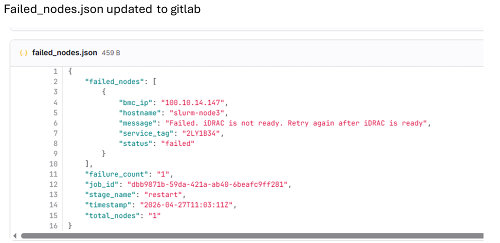

.. _executing-deploy-pipeline:

Step 6: Execute Deploy Pipeline
===============================

Execute the BuildStream deploy pipeline to deploy images to cluster nodes. This procedure covers the three deploy stages: deploy, restart, and validate.

The BuildStream deploy pipeline automates the deployment of built images to target cluster nodes. The pipeline consists of three sequential stages:

* **deploy**: Deploys the built images to the target nodes
* **restart**: Restarts the nodes to load the deployed images
* **validate**: Executes Molecule-based infrastructure tests to verify cluster deployment, network connectivity, and service health

The deploy pipeline is automatically triggered when you update the PXE mapping file (``pxe_mapping_file.csv``) in the GitLab repository, or can be manually initiated through the GitLab interface.

Prerequisites
------------

Before executing the deploy pipeline, ensure the following:

* Build pipeline has completed successfully and images are available
* Target nodes are powered on and accessible via BMC
* PXE mapping file (``pxe_mapping_file.csv``) is correctly configured with target node information
* PXE mapping file is present in the GitLab repository ``input/`` folder for automatic triggering

Procedure
---------

1. Navigate to the GitLab project URL::

    https://<gitlab_host>:<gitlab_https_port>/root/<gitlab_project_name>

2. Trigger the deploy pipeline by updating the ``pxe_mapping_file.csv`` file in the GitLab repository and committing the changes. This pipeline can also be executed manually through the GitLab UI. See :ref:`Execute Deploy Pipeline Manually <manual-deploy-pipeline-retry>` for detailed instructions. 

      .. image:: ../../images/gitlab-deploy-trigger.png
         :alt: GitLab Deploy Trigger

3. In the deploy pipeline, select the image from the ``select_image`` stage and click the "Play" button.

      .. image:: ../../images/gitlab-deploy-select-image.png
         :alt: GitLab Deploy Select Image

4. To deploy the image, click the "Play" button in the ``deploy`` stage.

      .. image:: ../../images/gitlab-deploy-play.png
         :alt: GitLab Deploy Play

5. Monitor the pipeline progress to ensure it completes successfully. See :ref:`Monitor Deploy Pipeline Progress <monitor-deploy-pipeline-progress>` for detailed instructions.

.. _manual-deploy-pipeline-retry:

Execute Deploy Pipeline Manually
--------------------------------

To manually execute the deploy pipeline, follow these steps:

Procedure 
~~~~~~~~~~

#. Review the pipeline logs in GitLab to check the current status.

   a. Navigate to **Deploy** → **Pipelines**.
   
   b. Click on the desired pipeline.
   
   c. Click on the stage to view logs.

#. Update the input parameters in the GitLab repository.

   a. Navigate to the ``input/`` folder in the GitLab repository.
   
   b. Edit the relevant configuration file. For detailed parameter descriptions, see :doc:`../reference/configuration-tables`.
   
   c. Commit and push the changes.

#. Manually trigger the pipeline with the updated parameters.

   a. Navigate to **Deploy** → **Pipelines**.
   
   b. Click **New Pipeline**.
   
   c. In the **Run new pipeline** dialog box, enter the variable name as **PIPELINE_TYPE** and enter the value as **deploy**.

    .. image:: ../../images/gitlab-deploy-manual-config.png
       :alt: GitLab Deploy Manual Configuration

   d. Click **Run Pipeline** to execute the deploy pipeline.

#. Monitor the pipeline progress to ensure it completes successfully.  See :ref:`Monitor Deploy Pipeline Progress <monitor-deploy-pipeline-progress>` for detailed instructions.

   .. image:: ../../images/gitlab-deploy-success.png
      :alt: GitLab Deploy Success

.. note::
   When using manual retry, ensure that only the necessary parameters are updated. Unnecessary changes may cause additional pipeline failures.

For information on handling deploy failures with partial node failures, see :ref:`Handling Deploy Failures <handling-deploy-failures>`. 

.. _monitor-deploy-pipeline-progress:

Monitor Deploy Pipeline Progress
--------------------------------

#. Monitor the deploy pipeline progress through the GitLab web interface:

   a. Click on the running pipeline to view details.
   
   b. Monitor each stage as it progresses:

         - **deploy**: Deploys images to target nodes based on catalog specifications
         - **restart**: Restarts nodes to load the deployed images
         - **validate**: Executes Molecule-based infrastructure tests to verify cluster deployment, network connectivity, and service health

#. Review the stage status indicators:
      - |success| **Green checkmark**: Stage completed successfully
      - |failed| **Red X**: Stage failed (click for error details)
      - |running| **Blue circle**: Stage currently running

      .. |success| image:: ../../images/Icons/green_check.png
      .. |failed| image:: ../../images/Icons/red_x.png
      .. |running| image:: ../../images/Icons/blue_circle.png

#. If any stage fails, review the error logs by clicking on the failed job.

.. note::
   The deploy pipeline uses the PXE mapping file to determine which nodes receive which images based on functional group assignments.

Verification
------------

After the deploy pipeline completes, verify the deployment:

#. Check the overall pipeline status in GitLab to ensure all stages passed.

#. Verify that the target nodes have restarted and are accessible.

#. Log in to a sample of deployed nodes to verify the correct image is loaded.

#. Check the BuildStreaM API for deployment status and image group information.

.. _handling-deploy-failures:

Handling Deploy Failures During Restart Stage (PXE Boot)
--------------------------------------------------------

In the deploy pipeline, when the restart stage encounters partial failures (some nodes PXE booted successfully while others fail), BuildStream provides a ``failed_nodes.json`` mechanism to enable efficient retry operations.

``failed_nodes.json`` is a structured JSON file that tracks which nodes failed to PXE boot during the restart stage. This file enables you to:

* Track failed nodes with detailed error messages
* Manually fix the failed nodes and update their entries as successful.
* Retry only the failed nodes instead of the entire inventory
* Maintain accurate state across pipeline runs

**Sample failed_nodes.json Schema**

.. code-block:: json

   {
     "job_id": "018f3c4b-7b5b-7a9d-b6c4-9f3b4f9b2c10",
     "stage_name": "restart",
     "timestamp": "2026-04-10T16:32:15Z",
     "total_nodes": 5,
     "failure_count": 2,
     "failed_nodes": [
       {
         "bmc_ip": "172.17.107.44",
         "hostname": "slurm-node2",
         "service_tag": "79WWJ93",
         "status": "failed",
         "message": "Failed. iDRAC is not ready. Retry again after iDRAC is ready"
       },
       {
         "bmc_ip": "172.17.107.45",
         "hostname": "slurm-node3",
         "service_tag": "79WWJ94",
         "status": "failed",
         "message": "iDRAC is unreachable. pxe boot might be set. Please check the host reboot status manually"
       }
     ]
   }

Procedure
~~~~~~~~~~

1. During the first run, the restart stage attempts to PXE boot all nodes automatically.

2. If all nodes succeed, the stage is marked successful and proceeds to the validation stage.

3. In case of partial failure, only failed nodes are recorded in ``failed_nodes.json`` in a directory called ``miscellaneous`` in GitLab. The file contains failed node details along with corresponding error messages.

4. Analyze failures and perform corrective actions:

   * Check iDRAC readiness
   * Verify BMC network connectivity
   * Validate PXE boot configuration

5. After resolving issues, retry the restart stage for failed nodes.

6. If automated retry is not feasible (for example, VM or manual dependency), manually PXE boot the affected nodes.

7. After manual boot of the nodes, update the node status as ``success`` in ``failed_nodes.json``. Updated nodes are excluded from further PXE attempts by the pipeline/API and are automatically added to the booted nodes list.

.. image:: ../../images/buildstream_restart_updated_failed_nodes_json.png
   :alt: updated failed_nodes.json example

The restart stage completes successfully only when all nodes are successful (automated or manual). Upon completion, the workflow proceeds to the validation stage.

.. image:: ../../images/buildstream_restart_stage_success.png
   :alt: restart stage success example
   

.. _add_node_scenario:

Adding New Nodes to the Cluster
~~~~~~~~~~~~~~~~~~~~~~~~~~~~~~~

This procedure describes how to deploy images on the new nodes without affecting previously provisioned nodes.

1. Update the ``pxe_mapping`` file with the details of the new nodes to be added in GitLab.

2. Run the deploy pipeline by selecting the image required.

The system will PXE boot only the newly added nodes, without impacting previously successful nodes.

For troubleshooting common pipeline issues, see :doc:`../troubleshooting/common-pipeline-issues`.
