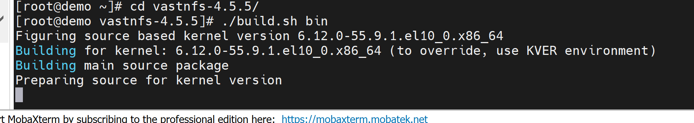
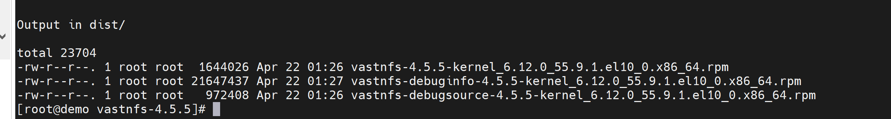
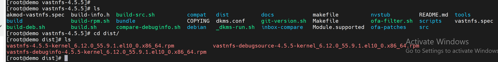
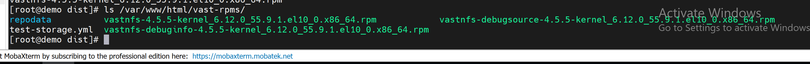

Vast Repo and Vast Client Installation
======================================

This section describes the steps to build the Vast repository and install the Vast client on the cluster nodes.

.. note:: The Vast repository must be hosted on an HTTP server (such as Apache) before it can be used as a user repository in Omnia.

Step 1: Download Vast
---------------------

Download the Vast package using the following command:

.. code-block:: bash

    curl -sSf https://vast-nfs.s3.amazonaws.com/download.sh | bash -s -- --version 4.5.5

.. image:: ../../../images/vastrepo1.png
    :width: 600pt
    :align: center

Step 2: Extract the Package
----------------------------

Extract the downloaded tarball:

.. code-block:: bash

    tar -xf vastnfs-4.5.5.tar.xz vastnfs-4.5.5/

Step 3: Build the Vast Repository
----------------------------------

Navigate to the extracted directory and build the repository:

.. code-block:: bash

    cd vastnfs-4.5.5/
    ./build.sh bin

Once the build is complete, you will see a message indicating that the RPM files have been created and are ready to be hosted as a user repository.

The Vast RPMs will be located in the ``dist/`` directory within ``vastnfs-4.5.5/``.

.. code-block:: text

    ========== Vast repo build completed ==========

Step 4: Host the RPMs on an HTTP Server
----------------------------------------

Host the RPMs on an HTTP server (such as Apache) or any other server that will serve as your user repository.

For example, you can use the OIM as an HTTP server. Follow the steps provided in the documentation for hosting Slurm repositories on the Apache server (refer to `Host the RPMS on the Apache server <https://dell.github.io/omnia/OmniaInstallGuide/RHEL_new/CreateLocalRepo/localrepos.html>`_).

.. image:: ../../../images/vastrepo6.png
    :width: 600pt
    :align: center

.. code-block:: text

    ========== Vast rpms hosted for user_Repo ==========

Step 5: Configure the User Repository in local_repo_config.yml
--------------------------------------------------------------

Add the user repository URL to the ``local_repo_config.yml`` file.

Step 6: Run Omnia Playbooks
----------------------------

Run the following playbooks in order:

1. ``local_repo`` playbook
2. ``build_image`` playbook
3. ``provision`` playbook

The Vast client will be installed on the nodes successfully after the provision playbook completes.
