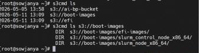

.. _powerscale-s3-config:

Configure PowerScale as S3 Storage
==================================

PowerScale provides scalable, high-performance object storage for the OpenCHAMI image repository. Using PowerScale as S3-compatible storage enables efficient storage and retrieval of boot images across the cluster, with support for HTTP access and robust authentication mechanisms.

This section describes the end-to-end workflow for configuring PowerScale as S3 storage, including enabling the S3 service on PowerScale, obtaining credentials, configuring the ``storage_config.yml`` file, and setting up credentials during the ``prepare_oim`` playbook execution.

.. note::
   * PowerScale cluster must be deployed within the admin subnet and should be accessible from all cluster nodes.
   * Omnia uses HTTP access only when connecting to PowerScale, using the default port 9020.
   * Both S3 and HTTP services are enabled in the S3 bucket configuration.
   * Valid S3 Access Key ID and S3 Secret Access Key for authentication when accessing the PowerScale S3 service.
   * S3 Access Key ID and S3 Secret Access Key are tightly associated with the S3 buckets. You need S3 Access Key ID and S3 Secret Access Key to access the S3 buckets created using the key.

Enable S3 Service on PowerScale
-------------------------------

1. Log in to the PowerScale OneFS web interface.

2. Navigate to **Protocol** → **Object storage (S3)**.

   .. image:: ../../../images/powerscale_s3_enable.png

3. On the **Object Storage (S3)** page, click the **Global Settings** tab.

4. To enable the S3 bucket service, do the following:

   * Select the **Enable S3 service** checkbox.
   * Select the **Enable S3 HTTP** checkbox.

5. Set the HTTP port for S3 (default: 9020).

6. Click **Save** to apply the changes.

Obtain S3 Access ID and Secret Key
----------------------------------

1. Log in to the PowerScale OneFS web interface.

2. Navigate to **Protocol** → **Object storage (S3)**.

3. On the **Object Storage (S3)** page, click the **My Keys** tab.

.. image:: ../../../images/powerscale_s3_my_keys.png

4. On the **Secret key Details** page, click **Create new key**.

5. Note the **Access ID** and **Secret Key** for the S3 user.

   .. warning::
      The S3 access ID and secret key are required during the OIM credential setup process.

   .. warning::
      Ensure to note down the S3 access ID and secret key as they are tightly associated with the S3 buckets. The cluster nodes cannot access the bootimages without these keys. 

Configure storage_config.yml
----------------------------

1. Open the ``storage_config.yml`` file available at ``/opt/omnia/input/project_default``.

2. Update the ``s3_configurations`` section with the following parameters. For detailed instructions on updating the ``storage_config.yml`` file, refer to :doc:`../prepare_oim`. 

   .. code-block:: yaml

      s3_configurations:
        provider: "powerscale"
        endpoint_url: "http://<powerscale-ip>:<port>"

   Replace ``<powerscale-ip>`` with the actual PowerScale IP address and ``<port>`` with the S3 port (default: 9020).

  **Sample:**
   .. code-block:: yaml

      s3_configurations:
        provider: "powerscale"
        endpoint_url: "http://192.168.1.100:9020"

   

3. Save the ``storage_config.yml`` file.

Configure Credentials During Prepare OIM
----------------------------------------

When running the ``prepare_oim`` playbook, you will be prompted for S3 credentials:

1. Run the ``prepare_oim.yml`` playbook as described in :doc:`../prepare_oim`.   

2. When prompted, enter the S3 access ID and secret key obtained from PowerScale.

   .. note::
      * For ``powerscale`` provider, the ``s3_access_id`` is prompted as a conditional mandatory parameter.
      * The ``s3_secret_key`` is always prompted during credential setup.

   .. image:: ../../../images/prepare_oim_s3_credentials.png
   
   .. image:: ../../../images/prepare_oim_access_id.png

Verify S3 Connection
--------------------

To verify that the S3 connection is working after running the ``prepare_oim.yml`` playbook, run the following:

1. On the OIM node, run the following command::

     s3cmd ls

2. Verify that the command lists the S3 buckets created for OpenCHAMI bootimages.

