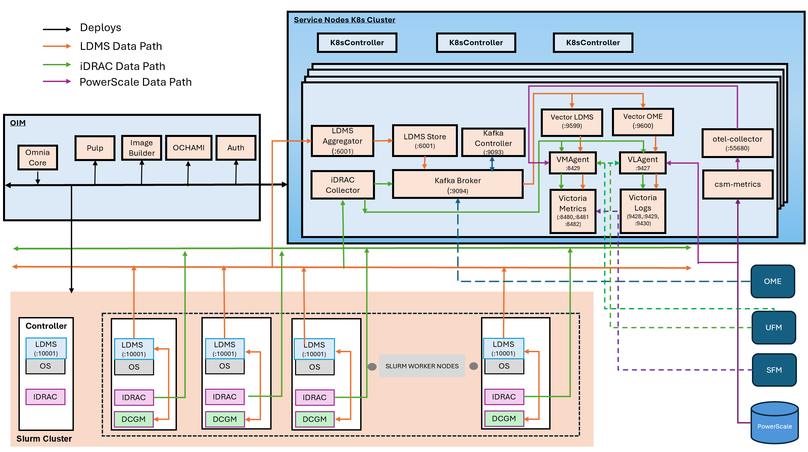

Step 8: Configure Telemetry Requirements
========================================

Omnia supports the following telemetry collection to monitor and manage your HPC infrastructure.

**Core Telemetry**

* **iDRAC Telemetry** collects out-of-band system metrics from Dell servers, including
  power, thermal, and hardware health information. The iDRAC Telemetry data can be collected
  and sent to Kafka and VictoriaMetrics. 
  
* **LDMS Telemetry** collects in-band performance metrics such as CPU, memory,
  network, and I/O statistics from compute nodes. The LDMS Telemetry data can be collected
  and sent to Kafka. To route LDMS telemetry to VictoriaMetrics, enable the Vector Telemetry Pipeline.

* **PowerScale Telemetry** collects the PowerScale Telemetry data and logs and sends them to VictoriaMetrics and VictoriaLogs.

* **DCGM Telemetry** collects NVIDIA GPU metrics including temperature, utilization, memory, ECC errors, and power from compute nodes. The DCGM Telemetry data can be collected and sent to Kafka and VictoriaMetrics.

* **UFM Telemetry** collects NVIDIA UFM InfiniBand Fabric Manager metrics and syslog logs, including IB port state, transmit/receive data, error counters, and fabric topology. The UFM Telemetry data and logs can be collected and sent to VictoriaMetrics and VictoriaLogs, respectively.

**Vector Telemetry Pipeline**

The Vector Telemetry Pipeline provides Kafka-to-Victoria ingestion using Vector for collecting, transforming, and routing telemetry data to VictoriaMetrics and VictoriaLogs:

* **Vector-LDMS** routes LDMS metrics from Kafka to VictoriaMetrics
* **Vector-OpenManage Enterprise** routes OpenManage Enterprise metrics and logs from Kafka to VictoriaMetrics and VictoriaLogs

**External Integrations**

* **OpenManage Enterprise Telemetry** collects metrics and logs from OpenManage Enterprise and sends them to **Kafka**. To route OpenManage Enterprise telemetry to VictoriaMetrics and VictoriaLogs, enable the Vector Telemetry Pipeline. For integration steps, see :doc:`ExternalTelemetry/external_kafka_ome`.

* **SFM Telemetry** collects network telemetry metrics from Smart Fabric Manager and sends them to **VictoriaMetrics**. For integration steps, see :doc:`ExternalTelemetry/external_victoria_sfm`.

.. note::

   To enable any telemetry and log collections (iDRAC, LDMS, PowerScale, DCGM, UFM, or Vector), ensure that the ``service_k8s`` entry is mentioned in the ``software_config.json`` file and the corresponding telemetry source fields are set to ``true`` in the ``telemetry_config.yml`` file. For example, set ``telemetry_sources > idrac > metrics_enabled = true`` to enable iDRAC telemetry, or ``telemetry_sources > powerscale > metrics_enabled = true`` to enable PowerScale telemetry.

Omnia Telemetry Architecture
-----------------------------

Omnia collects telemetry data from HPC cluster nodes using: LDMS for OS-level metrics and iDRAC for hardware telemetry.

The following diagram illustrates the telemetry services that can be deployed using Omnia and the data flow between the components.

  
Telemetry Components
---------------------

The following components are involved in the telmetry services deployed by Omnia:

**OIM (Omnia Infrastructure Manager)**

Central management node that deploys and configures all telemetry services across the cluster.

**Service Kubernetes Cluster**

Hosts telemetry collection and storage services:

- **LDMS Aggregator** – Receives metrics from slurm compute node samplers.
- **LDMS Store** – Stores aggregated LDMS data
- **iDRAC Collector** – Collects hardware telemetry via Redfish API
- **Kafka Broker** – Streams telemetry data
- **VMAgent** – Forwards metrics to Victoria Metrics
- **Victoria Metrics** – Time-series database for metric storage
- **vmstorage-victoria-cluster** – Storage backend for VictoriaMetrics cluster
- **vminsert-victoria-cluster** – Ingestion component for VictoriaMetrics cluster
- **VictoriaLogs Cluster** – Distributed log storage system with vlstorage, vlinsert, vlselect components
- **vlstorage-victoria-logs-cluster** – Storage backend for VictoriaLogs cluster
- **vlinsert-victoria-logs-cluster** – Ingestion component for VictoriaLogs cluster
- **VLAgent** – Platform-managed log collection agent that receives logs from external sources
- **karavi-metrics-powerscale** – Collects PowerScale metrics via Karavi Observability
- **csm-metrics** – Collects PowerScale metrics
- **csi-volume-exporter** – Exports CSI volume metrics
- **otel-collector** – Forwards metrics to Victoria Metrics and Victoria Logs
- **CSI Driver for Dell PowerScale:** – Driver required for communication between PowerScale and service Kubernetes nodes
- **Vector** – High-performance data pipeline tool for collecting, transforming, and routing logs and metrics
- **Vector-LDMS** – Kafka consumer for LDMS metrics, routes to VictoriaMetrics via vmagent-vector
- **Vector-OME** – Kafka consumer for OME telemetry, routes metrics to VictoriaMetrics and logs to VictoriaLogs
- **vmagent-vector** – Dedicated vmagent instance as a write-buffer between Vector pods and vminsert
- **vlagent-vector** – Dedicated VictoriaLogs forwarding agent for log/event data from Vector pods

**Slurm Cluster**

Each slurm compute node runs:

- **LDMS Sampler** – Collects OS metrics (CPU, memory, network, and I/O)
- **iDRAC** – Provides hardware health data (temperature, power, and fans)

iDRAC and LDMS Telemetry Data Flows
------------------------------------

**LDMS Flow (OS Metrics)**

::

   Slurm Compute Nodes (LDMS Sampler) → LDMS Aggregator → LDMS Store → Kafka 

**iDRAC Flow (Hardware Metrics)**

::

   iDRAC (BMC) → iDRAC Collector → Kafka
   iDRAC (BMC) → iDRAC Collector → VMAgent → Victoria Metrics

Vector Telemetry Data Flows
-----------------------------

::

   LDMS Store (store_avro_kafka) → Kafka 'ldms' topic → Vector-LDMS → vmagent-vector → vminsert → VictoriaMetrics
   OME → Kafka '*.inventory', '*.telemetry', '*.health', '*.alerts', '*.auditlogs' topics → Vector-OME → vmagent-vector (metrics) → vminsert → VictoriaMetrics
   OME → Kafka '*.inventory', '*.telemetry', '*.health', '*.alerts', '*.auditlogs' topics → Vector-OME → vlagent-vector (logs) → vlinsert → VictoriaLogs

.. note::
   To list all Kafka topics (including LDMS, iDRAC, and OME topics), run the following command::

   .. code-block:: bash

       curl -s -X GET "http://$KAFKA_LB_IP:8080/topics" | jq '.'

PowerScale Telemetry Data Flows
--------------------------------

::

   PowerScale Nodes → CSM Metrics PowerScale → OTEL Collector → vmagent(shared) → victoria_metric
   PowerScale Nodes forwards syslog →  vlagent → Victoria Logs

.. toctree::
    :maxdepth: 1
    :caption: Telemetry Configuration Topics

    service_cluster_telemetry
    ldms_telemetry
    power_scale_telemetry
    vector_telemetry
    telemetry_storage_configuration
    
