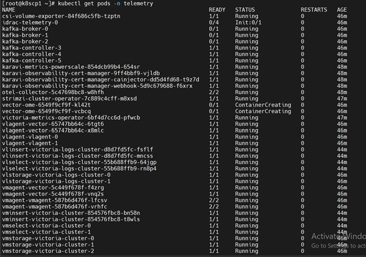
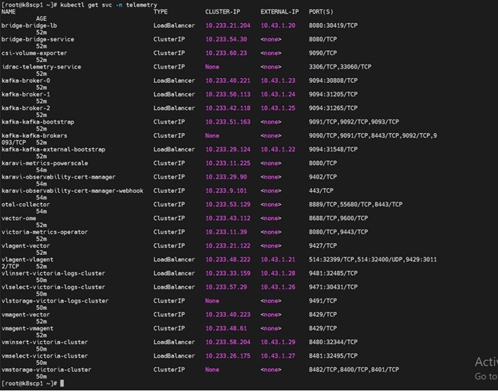

Verify iDRAC Telemetry Flow
============================

This section outlines the steps to verify iDRAC telemetry data flow from Kafka to VictoriaMetrics and VictoriaLogs.

Verify iDRAC Telemetry Messages in Kafka
-----------------------------------------

To verify that iDRAC telemetry data is being successfully published to the ``idrac`` Kafka topic, do the following:

1. Log in to the Service Kubernetes Control plane.

2. Create a Kafka consumer using the following command::

    KAFKA_LB_IP=<external load balancer IP of the bridge-bridge-lb service>
    curl -X POST http://$KAFKA_LB_IP:8080/consumers/idrac-consumer-group \
    -H 'content-type: application/vnd.kafka.v2+json' \
    -d '{
            "name": "idrac-consumer-1",
            "format": "json",
            "auto.offset.reset": "earliest"
        }'

3. Subscribe the consumer to the telemetry topic using the following command::

    curl -X POST http://$KAFKA_LB_IP:8080/consumers/idrac-consumer-group/instances/idrac-consumer-1/subscription \
    -H 'content-type: application/vnd.kafka.v2+json' \
    -d '{"topics": ["idrac"]}'

4. Consume messages from the topic using the following command::

    while true; do curl -X GET http://$KAFKA_LB_IP:8080/consumers/idrac-consumer-group/instances/idrac-consumer-1/records \
    -H 'accept: application/vnd.kafka.json.v2+json' | jq '.' ;  sleep 2; done

If telemetry metrics are collected correctly, the output contains JSON-formatted iDRAC telemetry records.

Verify VictoriaMetrics TLS Connectivity
-------------------------------------

To verify TLS connectivity for VictoriaMetrics, run the VictoriaMetrics TLS test job to
verify that certificates and secure connectivity are functioning correctly::

    cd /<nfs client mount path of the service k8s cluster>/telemetry/deployments/test
    kubectl apply -f victoria-tls-test-job.yaml

After the job completes, check the logs to confirm that the TLS connection is successful::

    kubectl logs victoria-tls-test-xxx -n telemetry    

View Collected iDRAC Telemetry Data using VictoriaMetrics UI (VMUI) - Cluster Mode Deployment
------------------------------------------------------------------------------------------------

After applying the ``telemetry.yml`` configuration using the VictoriaMetrics deployment mode as ``cluster``, 
use the (VMUI) to validate that iDRAC telemetry data is being collected and stored 
successfully in a cluster mode VictoriaMetrics deployment. For more details, see 
`VictoriaMetrics Cluster deployment documentation <https://docs.victoriametrics.com/victoriametrics/cluster-victoriametrics/>`_.

1. Run the following command to verify that the VictoriaMetrics pod is running::

    kubectl get pods -n telemetry -o wide | grep vm

2. Run the following command to verify that the VictoriaMetrics service is running::

    kubectl get service -n telemetry -o wide | grep vm

3. Note the **External IP** and **port number** of the VictoriaMetrics service. The external IP and port number will be used to access the VictoriaMetrics UI (VMUI).

4. Access the VMUI in a web browser using::

    https://<external vmselect loadbalancer IP>:8481/select/0/vmui 

5. Filter and view telemetry metrics using queries in VMUI.
For example, the following query displays detailed PowerEdge metrics for each hardware component::

    {__name__=~"PowerEdge_.*"}

.. image:: ../../../images/victoria_metrics_vmui_cluster.png
