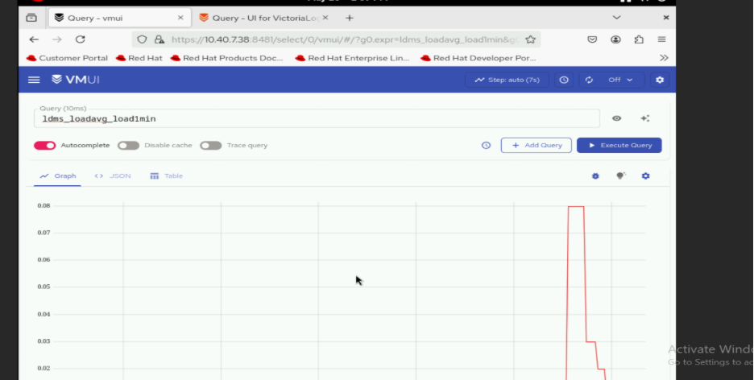

Verify LDMS Telemetry Flow
============================

This section outlines the steps to verify LDMS telemetry data flow from Kafka through Vector to VictoriaMetrics.

.. note::
   If you want to enable any of the telemetry components after making changes in ``telemetry_config.yml`` after the first successful deployment of telemetry and if Kubernetes is already up and running, you will have to execute the ``telemetry.sh`` script on kube-control-plane present at path ``<K8s_NFS_mount_point>/telemetry/telemetry.sh``.

.. _verify_ldms_messages_in_kafka:

Verify LDMS Messages in Kafka
-----------------------------

To verify that LDMS telemetry data is being successfully published to the ``ldms`` Kafka topic, do the following:

1. Log in to the Service Kubernetes Control plane.

2. Set the required variables using the following command::

    KAFKA_LB_IP=<external IP of bridge-bridge-lb service>
    TOPIC=ldms
    GROUP=ldms-consumer-group
    INSTANCE=ldms-consumer-1

3. Create a Kafka consumer using the following command::

    KAFKA_LB_IP=<external load balancer IP of the bridge-bridge-lb service>
    curl -X POST http://$KAFKA_LB_IP:8080/consumers/ldms-consumer-group \
    -H 'content-type: application/vnd.kafka.v2+json' \
    -d '{
            "name": "ldms-consumer-1",
            "format": "json",
            "auto.offset.reset": "latest",
            "enable.auto.commit": true
        }'

3. To view the list of LDMS Kafka topics configured, use the following command::

    curl -s -X GET "http://$KAFKA_LB_IP:8080/topics" | jq '.'

4. Subscribe the consumer to the LDMS topic using the following command::

    curl -X POST http://$KAFKA_LB_IP:8080/consumers/ldms-consumer-group/instances/ldms-consumer-1/subscription \
    -H 'content-type: application/vnd.kafka.v2+json' \ 
    -d '{"topics": ["ldms"]}'

5. Consume messages from the topic using the following command::

    while true; do curl -X GET http://$KAFKA_LB_IP:8080/consumers/ldms-consumer-group/instances/ldms-consumer-1/records \
    -H 'accept: application/vnd.kafka.json.v2+json' | jq '.' ;  sleep 2; done

If telemetry is flowing correctly, the output contains JSON-formatted LDMS telemetry records.

.. note:: When new nodes are added, ensure the nodes are up and cloud-init has completed successfully (check /var/log/cloud-init-output.log on each node). Then, create a new Kafka consumer group with a unique name (e.g., ldms-new-nodes-group) to verify metrics from the newly added nodes. Wait 2-3 minutes after discovery completes before checking.

Verify LDMS Metrics in VictoriaMetrics via Vector
------------------------------------------------

To verify that LDMS telemetry data is being successfully consumed from Kafka by Vector-LDMS and routed to VictoriaMetrics, do the following:

1. Verify that the Vector-LDMS pod is running::

    kubectl get pods -n telemetry -l app=vector-ldms

2. Verify that the vmagent-vector pod is running::

    kubectl get pods -n telemetry -l app=vmagent-vector

3. Verify that the Kafka consumer group is registered::

    kubectl get kafkagroups -n telemetry

4. Verify data flow by checking Vector pod logs::

    kubectl logs -n telemetry <vector-ldms-pod-name> -c vector

5. Verify that metrics are reaching VictoriaMetrics by querying the VMUI or using PromQL queries. For example, the following query displays LDMS-related metrics::

    {__name__=~"ldms_.*"}

   

Verify Kafka TLS Connectivity
-----------------------------

To verify TLS connectivity for Kafka, run the Kafka TLS test job to verify that
certificates, truststores, keystores, and mTLS communication are functioning correctly::

    cd /<nfs client mount path of the service k8s cluster>/telemetry/deployments/test
    kubectl apply -f kafka.tls_test_job.yaml

After the job completes, check the logs to confirm that the TLS connection is successful::

    kubectl logs kafka-tls-test-xxx -n telemetry
