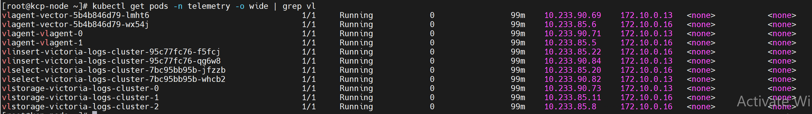
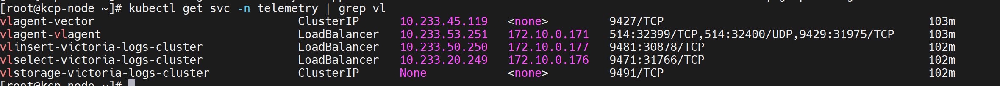

Verify PowerScale Telemetry Flow
=================================

This section outlines the steps to verify PowerScale telemetry data in VictoriaMetrics.

View Collected PowerScale Telemetry Data using VictoriaMetrics UI (VMUI) - Cluster Mode Deployment
------------------------------------------------------------------------------------------------

After applying the ``telemetry.yml`` configuration using the VictoriaMetrics deployment mode as ``cluster``, 
use the (VMUI) to validate that PowerScale telemetry data is being collected and stored 
successfully in a cluster mode VictoriaMetrics deployment. For more details, see 
`VictoriaMetrics Cluster deployment documentation <https://docs.victoriametrics.com/victoriametrics/cluster-victoriametrics/>`_.

1. Run the following command to verify that the VictoriaMetrics pod is running::

    kubectl get pods -n telemetry -o wide | grep vm

.. image:: ../../../images/victoria_metrics_pod_cluster_mode.png

2. Run the following command to verify that the VictoriaMetrics service is running::

    kubectl get service -n telemetry -o wide | grep vm

.. image:: ../../../images/victoria_metrics_service_cluster.png

4. Note the **External IP** and **port number** of the VictoriaMetrics service. The external IP and port number will be used to access the VictoriaMetrics UI (VMUI).

5. Access the VMUI in a web browser using::

    https://<external vmselect loadbalancer IP>:8481/select/0/vmui 

6. Filter and view telemetry metrics using queries in VMUI.
For example, the following query displays detailed PowerScale metrics for each hardware component::

    {__name__=~"powerscale"}

.. image:: ../../../images/powerscale_metrics_vmui_cluster.png

View Collected PowerScale Logs using VictoriaLogs UI - Cluster Mode Deployment
-------------------------------------------------------------------------------

After applying the ``telemetry.yml`` configuration using the VictoriaLogs deployment mode as ``cluster``, 
use the VictoriaLogs UI to validate that PowerScale log data is being collected and stored 
successfully in a cluster mode VictoriaLogs deployment.

1. Run the following command to verify that the VictoriaLogs pods are running::

    kubectl get pods -n telemetry -o wide | grep vl

2. Run the following command to verify that the VictoriaLogs service is running::

    kubectl get service -n telemetry -o wide | grep vl

4. Note the **External IP** and **port number** of the VictoriaLogs service. The external IP and port number will be used to access the VictoriaLogs UI.

5. Access the VictoriaLogs UI in a web browser using::

    https://<external vlselect loadbalancer IP>:9471/select/vmui

6. Filter and view PowerScale logs using queries in VictoriaLogs UI.
For example, use the ``*`` query to display all logs.

.. image:: ../../../images/powerscale_logs_vlui_cluster.png

