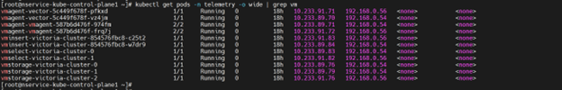
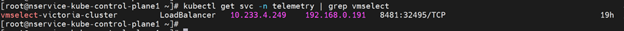

Verify VAST Telemetry Flow
===============================================

This section outlines the steps to verify VAST telemetry data in VictoriaMetrics.

View Collected VAST Telemetry Data using VictoriaMetrics UI (VMUI) - Cluster Mode Deployment
-------------------------------------------------------------------------------------------

After applying the ``telemetry.yml`` configuration using the VictoriaMetrics deployment mode as cluster, use the VictoriaMetrics UI (VMUI) to validate that VAST telemetry data is being collected and stored successfully in a cluster mode VictoriaMetrics deployment. For more details, see `VictoriaMetrics Cluster deployment documentation <https://docs.victoriametrics.com/victoriametrics/cluster-victoriametrics/>`_.

1. Run the following command to verify that the VictoriaMetrics pod is running::

    kubectl get pods -n telemetry -o wide | grep vm

2. Run the following command to verify that the VictoriaMetrics service is running::

    kubectl get service -n telemetry -o wide | grep vm

.. image:: ../../../images/vast_telemetry_2.png
.. image:: ../../../images/vast_telemetry_3.png

3. Run the following command to verify VMagent logs for VAST scraping to view recent logs::

    VMAGENT_POD=$(kubectl get pods -n telemetry -l app.kubernetes.io/name=vmagent -o jsonpath='{.items[0].metadata.name}')
    kubectl logs $VMAGENT_POD -n telemetry -c vmagent --tail=10

.. image:: ../../../images/vast_telemetry_4.png

4. Note the **External IP** and **port number** of the VictoriaMetrics service. The external IP and port number will be used to access the VictoriaMetrics UI (VMUI)::

    kubectl get svc -n telemetry | grep vmselect

5. Access the VMUI in a web browser using::

    https://<external vmselect loadbalancer IP>:8481/select/0/vmui

.. image:: ../../../images/vast_telemetry_7.png

Key VAST Metrics
----------------

.. csv-table:: Key VAST Metrics
   :file: ../../../Tables/vast_metrics.csv
   :header-rows: 1
   :widths: 40, 40, 20
   :keepspace:

View VAST Logs using VictoriaLogs
----------------------------------

1. Configure the VLAgent LoadBalancer IP address for syslog delivery. Retrieve the VLAgent LoadBalancer IP and configure it on the VAST appliance by following the steps outlined in the prerequisites section above::

    kubectl get svc -n telemetry | grep -E "(vlagent|victoria-logs)"

.. image:: ../../../images/view_vast_logs_1.png

2. Retrieve the external IP and port of the vlselect service::

    kubectl get svc -n telemetry | grep vlselect

.. image:: ../../../images/view_vast_logs_3.png

3. Access the VictoriaLogs UI in a web browser using::

    https://<external vlselect loadbalancer IP>:9471/select/vmui

.. image:: ../../../images/view_vast_logs_4.png

