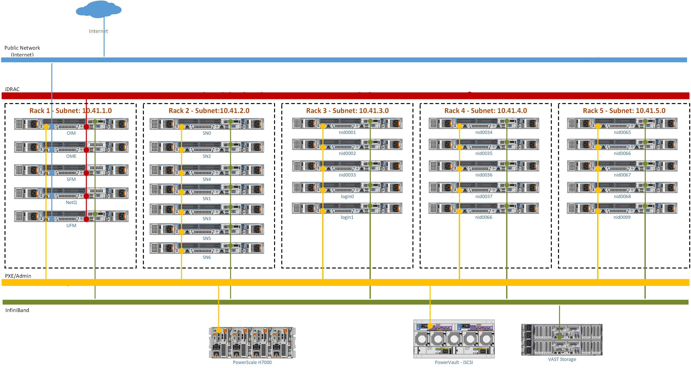

Network Topology: Multi-Rack Multi-Subnet Setup
==============================================

.. note:: The following diagram is for representational purposes only.

In a **Multi-Rack Multi-Subnet Setup**, each rack has its own /24 subnet for the Admin (PXE) network. This architecture allows large-scale HPC and AI/ML deployments to have per-rack management subnets instead of a single shared subnet, improving scalability, failure isolation, and operational efficiency.

* **Public Network (Blue line)**: This indicates the external public network that is connected to the internet. NIC2 of the OIM, Service cluster nodes, Head node, Service Kubernetes node, and Login node [optional] are connected to the public network.

* **BMC Network (Red line)**: This indicates the private BMC (iDRAC) network used by the OIM to control the cluster nodes using out-of-band management.

* **Admin Network (Green line)**: This indicates the admin network used by Omnia to provision the cluster nodes. NIC1 of all the nodes are connected to the private switch. In this topology, each rack has its own /24 subnet for the Admin network, and DHCP relay agents on Top-of-Rack (ToR) switches forward DHCP requests to the CoreDHCP server.

* **Infiniband Network (Yellow Line)**: This indicates the high-speed InfiniBand network used for high throughput inter-node communication in the cluster.

.. note:: Omnia supports classless IP addressing, which allows the Admin network, BMC network, Public network, and the Additional network to be assigned different subnets.

**Recommended discovery mechanism**

* `Discovery Mechanisms <../../OmniaInstallGuide/RHEL_new/Provision/discover_mechanism_mappingfile.html>`_ (OME-based BMC Discovery is recommended)

.. note:: For detailed configuration instructions, see :doc:`../../OmniaInstallGuide/AdvancedConfigurations/multi-subnet-dhcp/index`.
