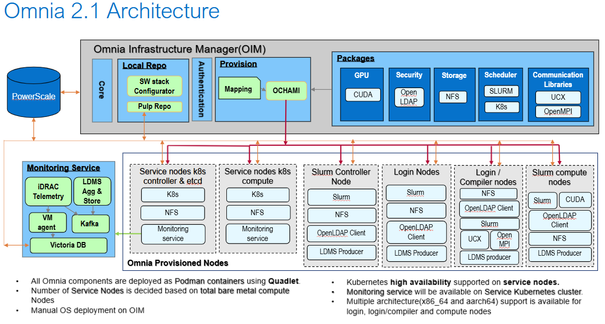

Architecture
===============

Omnia provides a comprehensive infrastructure management platform that orchestrates the deployment, configuration, and monitoring of HPC clusters. The architecture centers around the Omnia Infrastructure Manager (OIM), which serves as the central control plane for managing all cluster operations.

**OIM Role and Responsibilities**

The OIM is the primary management node that coordinates all cluster activities:

* **Provisioning**: Manages the Bare System Setup (BSS) and cloud-init configurations to provision nodes from bare metal
* **Package Deployment**: Handles software distribution and configuration management across the cluster
* **Monitoring**: Collects and aggregates metrics, logs, and telemetry data from all cluster components
* **Orchestration**: Coordinates workflows for cluster operations including upgrades, scaling, and maintenance

**Node Relationships**

The OIM maintains a hierarchical relationship with provisioned nodes:
* **Service Cluster**: Kubernetes-based control plane running core services (monitoring, telemetry, scheduling)
* **Compute Nodes**: Slurm-managed workload execution nodes
* **Login Nodes**: User access points for job submission and cluster interaction
* **Storage Nodes**: Dedicated nodes for shared storage and data management

All nodes communicate with the OIM through secure channels for configuration updates, health checks, and status reporting. The OIM maintains the authoritative source of truth for cluster state and configuration.

**Component Integration**

The architecture integrates three primary subsystems:

1. **Monitoring Service**: Collects metrics and logs from all cluster components using VictoriaMetrics and VictoriaLogs for time-series data storage and analysis
2. **Provisioning System**: Automates node provisioning through BSS and cloud-init, ensuring consistent configuration across the cluster
3. **Package Management**: Deploys and manages software packages using local repositories and build pipelines

These subsystems work together through the OIM's orchestration layer to provide a unified, automated infrastructure management experience.

**Monitoring Service Component Legend**

The Monitoring Service block in the architecture diagram uses the following VictoriaMetrics components:

* **VictoriaMetrics / VictoriaLogs Agent (vmagent / vlagent)**: Collects metrics and logs from cluster components
* **VictoriaMetrics Insert (vminsert)**: Ingests time-series data into the VictoriaMetrics database
* **VictoriaMetrics Database (vmstorage + vmselect)**: Stores and queries metrics and log data