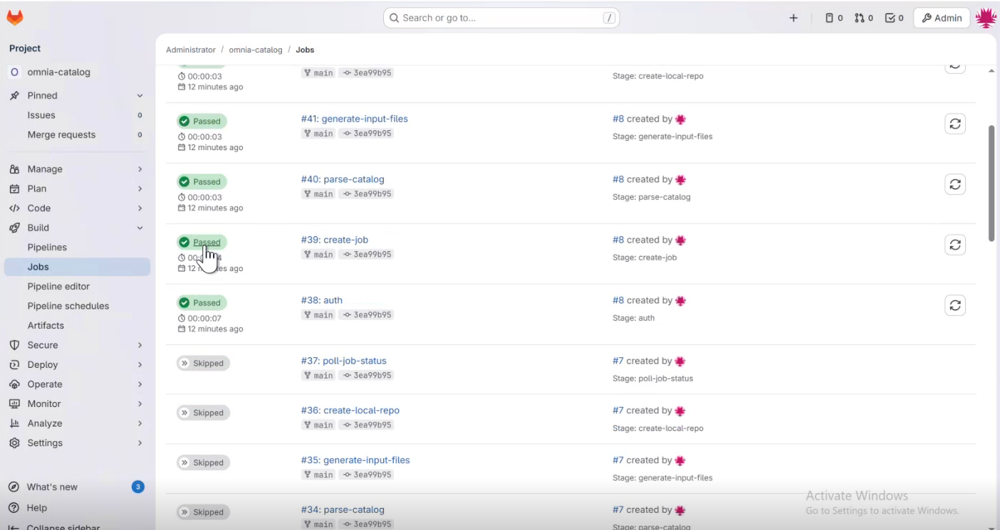

.. _how-to-buildstream-update-catalog-pipeline:

Step 5: Update Catalog and Execute Omnia BuildStreaM Pipeline
====================================================

Update the ``catalog_rhel.json`` file and monitor pipeline execution through GitLab. This procedure covers catalog modifications, automatic pipeline triggering, and verification of pipeline status and job execution.

Prerequisites
-------------

Before updating catalogs and checking pipelines:

* Deploy and Configure BuildStreaM Container on OIM Node (see :doc:`how-to-prepare-buildstream`)
* GitLab deployment for BuildStreaM is completed (see :doc:`how-to-gitlab-deployment`)
* Confirm that you can access GitLab project repository

Procedure
---------

1. Go to the GitLab project URL::

    https://<gitlab host ip>/<gitlap project name>

2. Go to **Code** → **Repository**.
3. Locate the catalog file ``catalog_rhel.json``.
4. Modify the ``catalog_rhel.json`` file to define your build requirements.
5. To trigger the pipeline, commit and push catalog changes.
6. Perform the following steps to track the pipeline progress through the GitLab web interface:

      1. Navigate to **Build** → **Pipeline**

      .. image:: ../images/buildstream_pipeline_status.png

      2. Click on the running pipeline to view details.
      3. Monitor each stage as it progresses:
            - **parse-catalog** - Parses the catalog file for build requirements.
            - **generate-input-files** - Creates build inputs
            - **create-local-repositories** - Creates image repository in the local pulp repository.
            - **build-image** - Builds the images
            - **deploy-image** - Deploys the images to the local pulp repository.     

   Expected pipeline status indicators:
      - **Green checkmark**: Stage completed successfully
      - **Red X**: Stage failed (click for error details)
      - **Blue circle**: Stage currently running

Verification
------------

After the pipeline is completed, you can check the overall pipeline status and job execution.

1. Navigate to **Build** → **Pipelines**
2. Review the job list and status
3. Click on individual jobs to view:
   - Execution logs
   - Resource usage
   - Error messages (if any)

Next Steps
-----------

After successful execution of the pipeline, set the PXE boot order for the nodes and then run the ``set_pxe_boot.yml`` playbook to configure the boot settings. See :doc:`set_pxe_boot_order_buildstream` for detailed instructions.

