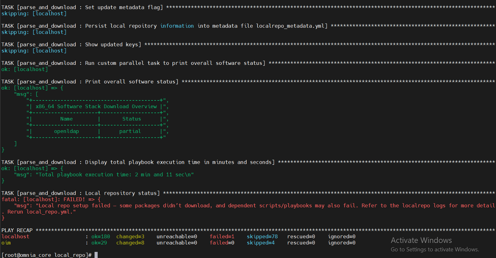
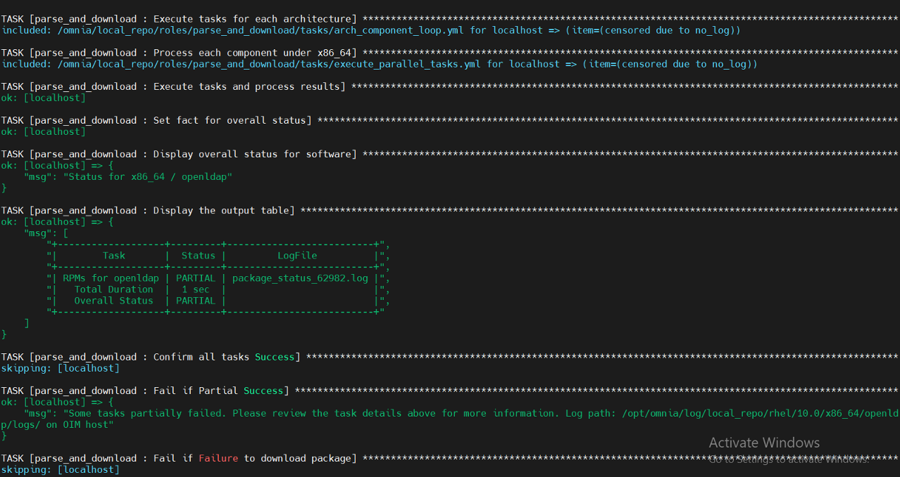
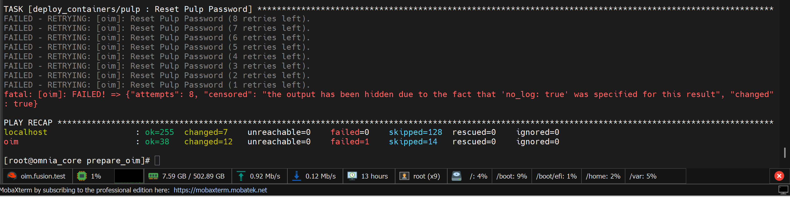
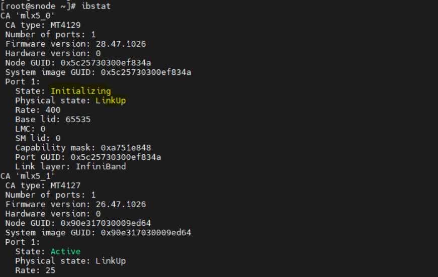

============================
Troubleshooting Guide
============================

A structured guide for diagnosing and resolving issues across Omnia deployment, provisioning, Kubernetes, Slurm, storage, authentication, and telemetry workflows.

.. rubric:: Key Log Locations

When troubleshooting issues, consult the following log files:

**Playbook Logs**

- ``/opt/omnia/log/`` - Main playbook execution logs
- ``/var/log/ansible/`` - Ansible playbook logs

**Container Logs**

- ``podman logs <container>`` - View container logs
- ``podman logs -n 200 <container>`` - View last 200 lines

**Kubernetes Logs**

- ``kubectl logs -n <namespace> <pod>`` - View Kubernetes pod logs
- ``kubectl logs -f -n <namespace> <pod>`` - Follow logs in real-time

**Slurm Logs**

- ``/var/log/slurm/`` - Slurm controller and daemon logs
- ``/var/spool/slurm/`` - Slurm accounting and job logs

For comprehensive logging information, see `Logs <Logging/OIM_logs.html>`_.

.. contents::
   :depth: 2
   :local:

1. Core Container & OIM Issues
===============================

1.1 Omnia Core Container Fails to Deploy
---------------------------------------

**Symptoms**

- ``omnia.sh`` aborts early
- ``podman pull`` fails
- Container starts but cannot write to shared path

**Causes**

- Podman pull/auth issues
- Time synchronization failure
- Invalid OIM hostname
- NFS/SELinux permission issues

**Resolution**

Check container status: ::

        podman ps --format 'table {{.Names}}\t{{.Status}}'

Check logs: ::

        podman logs -n 200 omnia_core

Check time synchronization:

.. code-block:: bash

   timedatectl status
   chronyc tracking || chronyc sources -v

Validate OIM hostname (no dots, underscores, commas, uppercase, leading/trailing hyphens, or leading digits; FQDN ≤64 chars).

Validate NFS mount and SELinux labeling:

.. code-block:: bash

   podman run --rm -v /shared:/mnt:z registry.access.redhat.com/ubi10/ubi sh -lc 'touch /mnt/.rw'

Re-run ``omnia.sh``.

1.2 Prepare OIM Failures
------------------------

**Symptoms**

- Certificate or TLS failures
- Expected container not created
- Service is running but unreachable

**Cause**

- Invalid or expired TLS certificates
- Container image pull failures
- Network connectivity issues
- Incorrect configuration parameters

**Resolution**

Verify container inventory:

.. code-block:: bash

   podman ps --format 'table {{.Names}}\t{{.Image}}\t{{.Status}}'

For common container debugging commands, see `Container Debugging Tools <../Utils/container_debugging_tools.html>`_.

1.3 Ansible Vault Decryption Failures
------------------------------------

**Symptom**

Playbook execution fails with error message "Attempting to decrypt but no vault secrets found" or similar vault decryption errors.

**Cause**

The vault password file (``.omnia_config_credentials_key``) is missing, incorrect, or inaccessible to the playbook execution context.

**Resolution**

1. Verify the vault password file exists in the correct location: ``.omnia_config_credentials_key``
2. Ensure the file has the correct permissions (readable by the user running the playbook)
3. Re-run the playbook with the correct vault password file

For information on managing encrypted parameters, see `Encrypted Parameters Management <../SecurityConfigGuide/MiscellaneousConfigurationManagementElements.html#encrypted-parameters-management>`_.

1.4 OIM Cleanup NFS Directory Deletion Failure
-----------------------------------------------

**Symptoms**

- ``oim_cleanup.yml`` playbook fails with error: ``[ERROR]: Task failed: Module failed: rmtree failed: [Errno 39] Directory not empty``
- Specific error on directories like ``/share_omnia_k8s/<node_ip>/kubelet/pods``
- Cleanup process completes partially but leaves NFS share directories intact

**Example Error**

.. code-block:: text

   [ERROR]: Task failed: Module failed: rmtree failed: [Errno 39] Directory not empty: '/share_omnia_k8s/10.20.0.15/kubelet/pods'

   failed: [oim] (item=/share_omnia_k8s/10.20.0.15) => {
     "ansible_loop_var": "item",
     "changed": false,
     "item": "/share_omnia_k8s/10.20.0.15",
     "msg": "rmtree failed: [Errno 39] Directory not empty: '/share_omnia_k8s/10.20.0.15/kubelet/pods'"
   }

**Cause**

- Active processes - Kubernetes processes (kubelet, crio) on compute nodes or OIM node have open file handles to the NFS share directories
- Active NFS mounts - NFS shares are still mounted and in use on compute nodes

.. note::
   The OIM cleanup process cleans the contents of NFS shares for both Slurm and Kubernetes (K8s). Active processes or mounts may prevent successful cleanup.

**Resolution**

**Step 1: Manually delete the problematic directories on the OIM node**

Log in to the OIM node and navigate to the NFS share path to manually delete the contents:

.. code-block:: bash

   # On the OIM node
   # Navigate to the problematic directory
   cd /share_omnia_k8s/<node_ip>/kubelet/pods

   # Delete all contents
   rm -rf *

   # Or delete the entire node directory
   cd /share_omnia_k8s/
   rm -rf <node_ip>

**Step 2: Re-run the OIM cleanup playbook from the omnia_core container**

After manually deleting the problematic directories, log in to the omnia_core container and re-run the cleanup playbook:

.. code-block:: bash

   # Log in to omnia_core container
   ssh omnia_core

   # Navigate to utils directory
   cd /omnia/utils

   # Re-run the cleanup playbook
   ansible-playbook oim_cleanup.yml

.. tip::
   If manual deletion also fails with "Directory not empty" or "Device or resource busy" errors, the directories are still in use by active processes. In such cases, power off the compute nodes before attempting manual cleanup.

2. PXE Boot & Provisioning Issues
=================================

2.1 Node Hangs at nm-wait-online-initrd.service
-----------------------------------------------

**Symptom**

Node hangs during boot at the ``nm-wait-online-initrd.service`` stage.

**Cause**

IP address conflict with old node.

**Resolution**

- Ensure old node is powered off/disconnected
- Verify IP address is unused
- Re-run ``provision.yml``

2.2 PXE Boot Timeout (TFTP/Service Timeout)
--------------------------------------------

**Symptom**

PXE boot process times out with TFTP or service timeout errors.

**Cause**

- PXE NIC not configured
- Extra NIC interfering
- Multiple PXE servers

**Resolution**

- Configure BIOS → Network Settings → PXE Device
- Assign correct active NIC
- Remove/add NIC only after boot completion

2.3 Target Server Unreachable After PXE Boot
----------------------------------------------

**Symptom**

Target server becomes unreachable after PXE boot completes.

**Cause**

- POST errors
- F1 hardware prompts
- Boot stalls

**Resolution**

- Log in to iDRAC
- Clear errors or disable POST
- Hard reboot
- Disable PXE temporarily if needed

2.4 Root Login Fails
--------------------

**Symptom**

Unable to log in as root user via SSH. Error messages include:

- ``WARNING: REMOTE HOST IDENTIFICATION HAS CHANGED!``
- ``Permission denied (publickey,gssapi-keyex,gssapi-with-mic)``
- ``ssh: connect to host <ip> port 22: Connection refused``

**Cause**

- Outdated SSH key
- cloud-init not rendered

**Resolution**

.. code-block:: bash

   ssh-keygen -R <hostname>

Retry login or reprovision the node.

3. Local Repository & Pulp Issues
=================================

3.1 local_repo.yml Download Failures
-------------------------------------

**Symptom**

The ``local_repo.yml`` playbook fails during package download, displaying errors such as "TASK [parse_and_download : Display Failed Packages]" or indicating that specific software packages could not be downloaded.

**Cause**

Download failures occur due to:

- Incorrect URLs in software JSON configuration files
- Docker pull limit reached or invalid Docker credentials
- Insufficient disk space on Pulp NFS storage
- Unreachable software repositories

**Resolution**

1. Verify and correct URLs in the software JSON configuration files
2. Provide valid Docker credentials in ``input/omnia_config_credentials.yml``
3. Ensure adequate disk space is available on Pulp NFS storage
4. Re-run the ``local_repo.yml`` playbook

**Detailed Log Analysis**

The ``local_repo.yml`` playbook generates log files for troubleshooting download failures. To diagnose specific issues:

1. View overall download status of all software:

   ::

       /opt/omnia/log/local_repo/<cluster_os>/<cluster_os_version>/<arch>/software.csv

   Example:

   ::

       /opt/omnia/log/local_repo/rhel/10.0/x86_64/software.csv

   .. image:: images/troubleshooting_local_repo_updated_2.png

2. View download status and log filenames for a specific software:

   ::

       /opt/omnia/log/local_repo/rhel/10.0/x86_64/<sw>_task_results.log

   Example for OpenLDAP:

   ::

       /opt/omnia/log/local_repo/rhel/10.0/x86_64/openldap_task_results.log

   .. image:: images/troubleshooting_local_repo_updated_3.png

3. View package-level status for a specific software:

   ::

       /opt/omnia/log/local_repo/<cluster_os>/<cluster_os_version>/<arch>/<sw>/status.csv

   Example:

   ::

       /opt/omnia/log/local_repo/rhel/10.0/x86_64/openldap/status.csv

   .. image:: images/troubleshooting_local_repo_updated_4.png

4. View detailed failure information in the package status log:

   To view the issues information and the reason for job being unsuccessful, see the ``package_status_<pid>.log`` file mentioned in the ``<sw>_task_result.log``.

   Example:

   ::

       /opt/omnia/log/local_repo/rhel/10.0/x86_64/openldap/logs/package_status_858667.log

   .. image:: images/troubleshooting_local_repo_updated_5.png

If the ``local_repo.yml`` is executed successfully without any package download failures, a ``Successful`` message is displayed.

.. image:: images/local_repo_success.png

3.2 Failure When Re-run Multiple Times
--------------------------------------

**Symptom**

The ``local_repo.yml`` playbook fails when re-run multiple times in quick succession.

**Cause**

Pulp container resource saturation.

**Resolution**

Allow the system to idle ~1 hour before re-running.

3.3 Pulp Reset Password Failed
--------------------------------

**Symptom**

Pulp reset password operation fails during ``prepare_oim.yml`` execution.

**Cause**

- NFS Storage Export Configuration (PowerScale): Missing or incorrect settings for ``nfsv4-no-names``, ``nfsv4-no-domain``, ``nfsv4-no-domain-uids``, and ``nfsv4-allow-numeric-ids``
- Inconsistent UID and GID mappings between NFS server and client
- Access Permissions: Missing ``no_root_squash`` option in NFS export configuration
- Network Reachability: NFS server connectivity issues or firewall blocking ports 2049, 111, and 20048

**Resolution**

Verify the configurations and settings mentioned above, then rerun the ``prepare_oim.yml`` playbook. For PowerScale-specific configuration details, see the PowerScale configuration page in the `Omnia Deployment Requirements <https://omnia.readthedocs.io/en/v2.2.0.0-rc1/RHEL_prereq.html>`_ documentation.

3.4 EPEL Repository Instability
-------------------------------

**Symptom**

EPEL repository is unstable or unavailable during package installation.

**Cause**

EPEL repository server issues or network connectivity problems.

**Resolution**

- If no packages depend on EPEL → remove EPEL URL
- If required → wait for stability or host EPEL packages locally

3.5 Intermittent Local Repository sync failure due to non-persistent iptables rules on OIM
-------------------------------------------------------------------------------------------

**Symptom**

Local repository sync fails intermittently due to blocked outbound internet access from containers.

**Cause**

iptables rules on the OIM node are not persistent. After OIM startup, restrictive iptables policies block outbound internet access from containers.

**Resolution**

As a workaround to unblock repository synchronization, run the following commands to relax iptables default policies on the OIM node:

.. code-block:: json

   iptables -P INPUT ACCEPT
   iptables -P FORWARD ACCEPT
   iptables -P OUTPUT ACCEPT

4. Kubernetes Cluster & Pod Issues
==================================

4.1 ImagePullBackOff / ErrImagePull
------------------------------------

**Causes**

- Docker rate limits
- Local repo missing images

**Resolution**

- Add Docker Credentials to ``omnia_config_credentials.yml``
- Ensure ``local_repo.yml`` succeeded

For more information, `click here <https://kubernetes.io/docs/tasks/configure-pod-container/pull-image-private-registry>`_

4.2 Pods Not in Running State
-----------------------------

**Symptom**

Pods are not in Running state. Status values observed include:

- ``Pending``
- ``CrashLoopBackOff``
- ``ImagePullBackOff``
- ``OOMKilled`` (from ``kubectl describe pod`` Events section)

**Cause**

Pod startup failures due to various issues including resource constraints, image pull failures, or application errors.

**Resolution**

.. code-block:: bash

   kubectl get pods --all-namespaces
   kubectl delete pod <pod-name>

4.3 Cluster Nodes Reboot
-------------------------

**Symptom**

Cluster nodes reboot unexpectedly or require reboot after configuration changes.

**Cause**

- Configuration changes requiring node restart
- Kernel updates
- System instability

**Resolution**

Wait 15 minutes
Verify:

.. code-block:: bash

   kubectl get nodes
   kubectl cluster-info

4.4 DNS Unresponsive / CoreDNS Issues
-------------------------------------

**Symptom**

DNS resolution fails or CoreDNS is unresponsive in the cluster.

**Cause**

- CoreDNS pod not running
- DNS configuration errors
- Network connectivity issues

**Resolution**

Restart CoreDNS:

.. code-block:: bash

   kubectl rollout restart deployment coredns -n kube-system

4.5 PowerScale SmartConnect DNS Resolution Issues
-------------------------------------------------

**Symptom**

DNS resolution fails for PowerScale SmartConnect zone entries.

**Cause**

CoreDNS unaware of external SmartConnect zone.

**Resolution**

Edit ConfigMap:

.. code-block:: bash

   kubectl -n kube-system edit configmap coredns

Add a hosts block: ::

        hosts {
        10.x.x.x management.ps.com
        fallthrough
        }

Restart CoreDNS.

4.6 Control-plane Join Fails Due to Certificate Key Expiry
---------------------------------------------------------

**Symptom**

Control-plane node fails to join the cluster due to certificate key expiry.

**Cause**

kubeadm certificate key expires (~2 hours).

**Resolution**

On a healthy control-plane:

.. code-block:: bash

   {{ k8s_client_mount_path }}/generate-control-plane-join.sh

Reboot the failed node.

4.7 Static Pods Show Stale "Running" State After Node Shutdown or Reboot
------------------------------------------------------------------------

**Symptoms**

After a control plane node is powered off, shut down, or rebooted (using ``systemctl poweroff``, ``poweroff``, or ``systemctl reboot``), static pods on the affected node **may intermittently** show:

- Pod STATUS column: ``1/1 Running`` (appears healthy)
- Pod Phase: ``Running`` (incorrect - should be ``Failed``)
- Pod Ready Condition: ``True`` or ``False`` (varies)
- Container State: ``running`` (stale/incorrect - should be ``terminated``)

This is most commonly observed with ``kube-apiserver`` pods, but can affect all static pods (``etcd``, ``kube-controller-manager``, ``kube-scheduler``, ``kube-vip``).

.. note::
   This is an **intermittent issue** caused by a race condition. The behavior varies depending on timing - sometimes all pods show correct "Failed/Terminated" status, sometimes only certain pods (especially ``kube-apiserver``) show stale "Running" status, and sometimes all pods show stale status. This inconsistency is expected and depends on shutdown timing, network conditions, and system load.

**Example**

.. code-block:: bash

   kubectl get pods -n kube-system | grep 172.10.5.16
   # Output shows:
   etcd-172.10.5.16                         1/1     Running   3      4h27m
   kube-apiserver-172.10.5.16               1/1     Running   3      4h27m
   kube-controller-manager-172.10.5.16      1/1     Running   3      4h26m
   kube-scheduler-172.10.5.16               1/1     Running   3      4h27m

   kubectl get node 172.10.5.16
   # Output shows:
   NAME          STATUS     ROLES           AGE     VERSION
   172.10.5.16   NotReady   control-plane   4h27m   v1.35.1

**Causes**

This is a known Kubernetes limitation with graceful node shutdown. During shutdown:

1. All critical pods receive SIGTERM simultaneously
2. Kubelet attempts to update pod status to the API server
3. Race condition occurs:

   - Fast-exiting pods (``kube-controller-manager``, ``kube-scheduler``) terminate quickly and status is updated successfully
   - ``kube-apiserver`` takes longer to shutdown (handling final requests)
   - ``kube-vip`` releases the VIP before ``kube-apiserver`` fully terminates
   - When kubelet tries to update ``kube-apiserver`` container status, the API server is unreachable (VIP down or network unavailable)
   - Container state remains stale as "running"

**Root Cause**: Circular dependency - kubelet needs the API server to update the API server's own status.

**Impact**

- **No functional impact** on cluster operations
- Pod-level status may show correct Phase (``Failed``) and Ready (``False``)
- Only container-level state remains stale
- Cluster continues to operate normally with remaining control planes
- Pods are properly garbage collected based on ``--terminated-pod-gc-threshold`` setting

**Resolution**

This behavior is expected and does not require action. The cluster continues to operate normally with the remaining control planes. When the node powers back on, pods restart automatically with incremented restart count.

**Related Kubernetes Issues**

This is a known Kubernetes issue tracked upstream:

- `Issue #110755: Kubelet doesn't finish killing pods before shutdown <https://github.com/kubernetes/kubernetes/issues/110755>`_
- `Issue #124448: GracefulNodeShutdown fails to update Pod status for system critical pods <https://github.com/kubernetes/kubernetes/issues/124448>`_
- `Issue #109531: Pods in Running/Terminating state after shutdownGracePeriod expiry <https://github.com/kubernetes/kubernetes/issues/109531>`_

**Official Kubernetes Documentation**

- `Kubernetes Node Shutdowns <https://kubernetes.io/docs/concepts/cluster-administration/node-shutdown/>`_
- `Kubelet Configuration Reference <https://kubernetes.io/docs/reference/config-api/kubelet-config.v1beta1/>`_

5. Storage & NFS Issues
=======================

5.1 NFS-Client Provisioner CrashLoopBackOff
--------------------------------------------

**Symptom**

NFS-Client provisioner pod enters CrashLoopBackOff state.

**Cause**

NFS server not active at ``server_share_path``.

**Resolution**

Ensure NFS server is active and reachable.

5.2 PowerScale CSI Controller Issues
-------------------------------------

**Symptoms**

PowerScale (Isilon) CSI controller pod in CrashLoopBackOff after node reboot.

.. image:: images/troubleshoot_powerscale_1.png

.. image:: images/troubleshoot_powerscale.jpg

**Cause**

- CSI controller fails to reconnect to PowerScale storage after node reboot
- Storage connectivity issues or configuration problems
- PowerScale (Isilon) service unavailability

**Resolution**

1. Inspect recent logs from the controller deployment: ::

        kubectl logs deploy/isilon-controller -n isilon --all-containers=true | tail -n 60

2. Restart the Isilon controller deployment: ::

        kubectl rollout restart deployment isilon-controller -n isilon

3. Restart the Isilon node daemonset: ::

        kubectl rollout restart daemonset isilon-node -n isilon

5.3 Missing PowerScale CSI Driver
----------------------------------

**Symptom**

PowerScale CSI driver is not deployed or available in the cluster.

**Cause**

Driver not listed in ``software_config.json``.

**Required Entry**

.. code-block:: json

   {
     "name": "csi_driver_powerscale",
     "version": "v2.17.0",
     "arch": ["x86_64"]
   }

For more information on deploying the Dell CSI-PowerScale driver, see `Deploy CSI drivers for Dell PowerScale Storage Solutions <../OmniaInstallGuide/AdvancedConfigurations/PowerScale_CSI.html>`_

**Resolution**

Add the required entry to ``software_config.json`` and re-run the playbook.

For troubleshooting Kafka issues related to the missing CSI driver, see `Section 7.1 <https://omnia-devel.readthedocs.io/en/latest/troubleshootingguide.html#kafka-pods-crashloopbackoff>`_.

6. Slurm Issues
===============

6.1 Nodes Entering DRAINED State
--------------------------------

**Symptom**

Slurm nodes enter DRAINED state unexpectedly. Error messages include:

- ``State=IDLE+DRAIN Reason=Kill task failed``
- ``State=DOWN+DRAIN Reason=Not responding``

**Cause**

Epilog script not executable.

**Resolution**

.. code-block:: bash

   chmod 0755 /etc/slurm/epilog.d/logout_user.sh
   scontrol reconfigure

6.2 NVIDIA GPU, CUDA, and DCGM Issues
--------------------------------------

``nvidia-smi`` Not Found or Driver Not Communicating

**Symptom**

``nvidia-smi: command not found`` or ``nvidia-smi`` exits with a non-zero return code

**Cause**

NVIDIA driver installation failed during provisioning, or GPU hardware is absent on this node

**Resolution**

Verify GPU hardware is present on the node. If confirmed present, re-install the driver: ::

    dnf install -y cuda-drivers

Review ``/var/log/nvidia_install.log`` for error details.

CUDA Toolkit Not Available on Node (``nvcc`` Not Found)

**Symptom**

``nvcc: command not found`` or ``/usr/local/cuda`` is empty

**Probable cause 1**

Toolkit installation did not complete on the designated installer node due to a repository or NFS error

**Probable cause 2**

NFS mount for the CUDA toolkit was not established at provisioning time

**Resolution**

Verify the NFS mount at ``/usr/local/cuda`` is present: ::

    mount | grep cuda

If absent, re-mount manually. If the toolkit is not installed on the NFS share, review ``/var/log/cuda_toolkit_install.log`` on the installer node.

CUDA Toolkit NFS Mount Failed

**Symptom**

``/usr/local/cuda`` is empty or not mounted after provisioning

**Cause**

NFS server was unreachable at provisioning time, or the NFS export is not configured with ``no_root_squash``

**Resolution**

Verify NFS server reachability from the node. Verify the NFS export includes ``no_root_squash``. Re-mount manually: ::

    mount -t nfs <NFS_SERVER>:<path>/hpc_tools/cuda /usr/local/cuda

Verify the ``fstab`` entry is present for persistence.

``nvidia-dcgm`` Service Inactive or Failed

**Symptom**

``systemctl status nvidia-dcgm`` shows ``inactive`` or ``failed`` state

**Probable cause 1**

DCGM package installation failed due to an unavailable repository or a CUDA version mismatch

**Probable cause 2**

The NVIDIA driver was not functional at the time DCGM attempted to start

**Resolution**

Verify driver is functional: ``nvidia-smi``. Identify the installed CUDA version: ``nvidia-smi | grep "CUDA Version"``. Re-install the matching DCGM package and restart the service. Review ``/var/log/dcgm_setup.log`` for errors.

DCGM Not Installed (``dcgm.metrics_enabled`` Disabled)

**Symptom**

``nvidia-dcgm`` service is not present on Slurm node, and ``/var/log/dcgm_setup.log`` is missing

**Cause**

``dcgm.metrics_enabled`` is set to ``false`` under ``telemetry_sources`` in ``telemetry_config.yml``, so Omnia intentionally skips DCGM installation during Slurm node cloud-init

**Resolution**

Set ``dcgm.metrics_enabled: true`` under ``telemetry_sources`` in ``input/telemetry_config.yml``, re-run provisioning for affected Slurm nodes, then validate with ``systemctl status nvidia-dcgm`` and ``dcgmi discovery -l``

DCGM Package Version Mismatch

**Symptom**

DCGM package installation fails with ``No match for argument`` or ``No packages found``

**Cause**

The CUDA major version on the node does not have a matching ``datacenter-gpu-manager-4-cuda<N>`` package available in the configured local repository

**Resolution**

Verify the CUDA version: ``nvidia-smi | grep "CUDA Version"``. Confirm the corresponding DCGM package is present in the local Pulp repository. Update ``local_repo_config.yml`` to include the correct DCGM package version and re-run ``local_repo.yml``.

``nvidia-peermem`` Not Loading

**Symptom**

``lsmod`` does not show ``nvidia_peermem``; workloads requiring GPUDirect RDMA fail to initialize

**Probable cause 1**

Kernel headers were not available at provisioning time, causing the DKMS build to fail

**Probable cause 2**

Base NVIDIA kernel modules were not loaded prior to ``nvidia-peermem`` load attempt

**Resolution**

Verify kernel headers: ::

    ls /lib/modules/$(uname -r)/build

Install if missing: ::

    dnf install -y kernel-devel-$(uname -r)

Load the module: ::

    modprobe nvidia-peermem

Review ``/var/log/nvidia_peermem_install.log`` for details.

.. note:: If RDMA is not required for any workload on this node, this warning is non-blocking.

6.3 CUDA Toolkit and DCGM Setup Failure: Manual Recovery
---------------------------------------------------------

**Symptom**

Automated GPU setup fails during provisioning.

**Cause**

Repository unavailability, NFS connectivity issues, or node initialization errors.

**Resolution**

Perform all recovery steps as ``root`` on the affected node. Verify that the shared NFS path is reachable and repositories are accessible before proceeding.

Step 1: Verify Prerequisites

Before attempting any recovery, confirm the following::

    # Verify NFS reachability
    showmount -e <NFS_SERVER_IP>

    # Verify GPU hardware presence
    lspci | grep -i nvidia

    # Verify repository access
    dnf repolist | grep -i cuda

    # Verify available disk space
    df -h /usr/local

Step 2: Recover NVIDIA Driver

If ``nvidia-smi`` is missing or returning errors::

    dnf install -y cuda-drivers

Validate::

    nvidia-smi

Step 3: Recover CUDA Toolkit

The CUDA toolkit recovery procedure differs depending on both the node type and whether a login or compiler node is present in the cluster. Identify your scenario before proceeding.

**Scenario A — Login or Compiler Node present in the cluster**

In this topology, the login/compiler node is the designated installer. It installs the toolkit to the shared NFS location at ``/hpc_tools/cuda``. Slurm compute nodes mount this path at ``/usr/local/cuda`` and do not perform any installation themselves.

*On the login or compiler node:*

Check whether the toolkit is installed::

    ls /hpc_tools/cuda/bin/nvcc 2>/dev/null && echo "Toolkit present" || echo "Toolkit NOT present"

If not present, trigger the installation manually::

    CUDA_INSTALL_MANUAL=true /usr/local/bin/install_cuda_toolkit.sh

.. note:: Run this only after confirming no active toolkit installation is already in progress. Review ``/var/log/cuda_toolkit_install.log`` to check current installation status.

Validate on the login/compiler node::

    ls /hpc_tools/cuda/bin/nvcc
    nvcc --version

*On a Slurm compute node (after toolkit is confirmed installed on NFS):*

The compute node accesses the toolkit via an NFS mount at ``/usr/local/cuda``. Verify the mount::

    mount | grep cuda

If the mount is absent, re-mount manually::

    mount -t nfs <NFS_SERVER>:<hpc_tools_path>/hpc_tools/cuda /usr/local/cuda

Validate on the compute node::

    ls /usr/local/cuda/bin/nvcc
    nvcc --version

**Scenario B — No Login or Compiler Node in the cluster**

In this topology, Slurm compute nodes are responsible for installing the toolkit themselves. The NFS ``hpc_tools`` share is mounted at ``/hpc_tools`` on all compute nodes, and the toolkit is installed to ``/hpc_tools/cuda`` by whichever node acquires the installation role. ``CUDA_HOME`` is set to ``/hpc_tools/cuda`` on all nodes.

Check whether the toolkit is installed on the shared NFS location::

    ls /hpc_tools/cuda/bin/nvcc 2>/dev/null && echo "Toolkit present" || echo "Toolkit NOT present"

If not present, trigger the installation manually on any compute node::

    CUDA_INSTALL_MANUAL=true /usr/local/bin/install_cuda_toolkit.sh

.. note:: Run this only after confirming no active toolkit installation is already in progress. Review ``/var/log/cuda_toolkit_install.log`` to check current installation status.

Validate::

    ls /hpc_tools/cuda/bin/nvcc
    nvcc --version

Step 4: Recover DCGM

If the ``nvidia-dcgm`` service is inactive or failed::

    # Verify CUDA version on node
    nvidia-smi | grep "CUDA Version"

    # Install the appropriate DCGM package
    dnf install -y datacenter-gpu-manager-4-cuda<N>

    # Enable and start the service
    systemctl enable nvidia-dcgm
    systemctl start nvidia-dcgm

Validate::

    systemctl status nvidia-dcgm
    dcgmi discovery -l
    journalctl -u nvidia-dcgm -n 100 --no-pager

Step 5: Recover ``nvidia-peermem`` (RDMA environments only)

If the ``nvidia-peermem`` module is not loaded::

    # Verify kernel headers are available
    ls /lib/modules/$(uname -r)/build

    # Install kernel headers if missing
    dnf install -y kernel-devel-$(uname -r)

    # Load the module
    modprobe nvidia-peermem

Validate::

    lsmod | grep -E 'nv_peer_mem|nvidia_peermem'

Log File Reference

* ``/var/log/nvidia_install.log``: NVIDIA driver installation output
* ``/var/log/cuda_toolkit_install.log``: CUDA toolkit installation output and timing
* ``/var/log/dcgm_setup.log``: DCGM package install, service startup, GPU discovery
* ``/var/log/nvidia_peermem_install.log``: ``nvidia-peermem`` DKMS build and load output

6.4 Benchmark assets missing on Slurm nodes
-------------------------------------------

**Symptom**

- Benchmark tool directories are missing or incomplete under ``/hpc_tools``.
- Expected benchmark artifacts are not visible on login/compiler/compute nodes.

**Cause**

- Shared NFS path (``/hpc_tools``) is not mounted or not accessible.
- ``pull_benchmarks.sh`` or ``benchmark_tools.list`` is missing under ``/hpc_tools/scripts``.
- Pulp mirror endpoint is unreachable from the node.
- Required benchmark content is not available in local repository/Pulp.
- Tool directory already exists and contains files (script skips re-download by design).
- Architecture mismatch (for example, ``msr-safe`` on ``aarch64``, which is skipped by design).

**Resolution**

1. Verify NFS and scripts path:

.. code-block:: bash

   ls -ld /hpc_tools
   ls -l /hpc_tools/scripts

Expected files:

- ``/hpc_tools/scripts/pull_benchmarks.sh``
- ``/hpc_tools/scripts/benchmark_tools.list``

2. Run runtime staging script and review output:

.. code-block:: bash

   /hpc_tools/scripts/pull_benchmarks.sh

3. Review runtime log:

.. code-block:: bash

   tail -n 200 /var/log/pull_benchmarks.log

4. Validate staged benchmark directories:

.. code-block:: bash

   ls -l /hpc_tools
   ls -l /hpc_tools/osu-micro-benchmarks /hpc_tools/imb /hpc_tools/likwid /hpc_tools/papi /hpc_tools/geopm /hpc_tools/sionlib

.. note:: ``msr-safe`` is expected only on ``x86_64``.

5. If a tool was skipped as already present:

- Remove that tool directory only if refresh is required.
- Re-run ``/hpc_tools/scripts/pull_benchmarks.sh``.

7. Telemetry Issues
===================

7.1 Kafka Pods CrashLoopBackOff
-------------------------------

**Symptom**

Kafka pods enter CrashLoopBackOff state.

**Cause**

- No service kube nodes
- Missing CSI driver
- PV full

**Resolution**

- Ensure service kube nodes are booted
- Add PowerScale CSI driver
- Increase Kafka volume and configure log retention

For more information on adding the PowerScale CSI driver, see `Section 5.3 <https://omnia-devel.readthedocs.io/en/latest/troubleshootingguide.html#missing-powerscale-csi-driver>`_.

For more details on Kafka Pods CrashLoopBackOff issues, see `Section 7.1 <https://omnia-devel.readthedocs.io/en/latest/troubleshootingguide.html#kafka-pods-crashloopbackoff>`_.

.. image:: images/telemetry.png

7.2 Kafka "No space left on device"
------------------------------------

**Symptoms**

.. image:: images/faq_telemetry_error_crash_loop.png

.. image:: images/faq_telemetry_error_nospace.jpg

**Cause**

Configured ``persistence_size`` for Kafka reaches capacity limit.

**Resolution**

The default ``8Gi`` persistent volume size is suitable for small clusters (typically fewer than 5 nodes). For larger clusters, increase the ``persistence_size`` and configure Kafka retention settings ``log_retention_hours`` and ``log_retention_bytes`` so that old logs are deleted before the persistent volume reaches its limit.

7.3 LDMS Metrics Missing
--------------------------

**Symptom**

LDMS metrics do not appear in the telemetry dashboard or are missing expected data points.

**Cause**

- LDMS aggregator pods are not running or experiencing errors
- LDMS store daemon service is inactive
- LDMS sampler service is not functioning correctly

**Resolution**

Check the status of LDMS components and review logs for errors:

.. code-block:: bash

   kubectl logs -n telemetry nersc-ldms-aggr-0
   kubectl logs -n telemetry nersc-ldms-store-slurm-cluster-0
   sudo systemctl status ldmsd.sampler.service
   /opt/ovis-ldms/sbin/ldms_ls ...

7.4 iDRAC Telemetry — No Metrics Reaching VictoriaMetrics / Kafka
-----------------------------------------------------------------

**Symptom**

iDRAC metrics (power, thermal, fan, CPU) do not appear in Grafana or VictoriaMetrics, or data is stale. The iDRAC telemetry receiver pods restart repeatedly or remain in 0/1 Ready state. New nodes do not appear as telemetry sources after provisioning.

**Example errors**

In the VictoriaPump / KafkaPump container logs:

- ``ERROR failed to subscribe to Redfish event service: 401 Unauthorized``
- ``ERROR redfish: event subscription rejected (SubscriptionLimitExceeded)``
- ``WARN activemq: connection refused tcp 127.0.0.1:61616``
- ``ERROR victoriapump: post to vmagent failed: dial tcp <vmagent-svc>:8429: connect: connection refused``

**Cause**

- Incorrect or expired iDRAC credentials in the vault (``idrac_username`` / ``idrac_password``), resulting in 401 Unauthorized errors
- Redfish subscription limit reached on iDRAC (stale subscriptions from prior runs block new ones)
- iDRAC firmware does not support Redfish Telemetry/EventService (older iDRAC9 firmware)
- Pipeline component failure (ActiveMQ, KafkaPump, or VictoriaPump in the receiver pod is not ready)
- Collection type misconfiguration (``idrac_telemetry_collection_type`` does not include the expected sink)
- Network or firewall blocking OIM from reaching iDRAC on port 443, or receiver from reaching vmagent:8429 or Kafka brokers

**Diagnostics**

Identify telemetry pods:

.. code-block:: bash

   kubectl get pods -A | grep -Ei 'telemetry|idrac|victoria|kafka'

Inspect iDRAC telemetry receiver pod (contains MySQL, ActiveMQ, KafkaPump, VictoriaPump):

.. code-block:: bash

   kubectl -n telemetry-and-visualizations describe pod <idrac-telemetry-pod>
   kubectl -n telemetry-and-visualizations logs <idrac-telemetry-pod> -c victoriapump --tail=100
   kubectl -n telemetry-and-visualizations logs <idrac-telemetry-pod> -c kafkapump --tail=100

Verify Redfish reachability and credentials from the OIM:

.. code-block:: bash

   curl -sk -u "$IDRAC_USER:$IDRAC_PASS" https://<idrac-ip>/redfish/v1/EventService | head

List existing Redfish subscriptions (delete stale ones if at the limit):

.. code-block:: bash

   curl -sk -u "$IDRAC_USER:$IDRAC_PASS" \
     https://<idrac-ip>/redfish/v1/EventService/Subscriptions

Confirm metrics landed in VictoriaMetrics:

.. code-block:: bash

   curl -s 'http://<vmselect-svc>:8481/select/0/prometheus/api/v1/query?query=up' | head

**Resolution**

- Correct ``idrac_username`` / ``idrac_password`` in the Ansible vault, then re-run ``telemetry.yml``. Verify with the curl command above (expect 200).
- Delete orphaned Redfish subscriptions using ``curl -X DELETE ...``, then allow the receiver to re-subscribe.
- Update iDRAC firmware to a version that supports Redfish EventService/Telemetry, then re-run telemetry.
- If ActiveMQ/KafkaPump/VictoriaPump is unhealthy, check container logs and restart the receiver pod (``kubectl delete pod <pod>``) after confirming the root cause.
- Set ``idrac_telemetry_collection_type`` to victoria, kafka, or victoria,kafka to match where you expect data, then re-run.
- Ensure OIM can reach iDRAC on port 443 and the receiver can reach vmagent:8429 and Kafka on port 9092.

.. note:: iDRAC telemetry is enabled by ``idrac_telemetry_support: true`` and routed per ``idrac_telemetry_collection_type`` in ``input/telemetry_config.yml``. The receiver (MySQL + ActiveMQ + KafkaPump + VictoriaPump) is a generated StatefulSet — modify inputs and re-run rather than editing the pod.

7.5 VictoriaMetrics (Cluster Mode) — Pods Down, PVC Full, or Queries Failing
--------------------------------------------------------------------------

**Symptom**

Grafana panels show "No data" or queries time out or return partial series. One or more vmstorage, vminsert, or vmselect pods are in CrashLoopBackOff, Pending, or Evicted state. Recent samples are missing while older data is present (ingestion lag).

Omnia deploys VictoriaMetrics in cluster mode with TLS: vmstorage (3 replicas), vminsert (2), vmselect (2), and vmagent (2), with replication factor 2.

**Example errors**

vmstorage:

- ``panic: cannot open storage at "/storage": no space left on device``

vminsert:

- ``cannot send data to vmstorage node "vmstorage-1:8400": connection timed out``

vmselect:

- ``error during search: cannot fetch data from vmstorage nodes: not enough healthy storage nodes (got 1, need 2)``

Pod events:

- ``0/3 nodes are available: 3 Insufficient memory.``
- ``Pod ephemeral local storage usage exceeds the total limit of containers``

**Cause**

- vmstorage PVC is full (retention or ingest volume exceeded the provisioned storage)
- Insufficient healthy replicas (with replication factor 2, losing 2+ vmstorage pods prevents vmselect from satisfying reads)
- Resource pressure (pods Pending or Evicted due to insufficient memory or node disk pressure)
- TLS or certificate mismatch (expired or mismatched certificates between vminsert/vmselect and vmstorage break inter-component communication)
- vmagent backlog (vmagent cannot reach vminsert, queues fill, and remote_write stalls)

**Diagnostics**

Check pod and PVC status:

.. code-block:: bash

   kubectl -n telemetry-and-visualizations get pods -l 'app in (vmstorage,vminsert,vmselect,vmagent)' -o wide
   kubectl -n telemetry-and-visualizations get pvc | grep -i vmstorage
   kubectl -n telemetry-and-visualizations describe pod <vmstorage-pod> | sed -n '/Events/,$p'

Check disk usage inside a vmstorage pod:

.. code-block:: bash

   kubectl -n telemetry-and-visualizations exec <vmstorage-pod> -- df -h /storage

Check cluster health logs:

.. code-block:: bash

   kubectl -n telemetry-and-visualizations logs <vminsert-pod> --tail=100
   kubectl -n telemetry-and-visualizations logs <vmselect-pod> --tail=100

Check vmagent remote_write health (look for failed batches or queue size):

.. code-block:: bash

   kubectl -n telemetry-and-visualizations logs <vmagent-pod> --tail=100 | grep -Ei 'remote_write|error|drop'

**Resolution**

- Expand the vmstorage PVC (if the StorageClass allows allowVolumeExpansion) or reduce retention. In Omnia, set retention and sizing through the telemetry input config and re-run ``telemetry.yml``; do not manually edit the StatefulSet.
- Restore quorum by bringing failed vmstorage pods back (resolve node disk pressure or memory issues), confirming vmselect reports enough healthy nodes.
- Free node resources or adjust requests/limits via the input config; reschedule Evicted pods.
- Regenerate or rotate the telemetry certificates via the playbook so vminsert/vmselect ↔ vmstorage mTLS matches.
- Once vminsert is reachable, vmagent flushes its queue; verify lag closes via a recent-range query.

Sizing guidance: provision vmstorage capacity from sources × active series/node × samples/series × retention. Under-provisioning the PVC is the most common cause of this issue — size for peak source count (iDRAC + LDMS + DCGM + PowerScale + UFM + VAST + OME), not initial node count.

.. note:: cluster mode, replica counts, replication factor, TLS, and retention are rendered from ``input/telemetry_config.yml`` and ``input/service_k8s.json``. Modify inputs and re-run; pod edits are transient.

7.6 VictoriaLogs (Cluster Mode) — Logs Missing or Unsearchable
-------------------------------------------------------------

**Symptom**

Log queries return nothing or only old data; new node or syslog events never appear. vlstorage, vlinsert, or vlselect pods restart repeatedly or remain unready. There is ingestion lag between event time and searchability.

Omnia (Q2) deploys VictoriaLogs in cluster mode: vlinsert, vlstorage, vlselect.

**Example errors**

vlstorage:

- ``cannot create new part: no space left on device``

vlinsert:

- ``cannot proxy request to vlstorage: dial tcp <vlstorage-svc>:9491: i/o timeout``

vlselect:

- ``cannot perform query: some vlstorage nodes are unavailable``

VLAgent:

- ``syslog: failed to forward to vlinsert: connection refused``

**Cause**

- vlstorage PVC is full (log volume exceeded provisioned storage)
- vlstorage nodes are unavailable (vlselect cannot complete queries)
- VLAgent to vlinsert path is broken (syslog receiver cannot forward due to firewall, wrong service endpoint, or TLS mismatch)
- No source configured (a device or service is not shipping syslog to VLAgent)

**Diagnostics**

Check pod and PVC status:

.. code-block:: bash

   kubectl -n telemetry-and-visualizations get pods -l 'app in (vlinsert,vlstorage,vlselect)' -o wide
   kubectl -n telemetry-and-visualizations get pvc | grep -i vlstorage
   kubectl -n telemetry-and-visualizations exec <vlstorage-pod> -- df -h /vlstorage
   kubectl -n telemetry-and-visualizations logs <vlinsert-pod> --tail=100
   kubectl -n telemetry-and-visualizations logs <vlselect-pod> --tail=100

Confirm logs are ingesting (LogsQL count over the last 5 minutes):

.. code-block:: bash

   curl -s 'http://<vlselect-svc>:9471/select/logsql/query' \
     --data-urlencode 'query=*' --data-urlencode 'limit=1'

**Resolution**

- Expand the vlstorage PVC or reduce log retention via the telemetry input config, then re-run ``telemetry.yml``.
- Recover unavailable vlstorage pods so vlselect can query them.
- Verify the syslog source points at the VLAgent service, the firewall permits the syslog port, and TLS matches; confirm forwarding in VLAgent logs.
- Ensure the device or service (PowerScale, UFM, VAST, NetQ, Skyway, OS syslog) is configured to emit syslog to VLAgent.

.. note:: VictoriaLogs is enabled and sized through the telemetry input config; component layout and TLS are generated. Modify inputs and re-run.

8. Authentication Issues
========================

8.1 LDAP Login Fails After User Creation
----------------------------------------

**Symptom**

User login fails after LDAP user creation. Error messages include:

- ``id: 'newuser': no such user``
- ``Permission denied (publickey,gssapi-keyex,gssapi-with-mic)``

**Cause**

Whitespace in LDIF.

**Resolution**

.. code-block:: bash

   cat -vet <filename>
   # remove whitespace

8.2 OpenLDAP Login Fails
------------------------

**Symptom**

OpenLDAP login fails.

**Cause**

Stale SSH key.

**Resolution**

.. code-block:: bash

   ssh-keygen -R <hostname>

.. image:: images/UserLoginError.png

9. OpenCHAMI Issues
==================

9.1 Certificate Expiration
--------------------------

**Symptom**

OpenCHAMI certificates have expired.

**Cause**

Certificates have reached their expiration date.

**Resolution**

.. code-block:: bash

   sudo openchami-certificate-update update <OIM_hostname>.<domain>
   sudo systemctl restart openchami.target

9.2 Token Expired
----------------

**Symptom**

OpenCHAMI access token has expired.

**Cause**

Token has reached its expiration time.

**Resolution**

.. code-block:: bash

   export <OIM_HOSTNAME>_ACCESS_TOKEN=$(sudo bash -lc 'gen_access_token')

9.3 provision.yml Fails - prepare_oim Needs to be Executed
----------------------------------------------------------

**Symptom**

The ``provision.yml`` playbook fails with an error indicating that ``prepare_oim`` needs to be executed first.

**Cause**

The OpenCHAMI container is not up and running.

**Resolution**

Perform a cleanup using ``oim_cleanup.yml`` and re-run the ``prepare_oim.yml`` playbook to bring up the OpenCHAMI containers. After ``prepare_oim.yml`` playbook has been executed successfully, re-deploy the cluster using the steps mentioned in the `Omnia deployment guide <../OmniaInstallGuide/RHEL_new/index.html>`_.

10. General Issues
==================

10.1 Playbook Fails Due to HW/Network/Storage
--------------------------------------------

**Symptom**

Playbook execution fails due to hardware, network, or storage issues.

**Cause**

Underlying hardware, network, or storage problem preventing playbook execution.

**Resolution**

Fix underlying issue → re-run playbook.

10.2 Cluster Not Recovering After Power Cycle
----------------------------------------------

**Symptom**

After a power cycle, the Omnia cluster does not recover properly. Nodes fail to rejoin the cluster or services do not start as expected.

**Cause**

- OIM was not powered on before compute nodes
- Compute nodes were powered on before OIM was fully operational
- Network connectivity issues after power cycle
- Persistent storage or NFS mount failures

**Resolution**

1. Follow the proper startup sequence: power on OIM first, then compute nodes
2. Verify OIM is fully operational before powering on compute nodes
3. Check network connectivity between OIM and compute nodes
4. Verify NFS mounts are accessible
5. If issues persist, reprovision affected nodes

10.3 InfiniBand Issues
----------------------

**Symptoms**

InfiniBand ports stuck in Initializing state after boot.

**Cause**

The Open Subnet Manager (OpenSM) service is not running on the InfiniBand (IB) switch.

**Resolution**

1. Ensure that the Open Subnet Manager service is enabled and running on the InfiniBand switch.
2. After enabling OpenSM on the IB switch, do the following:
   * PXE boot all the IB NIC based nodes.
   * Run the following command on the host: ``ibstat``
   * Verify that the InfiniBand ports state transition to: ``State: Active``

10.4 System Recovery Issues
---------------------------

**Omnia containers not coming up after OIM reboot**

**Symptom**

Omnia containers fail to start after OIM reboot.

**Cause**

The Admin NIC on the OIM may have its autoconnect settings disabled (``autoconnect=no``), which stops it from reconnecting automatically after a reboot.

**Resolution**

Ensure that the Admin NIC on the OIM is configured with ``autoconnect=yes`` so it automatically reconnects after reboot. If you changed this configuration, reboot your OIM once to nullify any cache-related or stale configuration issues.

**PostgreSQL container deployment fails after cleanup**

**Symptom**

PostgreSQL container deployment fails after running ``oim_cleanup.yml``.

**Cause**

Database initialization issues when existing data is present.

**Resolution**

* To reuse the existing PostgreSQL database data available at ``postgres_data_dir``, re-run ``prepare_oim.yml`` using the same PostgreSQL database credentials that you used in the previous deployment.
* To delete the existing PostgreSQL database data and create a new one, run the following commands:

.. code-block:: bash

   ansible-playbook utils/oim_cleanup.yml -e postgres_backup=false

The playbook deletes the PostgreSQL data at ``postgres_data_dir`` and the associated data and log files. After cleanup completes, re-run ``prepare_oim.yml`` to deploy a new ``postgres_container_name`` container.

10.5 Connectivity Issues
-----------------------

**local_repo.yml fails with connectivity errors**

**Symptom**

The ``local_repo.yml`` playbook fails with connectivity errors.

**Cause**

The OIM was unable to reach a required online resource due to a network glitch.

**Resolution**

Verify all connectivity and re-run the playbook.

**Software installation fails with checksum error**

**Symptom**

Software installation fails with a checksum error.

**Cause**

A local repository for the software has not been configured by the ``local_repo.yml`` playbook.

**Resolution**

1. Re-run the ``local_repo.yml`` playbook with proper inputs to download the software package to the Pulp repository.
2. Once the local repository has been configured successfully, re-run the failed installation script.

11. Upgrade and Rollback Issues
================================

11.1 Lock File Issues
---------------------

Upgrade fails: "A rollback is currently in progress"
~~~~~~~~~~~~~~~~~~~~~~~~~~~~~~~~~~~~~~~~~~~~~~~~~~~~

**Symptoms**

The upgrade playbook aborts with the message: *A rollback is currently in progress. Cannot start an upgrade.*

**Causes**

The file ``/opt/omnia/.data/rollback_in_progress.lock`` exists, indicating a rollback is either running or was previously interrupted without cleanup.

**Resolution**

1. Check if a rollback process is actually running:

.. code-block:: bash

   ps aux | grep rollback

2. If no rollback process is active, the lock is stale. Remove it manually:

.. code-block:: bash

   rm /opt/omnia/.data/rollback_in_progress.lock

3. Rerun the upgrade playbook.

Rollback fails: "An upgrade is currently in progress"
~~~~~~~~~~~~~~~~~~~~~~~~~~~~~~~~~~~~~~~~~~~~~~~~~~~~

**Symptoms**

The rollback playbook aborts with the message: *An upgrade is currently in progress. Cannot start a rollback.*

**Causes**

The file ``/opt/omnia/.data/upgrade_in_progress.lock`` exists.

**Resolution**

1. Check if an upgrade process is actually running:

.. code-block:: bash

   ps aux | grep upgrade

2. If no upgrade process is active, remove the stale lock:

.. code-block:: bash

   rm /opt/omnia/.data/upgrade_in_progress.lock

3. Rerun the rollback playbook.

11.2 Manifest Issues
---------------------

Manifest shows "partial" status after upgrade
~~~~~~~~~~~~~~~~~~~~~~~~~~~~~~~~~~~~~~~~~~~~~

**Symptoms**

The upgrade completes but ``upgrade_status`` is ``partial`` instead of ``completed``.

**Causes**

One or more components did not reach ``completed`` or ``skipped`` status.

**Resolution**

1. Check which components are not completed:

.. code-block:: bash

   cat /opt/omnia/.data/upgrade_manifest.yml

2. Review the component status to identify the failed component.

3. After fixing the issue, rerun the full upgrade. Already-completed components are skipped automatically:

.. code-block:: bash

   cd /omnia/upgrade
   ansible-playbook upgrade.yml

Manifest shows "partial" status after rollback
~~~~~~~~~~~~~~~~~~~~~~~~~~~~~~~~~~~~~~~~~~~~~

**Symptoms**

The rollback completes but ``rollback_status`` is ``partial`` instead of ``completed``.

**Causes**

One or more components did not reach ``completed`` or ``skipped`` status.

**Resolution**

1. Check which components are not completed:

.. code-block:: bash

   cat /opt/omnia/.data/rollback_manifest.yml

2. Review the component status to identify the failed component.

3. After fixing the issue, rerun the full rollback. Already-completed components are skipped automatically:

.. code-block:: bash

   cd /omnia/rollback
   ansible-playbook rollback.yml

Manifest file is missing or corrupted
~~~~~~~~~~~~~~~~~~~~~~~~~~~~~~~~~~~~~~~

**Symptoms**

The playbook fails because ``upgrade_manifest.yml`` or ``rollback_manifest.yml`` cannot be parsed.

**Cause**

The manifest file was manually deleted, corrupted due to disk errors, or contains invalid YAML syntax.

**Resolution**

1. Check the manifest file for syntax errors:

.. code-block:: bash

   cat /opt/omnia/.data/upgrade_manifest.yml

2. If corrupted, remove the manifest to start fresh:

.. code-block:: bash

   rm /opt/omnia/.data/upgrade_manifest.yml

3. Rerun the playbook. A new manifest will be initialized from ``oim_metadata.yml``.

.. caution::
   Removing the manifest means all component statuses are reset to ``pending``. Previously completed components will be re-executed.

11.3 Component-Specific Issues
----------------------------

OIM upgrade fails
~~~~~~~~~~~~~~~~~

**Symptoms**

The ``oim`` component fails during upgrade.

**Cause**

- ``oim_metadata.yml`` is missing or incorrectly configured
- ``omnia_core`` container is not running or inaccessible
- Database connectivity issues

**Resolution**

1. Check the playbook output for the specific error.
2. Verify ``oim_metadata.yml`` is populated correctly:

.. code-block:: bash

   cat /opt/omnia/.data/oim_metadata.yml

3. Ensure the ``omnia_core`` container is running and accessible:

.. code-block:: bash

   podman ps | grep omnia_core

4. After fixing the issue, rerun:

.. code-block:: bash

   cd /omnia/upgrade
   ansible-playbook upgrade.yml

Kubernetes upgrade fails
~~~~~~~~~~~~~~~~~~~~~~~~~

General Kubernetes upgrade failure
^^^^^^^^^^^^^^^^^^^^^^^^^^^^^^^^^^^

**Symptoms**

The ``k8s`` component fails during upgrade with status showing ``failed`` in the upgrade manifest.

**Cause**

- Cluster nodes are not in Ready state
- Pending pods or stuck resources
- Network connectivity issues between nodes
- Storage mount failures

**Resolution**

1. Check the upgrade status file to identify what failed: ::

    cat <mount_point>/upgrade/upgrade_status.yml

   The mount point is defined in your ``storage_config.yml`` file. Look for the NFS mount entry where ``name: "nfs_k8s"`` and the ``mount_point`` field shows the path.

2. Verify cluster health:

   * Ensure all nodes are reachable and in a ``Ready`` state
   * Check for pending pods or stuck resources

3. Fix the underlying issue based on the error.

4. After resolving, rerun: ::

    cd /omnia/upgrade
    ansible-playbook upgrade.yml

   * Completed steps will be skipped automatically
   * Only failed steps will be retried

5. If the issue persists after multiple retries, rollback: ::

    cd /omnia/rollback
    ansible-playbook rollback.yml

Cloud-init timeout after reboot
^^^^^^^^^^^^^^^^^^^^^^^^^^^^^^^^

**Symptoms**

First control plane or first worker reboot fails with "Cloud-init did not complete within timeout" error.

**Cause**

Cloud-init execution takes longer than the configured timeout period due to slow network, large package downloads, or system resource constraints.

**Resolution**

1. SSH to the node and check the ``/var/log/cloud-init-output.log`` and wait for the cloud-init execution to complete.

2. Once execution is completed, rerun the upgrade playbook: ::

    cd /omnia/upgrade
    ansible-playbook upgrade.yml

Node unreachable during upgrade
^^^^^^^^^^^^^^^^^^^^^^^^^^^^^^^^

**Symptoms**

Upgrade fails with SSH connection errors or node unreachable messages.

**Cause**

- Node is powered off or has hardware issues
- SSH service is not running on the node
- Network connectivity issues between OIM and the node
- Firewall blocking SSH connections

**Resolution**

1. Verify node is powered on and accessible.

2. Verify SSH service is running on the node.

3. After restoring connectivity, rerun the upgrade playbook: ::

    cd /omnia/upgrade
    ansible-playbook upgrade.yml

Build image fails for aarch64 — missing inventory
~~~~~~~~~~~~~~~~~~~~~~~~~~~~~~~~~~~~~~~~~~~~~~~~~~~~

**Symptoms**

The ``build_image`` component fails with: *"aarch64 functional groups detected in pxe_mapping_file but no hosts found in 'admin_aarch64' inventory group"* or *"The inventory group 'admin_aarch64' does not exist or has no hosts."*

**Cause**

The PXE mapping file contains aarch64 functional groups, but the upgrade was run without an inventory file containing the ``[admin_aarch64]`` group.

**Resolution**

1. Create an inventory file with the ``[admin_aarch64]`` group containing exactly one ARM admin node: ::

    [admin_aarch64]
    <arm_admin_node_ip>

2. Re-run the upgrade with the inventory file:

.. code-block:: bash

   cd /omnia/upgrade
   ansible-playbook upgrade.yml -i <inventory_file>

.. note::
   The ``[admin_aarch64]`` group must have exactly one host. NFS must be configured on the OIM for aarch64 image building.

Target core container image is missing
~~~~~~~~~~~~~~~~~~~~~~~~~~~~~~~~~~~~~~~~

**Symptoms**

``omnia.sh --upgrade`` or ``omnia.sh --rollback`` aborts reporting that the required ``omnia_core`` image is not available locally.

**Cause**

The container image for the target version has not been built on the OIM host.

**Resolution**

1. Confirm which image tags are available:

.. code-block:: bash

   podman images | grep omnia_core

2. If the required image is missing, build it on the OIM host (see *Build the Omnia 2.2.0.0 Core Container Image* in the Upgrade guide):

.. code-block:: bash

   git clone -b omnia-container-v2.2.0.0 https://github.com/dell/omnia-artifactory.git
   cd omnia-artifactory
   ./build_images.sh core core_tag=2.2 omnia_branch=v2.2.0.0

3. Re-run the ``omnia.sh`` command.

Kubernetes rollback fails
~~~~~~~~~~~~~~~~~~~~~~~~~~~

**Symptoms**

The ``k8s-telemetry`` component fails during rollback.

**Cause**

- Control plane is unreachable or nodes are not in Ready state
- Backup files are missing or corrupted on NFS
- Storage mount failures preventing access to backup directory
- Network connectivity issues between OIM and Kubernetes cluster

**Resolution**

1. Check the rollback status file to identify what failed.

   The status file is located at ``<mount_point>/upgrade/rollback_status.yml``. The mount point is defined in your ``storage_config.yml`` file. Look for the NFS mount entry where ``name: "nfs_k8s"`` and the ``mount_point`` field shows the path.

2. Verify the control plane is reachable and check node status.

3. **Check for missing backup files**:

   Verify the backup directory exists on NFS at ``<mount_point>/upgrade/backup/``.

   Check for required backup files:

   * etcd snapshot: ``<mount_point>/upgrade/backup/etcd-snapshot-*.db``
   * etcd members: ``<mount_point>/upgrade/backup/etcd-members.json``
   * K8s configs: ``<mount_point>/upgrade/backup/configs/<node>/k8s-config.tar.gz``

   If backups are missing, rollback cannot proceed. The upgrade must have failed before backups were created, or backups were accidentally deleted.

4. **Check etcd restore issues**:

   If rollback fails during etcd restore stage with "etcd snapshot restore failed" or "/var/lib/etcd/member does not exist":

   a. SSH to the affected control plane node.

   b. Check if etcd data directory is accessible at ``/var/lib/etcd/``.

   c. Verify etcdutl binary is available in backup directory at ``<mount_point>/upgrade/backup/etcdutl``.

   d. Manually verify etcd snapshot integrity using etcdutl.

   e. If snapshot is corrupted, rollback cannot proceed.

5. **Check for nodes stuck in NotReady state**:

   If nodes remain in NotReady state after rollback:

   a. Check node status and identify NotReady nodes.

   b. Check kubelet service status and logs on the affected node.

   c. Verify CNI pods are running in the calico-system namespace.

   d. Restart kubelet service on the affected node.

   e. If issue persists, verify network connectivity and CNI configuration.

6. After resolving the issue, rerun the full rollback. Already-completed stages are skipped automatically.

Slurm or login nodes do not recover after rollback reboot
~~~~~~~~~~~~~~~~~~~~~~~~~~~~~~~~~~~~~~~~~~~~~~~~~~~~~~~~~~~~

**Symptoms**

The rollback summary reports one or more Slurm/login nodes as unreachable, reboot-failed, or ``sinfo`` not responding.

**Cause**

A node did not boot back with the restored 2.1 configuration, or Slurm services did not start after reboot.

**Resolution**

1. Review the node status report printed at the end of the Slurm rollback.
2. For unreachable nodes, verify power and network connectivity.
3. For ``sinfo`` failures, check the Slurm service on the node and reconfigure:

.. code-block:: bash

   systemctl restart slurmd
   scontrol reconfigure

4. Re-run the full rollback. Nodes that already rebooted successfully are not rebooted again:

.. code-block:: bash

   cd /omnia/rollback
   ansible-playbook rollback.yml

.. note::
   There is no standalone ``provision`` rollback. Cloud-Init and BSS boot configuration is restored within the Slurm and Kubernetes rollbacks. If a node's boot configuration appears incorrect after rollback, rerun the rollback for the corresponding component (``slurm`` or ``k8s``).

11.4 General Troubleshooting Steps
------------------------------------

Check playbook logs
~~~~~~~~~~~~~~~~~~~

Increase Ansible verbosity for detailed output:

.. code-block:: bash

   cd /omnia/upgrade
   ansible-playbook upgrade.yml -vvv

Review state files
~~~~~~~~~~~~~~~~~

All state files are stored in ``/opt/omnia/.data/``:

.. code-block:: bash

   ls -la /opt/omnia/.data/
   cat /opt/omnia/.data/upgrade_manifest.yml
   cat /opt/omnia/.data/rollback_manifest.yml
   cat /opt/omnia/.data/oim_metadata.yml

Check archived manifests
~~~~~~~~~~~~~~~~~~~~~~~~

Previous manifests are archived for history:

.. code-block:: bash

   ls /opt/omnia/.data/archive/

Reset upgrade/rollback state
~~~~~~~~~~~~~~~~~~~~~~~~~~~~

To completely reset the upgrade/rollback state and start fresh:

.. caution::
   This will discard all upgrade/rollback progress. Use only as a last resort.

.. code-block:: bash

   rm -f /opt/omnia/.data/upgrade_manifest.yml
   rm -f /opt/omnia/.data/rollback_manifest.yml
   rm -f /opt/omnia/.data/upgrade_in_progress.lock
   rm -f /opt/omnia/.data/rollback_in_progress.lock

Verify oim_metadata.yml
~~~~~~~~~~~~~~~~~~~~~~~

The ``oim_metadata.yml`` file is the source of truth for version information. Ensure it contains:

.. code-block:: bash

   cat /opt/omnia/.data/oim_metadata.yml

Expected fields:

* ``omnia_version`` — Currently installed version
* ``previous_omnia_version`` — Previous version
* ``upgrade_backup_dir`` — Path to the backup directory

.. note::
   ``oim_metadata.yml`` is **read-only** for upgrade and rollback flows. It is never modified by the playbooks. If the version information is incorrect, it must be fixed manually before rerunning.

12. Kernel Version Override Issues
===================================

12.1 Repository Sync Issues
----------------------------

**Symptoms**

- ``local_repo.yml`` fails to sync the additional kernel repositories.
- Kernel packages are not available in Pulp after sync.

**Resolution**

1. Verify repository URLs are correct and accessible from the ``omnia_core`` container:

.. code-block:: bash

   podman exec -it omnia_core curl -I <repository_url>

2. For RHEL subscription (EUS) repositories, verify that the entitlement certificates are valid and correctly placed:

.. code-block:: bash

   ls -la /opt/omnia/rhel_repo_certs/

3. Validate kernel packages are available in the synced Pulp repository. From within the ``omnia_core`` container, list the repository distributions:

.. code-block:: bash

   pulp rpm distribution list

4. Query the Pulp content endpoint to check for kernel packages. Replace ``<oim_admin_ip>`` with the OIM admin IP and ``<repo_name>`` with the distribution name from the previous step:

.. code-block:: bash

   curl -k https://<oim_admin_ip>:2225/pulp/content/opt/omnia/offline_repo/cluster/x86_64/rhel/10.0/rpms/<repo_name>/Packages/k/ | grep kernel

5. If no kernel packages are found, correct the repository URLs in ``local_repo_config.yml`` and re-run ``local_repo.yml``.

12.2 Kernel Image Not Found in S3
----------------------------------

**Symptoms**

- ``provision.yml`` fails with a kernel validation error.
- The specified ``kernel_version_override`` is not found in S3.

**Resolution**

1. Verify that the build image step completed successfully and uploaded images to S3:

.. code-block:: bash

   s3cmd ls -Hr s3://boot-images

2. Look for kernel and initramfs entries matching your functional group:

.. code-block:: text

   s3://boot-images/efi-images/<functional_group>/rhel-<functional_group>_omnia_<version>/vmlinuz-<kernel_version>
   s3://boot-images/efi-images/<functional_group>/rhel-<functional_group>_omnia_<version>/initramfs-<kernel_version>.img

3. If the expected kernel is missing, verify that the kernel packages were available in the Pulp repository before running ``build_image_x86_64.yml``. The build process selects the latest kernel available across all configured repositories.

4. Re-run the build image playbook to rebuild with the correct kernel:

.. code-block:: bash

   cd /omnia/build_image_x86_64
   ansible-playbook build_image_x86_64.yml

5. After the build completes, verify the new kernel image in S3 using ``s3cmd ls -Hr s3://boot-images`` and then re-run ``provision.yml``.

12.3 PXE Boot Issues
--------------------

**Symptoms**

- Nodes fail to PXE boot after kernel override.
- Nodes boot with the old kernel version instead of the overridden version.

**Resolution**

Validate the following:

* BSS configuration matches the expected kernel and initrd paths in S3
* Network connectivity between nodes and the OIM
* DHCP and TFTP services are running
* Node console logs for boot errors

Verify the booted kernel version on the node:

.. code-block:: bash

   uname -r

If the kernel version does not match the expected override, check that ``kernel_version_override`` in ``provision_config.yml`` is set correctly and re-run ``provision.yml``.

12.4 EUS Subscription Certificate Issues
------------------------------------------

**Symptoms**

- ``local_repo.yml`` fails with TLS/SSL errors when syncing EUS repositories.
- Pulp reports authentication failures for RHEL CDN URLs.

**Resolution**

1. Verify the certificate files exist at the configured paths:

.. code-block:: bash

   ls -la /opt/omnia/rhel_repo_certs/

2. Ensure the CA certificate, client key, and client certificate are valid and not expired:

.. code-block:: bash

   openssl x509 -in /opt/omnia/rhel_repo_certs/<entitlement-cert>.pem -noout -dates

3. Verify the ``sslcacert``, ``sslclientkey``, and ``sslclientcert`` paths in ``local_repo_config.yml`` match the actual file locations on the OIM.

4. After correcting the certificates, re-run ``local_repo.yml``.
